# Python 版 48：降维方法 📉

在本节课中，我们将要学习降维方法。这是本讲座中讨论的最后一类方法。我们将了解如何通过创建原始预测变量的线性组合来构建新的预测变量，并使用这些新变量来拟合线性回归模型，从而可能获得比直接使用原始预测变量更好的效果。

---

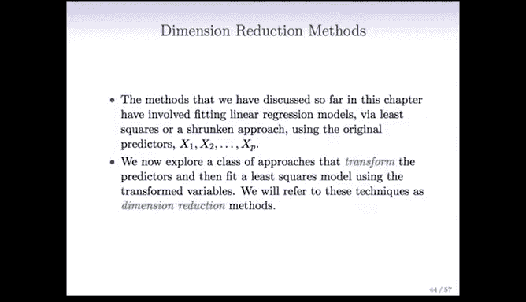

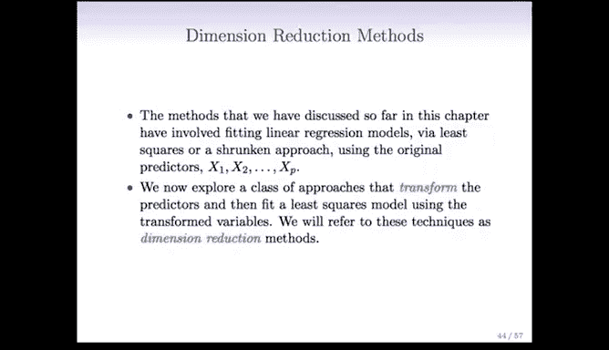

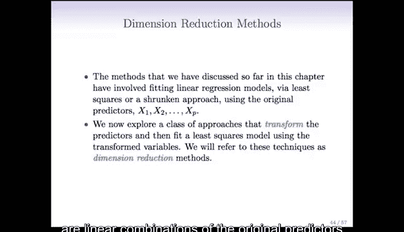

上一节我们介绍了子集选择方法、岭回归和套索回归。本节中我们来看看降维方法。

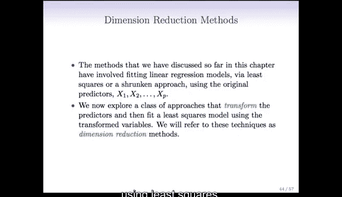

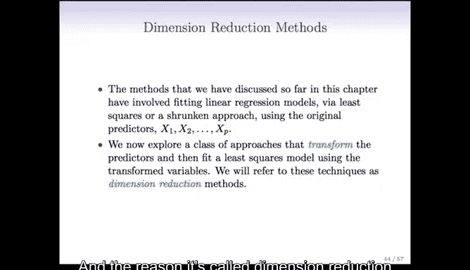

降维方法与之前的方法不同。在子集选择中，我们只使用一部分预测变量，并用最小二乘法拟合模型。在岭回归和套索回归中，我们使用了所有预测变量，但采用了收缩方法来拟合模型。

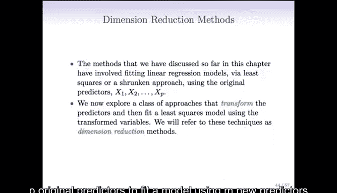

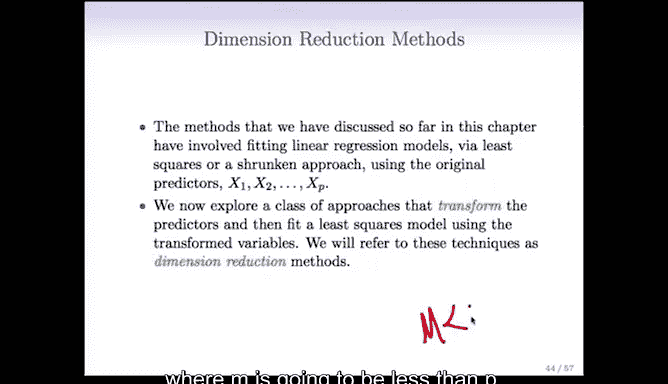

现在，我们将采用另一种不同的方法：我们仍然使用最小二乘法，但不是对原始预测变量 **X₁, X₂, ..., Xₚ** 使用，而是对由原始预测变量线性组合而成的新预测变量使用最小二乘法。

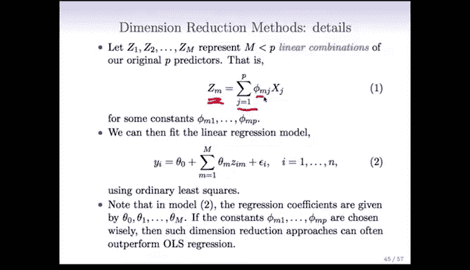

这种方法被称为降维。之所以称为降维，是因为我们将使用这 **p** 个原始预测变量，通过 **m** 个新预测变量来拟合模型，其中 **m < p**。这样，我们就将问题从 **p** 个预测变量缩减到了 **m** 个预测变量。

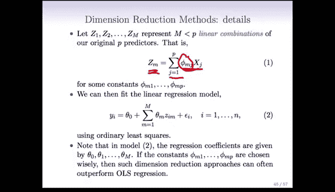

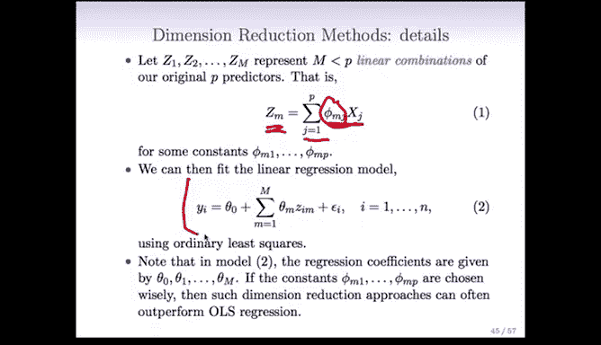

具体来说，我们将定义 **m** 个线性组合 **Z₁, Z₂, ..., Zₘ**，其中 **m < p**。这些新变量是原始 **p** 个预测变量的线性组合。

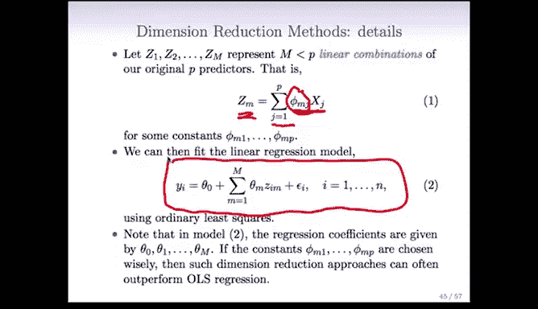

例如，**Zₘ** 可以表示为：
**Zₘ = Σⱼ₌₁ᵖ φₘⱼ Xⱼ**
其中，**φₘⱼ** 是某个常数。稍后我们会讨论如何确定这些 **φₘⱼ**。

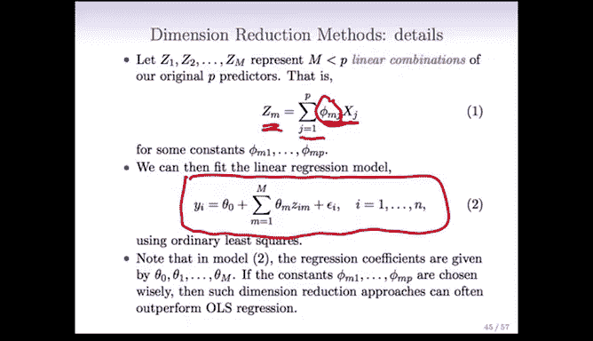

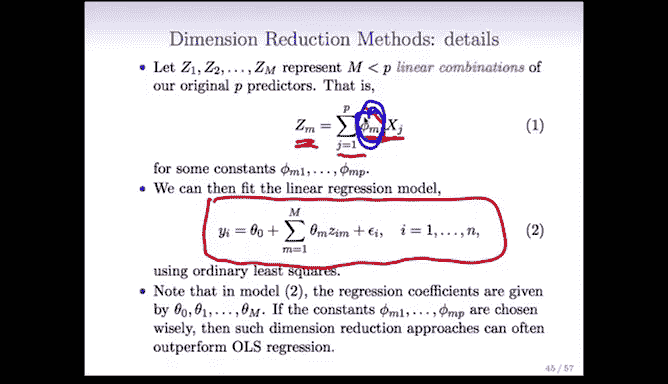

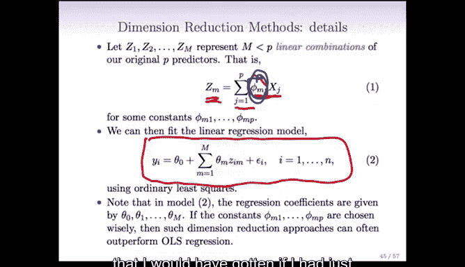

关键在于，一旦我们得到新的预测变量 **Z₁, Z₂, ..., Zₘ**，我们将使用最小二乘法拟合一个线性回归模型：
**Yᵢ = θ₀ + Σₘ₌₁ᴹ θₘ Zᵢₘ + εᵢ**
在这个新的最小二乘模型中，我的预测变量是 **Z**，系数是 **θ₁, θ₂, ..., θₘ**。

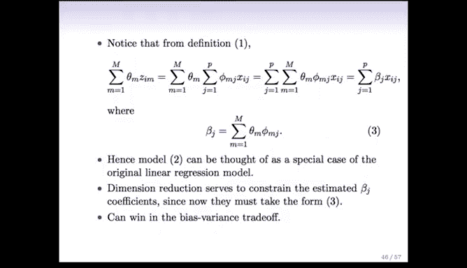

其核心思想是，如果我能非常巧妙地选择这些线性组合（特别是巧妙地选择这些 **φₘⱼ**），那么我实际上可以得到比直接使用原始预测变量进行最小二乘回归更好的结果。

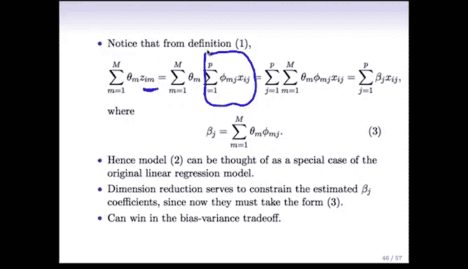

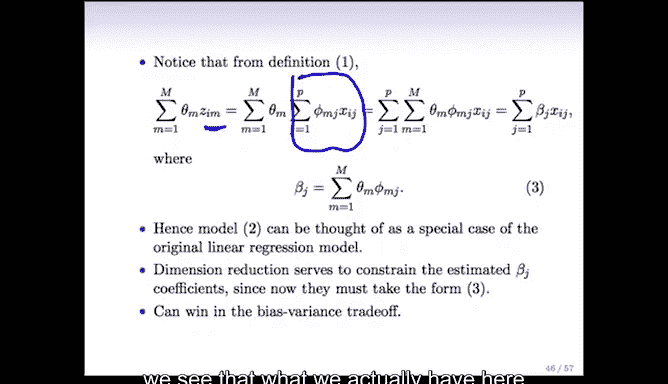

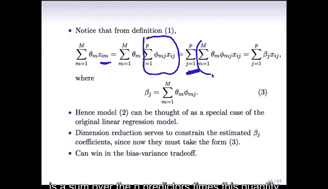

---

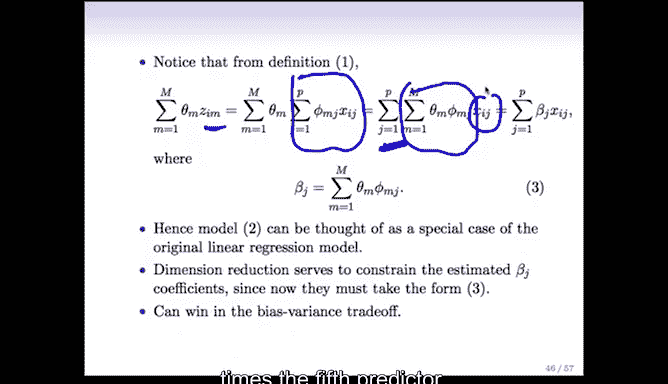

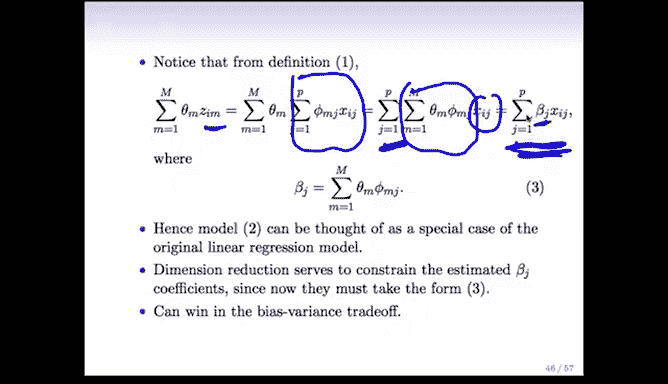

我们注意到，在前面的公式中，我们有 **Σₘ₌₁ᴹ θₘ Zᵢₘ**。如果我们更仔细地观察，并代入 **Zᵢₘ** 的定义（即原始 **X** 的线性组合），然后交换求和顺序并进行一些代数运算，我们会发现这实际上是对 **p** 个原始预测变量的一个线性组合：
**Σⱼ₌₁ᵖ ( Σₘ₌₁ᴹ θₘ φₘⱼ ) Xᵢⱼ**
这实际上就是原始 **X** 的一个线性组合，其中每个 **Xⱼ** 的系数 **βⱼ** 定义为：
**βⱼ = Σₘ₌₁ᴹ θₘ φₘⱼ**

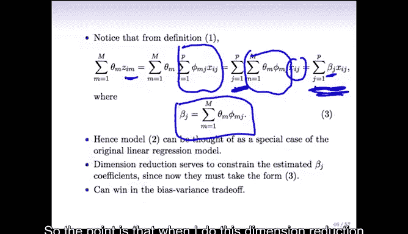

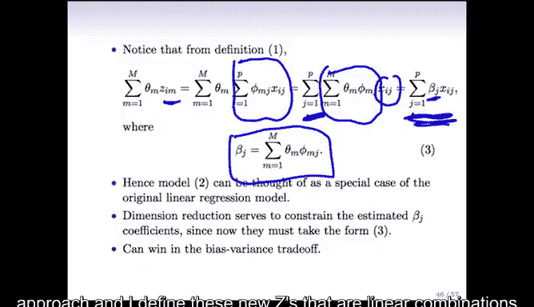

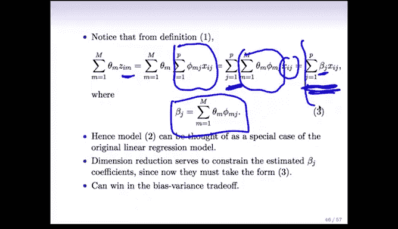

因此，当我采用这种降维方法，并定义这些作为 **X** 线性组合的新 **Z** 变量时，我最终拟合的模型在原始 **X** 上仍然是线性的。但是，模型中的系数 **βⱼ** 必须遵循一个非常特定的形式。

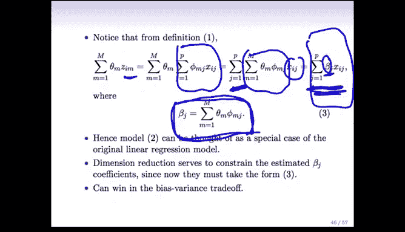

所以，这些降维方法给出的模型仍然是由最小二乘法拟合的，但我不是在原始预测变量上拟合模型，而是在一组新的预测变量上拟合。我也可以将其视为最终在原始预测变量上的一个线性模型，但使用了遵循这种特定形式的系数。

在某种程度上，这类似于岭回归和套索回归：它仍然是最小二乘法，仍然是一个包含所有变量的线性模型，但对系数施加了约束。不过，这里的约束方式不同。在岭回归中，我们约束系数的平方和要小；而在这里，我们约束系数必须遵循这种特定的形式。但从在新特征集上进行最小二乘回归的角度来看，这种形式有简单的解释。

这里的核心思想归根结底是偏差-方差权衡。通过要求我的系数 **β** 必须采取这种特定形式，相对于直接在原始特征上进行普通最小二乘回归，我有可能得到一个偏差和方差都较低的模型。

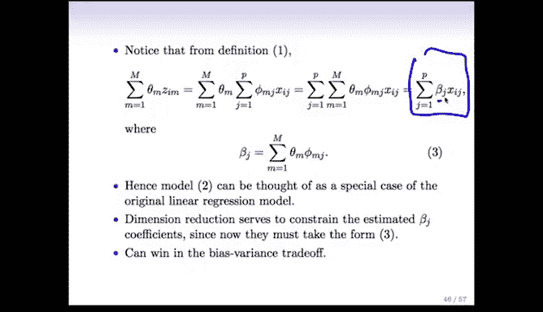

需要指出的一点是，这种方法只有在 **m < p** 时才能很好地发挥作用。如果 **m = p**，那么我最终只会得到普通的最小二乘回归结果，整个降维过程就等同于在原始数据上做最小二乘。

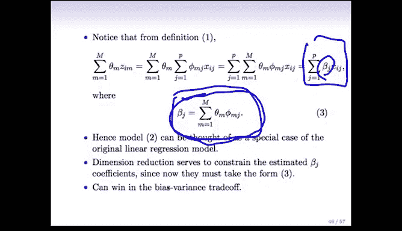

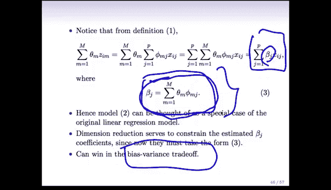

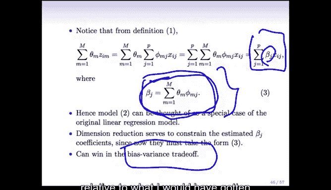

---

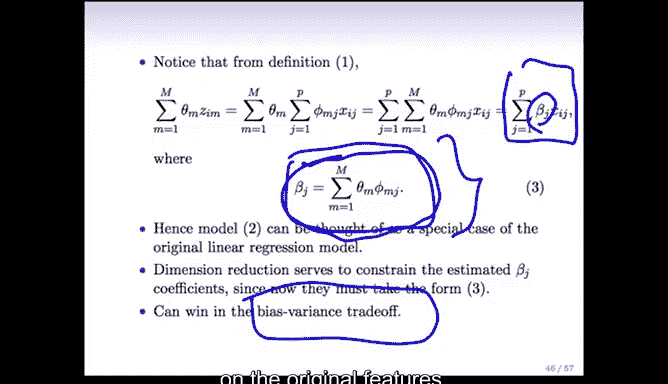

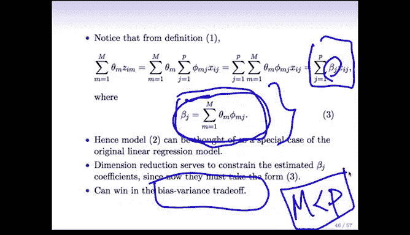

本节课中我们一起学习了降维方法。我们了解到，降维通过将原始预测变量组合成数量更少的新变量（**Z**），然后在新变量上使用最小二乘法来拟合模型。这种方法对原始变量的系数施加了特定形式的约束，其本质是通过巧妙的特征变换，在偏差和方差之间取得更好的平衡，从而可能提升模型性能。关键在于，新变量的数量 **m** 必须小于原始变量数量 **p**，否则降维就失去了意义。