# Python 版 49：主成分回归与偏最小二乘法 📊 

在本节课中，我们将学习两种重要的降维回归方法：主成分回归和偏最小二乘法。这两种方法都旨在处理预测变量众多、样本量相对有限的情况，通过构建原始预测变量的线性组合来简化模型，从而避免过拟合并提高预测性能。

---

## 🧩 主成分回归

主成分回归是目前最著名的降维方法。它包含一个两步流程。

第一步，我们寻找数据矩阵 **X** 的主成分。主成分分析将在教材第10章详细讨论，此处我们仅作简要介绍。

第二步，我们使用这些主成分作为新的预测变量，执行最小二乘回归。

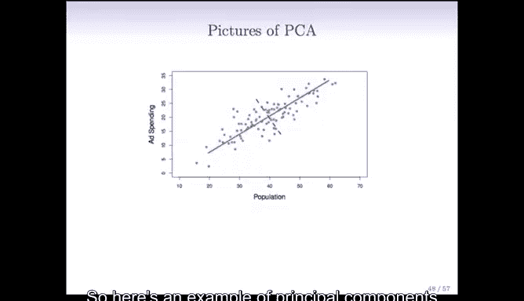

主成分是一个有趣的概念。**第一主成分**是所有变量线性组合中方差最大的那个。**第二主成分**则是与第一主成分完全不相关的所有线性组合中，方差最大的那个，依此类推。因此，主成分为我们提供了数据中方差很大且彼此不相关的线性组合或维度。

其核心思想是：如果给我一个有35个变量的数据，我可以计算出少数几个主成分，它们能以非常简洁的方式（仅涉及几个新变量，如Z1到Z3或Z1到Z4）捕捉数据中的大部分变异。

### 一个简单的二维示例

我们来看一个在第三章已见过的简单数据集示例。

上图展示了100个不同城市的人口（X轴）与广告支出（Y轴）的关系，即图中的紫色点。这是一个仅有两个变量（p=2）的简单数据集。

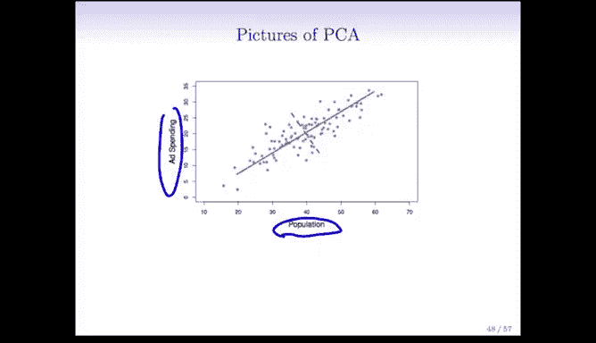

我们可以问：这些变量的哪个线性组合方差最大？或者说，数据沿着哪个方向变化最大？我们可以看到，数据变化最大的方向实际上沿着这条绿线，这就是**第一主成分方向**。

接着，在所有与第一方向不相关的方向中，数据变化最大的方向是这条蓝色虚线，即**第二主成分**。在这个p=2的例子中，只有两个主成分。但在变量众多的数据集中，如果p很大，就会有很多主成分，我们可以查看第一个、第二个、第三个等等。

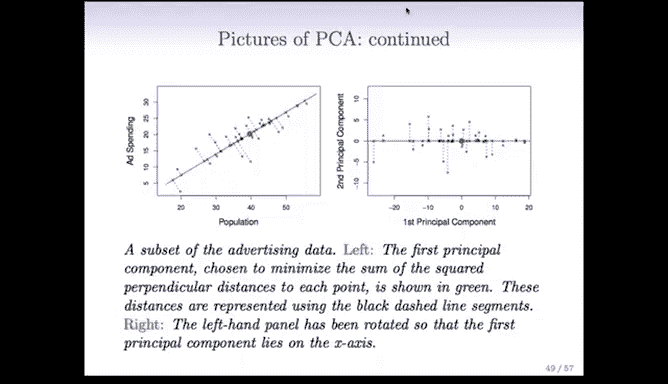

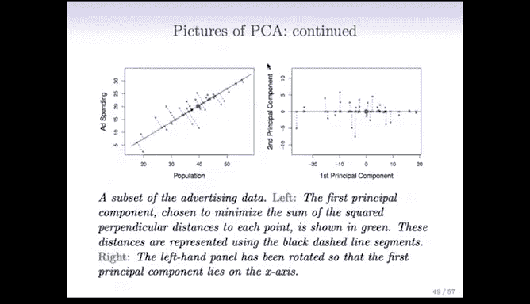

### 深入理解主成分

让我们放大看看这里发生了什么。

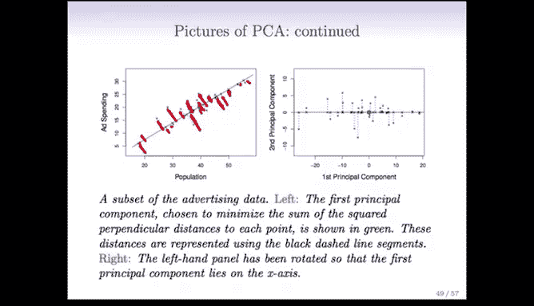

左侧图中，紫色圆圈代表大约20个地点。这条绿线之所以是第一主成分，是因为它是数据变化最大的方向。它是这样一条线：当我们将每个数据点投影到这条线上时，这些投影点沿着该线的分布尽可能分散（即方差最大）。同时，从各个紫色点到绿线的垂直距离（图中红色短线表示）之和也尽可能小。

右侧图展示了同一幅图，但经过旋转使主成分线变为水平，以便更清晰地观察。

### 主成分与原始变量的关系

为了更好地理解这些主成分，我们可以绘制每个主成分（即我们得到的变量线性组合）与原始变量（人口和广告支出）的关系图。

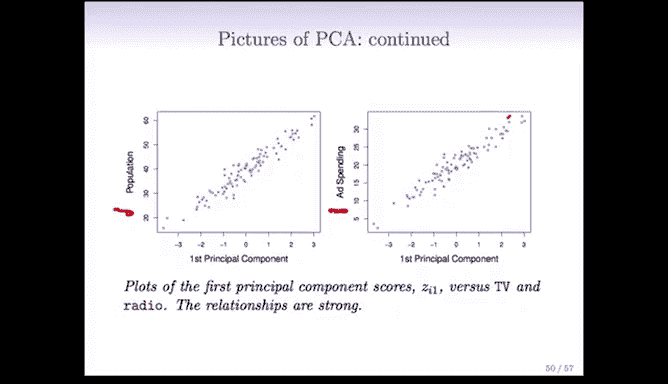

我们可以看到，**第一主成分**与人口和广告支出都高度相关。这意味着，如果我不使用原始的两个变量（人口和广告支出），而仅使用第一主成分，就能很好地概括数据。

这引出了一个想法：如果我想预测某个响应变量（如销售额），与其使用人口和广告支出来预测，不如直接使用第一主成分作为模型中的预测变量，用最小二乘法拟合模型，结果可能会相当不错。

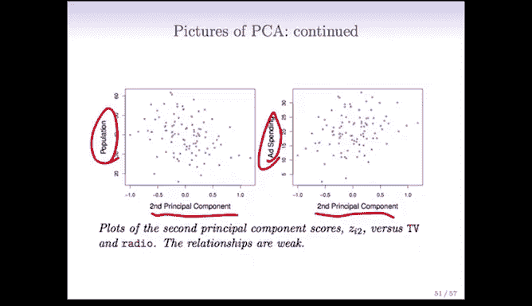

上图与前一图类似，但X轴显示的是**第二主成分**与人口和广告支出的关系。我们可以看到，第二主成分与人口和广告支出之间几乎没有关系。这表明，在这个案例中，第一主成分确实很好地概括了数据。这是因为人口和广告支出彼此高度相关，因此一个由第一主成分构成的新变量就能很好地概括这两个原始变量。

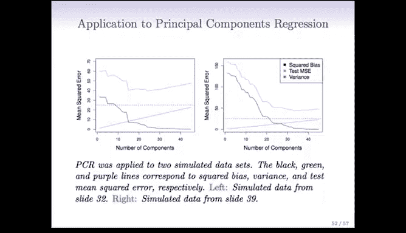

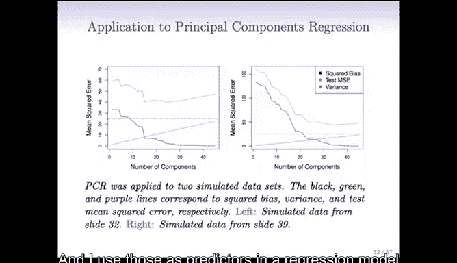

### 主成分回归的步骤

核心思想是：获取数据，提取所需数量的前几个主成分，然后将它们作为预测变量放入回归模型中，并使用最小二乘法进行拟合。

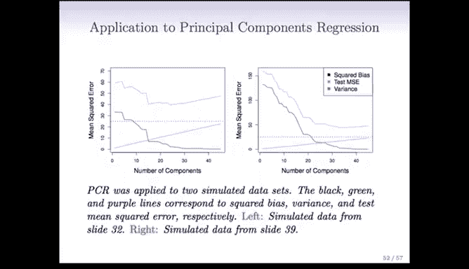

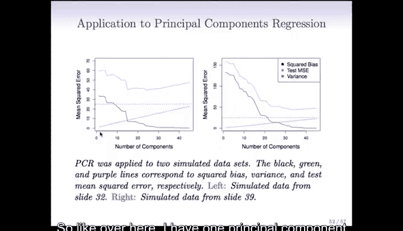

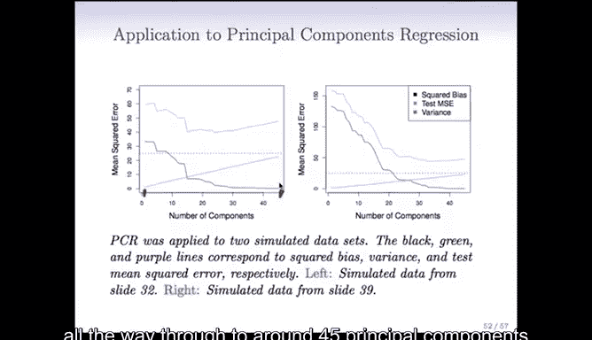

在许多情况下，这能产生非常好的结果。

---

## 📈 模拟数据示例

以下是一个模拟数据集上的示例。

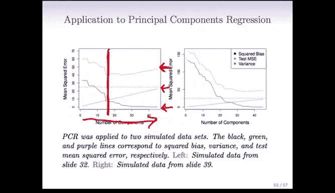

我进行了使用不同数量主成分的主成分回归，从使用1个主成分到大约45个主成分（在本例中）。

图中绘制了**偏差**（黑色）、**方差**（绿色）和**均方误差**（紫色）。随着模型中使用的**主成分数量 M** 增加，偏差会越来越小（因为模型越来越复杂），但代价是方差会随之增加。

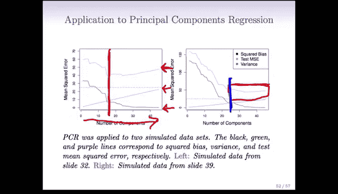

均方误差是偏差平方与方差之和，图中紫色曲线大致呈现我们讨论过的U形。可以看到，当模型使用大约18个主成分时，均方误差最小。因此，在这个例子中，使用18个预测变量的主成分回归效果非常好。

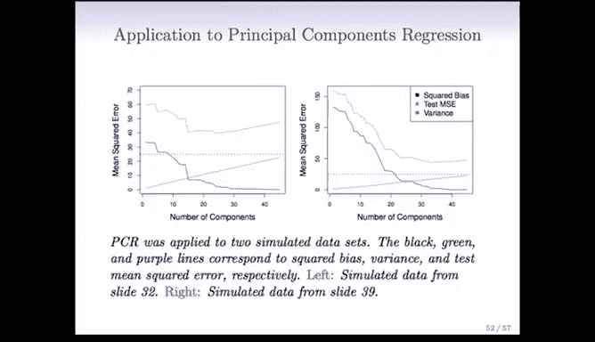

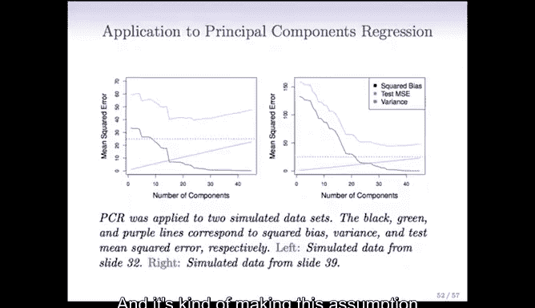

在这个例子中，情况略有不同。均方误差随着成分增加而下降，但之后并没有再次上升，从某个点开始基本保持平坦。因此，就测试均方误差而言，这些模型看起来都差不多。由于在此背景下我们总是偏好最简单的模型，我可能会选择大约有25个成分的模型。

---

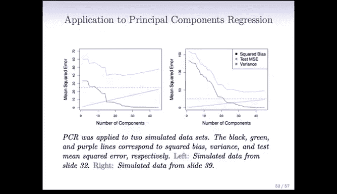

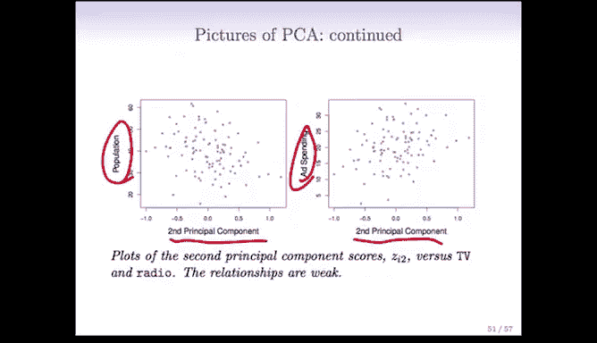

## ❓ 主成分回归的潜在问题

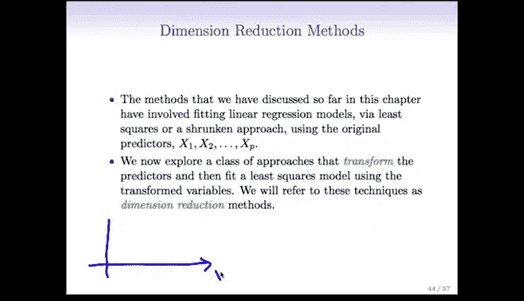

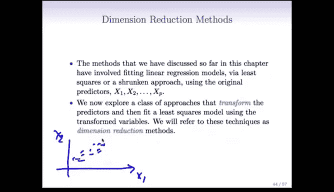

核心思想是用方差最大的组合（即主成分）来概括特征。但为什么这是个好主意？或者它可能是个坏主意？

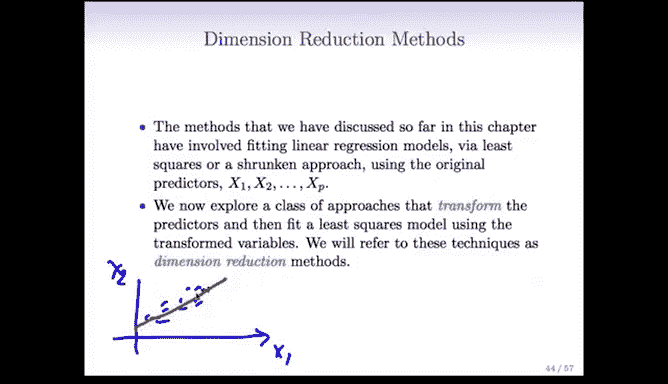

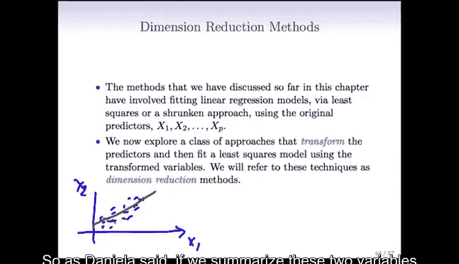

这里需要注意的一点是：当我计算这些主成分时，我实际上并没有查看响应变量 **Y**，而只是查看了预测变量 **X**。我在寻找它们方差最大的线性组合。这隐含了一个假设：**预测变量中方差大的线性组合很可能与响应变量相关**。

这是我们统计学家常有的一个直觉，也是我们常做的一个假设，但并没有理由认为这一定是事实，实际上也可能并非如此。

让我们通过一个图示来进一步讨论。

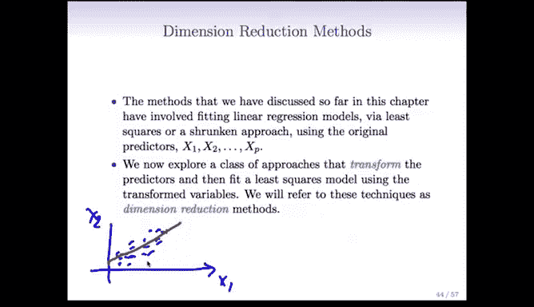

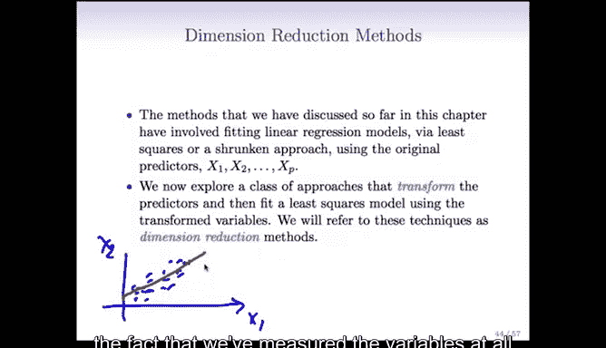

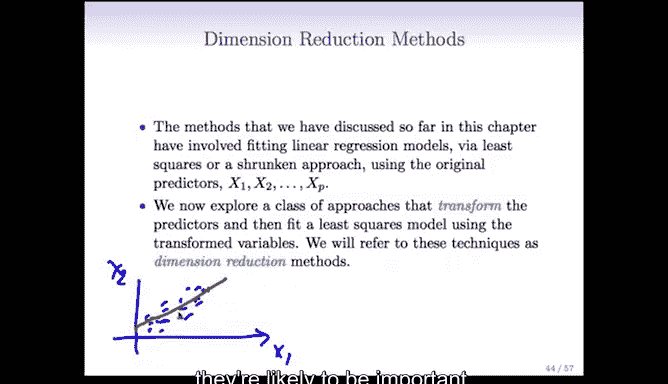

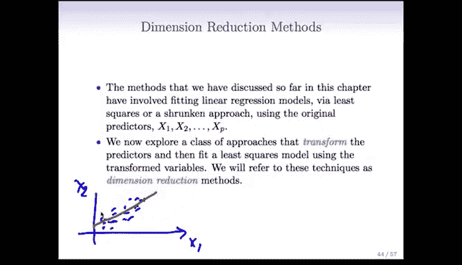

假设有两个变量，这是数据点的散点图。**第一主成分方向**是这条红线。如果我们用这个主成分来概括这两个变量，我们实际上是在假设**这个变异方向是重要的方向**。

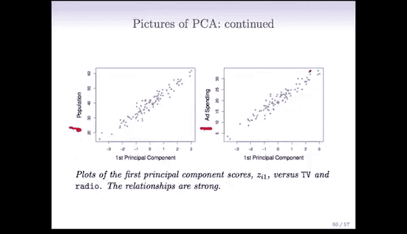

如果我们想象响应变量 **Y** 垂直于幻灯片平面，我们就是在假设回归平面沿着红线方向变化，而在正交方向上没有变化。因为如果我们只选择一个成分，就会忽略第二个方向。

这是一个好的假设吗？并不总是。但这往往相当合理。一种思考方式是：如果这是观测数据，我们测量这些变量本身可能意味着它们很重要。我们测量事物是为了预测，我们更可能测量那些重要的事物。因此，重要的事物很可能在响应变量的变化方向上也有所变化。虽然不总是如此，但这是一个很好的直觉：在其他条件相同的情况下，让我们在预测变量的变异方向中寻找响应变量最可能变化的地方。

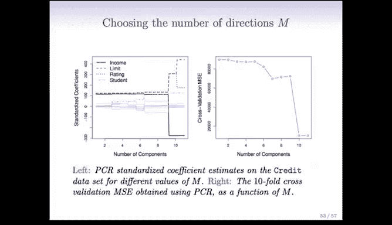

---

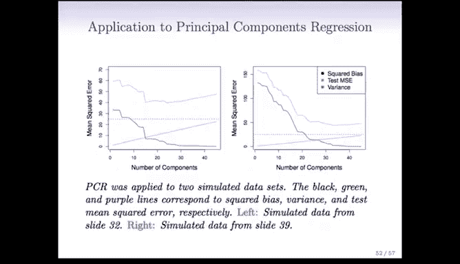

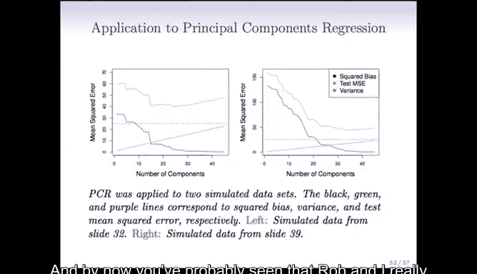

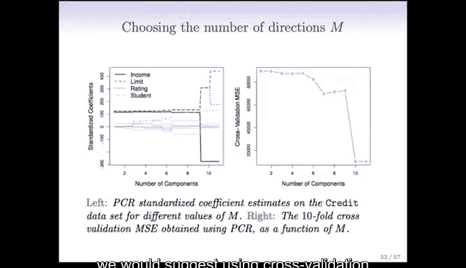

## 🔍 如何选择主成分数量 M？

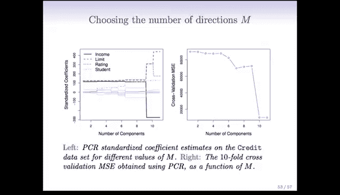

在执行主成分回归时，我们需要选择方向（主成分）的数量 **M**。我们希望测试均方误差尽可能小，因此需要估计测试均方误差。到目前为止，你可能已经看到我们**强烈推荐使用交叉验证**来选择要使用的主成分方向数量。

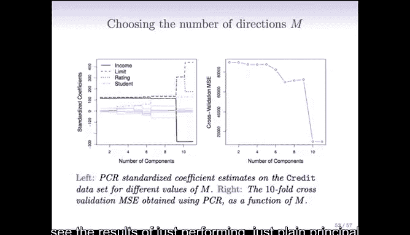

### 信用数据示例

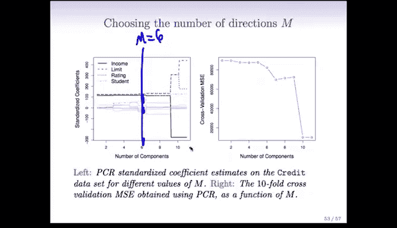

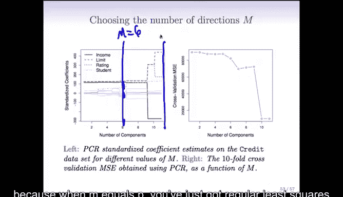

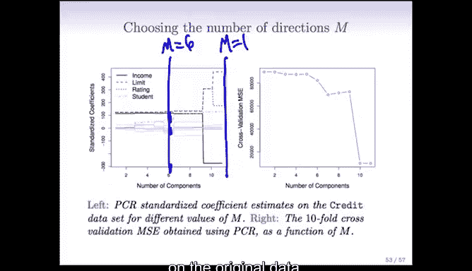

以下是在信用数据上应用交叉验证的示例。

左侧展示了直接进行主成分回归的结果。例如，如果我们想查看包含6个主成分（M=6）的模型，就是这条蓝线，我们可以看到一些系数非零，而另一些基本为零。

当使用11个成分时，这实际上就是完整的最小二乘模型，因为当 **M = P**（原始变量数）时，就等同于对原始数据执行常规最小二乘回归。

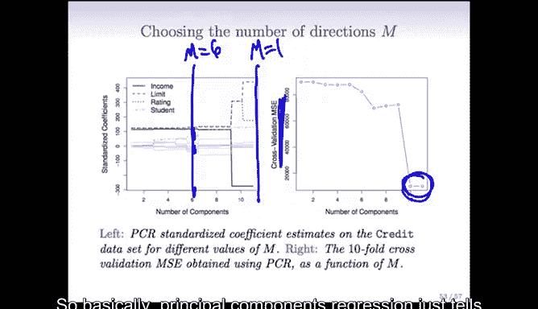

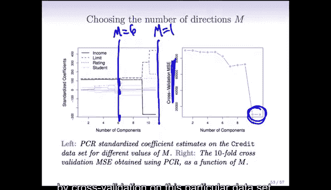

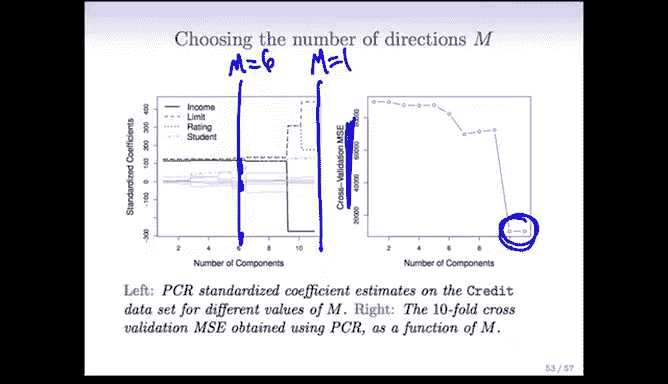

右侧，我们可以看到对于相同的模型，其交叉验证均方误差（即测试误差的估计）。这里我们看到的结果有些令人失望：我们希望选择均方误差尽可能小的模型，而在这里，当模型有10或11个成分时，均方误差才最小。记住，M=11就是原始数据的常规最小二乘。因此，在这个特定数据上，主成分回归通过交叉验证选择成分数量的结果告诉我们：放弃吧，直接对原始数据做最小二乘就行了。

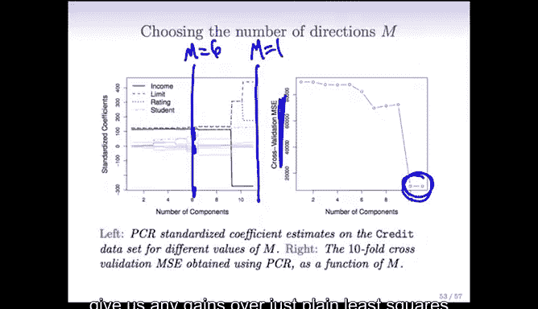

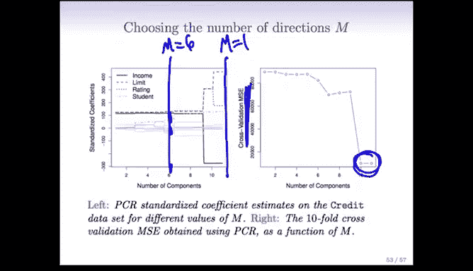

这令人失望，意味着主成分回归并没有比第三章看到的普通最小二乘带来任何增益。但这也常发生在许多情境中：你试图超越最小二乘法，但在特定数据集上可能行不通。

---

## 🧠 偏最小二乘法

正如前面提到的，在主成分回归中，我们以完全**无监督**的方式生成这些新的变换变量（主成分）。我们只查看 **X** 变量，然后祈祷 **X** 变量变化很大的方向，也正是与响应变量 **Y** 相关的方向。

如果我们不想只是祈祷并期待最好的结果，我们可以转而执行**偏最小二乘法**。

偏最小二乘与主成分回归类似，但它以**有监督**的方式选择这些新的预测变量 **Z1 到 Zm**。

它将选择那些**既是原始特征方差较大的方向，同时也与 Y 相关**的线性组合 **Z1 到 Zm**。因此，我们不仅寻找 **X** 变化的方向，还寻找与响应变量相关的变化方向。

这样做的目标是能够更有效地预测响应，因为我们在选择新特征时明确考虑了响应变量。

### 偏最小二乘的算法思想

获取第一个偏最小二乘方向的方法如下：
*   对 **Y** 到 **X1** 做回归，得到系数 φ11。
*   对 **Y** 到 **X2** 做回归，得到系数 φ12。
*   ...
*   对 **Y** 到 **Xp** 做回归，得到系数 φ1p。

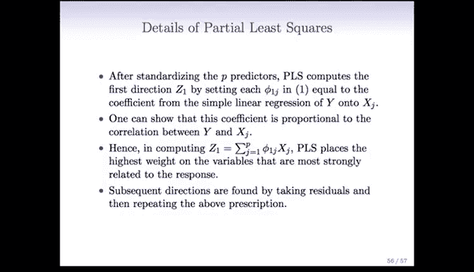

实际上，第一个偏最小二乘方向 **Z1** 与 **Y** 和数据矩阵 **X** 之间的相关性成比例。我们通过迭代这个程序来获得其他偏最小二乘方向。

理论上，偏最小二乘似乎应该比主成分回归有巨大增益，因为我们以一种非常聪明的方式选择 **Z**，这种方式实际上涉及查看响应变量，这似乎只会对我们有帮助。

但在实践中，我们发现偏最小二乘通常不会比主成分回归带来巨大提升。它与岭回归和主成分回归非常相似。因此，尽管有些人喜欢偏最小二乘，但我从未发现它非常有用，反而发现岭回归和主成分回归效果同样好，且更简单。

有趣的是，岭回归与主成分回归和偏最小二乘在数学上密切相关。例如，主成分回归可以看作是岭回归的一种离散版本——岭回归是连续地收缩变量，而主成分回归则以一种更“跳跃”的方式实现类似效果。

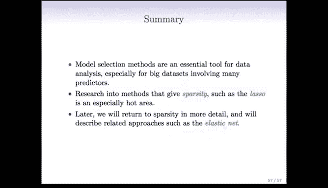

---

## 🎯 总结

本节课我们涵盖了许多内容。你现在已经看到了许多不同的模型选择方法，这些方法在观测值很多但变量也很多的情况下非常有用。

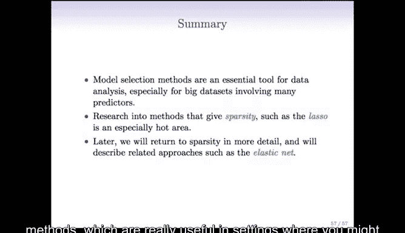

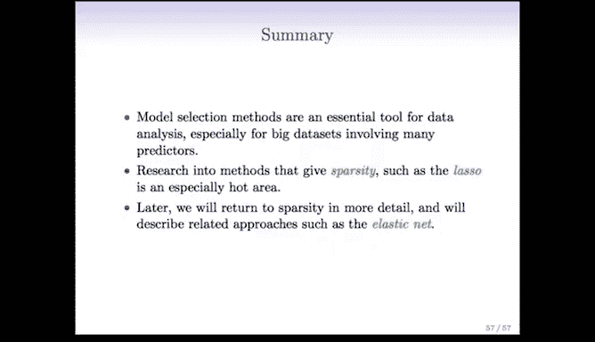

如果有人给你一个有一百万个观测值和四个变量的数据，那么尽管使用最小二乘法，或者使用第7、8、9章中将要看到的更灵活、更复杂的替代方法。但是，如果有人给你的数据有400个观测值和300个变量，甚至30,000个变量，你将需要方法来简化问题，并拟合比最小二乘法给出的模型更简单的模型。这就是我们今天所涵盖的一些核心思想。

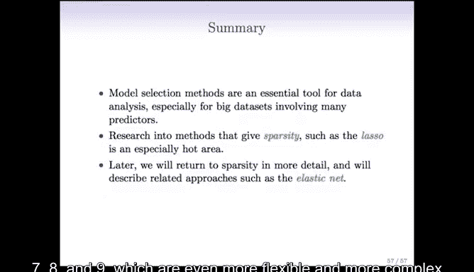

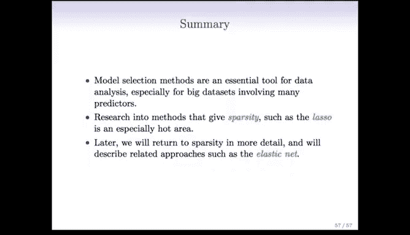

这是一个非常激动人心的领域，许多现代统计研究真正关注的是如何在我们今天所涵盖的场景中改进预测——在这些场景中，我们只想要一个比最小二乘法更简单的模型，因为最小二乘拟合真的会使数据过拟合。

