# Python 版 06：逐步回归与模型选择 📊

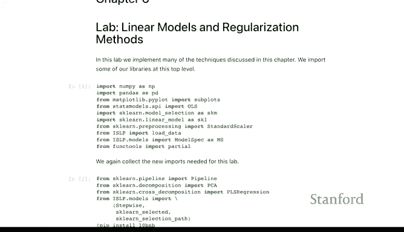

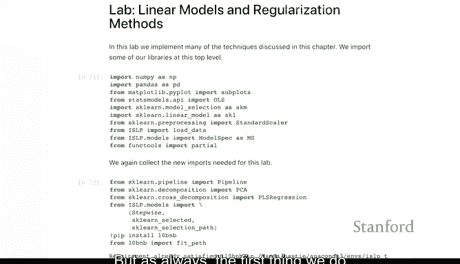

在本节课中，我们将学习如何使用Python实现第6章中介绍的线性模型与正则化方法。我们将从**前向逐步选择**开始，通过实际代码演示如何利用自定义指标（如C_p统计量）和交叉验证技术来选择最优模型。

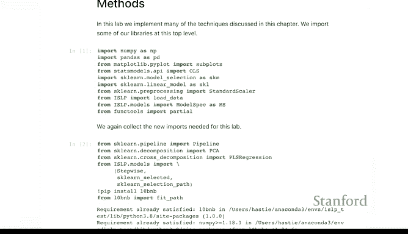

---

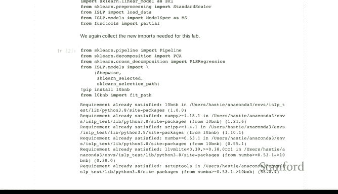

## 导入必要库

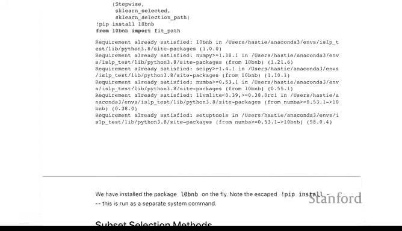

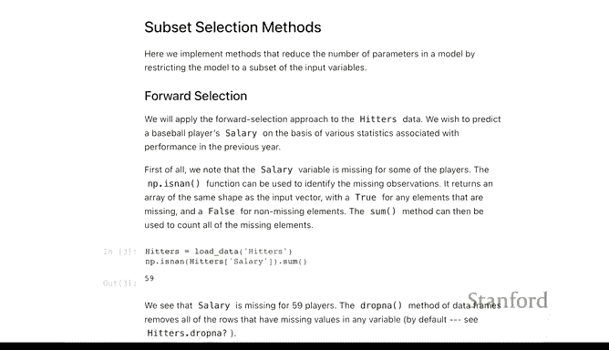

首先，我们需要导入本实验所需的Python库。以下代码展示了如何导入常用库，并演示了如何在Jupyter Notebook中动态安装缺失的包。

```python
import numpy as np
import pandas as pd
import matplotlib.pyplot as plt
from sklearn.linear_model import LinearRegression
from sklearn.model_selection import cross_val_predict, KFold
from sklearn.feature_selection import SequentialFeatureSelector
```

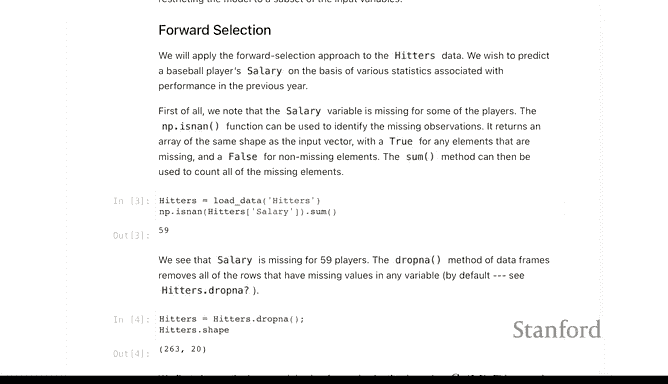

如果环境中缺少某个库，可以使用`!pip install`命令在代码中直接安装。例如：

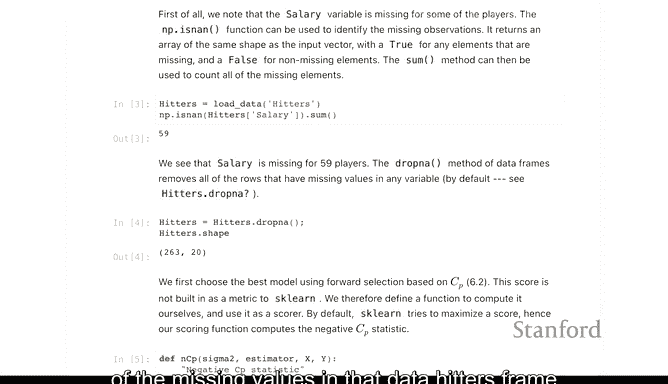

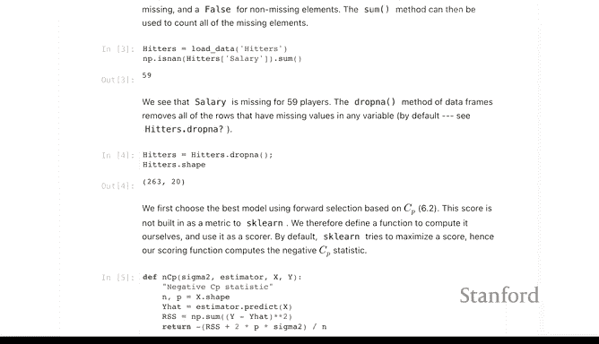

```python
!pip install some_package
```

---

## 数据准备：处理缺失值

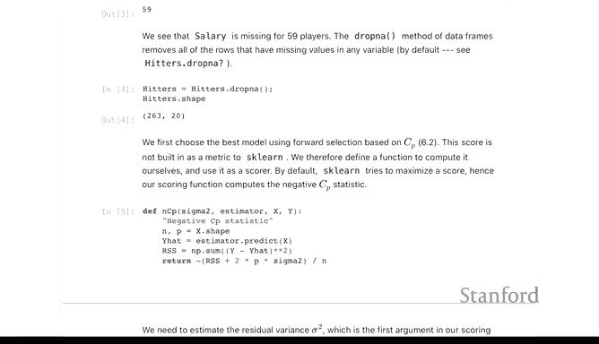

我们将使用`Hitters`数据集，并以`Salary`作为响应变量。数据集中存在59行`Salary`缺失的记录。在回归分析中，如果响应变量存在缺失值，通常无法进行插补，因此需要直接删除这些行。

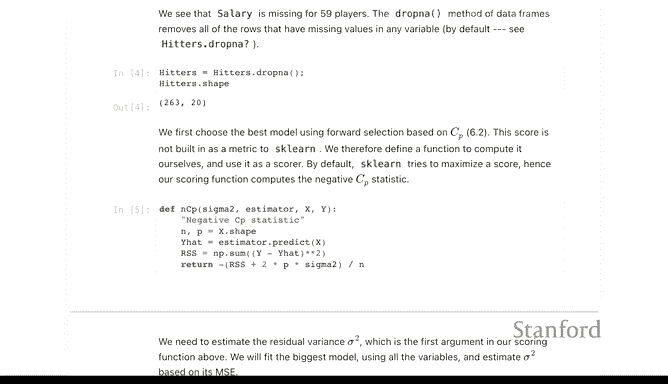

```python
# 假设hitters是包含数据的DataFrame
hitters = pd.read_csv('hitters.csv')
# 删除Salary为缺失值的行
hitters_clean = hitters.dropna(subset=['Salary'])
print(f"原始数据行数: {hitters.shape[0]}")
print(f"清理后数据行数: {hitters_clean.shape[0]}")
```

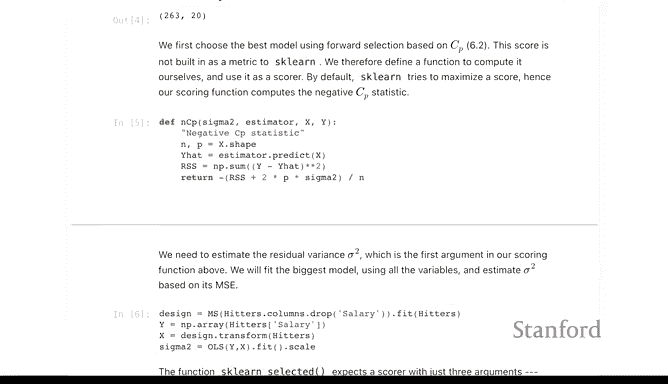

---

## 定义自定义评估指标：C_p统计量

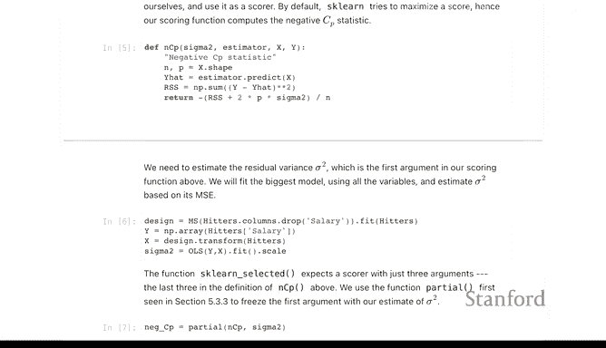

在模型选择中，C_p统计量是一个常用标准。Scikit-learn库本身不包含C_p，但我们可以自定义一个评估函数，并将其用于交叉验证中。C_p统计量的公式如下：

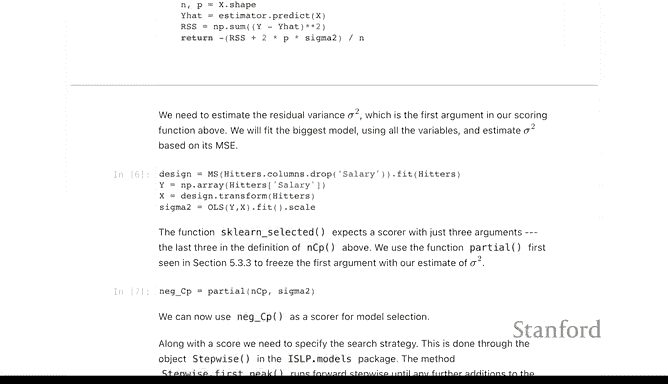

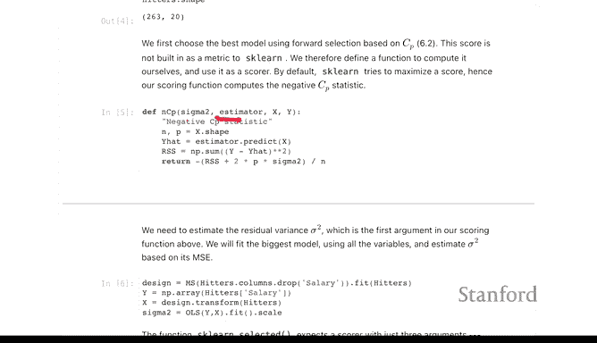

**C_p = \frac{1}{n} (RSS + 2d\hat{\sigma}^2)**

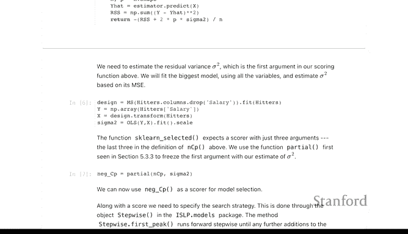

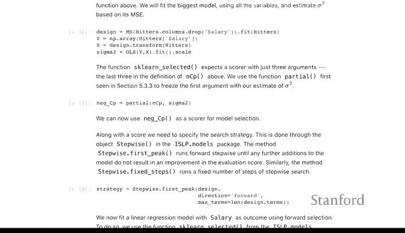

其中，`RSS`是残差平方和，`d`是模型参数个数，`\hat{\sigma}^2`是残差方差的估计值。由于Scikit-learn的优化器旨在最大化分数，我们需要定义负的C_p以实现最小化。

```python
def cp_score(estimator, X, y, sigma2):
    """
    计算负的C_p统计量作为评分。
    sigma2: 残差方差σ²的估计值。
    """
    y_pred = estimator.predict(X)
    rss = ((y - y_pred) ** 2).sum()
    n = len(y)
    d = len(estimator.coef_) + 1  # 参数个数（包括截距）
    cp = (rss + 2 * d * sigma2) / n
    return -cp  # 返回负值以便最大化

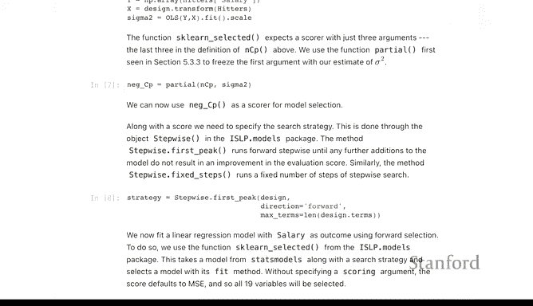

# 估计全模型下的σ²
full_model = LinearRegression().fit(X, y)
y_pred_full = full_model.predict(X)
sigma2_est = ((y - y_pred_full) ** 2).sum() / (len(y) - X.shape[1] - 1)

# 固定sigma2参数，创建可用于交叉验证的评分函数
from functools import partial
cp_scorer = partial(cp_score, sigma2=sigma2_est)
```

---

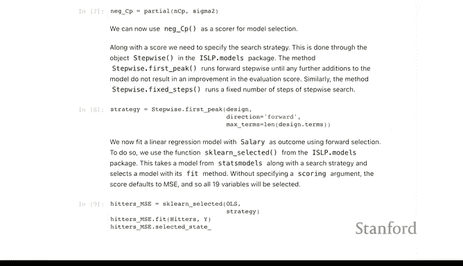

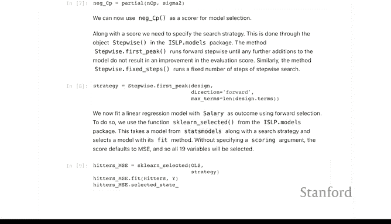

## 实施前向逐步选择

上一节我们定义了自定义评分函数，本节我们将使用它来进行前向逐步选择。我们将设置选择策略，并比较使用不同评分标准（如训练集MSE和C_p）的结果差异。

首先，我们使用默认策略（基于训练集R²或MSE）进行前向逐步选择，这通常会包含所有变量。

```python
from sklearn.feature_selection import SequentialFeatureSelector

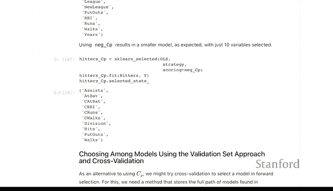

# 定义策略：前向逐步选择，直到所有特征被加入
strategy = SequentialFeatureSelector(LinearRegression(),
                                     direction='forward',
                                     n_features_to_select='auto') # 默认使用训练集评分

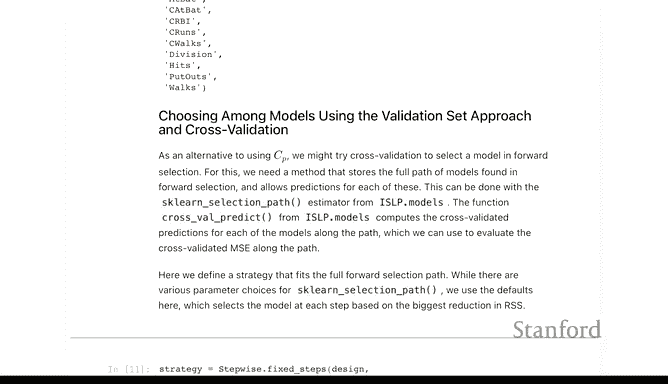

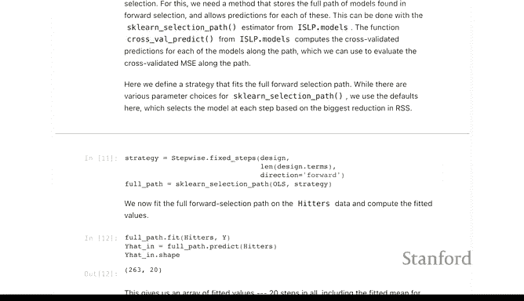

# 拟合模型
selector = strategy.fit(X, y)
selected_features = selector.get_support()
print("被选择的特征索引:", np.where(selected_features)[0])
```

接下来，我们使用自定义的C_p统计量作为评分标准进行选择。这会得到一个更精简的特征子集。

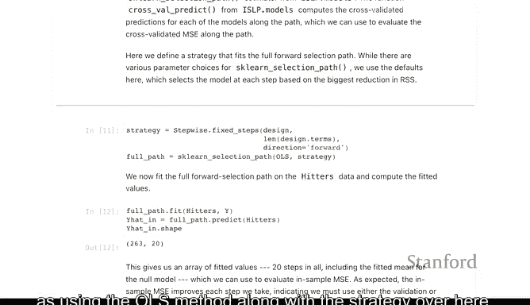

```python
# 使用C_p作为评分标准
strategy_cp = SequentialFeatureSelector(LinearRegression(),
                                        direction='forward',
                                        scoring=cp_scorer)
selector_cp = strategy_cp.fit(X, y)
selected_features_cp = selector_cp.get_support()
print("使用C_p选择的特征索引:", np.where(selected_features_cp)[0])
```

---

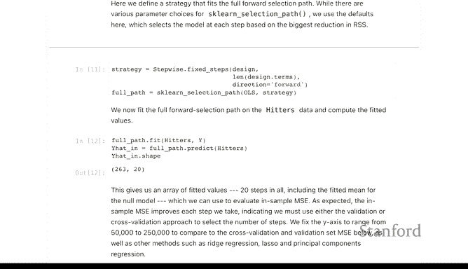

## 使用交叉验证评估模型路径

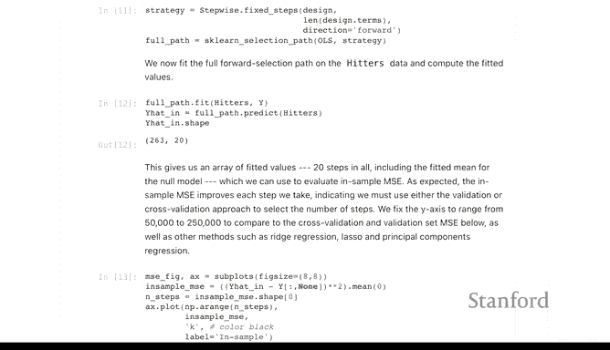

除了使用C_p等统计量，更通用的方法是使用交叉验证来评估不同复杂度模型的性能。我们将实施“固定步数”策略，拟合从零个特征到所有特征的完整模型路径，并计算每一步的交叉验证误差。

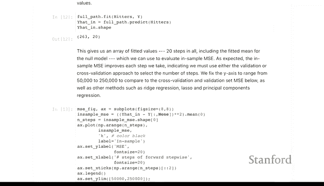

以下是实现步骤：

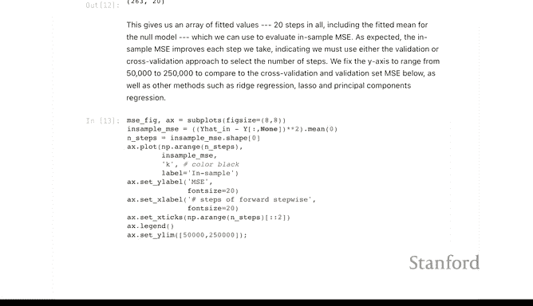

1.  使用`SequentialFeatureSelector`配合`n_features_to_select`参数拟合完整路径。
2.  利用`cross_val_predict`函数获得每一折交叉验证的预测值。
3.  计算每一步的平均交叉验证均方误差（CV MSE）及其标准误。

```python
# Python 版 1. 拟合完整路径
strategy_full = SequentialFeatureSelector(LinearRegression(),
                                          direction='forward',
                                          n_features_to_select=X.shape[1]) # 选择所有特征
selector_full = strategy_full.fit(X, y)

# Python 版 2. 获取每一步的预测值（在训练集上）
y_pred_path = selector_full.transform(X) # 这是一个逐步包含特征的预测矩阵

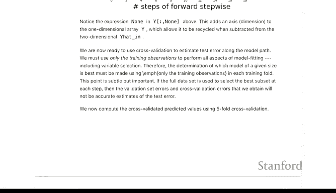

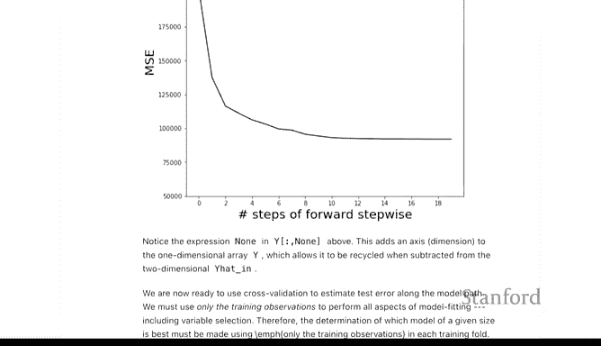

# Python 版 3. 进行5折交叉验证，获取每一步的CV预测
kf = KFold(n_splits=5, shuffle=True, random_state=1)
y_cv_pred = cross_val_predict(strategy_full, X, y, cv=kf)

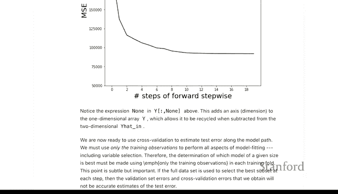

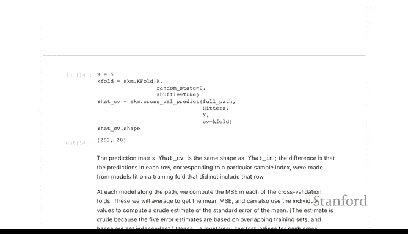

# Python 版 4. 计算每一步的CV MSE
cv_mse_per_fold = []
for i in range(y_cv_pred.shape[1]): # 遍历每一步（每一列）
    mse_fold = []
    for train_idx, val_idx in kf.split(X):
        y_val_true = y.iloc[val_idx]
        y_val_pred = y_cv_pred[val_idx, i]
        mse_fold.append(np.mean((y_val_true - y_val_pred) ** 2))
    cv_mse_per_fold.append(mse_fold)

# 计算平均CV MSE和标准误
cv_mse_mean = [np.mean(mse) for mse in cv_mse_per_fold]
cv_mse_std = [np.std(mse, ddof=1) / np.sqrt(5) for mse in cv_mse_per_fold] # 标准误
```

---

## 可视化与结果分析

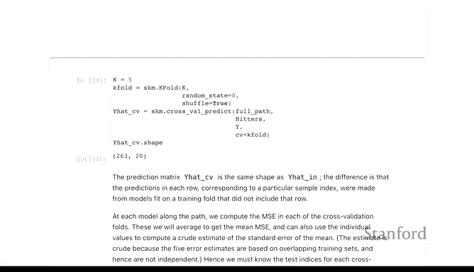

现在，我们将训练误差、交叉验证误差以及单一验证集误差绘制在同一张图上，以便直观比较并选择最优模型复杂度。

```python
# 计算训练集上每一步的MSE（必然递减）
train_mse = []
for i in range(y_pred_path.shape[1]):
    mse = np.mean((y - y_pred_path[:, i]) ** 2)
    train_mse.append(mse)

# 绘制图形
plt.figure(figsize=(10, 6))
steps = np.arange(1, len(train_mse) + 1)

# 训练误差
plt.plot(steps, train_mse, 'bo-', label='Training MSE')

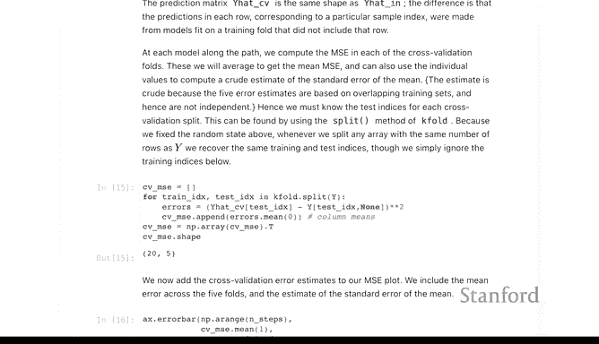

# 交叉验证误差（带误差棒）
plt.errorbar(steps, cv_mse_mean, yerr=cv_mse_std, fmt='ro-', capsize=5, label='5-Fold CV MSE ± SE')

# 单一验证集误差（示例，需提前划分数据）
# X_train, X_val, y_train, y_val = train_test_split(X, y, test_size=0.2, random_state=42)
# ... 在X_train上拟合路径，并在X_val上计算每一步的MSE
# val_mse = [...]
# lt.plot(steps, val_mse, 'g^--', label='Validation Set MSE')

plt.xlabel('Number of Features')
plt.ylabel('Mean Squared Error')
plt.title('Model Selection: Forward Stepwise')
plt.legend()
plt.grid(True, alpha=0.3)
plt.show()
```

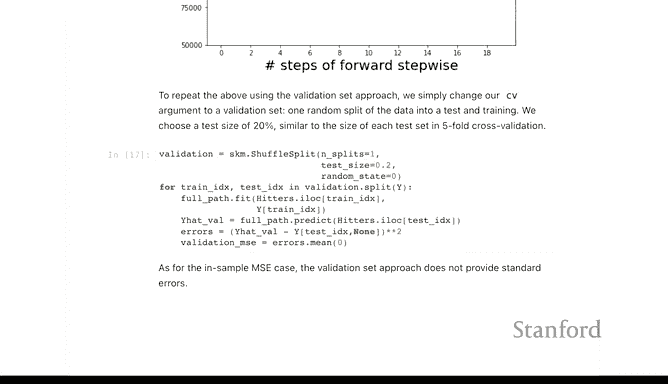

**结果解读**：
*   **训练误差（蓝线）**：随着特征增加持续下降，这是过拟合训练数据的表现。
*   **交叉验证误差（红线）**：通常会先下降后上升或趋于平缓。最低点或拐点对应的特征数可能是一个好的选择。误差棒（标准误）可以帮助我们判断差异的显著性。
*   **单一验证集误差（若绘制）**：由于只基于一次数据划分，其曲线可能不如交叉验证稳定。

根据上图，如果交叉验证误差在特征数为6附近达到最低并开始平坦化，那么选择包含6个特征的模型可能是合理的。

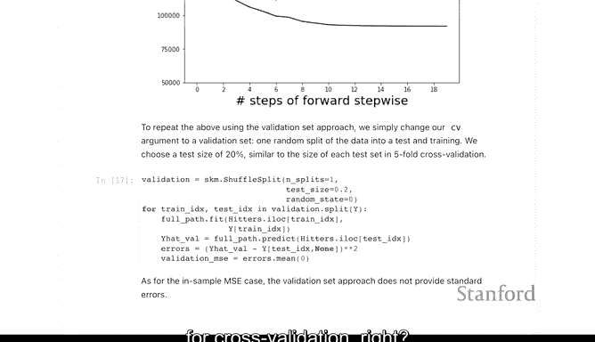

---

## 总结

本节课我们一起学习了如何使用Python实现前向逐步回归和模型选择。主要内容包括：

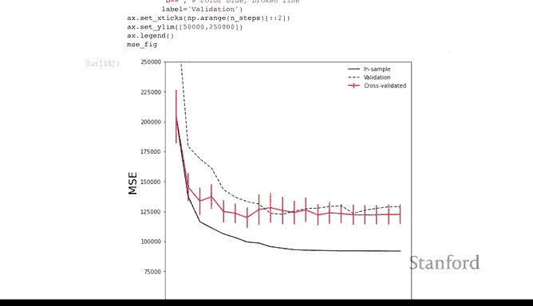


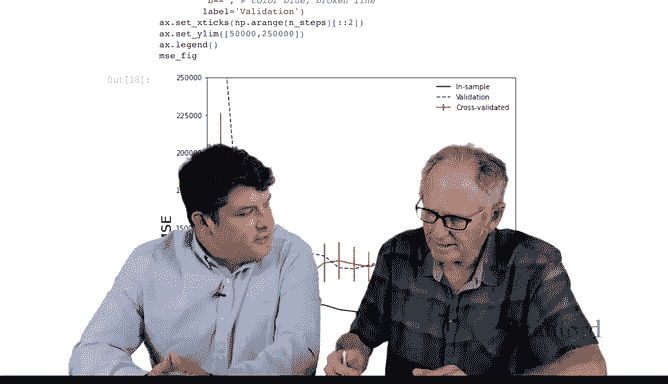

1.  **处理数据缺失值**：特别是响应变量的缺失。
2.  **自定义评估指标**：实现了C_p统计量并将其集成到Scikit-learn的框架中。
3.  **实施逐步选择**：使用`SequentialFeatureSelector`进行特征筛选。
4.  **交叉验证评估**：通过计算交叉验证均方误差及其标准误，为模型复杂度选择提供了更稳健的依据。
5.  **结果可视化**：通过绘制误差曲线，直观对比了训练误差、交叉验证误差的差异，指导最优模型选择。


这些技术是构建简约且预测性能良好模型的重要工具。在接下来的课程中，我们将探讨岭回归和Lasso等正则化方法。