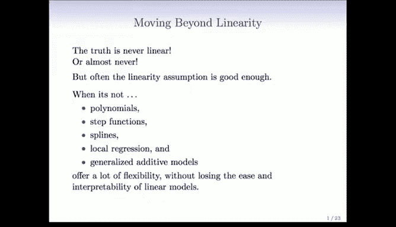
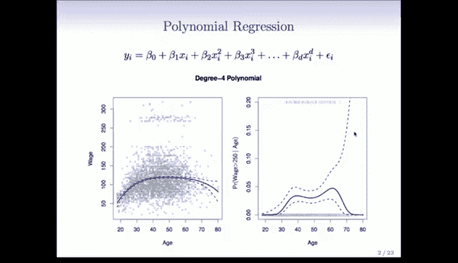
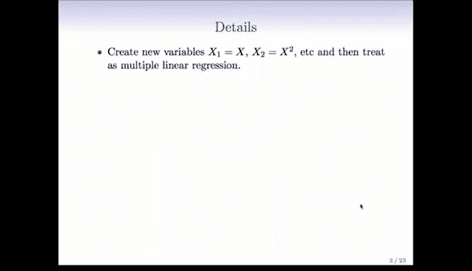
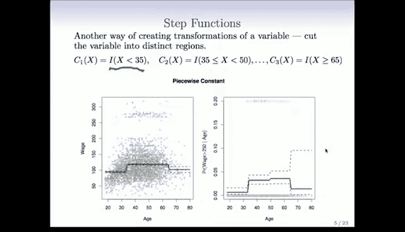
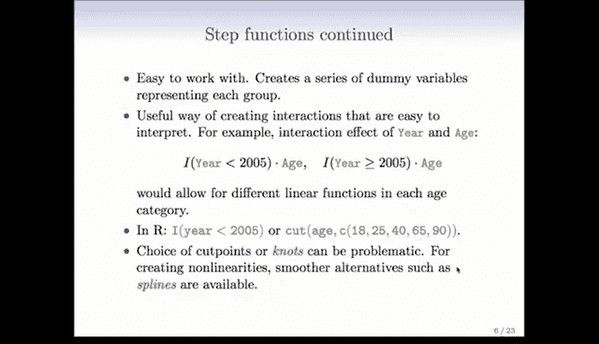

# Python 版 52：多项式与阶梯函数 📊


在本节课中，我们将学习如何将非线性关系引入到统计模型中。到目前为止，我们主要关注线性模型。本节将介绍一系列方法，从完全直接的方法到略微复杂的方法，来拟合非线性函数和模型。我们将看到，引入非线性实际上非常容易，并且所使用的工具几乎和拟合线性模型时一样简单。


我们将讨论一个方法层次结构，其中一些方法完全直接，一些则稍显复杂。今天看到的一些内容对特雷弗和我来说具有历史意义，因为我们合作撰写的第一篇论文就是关于广义可加模型的。在本节的最后部分，我们将讨论广义可加模型，这是一种将非线性工具用于多个预测变量的方法。


## 从线性到非线性 🔄


首先需要明确的是，真实情况几乎从来都不是线性的。线性只是一种近似。通常线性假设已经足够好，这也是我们喜欢线性模型的原因——近似足够好，并能提供一个简洁的总结。但很多时候我们需要超越线性，并且我们有很多工具可以做到这一点。在本节中，我们将讨论其中的一些工具。


以下是方法列表，按复杂度递增排列：多项式回归、阶梯函数、样条、局部回归和广义可加模型。你将看到，使用这些工具几乎和使用线性模型一样简单。

## 多项式回归 📈



多项式回归我们之前已经介绍过。在引入这些非线性方法时，我们主要针对单变量进行介绍，但你会看到在多变量中应用也同样简单。

多项式回归模型不仅包含线性项，还包含多项式项，例如 `x²`、`x³` 等。我们可以使用任意阶数。对于线性模型来说，它在系数上是线性的，但它是 `x` 的非线性函数。

在左侧面板中，我们看到工资数据上拟合了一个多项式函数（我相信是三阶多项式）。你可以看到拟合的函数以及逐点标准误差带（这些虚线带表示正负一个标准误差）。这是一个非线性函数，似乎捕捉到了数据中的趋势。我注意到标准误差带在末端更宽。特雷弗，这是为什么？

这是一个很好的问题，罗布。这是由于所谓的“杠杆作用”。注意数据在末端变得稀疏，因此用于拟合曲线末端的信息要少得多，所以标准误差变得更宽。此外，多项式函数非常灵活，尤其是在末端，这些“尾巴”往往摆动较大，标准误差带也反映了这一点。

实际上，在右侧的图中，我们使用多项式来拟合逻辑回归。在本节中，我们通过查看工资是否大于 250K 来将工资转换为二元变量。这是一个逻辑回归模型，试图模拟该事件的概率。注意末端的标准误差带有多宽。当我第一次看到时，我觉得这很疯狂，但后来我意识到垂直坐标轴的比例被拉伸得很厉害，它只到 0.2。哦，说得好。如果你从 0 到 1 来看，它会显得窄得多。这是一个需要时刻牢记的问题：绘图的比例很重要。在这个例子中，如罗布所说，它只到 0.2。

你还会注意到这里有一个所谓的“地毯图”。我们在图的底部看到所有零值出现的地方（这些小尖刺），它们均匀分布在整个范围内。在上方，我们看到所有一值出现的地方。你会注意到在范围中间只有一个一值，末端几乎没有一值。因此，在末端确实没有任何数据来估计这个函数。

### 多项式回归的细节

具体来说，进行多项式回归时，你需要创建新的变量。在这种情况下，它们只是原始变量的变换。例如，`x1` 是原始的 `x`，`x2` 是 `x²`，依此类推。然后，只需将这些新生成的变量视为多元线性回归模型中的预测变量即可。



在这种情况下，我们并不真正关心系数本身，而更关心在任何特定值 `x0` 处的拟合函数。我们感兴趣的是组合后的函数。因此，一旦我们拟合了模型，我们可能会问：函数在新的 `x0` 值处看起来是什么样子？系数本身并不那么有趣。

由于拟合函数实际上是系数 `β̂` 的线性函数，我们可以为逐点方差得到一个简单的表达式。也就是说，`x0` 处拟合函数的方差是多少？该拟合函数在 `x0` 处只是参数的一个线性组合。因此，通过使用拟合参数的协方差矩阵，你可以得到这个拟合值方差的一个简单表达式。我们在书中更详细地描述了这一点。在图中，我们实际上绘制了拟合函数加减 2 个标准误差（我之前说成了 1 个）。

因此，获得这些逐点标准误差是相当直接的。“逐点”意味着标准误差带是针对每个点的，它显示的是在任何给定点处的标准误差。这不要与全局置信带混淆，那是另一回事。

另一个问题是，我们使用什么阶数？在这里，我们实际上使用了四阶多项式（我之前说成了三阶）。显然，阶数 `D` 是一个参数。通常我们只是选择一个较小的数字，比如 2、3 或本例中的 4。或者，我们实际上可以通过交叉验证来选择 `D`，将其视为一个调优参数。

对于逻辑回归，细节与之前所述基本相同。在图中，这就是我们建模的内容。所以我们的逆逻辑函数只是一个多项式，而不是线性函数。一个稍微重要的小细节是获得置信区间。如果你尝试使用直接方法为概率获取置信区间，可能会得到超出 [0, 1] 范围的值。因此，你应该为拟合的 logit 值获取置信区间，然后将置信区间的上下端点通过逆 logit 变换，这样就得到了拟合概率的置信区间。这是一个有用的技巧。

### 其他要点

我们刚刚讨论了单变量的情况。对于多个变量，你可以对每个变量分别进行多项式变换，然后将所有新生成的变量堆叠在一起，在一个大的线性模型中拟合所有这些新变量。例如，如果你有一个变量 `x`，你可以生成 `x1` 到 `x4`；如果有另一个变量 `z`，你可以生成 `z1` 到 `z4`。你只需将它们全部堆叠在一起，构建一个大的模型矩阵，然后拟合你的线性模型。之后，你需要解包各个部分来组合函数。稍后我们会看到，广义可加模型技术可以帮助你以无缝的方式完成这项工作。

多项式回归有一些注意事项。如前所述，多项式具有众所周知的尾部行为问题，对于外推非常不利。这些“尾巴”往往摆动很大，你真的不会相信数据范围之外或甚至太接近数据末端的预测。



最后，在 R 中拟合多项式非常简单。以下是一个用于将 `x` 的多项式拟合到 `y` 的模型公式示例，`poly` 函数会为你生成这些变换：
```r
lm(y ~ poly(x, 4))
```
就是这么简单。我们将在实验课中获得一些相关经验。

## 阶梯函数 📊

阶梯函数是拟合非线性的另一种方式，在过去 20 年左右的时间里，在流行病学和生物统计学中特别流行。它的做法是将你的连续变量切割成离散的子范围。例如，这里我们在 35 岁和 65 岁处切割了年龄（实际上在 50 岁处也有一个切割点）。然后，想法是在每个区域内拟合一个常数模型。

所以这是一个分段常数模型。你可以在这里看到，当你拟合并一起绘制它们时，你会看到第一个范围的常数，第二个范围的常数，第三个范围的差异几乎看不见，然后是第四个范围的常数。当组合在一起时，它成为一个非线性函数，即分段常数函数。

如果存在一些感兴趣的自然分割点，这通常很有用。例如，35 岁以下人群的平均收入是多少？你可以直接从图上读出来。这通常适用于报纸、报告等中的总结，这也导致了它的流行。

要执行阶梯函数回归，就像多项式回归一样简单。如果你考虑这里的函数，它是一个二元变量。你创建一个二元变量：`x` 是否小于 35？如果是，设为 1；如果不是，设为 0。对于每个分割点，做法相同。因此，你创建了一堆虚拟变量（0/1 变量），然后用线性模型拟合它们。你总是可以看到这相对于多项式的一个优势：它是局部的。记住，多项式是整个 `x` 变量范围的单一函数。例如，如果我改变左侧的一个点，它可能会显著改变右侧的拟合。这是一个很好的观点，我之前忘了说。但对于阶梯函数，一个点只影响它所在分区的拟合，而不影响其他分区。

这是一个很好的观点，谢谢提醒。对于多项式，参数会影响整个函数，并且可能产生显著影响。我们对逻辑回归做了同样的事情，但使用了分段常数函数，其他一切都相同。不过，拟合的函数有些“块状”，可能被认为不那么有吸引力。

### 阶梯函数的应用

如前所述，阶梯函数易于使用：你创建一堆虚拟变量，然后拟合线性模型。

它也是创建易于解释的交互作用的有用方法。例如，考虑线性模型中年份和年龄的交互效应。你可以这样做：例如，创建一个年份的虚拟变量，比如年份是否小于等于 2005，以及另一个年份是否大于等于 2005。然后，如果你将其与年龄相乘，你就创建了一个交互作用，这将为 2005 年之前和之后工作的人拟合两个不同的关于年龄的线性模型。这样，从视觉上看很好。你会看到两个不同的线性函数。这是观察交互效应的一种简单方法。

在 R 中，创建这些虚拟变量非常容易。创建一个指示函数基本上与我们在内核中展示的表达式相同。R 中有一个函数 `I()`，基本上就是一个指示器。`year < 25` 会变成一个逻辑值，但用 `I()` 包装后，它本质上就是一个 0/1 变量。



如果你想在多个位置切割，有一个名为 `cut` 的函数。你可以切割年龄，并给它切割点，你还需要给 `cut` 两个边界点。在这个例子中，18 和 90 是年龄的范围，然后是内部的切割点，它会为你创建一个因子，一个有序因子，将变量切割成那些区间。

现在，切割点或我们即将称之为“节点”的选择可能有点问题。对于创建线性关系，有更平滑的替代方法可用，我们接下来将讨论它们。你可能只是不幸地选择了一个切割点，而它根本没有显示出非线性。因此，这需要一些技巧。通常，这些分段常数函数在存在你想要使用的自然切割点时尤其好用。

## 总结 📝

在本节课中，我们一起学习了如何超越线性模型，引入非线性关系。我们首先讨论了多项式回归，它通过添加原始预测变量的高次项来扩展线性模型，从而拟合曲线关系。我们了解了其实现方法、如何计算逐点标准误差，以及需要注意的尾部行为问题。

接着，我们探讨了阶梯函数，这是一种将连续变量分段并拟合常数模型的方法。它特别适用于存在自然分割点或需要易于解释的总结的情况。我们还看到了如何利用阶梯函数来创建直观的交互作用项。



这两种方法都展示了将非线性引入线性模型框架的简便性。它们为处理更复杂的非线性关系奠定了基础，我们将在后续课程中继续学习样条、局部回归和广义可加模型等更高级的技术。