# Python 版 53：分段多项式与样条 📈

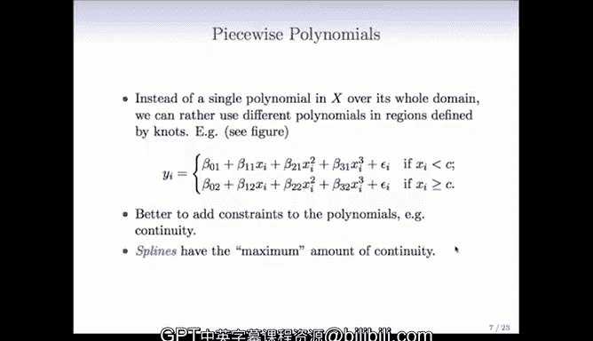

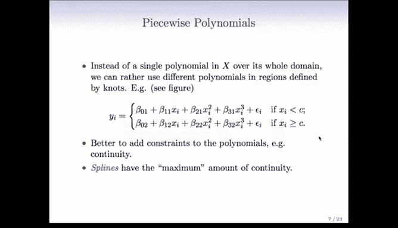

在本节课中，我们将要学习一种比全局多项式更灵活、更现代的非线性建模方法：分段多项式和样条。我们将了解它们的基本概念、数学表示、优势以及如何在实践中应用。

---

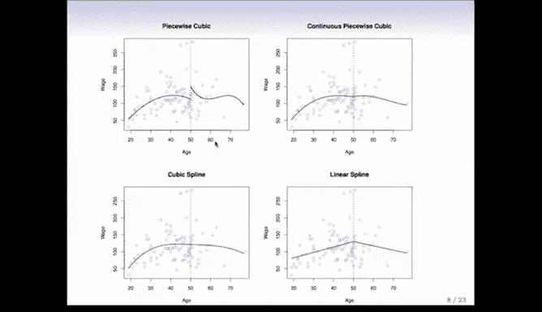

## 从分段常数到分段多项式

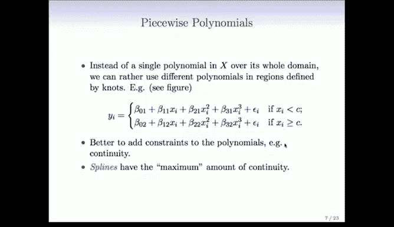

上一节我们介绍了分段常数回归，它虽然实现了局部拟合，但拟合结果不够平滑。本节中我们来看看如何通过使用分段多项式来获得既局部又平滑的拟合效果。

分段多项式的基本思想是：不在整个定义域上使用单个多项式，而是在不同的区域（由“节点”划分）内拟合不同的多项式。

例如，下图展示了一个在两个区域的分段三次多项式（左上图）。在节点（x=50）左侧和右侧分别拟合了一个独立的三次多项式。然而，这种方法在节点处会产生一个明显的断裂，导致拟合曲线不美观。

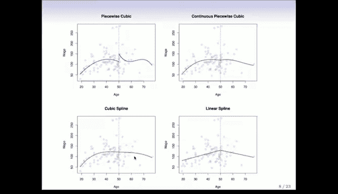

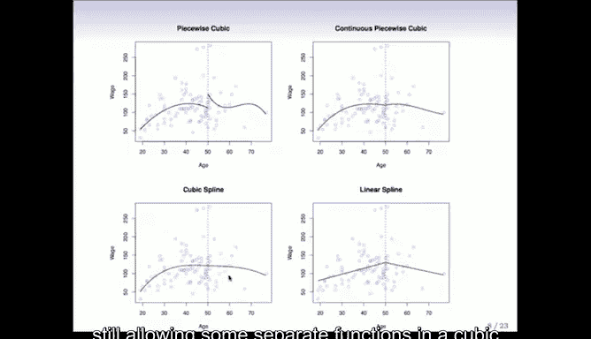

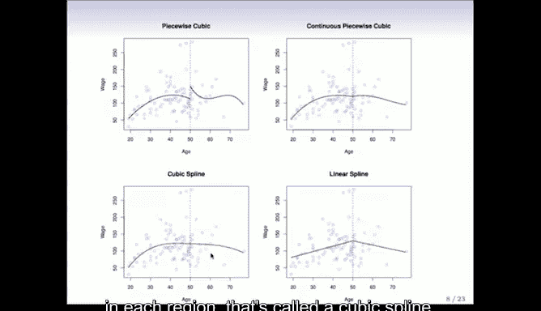

## 引入连续性约束

为了解决节点处的断裂问题，我们可以为多项式添加约束，例如**连续性**。

在右上图中，我们强制左侧和右侧的三次多项式在节点处连续。这使得拟合曲线看起来平滑了许多，开始接近全局多项式的效果，但在节点处仍可能有一个微小的“扭结”。

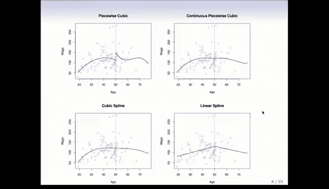

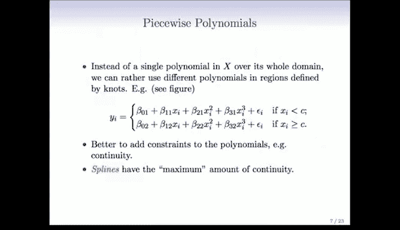

在某些情况下，仅保证连续性还不够。我们可以进一步要求**导数**也连续。

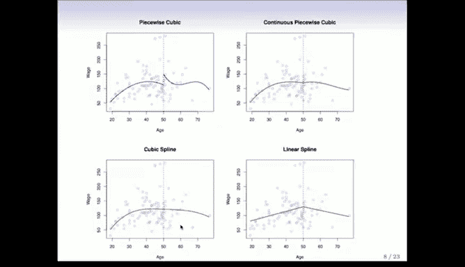

下图中的红色曲线被称为**三次样条**。它满足以下三个约束：
1.  函数在节点处连续。
2.  函数的一阶导数在节点处连续。
3.  函数的二阶导数在节点处连续。

我们无法让三阶导数也连续，因为那样就会退化为一个全局的三次多项式。三次样条是在保证区域独立性的前提下，所能达到的最高阶连续性。

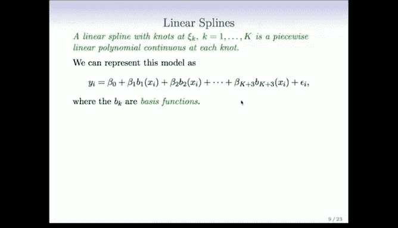

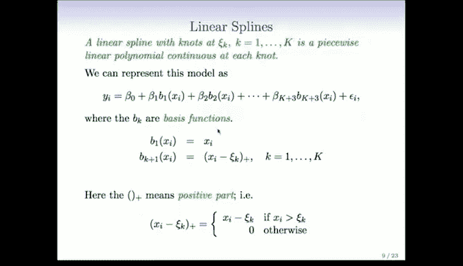

## 线性样条与三次样条的数学表示

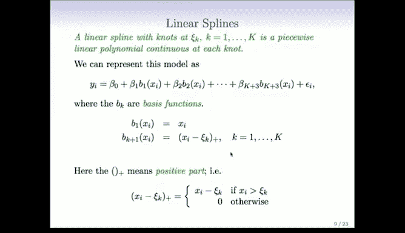

样条函数可以通过一组**基函数**的线性组合来表示，这使得它们可以像线性回归一样进行拟合。

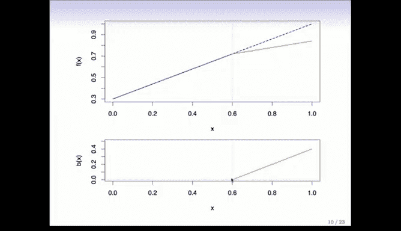

### 线性样条

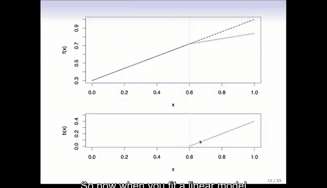

一个在节点 `C_k (k=1,...,K)` 处的线性样条，是一个在节点处连续的分段线性多项式。

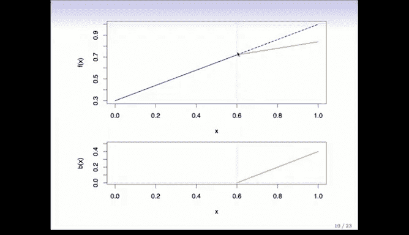

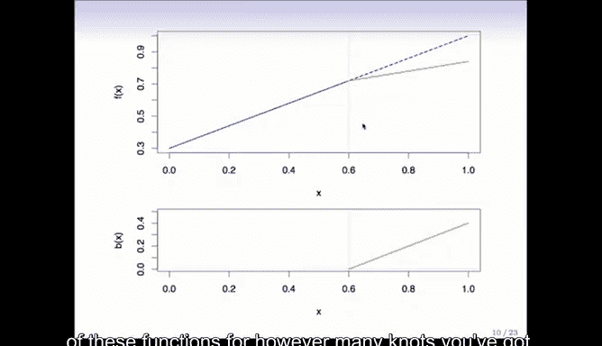

其基函数展开形式如下：
`y = β₀ + β₁x + Σ_{k=1}^{K} θ_k (x - C_k)_+`
其中，`(x - C_k)_+` 是一个**截断幂函数**，定义为：
`(x - C_k)_+ = { x - C_k, 如果 x > C_k; 0, 否则 }`

以下是线性样条基函数的工作原理：
*   全局线性项 `β₁x` 提供了基础斜率。
*   每个截断幂函数 `(x - C_k)_+` 在对应的节点 `C_k` 处从0开始线性增长。
*   将这些基函数加入模型并赋予系数 `θ_k`，允许函数在节点处改变斜率，同时保证函数本身连续。

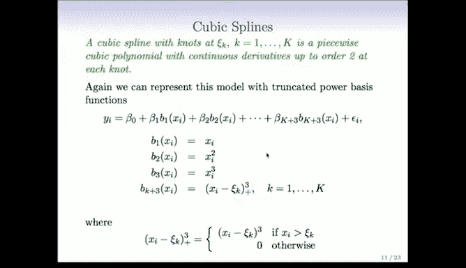

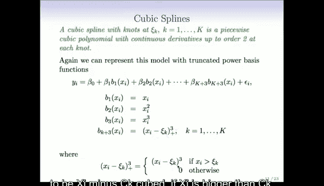

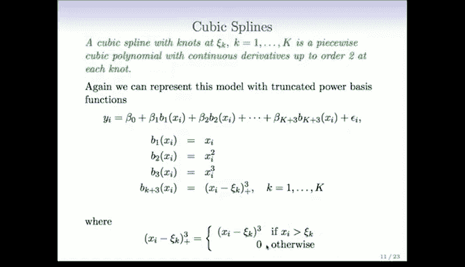

### 三次样条

一个在节点 `C_k` 处的三次样条，是一个分段三次多项式，且在节点处具有直到二阶的连续导数。

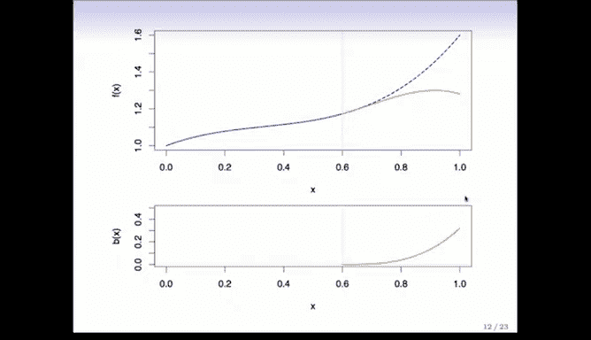

其基函数展开形式如下：
`y = β₀ + β₁x + β₂x² + β₃x³ + Σ_{k=1}^{K} θ_k (x - C_k)_+³`
其中，截断幂函数提升到了三次方：
`(x - C_k)_+³ = { (x - C_k)³, 如果 x > C_k; 0, 否则 }`

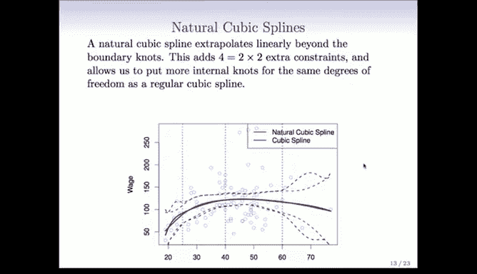

这个三次截断幂函数在节点处的函数值、一阶导数和二阶导数均为0。因此，将其加入模型只会改变节点右侧区域的“立方”部分，而不会破坏函数在节点处已有的连续性，完美满足三次样条的定义。

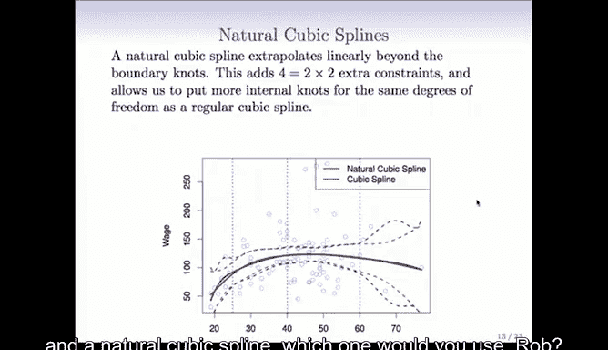

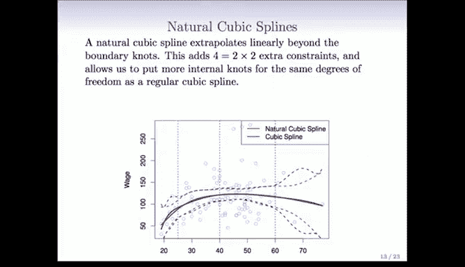

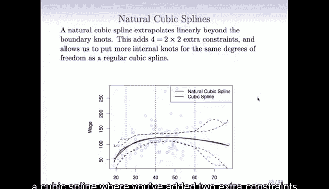

## 自然三次样条 🌿

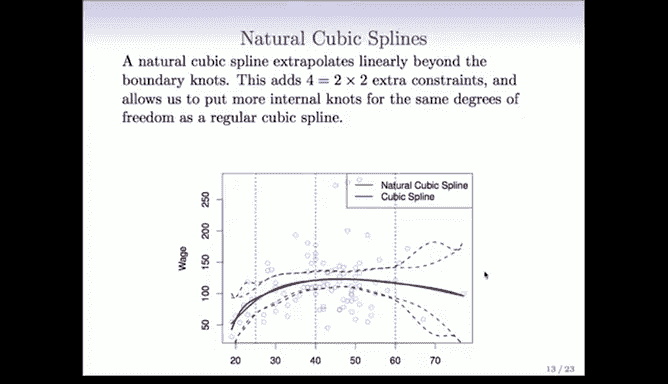

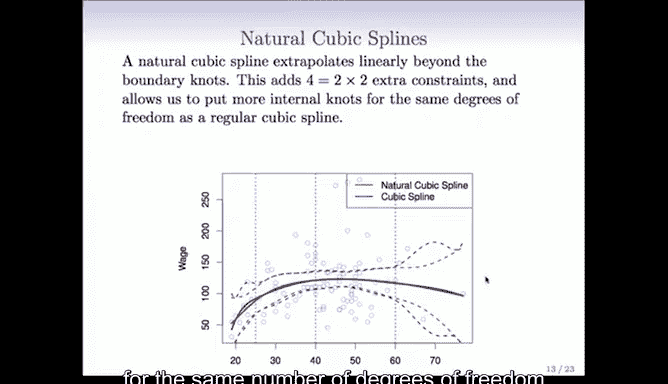

三次样条在数据边界区域可能表现不稳定。**自然三次样条**通过添加额外的边界约束来解决这个问题：它要求函数在边界节点之外的区域是**线性**的。

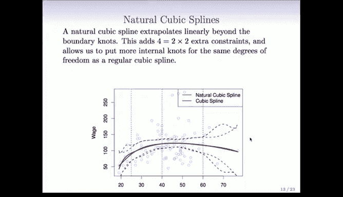

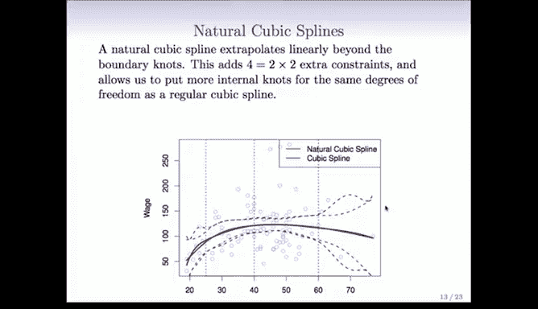

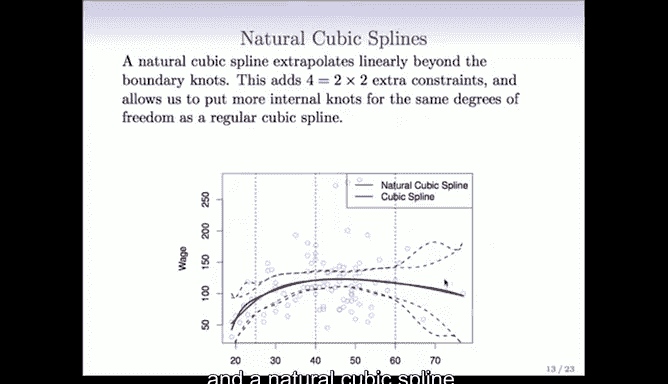

这意味着：
*   在数据范围之外，函数不会产生像高次多项式那样疯狂的摆动。
*   这些额外的约束释放了自由度。因此，在模型参数数量相同的情况下，自然三次样条可以在内部放置更多的节点，从而在数据密集区域获得更高的灵活性。

下图对比了普通三次样条和自然三次样条。在拟合曲线上差异不大，但自然三次样条在边界处的置信区间（标准误）更窄，表明其估计更稳定。

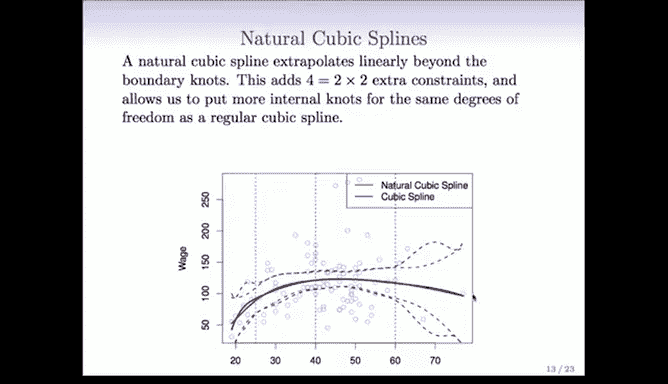

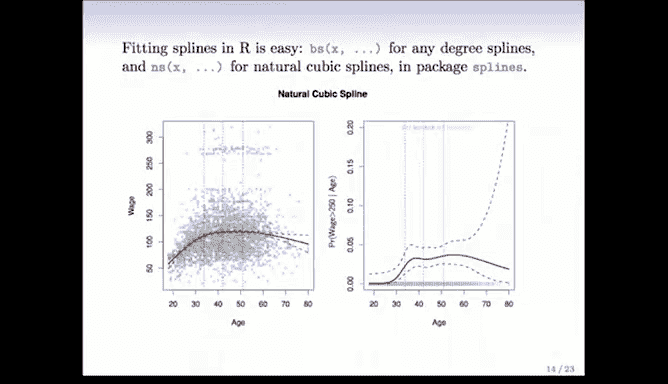

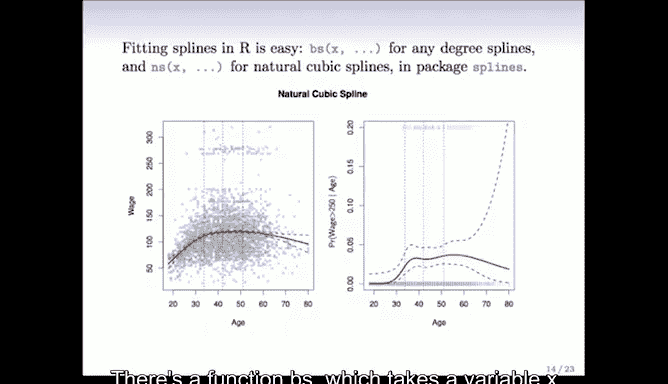

## 实践与应用

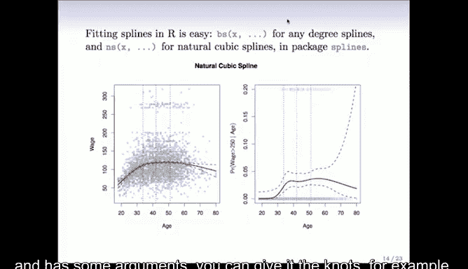

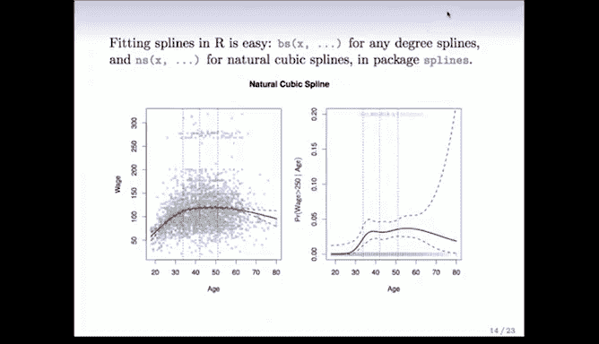

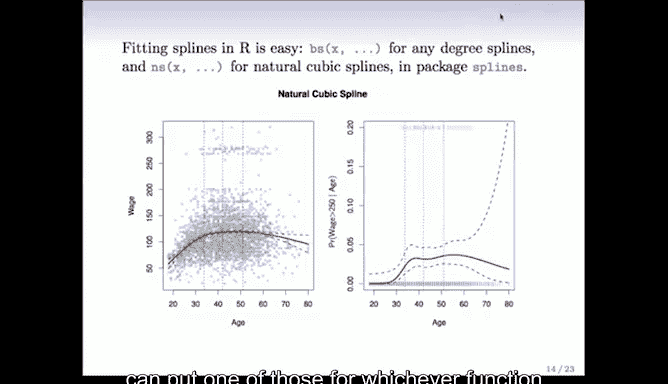

在实际操作中（以R语言为例），拟合样条非常简单：
*   使用 `bs()` 函数可以拟合三次样条。
*   使用 `ns()` 函数可以拟合自然三次样条。
*   需要指定节点位置或自由度。
*   这些函数可以像普通变量一样放入回归公式中。

以下是关于节点放置和自由度的一些细节：
*   **节点放置**：一个常见的策略是预先确定节点数量 `K`，然后将这些节点均匀放置在预测变量 `X` 的样本分位数上，使得每个区间包含大致相同数量的数据点。
*   **自由度**：
    *   一个具有 `K` 个节点的**三次样条**有 `K+4` 个自由度（或参数）。
    *   一个具有 `K` 个节点的**自然三次样条**有 `K` 个自由度（边界约束节省了4个自由度）。

下图展示了一个14次全局多项式与一个具有15个自由度的自然三次样条的对比。自然三次样条的拟合结果明显更平滑、更合理，且没有边界波动问题。

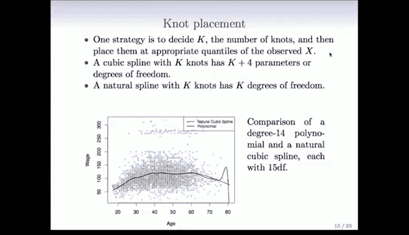

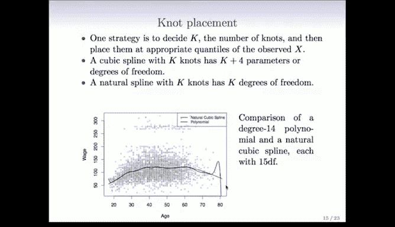

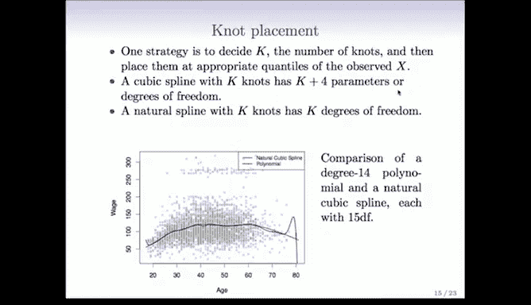

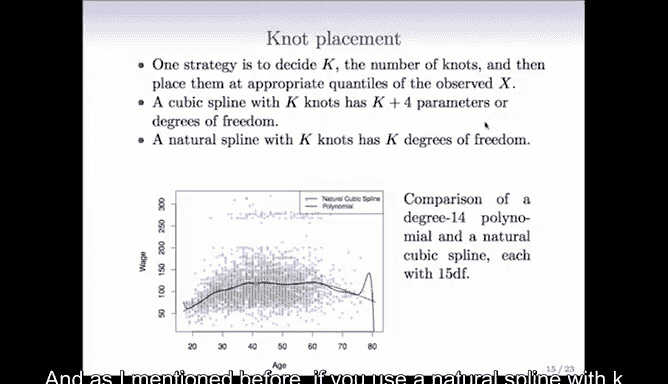

---

## 总结

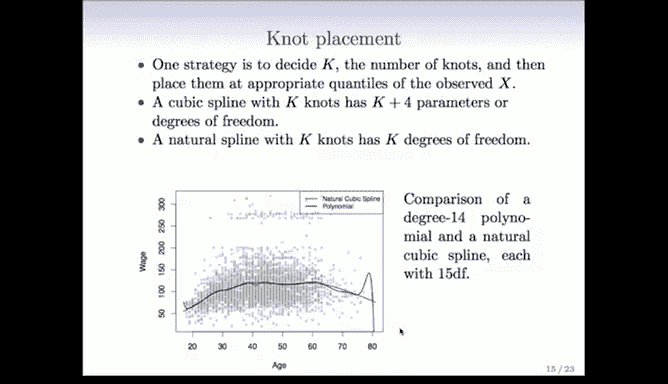

本节课中我们一起学习了分段多项式与样条回归。
*   我们从分段常数出发，为了追求平滑性，引入了分段多项式。
*   为了保证节点处的光滑连接，我们为多项式添加了连续性约束，从而引出了**样条**的概念，其中**三次样条**最为常用。
*   我们学习了样条的**基函数表示法**，这使其能够方便地融入线性模型框架进行拟合。
*   为了改善边界行为，我们介绍了**自然三次样条**，它强制外推部分为线性。
*   最后，我们讨论了节点的放置策略，并对比了样条与高次多项式的优劣。

核心结论是：虽然多项式易于理解，但样条（尤其是自然三次样条）通常具有更好的局部性和稳定性，是进行灵活非线性建模的更优选择。