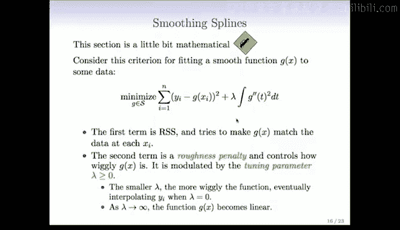
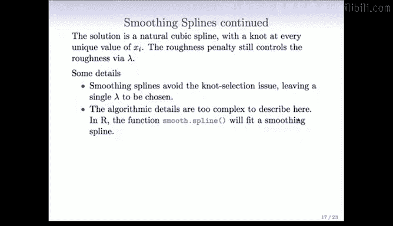
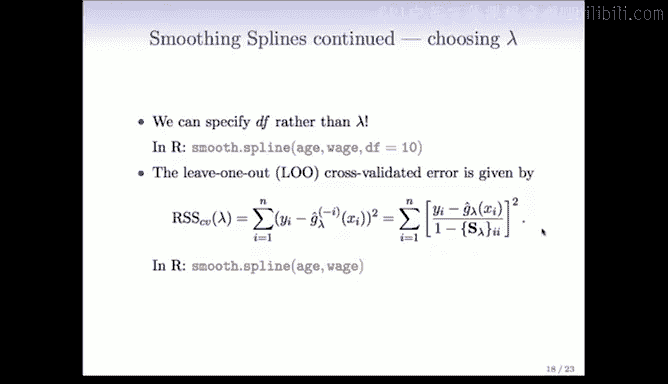
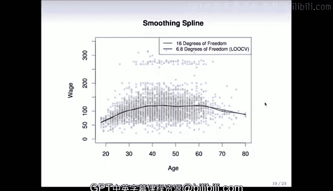

# Python 版 54：平滑样条 📈

在本节课中，我们将学习一种称为“平滑样条”的回归方法。这是一种拟合样条曲线而无需手动选择节点位置的优雅方法。我们将从数学原理、核心概念到实际应用，逐步解析平滑样条。

## 概述

平滑样条从一个完全不同的视角来处理曲线拟合问题。它通过一个包含两个部分的准则来寻找最优函数：一部分衡量函数对数据的拟合程度，另一部分则惩罚函数的“粗糙度”。这种方法避免了手动选择节点的麻烦，并通过一个称为“平滑参数”的单一参数来控制模型的复杂度。

## 核心准则

平滑样条的目标是找到一个函数 `g(x)`，使其最小化以下准则：

$$
\min_{g} \left\{ \sum_{i=1}^{n} (y_i - g(x_i))^2 + \lambda \int [g''(t)]^2 dt \right\}
$$

*   **第一部分**：`∑ (y_i - g(x_i))^2` 是残差平方和。它促使函数 `g(x)` 在观测点 `x_i` 处尽可能接近观测值 `y_i`。
*   **第二部分**：`λ ∫ [g''(t)]^2 dt` 是粗糙度惩罚项。它惩罚函数的“摆动”程度。二阶导数 `g''(t)` 衡量函数的曲率或非线性程度。平方后积分，就得到了函数在整个定义域上非线性的总和。
*   **参数 λ**：这是一个调节参数，称为平滑参数。它控制着惩罚项的权重。

## 平滑参数 λ 的作用

平滑参数 `λ` 的值决定了模型的复杂程度。

*   当 **λ = 0** 时，惩罚项不起作用。解 `g(x)` 会精确地穿过所有数据点，成为一个“插值函数”，可能非常“摆动”。
*   当 **λ → ∞** 时，惩罚项变得无限大。为了最小化准则，函数必须使惩罚项为零，即 `g''(t) = 0`。这意味着 `g(x)` 必须是一个线性函数。
*   当 **λ 在 0 到 ∞ 之间变化**时，我们得到一系列复杂度介于插值函数和线性函数之间的解。这个解被称为**平滑样条**。

## 平滑样条的性质

上一节我们介绍了平滑样条的数学准则，本节中我们来看看它的一些重要性质。

### 节点位置

一个令人惊讶的事实是，平滑样条的解是一个样条函数，并且它在**每一个唯一的 `x_i` 观测值处都有一个节点**。这听起来可能过于复杂，但由于粗糙度惩罚项 `λ` 的存在，它有效地控制了函数的摆动幅度，防止了过拟合。

### 线性平滑器

平滑样条属于“线性平滑器”家族。这意味着，在观测点 `x_i` 处的拟合值 `ĝ_λ` 可以写成观测响应向量 `y` 的线性组合：

$$
\hat{g}_\lambda = S_\lambda y
$$

其中，`S_λ` 是一个 `n × n` 的“平滑矩阵”，它由 `x_i` 的位置和 `λ` 的值决定。线性回归、多项式回归等许多方法都具有这种形式，这带来了良好的数学性质。

### 有效自由度

由于在每一个数据点都有节点，理论上模型的自由度可能接近 `n`。但由于惩罚项 `λ` 的约束，实际的有效自由度要小得多。有效自由度可以通过平滑矩阵 `S_λ` 的迹来计算：

$$
\text{df}_\lambda = \text{trace}(S_\lambda)
$$

这个值不一定是整数。在实际操作中，我们常常不是直接指定 `λ`，而是指定期望的**有效自由度**，然后由算法反向计算出对应的 `λ` 值。

## 如何选择平滑参数 λ

我们已经了解了平滑样条的原理和性质，接下来看看如何自动选择最优的平滑参数 `λ`。

### 交叉验证法

以下是选择 `λ` 的常用方法：

*   **留一法交叉验证**：对于平滑样条，计算留一法交叉验证误差平方和有一个非常高效的公式，无需反复重新拟合模型。公式如下：
    $$
    \text{CV}(\lambda) = \frac{1}{n} \sum_{i=1}^{n} \left( \frac{y_i - \hat{g}_\lambda (x_i)}{1 - {S_\lambda}_{ii}} \right)^2
    $$
    其中，`{S_λ}_{ii}` 是平滑矩阵 `S_λ` 的第 `i` 个对角元素。我们只需拟合一次模型，然后对一系列 `λ` 值计算 `CV(λ)`，并选择使 `CV(λ)` 最小的那个 `λ`。

### 实际操作

在 R 语言中，`smooth.spline()` 函数可以方便地拟合平滑样条。

*   你可以直接指定 `lambda`。
*   你也可以指定 `df`（有效自由度），函数会自动计算对应的 `lambda`。
*   如果你既不指定 `lambda` 也不指定 `df`，函数默认会使用留一法交叉验证自动选择最优的 `lambda`。

## 示例与应用

最后，我们通过一个例子来直观感受平滑样条的效果。

下图展示了两种拟合方式：
*   **左侧**：固定有效自由度 `df = 16` 的平滑样条。
*   **右侧**：使用留一法交叉验证自动选择 `λ` 的平滑样条，其对应的有效自由度约为 `df = 6.8`。

可以看到，交叉验证选择的模型更平滑，有效防止了过拟合，体现了自动参数选择的优势。

## 总结

本节课中，我们一起学习了平滑样条这一强大的非参数回归工具。它通过最小化一个结合了拟合优度和粗糙度惩罚的准则，优雅地实现了曲线拟合。其核心在于平滑参数 `λ`，它控制着模型的复杂度，从插值函数平滑过渡到线性函数。我们了解到平滑样条是线性平滑器，拥有有效自由度的概念，并且可以通过交叉验证自动选择最优的 `λ`。这种方法避免了手动选择节点的困难，是拟合非线性关系的有效手段。