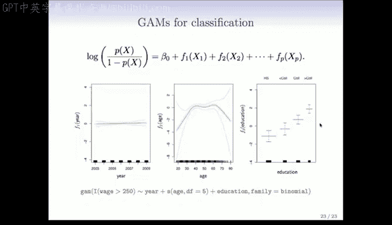

# Python 版 55：广义可加模型与局部回归 📊

在本节课中，我们将学习两种用于拟合非线性关系的强大方法：**局部回归** 和 **广义可加模型**。我们将了解它们的基本思想、如何实现，以及它们各自的优势。

---

## 局部回归

上一节我们介绍了多种拟合非线性函数的方法。本节中，我们来看看另一种方法家族：**局部回归**。

局部回归的核心思想是：在数据的每个目标点附近的一个小区域内，拟合一个简单的线性函数。这个“区域”由权重函数（或称核函数）定义，它赋予目标点附近的点更高的权重，而远离目标点的点权重较低。

以下是局部回归的工作步骤：

1.  选择一个目标点。
2.  根据核函数，为数据集中每个点分配一个权重。权重随该点与目标点距离的增加而衰减。
3.  使用**加权最小二乘法**，仅用该区域内的数据拟合一个线性函数。
4.  计算该线性函数在目标点处的拟合值。
5.  将目标点沿数据范围滑动，重复上述过程，从而得到一条完整的拟合曲线。

使用局部线性拟合（而非局部常数拟合，如移动平均）的优势在于，它在数据边界处的**外推效果更好**。

在R语言中，可以使用 `lowess` 或 `loess` 函数轻松实现局部回归。局部回归和三次平滑样条是两种最优秀的平滑方法。如果设置相同的自由度，两者的结果通常看起来非常相似。

关于局部回归的更多细节，可以参考相关书籍，这是一个非常丰富且灵活的领域。

---

## 广义可加模型

现在，让我们转向**广义可加模型**。其核心思想是同时拟合多个变量的非线性函数，但同时保留线性模型的**可加性**。这使得模型结果易于解释。

一个GAM模型的形式如下：
`Y = β0 + f1(X1) + f2(X2) + ... + fp(Xp) + ε`
其中，每个 `f_j(X_j)` 都是一个平滑的非线性函数。

拟合GAM模型后，可以绘制每个变量的函数贡献图，从而直观地理解每个变量如何影响响应变量。

以下是拟合GAM的几种方式：

*   **使用自然样条和线性模型**：可以直接利用之前学过的工具，如自然样条，通过 `lm()` 函数来拟合一个可加模型。
    ```r
    lm(wage ~ ns(year, df=5) + ns(age, df=5) + education, data=Wage)
    ```
    注意，需要使用 `plot.gam()` 而非通用的 `plot()` 来绘制正确的函数图。

*   **使用 `gam` 包**：可以拟合更复杂的模型，混合使用线性和非线性项，并使用不同的平滑方法。
    ```r
    gam(wage ~ s(year, df=5) + lo(age, span=0.5) + education, data=Wage)
    ```
    其中，`s()` 指定使用平滑样条，`lo()` 指定使用局部回归，`span` 参数控制局部窗口的大小。

*   **包含交互作用**：虽然基本GAM是加性的，但也可以通过张量积等方法引入变量间的交互项（即双变量平滑器）。
    ```r
    gam(wage ~ ns(age, df=5) * ns(year, df=5) + education, data=Wage)
    ```

*   **用于分类问题**：GAM同样可以应用于分类。例如，在逻辑回归中，将对数几率（logit）建模为可加形式。
    ```r
    gam(I(wage>250) ~ year + s(age, df=5) + education, family=binomial, data=Wage)
    ```
    此时，绘图显示的是各个函数对**对数几率**的贡献，并会给出标准误带。

---



## 总结

本节课中我们一起学习了两种重要的非线性建模工具：
1.  **局部回归**：通过在每个数据点邻域内拟合加权线性模型来构建灵活的曲线，特别擅长处理边界。
2.  **广义可加模型**：通过将多个变量的非线性贡献相加来构建模型，在保持预测能力的同时，提供了类似线性模型的可解释性。我们可以使用自然样条、平滑样条或局部回归作为其基础构件。


这些工具为我们处理复杂的非线性关系提供了强大的武器。在接下来的章节中，我们将探讨基于树的方法（如CART），它们擅长捕捉变量之间的交互效应和非线性组合。