# Python 版 56：多项式回归与阶梯函数 I 📊

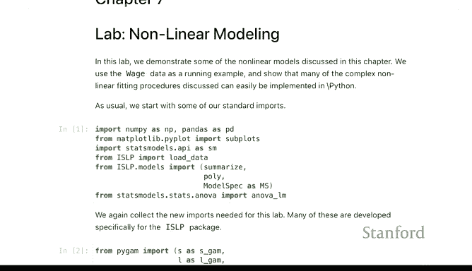

在本节课中，我们将学习第7章关于非线性建模和可加模型的实验内容。我们将从回顾多项式回归开始，并将其与样条函数以及后续的可加模型进行比较。课程将使用Python的`patsy`、`statsmodels`和`ISLP`等库，通过预测工资数据的实例，演示如何构建和评估多项式回归模型。

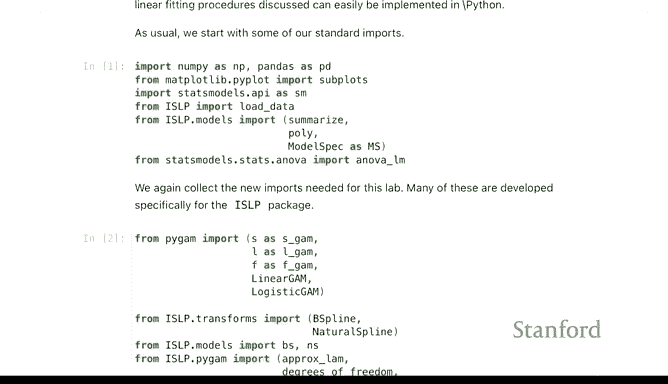

---

## 实验准备与数据导入

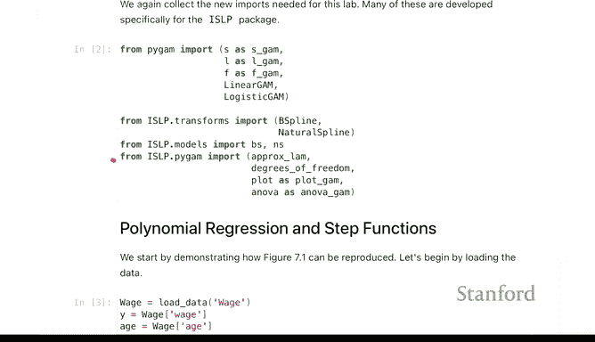

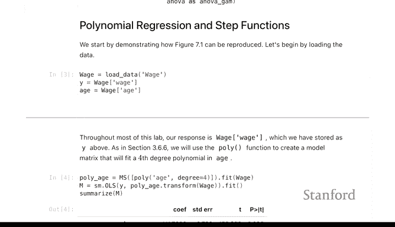

首先，我们进行常规的库导入。除了之前课程中常见的库，本章将引入一些新的工具。

```python
import numpy as np
import pandas as pd
import matplotlib.pyplot as plt
import statsmodels.api as sm
from patsy import dmatrix
from ISLP import load_data
from ISLP.models import (ModelSpec as MS,
                         poly,
                         bs, ns)
```

我们导入了用于拟合广义可加模型的`patsy`库，以及来自`ISLP`的用于构建B样条和自然样条的转换器及其辅助函数`bs()`和`ns()`。此外，还有一些为本次实验编写的实用工具函数。

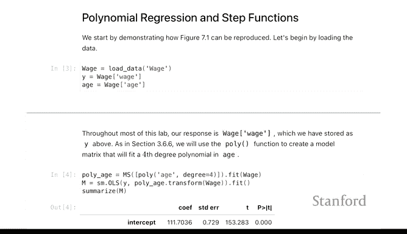

---

## 多项式回归回顾

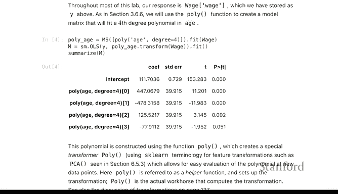

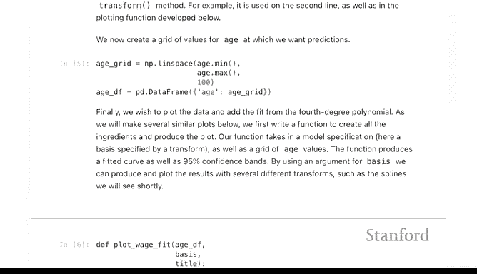

实验从回顾多项式回归开始。我们曾在第3章见过多项式回归，这里将用它来与样条函数和可加模型进行比较。

我们将使用一个预测工资的数据集（例如大西洋中部地区工资数据），试图根据工人的不同属性（主要是年龄）来预测其工资水平。数据中还包括教育水平等其他特征。

```python
Wage = load_data('Wage')
```

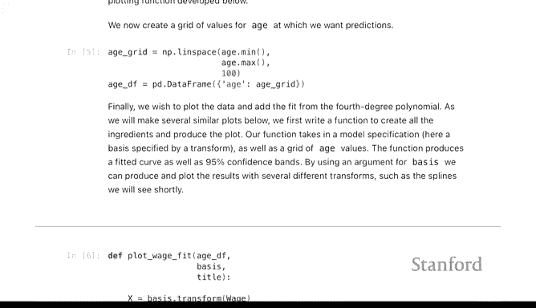

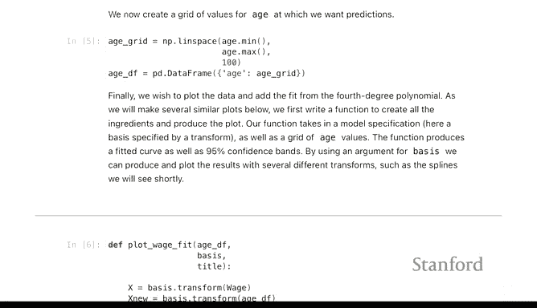

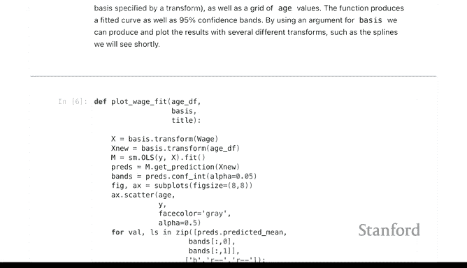

在拟合多项式回归后，我们希望可视化拟合结果。可加模型的一个优点是，可以为每个特征绘制其估计效应的曲线。因此，我们首先查看使用多项式回归的拟合情况。

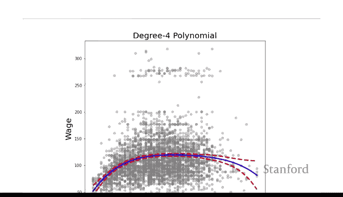

我们编写了一个辅助函数`make_plot`来简化绘图过程。该函数接受一个模型设定（即基函数），并在一个年龄值网格`age_df`上评估该基函数，从而生成绘图。

```python
def make_plot(X, Y, est, ax, alpha=0.5):
    ax.scatter(X, Y, alpha=alpha)
    ax.plot(age_df['age'], est.predict(age_df), color='black')
    # ... 添加误差带等代码
```

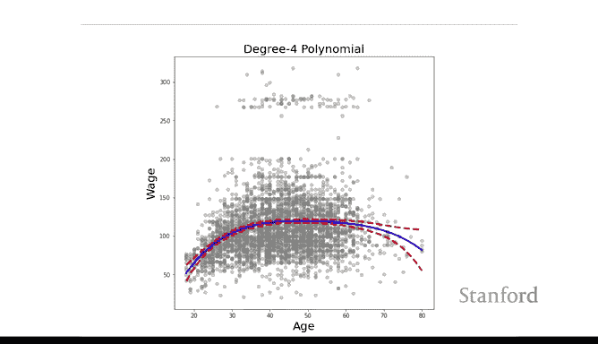

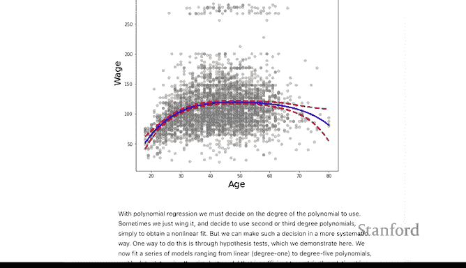

让我们查看四阶多项式的拟合结果。图中包含了误差带。为了在散点图中更好地感知数据点的密度，我们为点添加了透明度（alpha通道，例如50%和40%）。

```python
# 假设已经拟合了四阶多项式模型 poly_fit_4
make_plot(Wage['age'], Wage['wage'], poly_fit_4, ax)
```

---

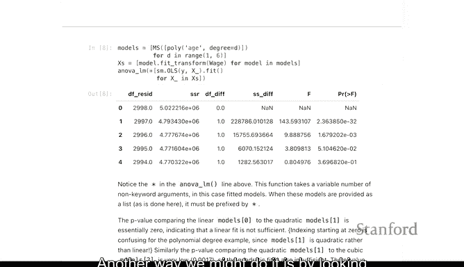

## 确定多项式阶数

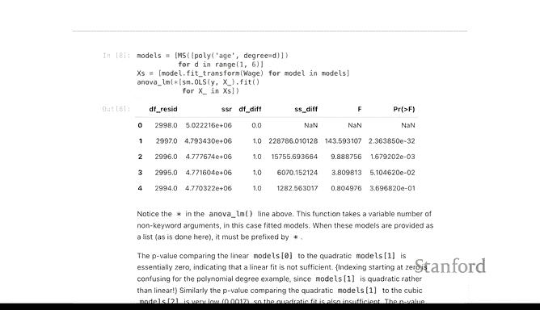

在构建多项式回归模型时，我们通常需要确定回归模型的阶数。一种方法是使用第5章见过的交叉验证。另一种方法是查看拟合优度随阶数增加的统计度量变化。我们稍后在广义可加模型中也会采用类似方法，比较不含年龄、线性年龄和带可加函数的模型。

这里，我们使用`anova_lm`函数（第3章见过）来比较随着多项式阶数增加，模型的改进情况。

```python
from statsmodels.stats.anova import anova_lm
# 比较不同阶数模型的ANOVA表
anova_results = anova_lm(model_linear, model_quad, model_cubic, model_quartic)
```

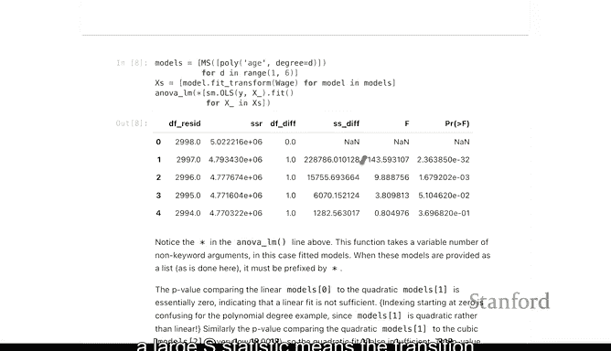

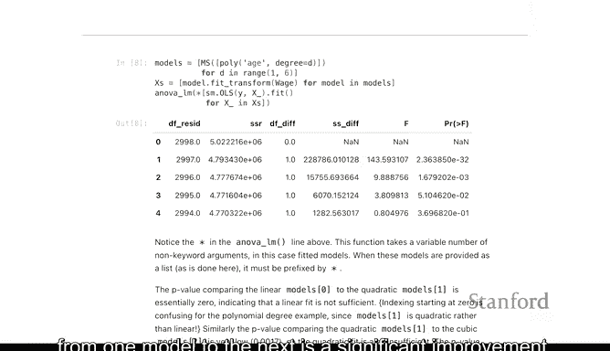

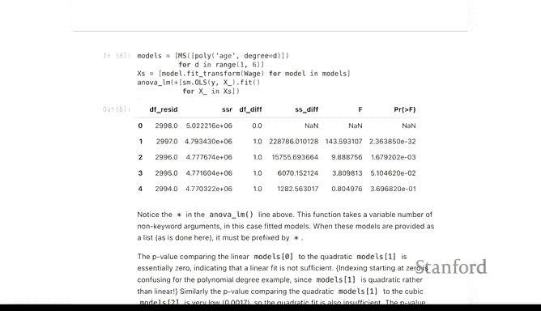

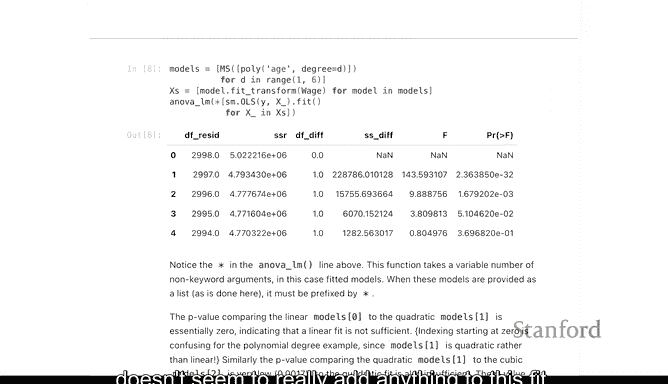

我们关注F统计量。较大的F统计量意味着从一个模型到下一个模型的转变带来了显著的改进。F统计量平均值在1左右，因此远大于1的值是存在改进的有力证据。从结果中我们可以看到，从无年龄到线性年龄是一个大改进，二次项也有相当改进，三次项改进较小，而四阶项似乎没有为拟合增加任何实质内容。

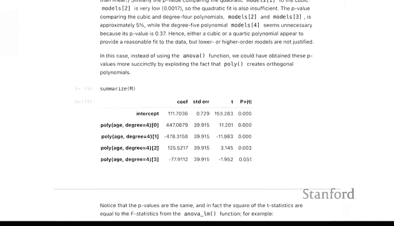

需要注意的是，在只有一个特征的情况下，这些F统计量也可以从模型的汇总表中找到。

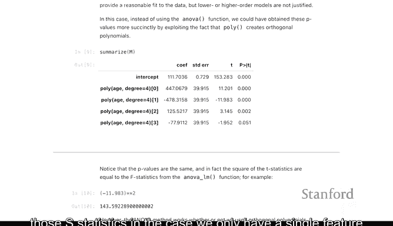

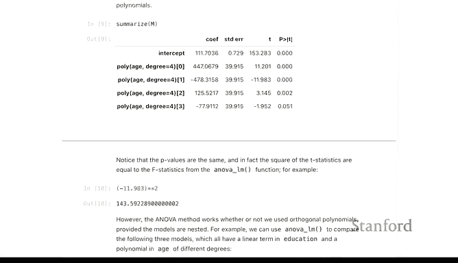

---

## 引入其他特征

我们不仅限于使用年龄作为特征。例如，我们可以加入教育水平（一个分类变量），研究在控制教育水平后，年龄的影响。我们可以构建类似的表格，查看随着年龄拟合复杂度的增加，模型拟合的改进情况。

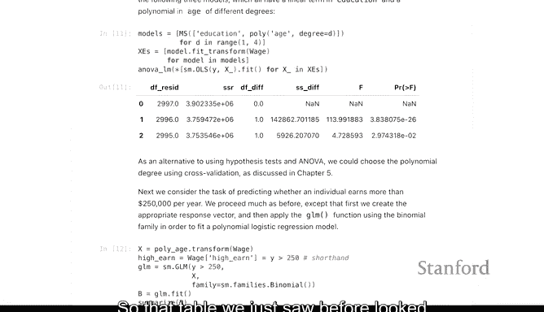

```python
# 构建包含教育水平和年龄多项式的模型
model_spec = MS(['education', poly('age', degree=4)])
# ... 拟合模型并进行ANOVA比较
```

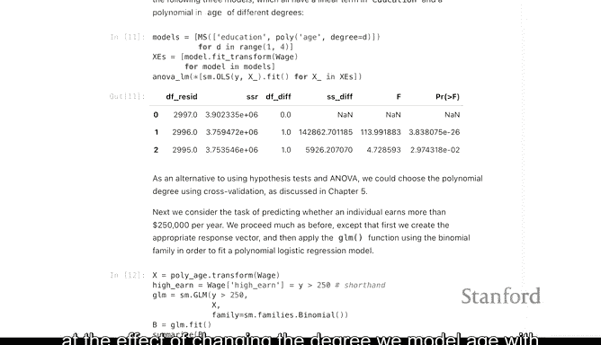

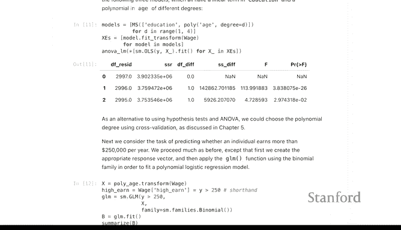

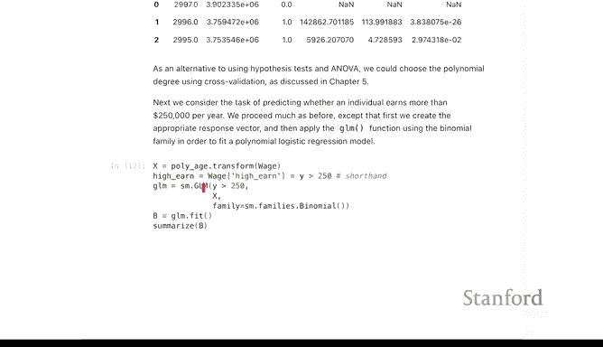

我们再次看到，加入线性项有巨大改进，加入二次项也有改进。这里我们没有展示到四阶。

---

## 逻辑回归应用

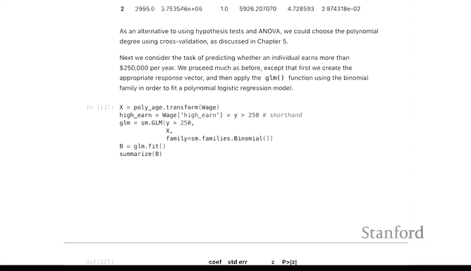

除了预测工资数值，我们还可以考虑一个二分类问题：预测工人的工资是否超过25万美元。我们将这个二值变量称为“高收入者”。

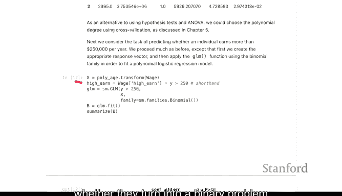

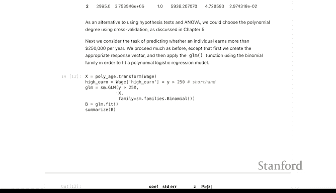

我们可以重复相同的过程，但不再使用普通最小二乘法，而是使用逻辑回归。这里使用`statsmodels`的`GLM`对象，并指定`family=sm.families.Binomial()`来告知计算机这是逻辑回归。

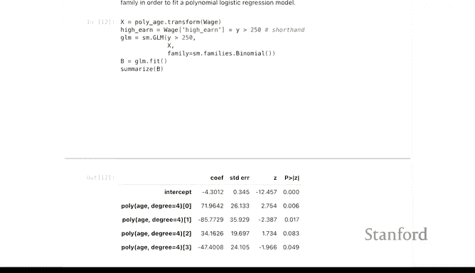

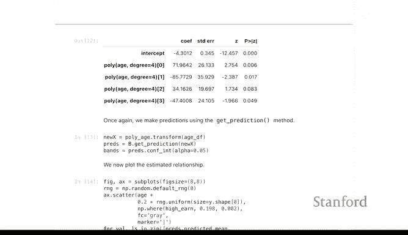

```python
from statsmodels.genmod.generalized_linear_model import GLM
Wage['high_income'] = (Wage['wage'] > 250).astype(int)
logit_model = GLM(Wage['high_income'], model_matrix, family=sm.families.Binomial()).fit()
```

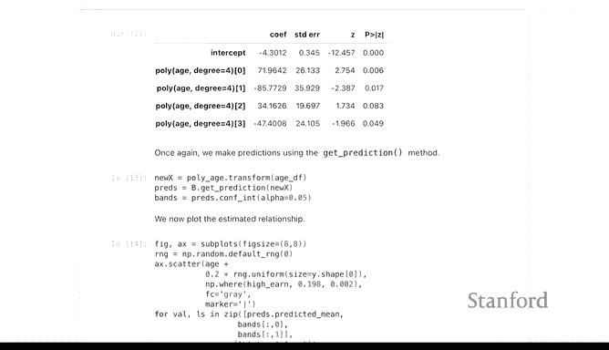

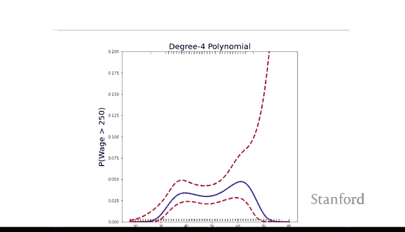

拟合并汇总这个模型，其形式会与线性回归拟合类似，只不过现在预测的是一个二值结果。

同样，我们可以绘制估计效应的曲线图。

```python
make_plot_for_logit(Wage['age'], Wage['high_income'], logit_fit_4, ax)
```

在此图中，蓝色曲线是四阶多项式的拟合结果，带有标准误差带。由于Y轴现在是预测的二值结果（0或1），我们没有像之前那样绘制散点图，而是将轴截断以便观察拟合曲线。我们在图上用标记点表示高收入者（标记在上方）和低收入者（标记在下方）。为了更好地区分年龄密度（因为年龄是整数值），我们在X轴上添加了一点轻微的随机扰动（jitter）。

请注意图右侧的标准误差带非常宽。这通常意味着在该区域数据非常少。在数据范围的边缘，标准误差通常会变宽，如果数据极少，则会变得更宽。此外，如果某个年龄段所有人都是低收入者，对于二分类问题来说，也意味着该区域的数据信息量低。

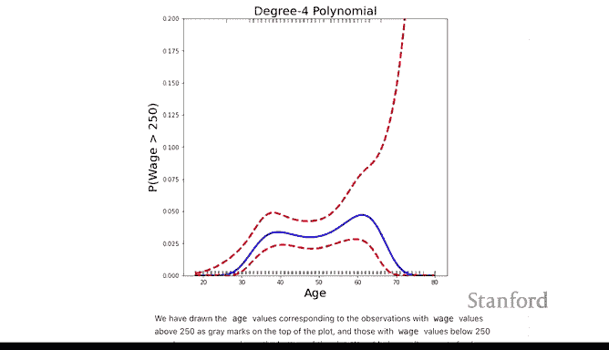

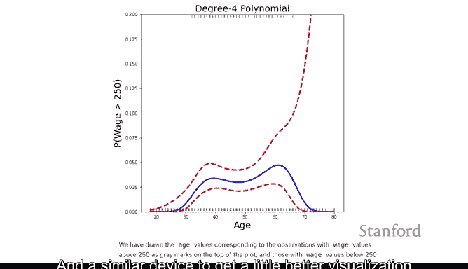

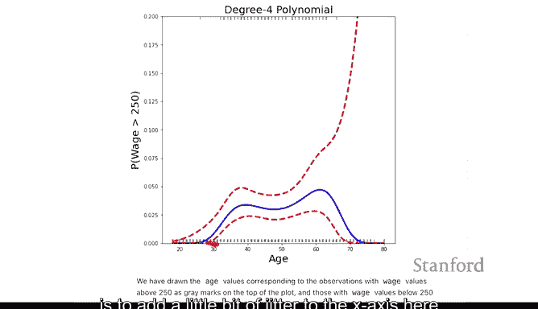

---

## 总结

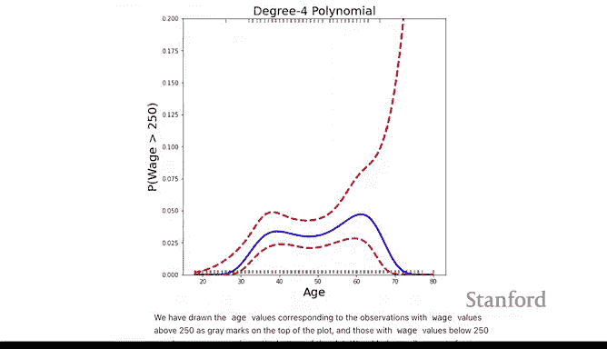


本节课我们一起回顾并实践了多项式回归。我们学习了如何拟合不同阶数的多项式模型，并使用ANOVA分析来确定合适的模型复杂度。我们还探讨了如何将多项式回归应用于包含其他特征（如分类变量）的模型，以及如何将其扩展到逻辑回归以解决二分类问题。通过可视化，我们直观地理解了模型拟合效果和不确定性，特别是在数据稀疏的区域。这些为后续学习更灵活的样条函数和广义可加模型奠定了基础。