# Python 版 57：统计学习中的样条回归 I 📊 

在本节课中，我们将学习如何使用样条来拟合灵活的回归模型。我们将介绍样条的基本概念，并通过Python代码演示如何构建和使用B样条与自然样条。

---

## 概述：从多项式到样条

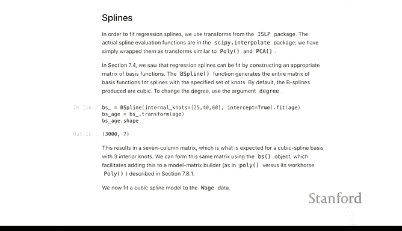

上一节我们介绍了如何通过高次多项式来拟合复杂的回归模型。本节中，我们来看看另一种拟合灵活函数的方法——样条。

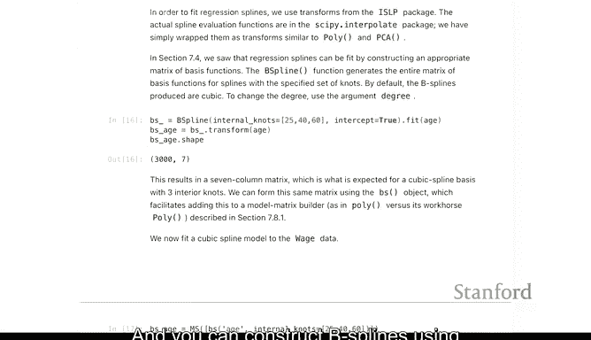

样条是分段光滑的函数。根据阶数的不同，它可以是分段常数（0阶）、分段线性（1阶）、分段二次（2阶）或分段三次（3阶）。其中，三次样条是建模光滑函数时的默认选择。

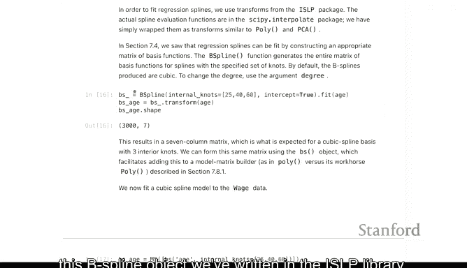

---

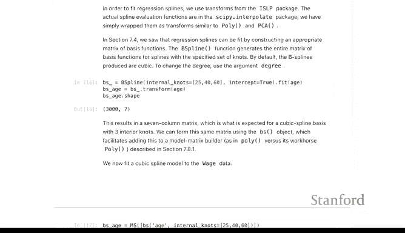

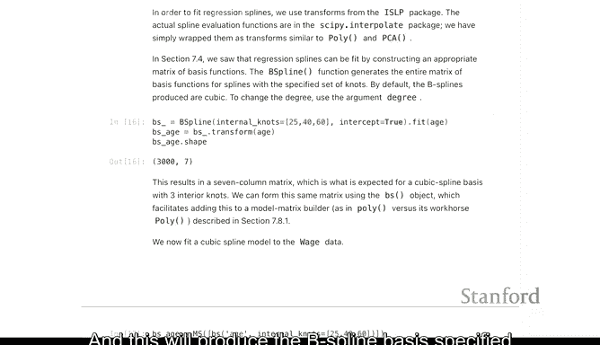

## B样条基础

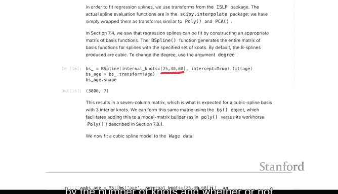

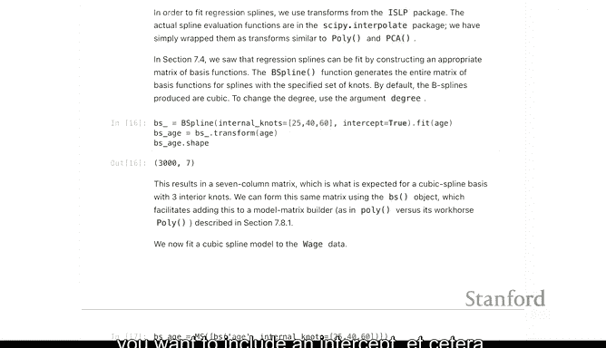

在回归场景中使用样条时，我们可以借助类似`poly`函数的工具。以下是使用B样条的方法。

我们可以在`ISLP`库中使用`BSpline`对象来构建B样条基。这是一个`scikit-learn`风格的转换器，具有`fit`和`transform`接口。

```python
# 示例：使用BSpline转换器
from ISLP import BSpline
# 初始化BSpline对象，指定节点数和是否包含截距项
bs = BSpline(knots=5, include_intercept=True)
# 拟合并转换数据
X_bs = bs.fit_transform(X)
```

在回归模型中，我们通常不直接使用这个转换器，而是使用一个辅助函数，类似于之前见过的`poly`函数。我们可以用样条拟合模型并查看摘要，但需注意，单个系数通常信息量较少，函数的整体形态更为重要。

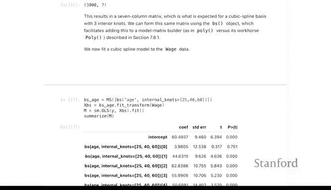

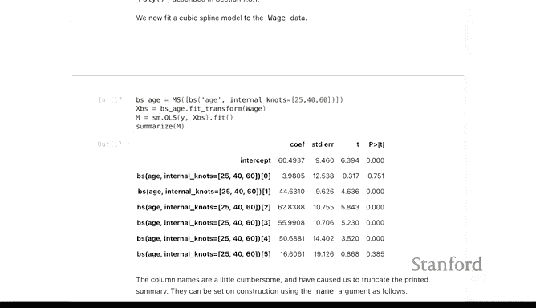

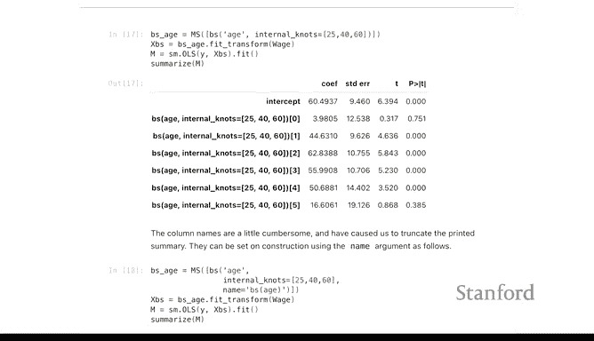

---

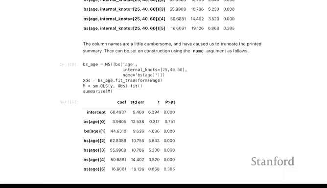

## 自然样条

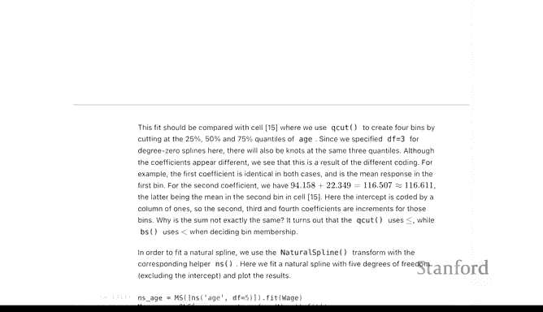

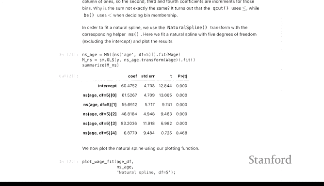

现在我们来讨论自然样条。自然样条是B样条的一种特殊形式，附加了额外的约束条件：在最后一个节点之外，函数以线性而非三次的形式延伸。

因此，自然样条在中间区域看起来像B样条，但在外推时表现略有不同。

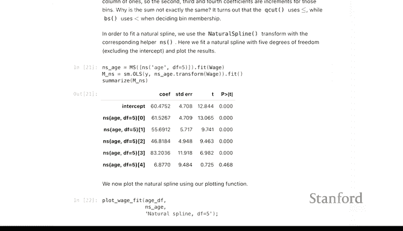

样条的自由度与节点数量相关，节点即函数导数不连续的点。使用5个自由度的样条在某种意义上类似于使用五次多项式，它们使用相同数量的参数，但实现方式略有不同。

---

## 样条与多项式的比较

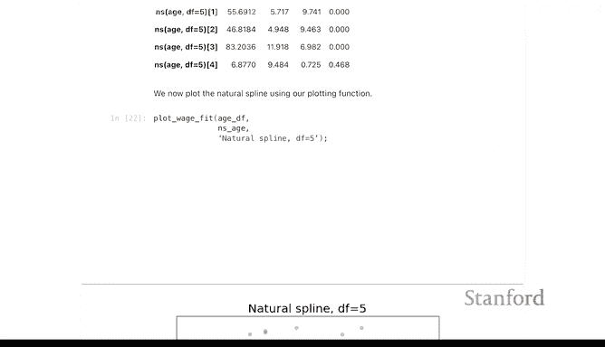

让我们回顾一下四次多项式的拟合图，其拟合效果与样条并不相似。自然样条通常具有更好的外推能力，因为它们是线性外推。相比之下，多项式在边界点之外可能快速增长，这是使用样条而非多项式的一个优点。

---

## 总结

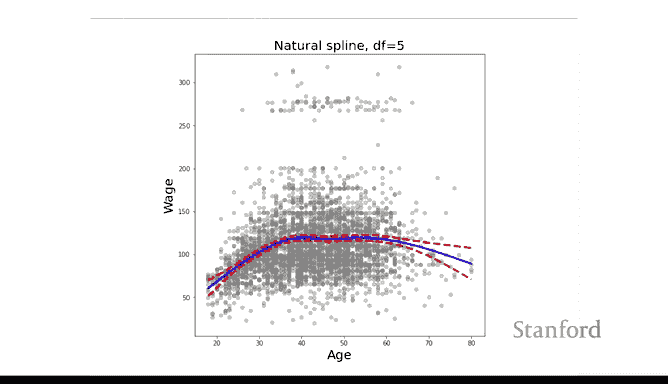


本节课中，我们一起学习了样条回归的基础知识。我们了解了B样条和自然样条的概念，并通过代码示例展示了如何在Python中实现它们。样条提供了一种灵活且稳健的方法来拟合复杂的数据关系，特别是在需要良好外推性能的场景中。