# Python 版 58：广义可加模型 (GAMs) I 📈

在本节课中，我们将学习广义可加模型。我们已经了解了如何使用样条和多项式回归来拟合回归模型。现在，我们将继续学习广义可加模型。本节实验的第一部分内容与我们之前看到的仅将工资建模为年龄的函数类似。我们将跳过这部分，直接讨论GAMs或可加模型中更有趣的方面，即当我们包含多个特征时的情况。

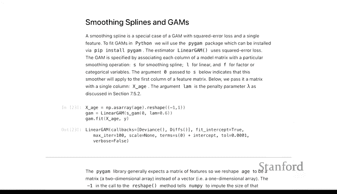

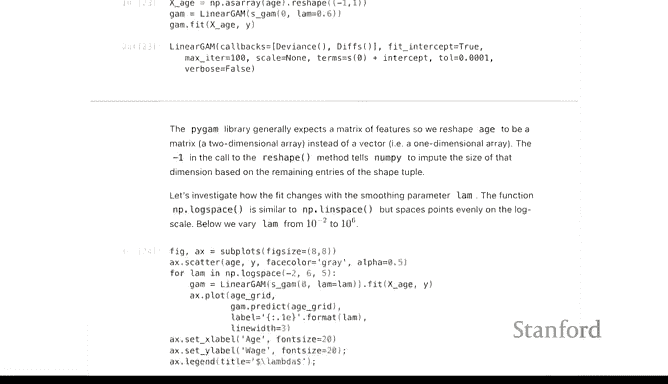

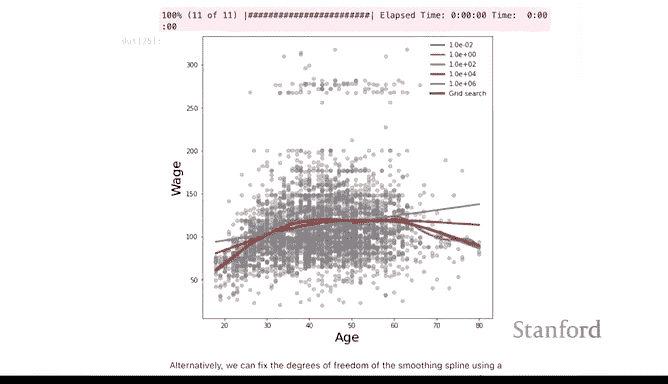

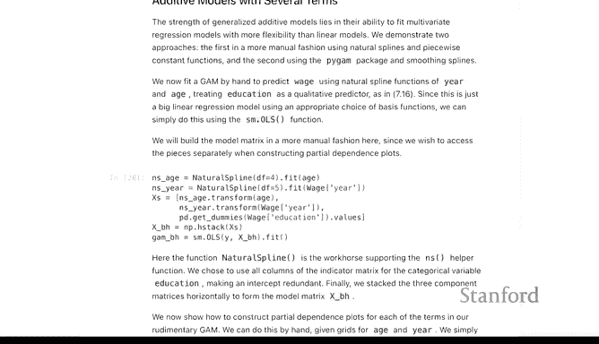

## 拟合包含多个特征的模型 🔧

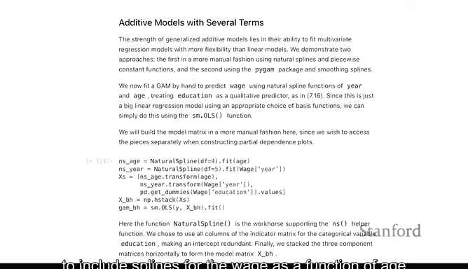

我们拟合的第一个包含多个特征的模型，将再次不严格地使用样条，但会包含工资作为年龄和年份函数的样条。

我们将为这两个变量拟合具有不同自由度的自然样条，并像之前对自然样条和B样条拟合所做的那样，使用普通最小二乘回归。在表达式 `excess` 中，你会看到年龄有一个非线性项，年份有一个非线性项，此外还有教育程度，这是一个分类变量，我们将在其每个水平上拟合常数。

我们将这三个部分都放入一个模型中，你会得到这两个非线性函数的拟合结果以及这些常数。是的，我之前没有提到教育程度。这里的关键区别在于，我们现在有多个特征，这使其成为一个真正的可加模型。

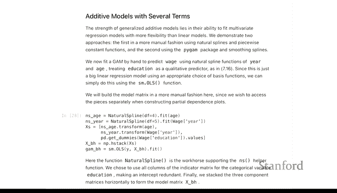

## 查看单个特征效应 📊

在可加模型中，你通常希望查看每个特征的个体效应，这通常通过**偏依赖图**来完成。这里不详细介绍生成这些偏依赖图的所有代码步骤，但我想展示的是，对于模型中的每个特征，你都会得到一个非线性函数。

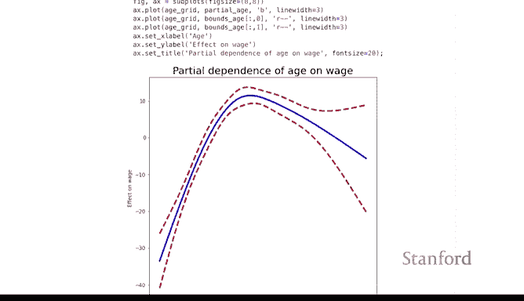

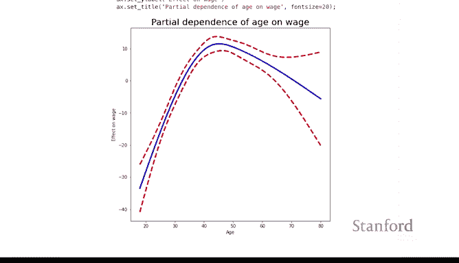

下图显示了年龄对工资的非线性效应估计。这里的y轴是任意的，因为模型中还有其他特征，不像我们之前只有年龄时，y轴是原始尺度。我们可以看到其形式与之前看到的相对相似，但在高年龄区域没有那么平缓，具有类似的反向二次型拟合。

**核心概念**：在线性模型中，每个变量得到一个系数；在可加模型中，每个变量得到一个拟合函数。

我们展示了年龄的拟合函数，同样可以展示年份的函数，以及教育程度各水平的常数估计。这是对线性模型的一个很好的推广。

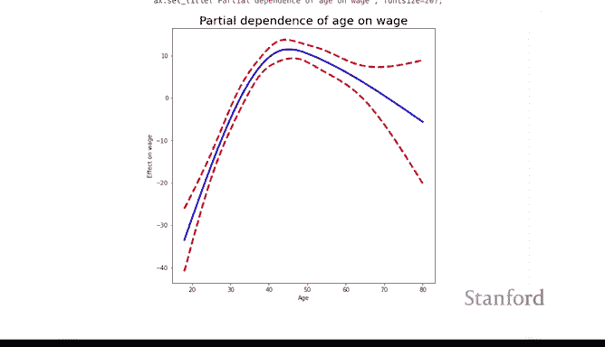

## 使用 `pygam` 库拟合GAM 🛠️

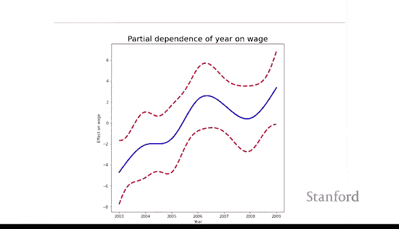

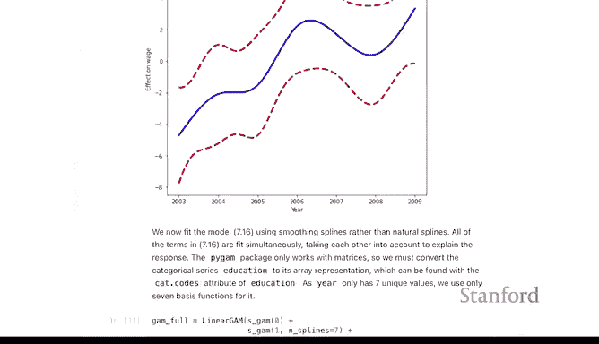

我们刚才拟合的模型只是普通最小二乘法。我们为两个特征指定了灵活的函数，并为教育水平使用了虚拟变量。它并不严格是广义可加模型，因为它没有我们在第7章讲座中看到的平滑惩罚项。

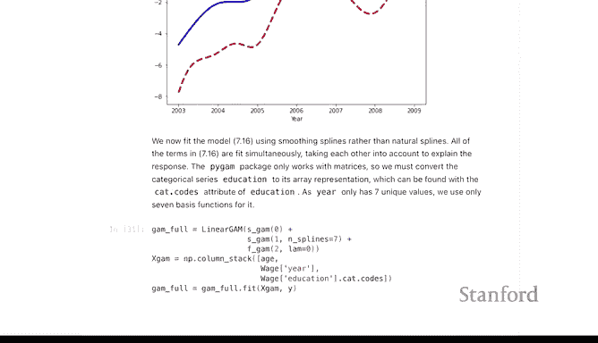

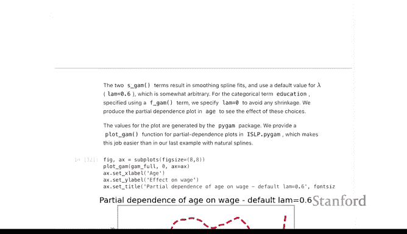

现在，我们将使用 `pygam` 库中的函数进行类似的拟合。`LinearGAM` 告诉 `pygam` 我们将处理回归问题。`pygam` 的设置不考虑特征名称，在指定模型时只考虑列索引。

例如，`s(0)` 中的 `s` 代表平滑器（类似样条），`0` 表示最终拟合的矩阵 `X_gam` 的第一列（即年龄列）。`s(1, n_splines=7)` 表示对第二列（即年份列）使用样条，`n_splines=7` 指定了节点数。

与模型规范不同，`gam` 函数在指定时不使用变量名，而是使用 `fit` 方法进行拟合。

我们在 `ISLP` 包中编写了一个函数，用于为拟合模型生成这些偏依赖图。下图展示了当我们不为 `s` 函数指定任何参数时，年龄对工资的偏依赖图。这表明我们当然需要调整参数。

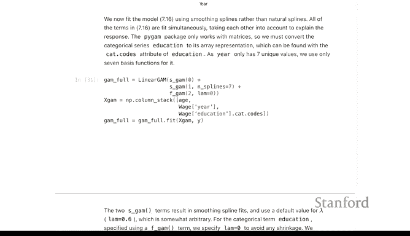

例如，`lambda=0.06` 的平滑度不如另一个。

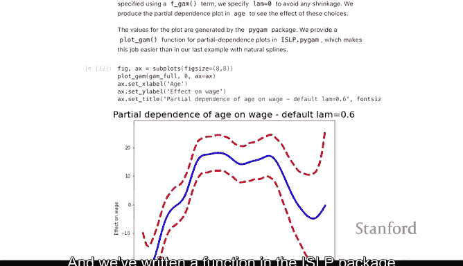

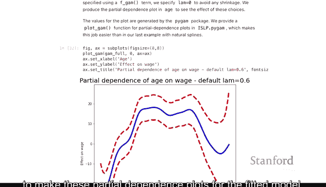

## 调整平滑度参数 🎛️

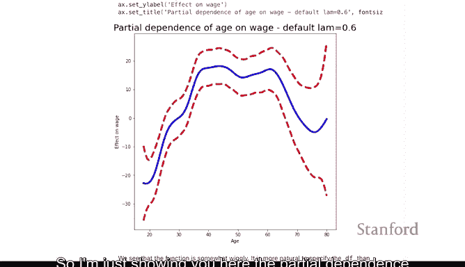

我们可以尝试估计一个能给出特定自由度的 lambda 值。这里，我们尝试为年龄项和年份项各获得5个自由度，这对应于找到这些 lambda 值。

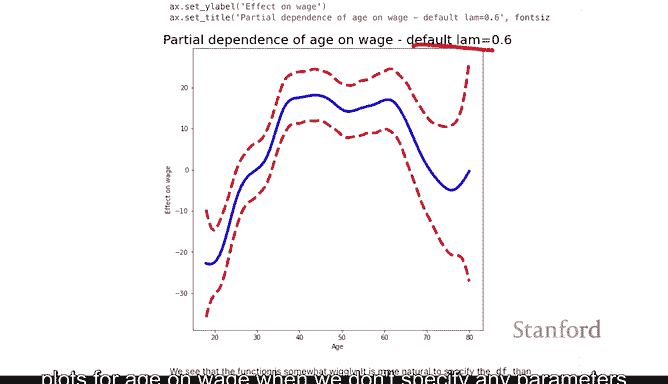

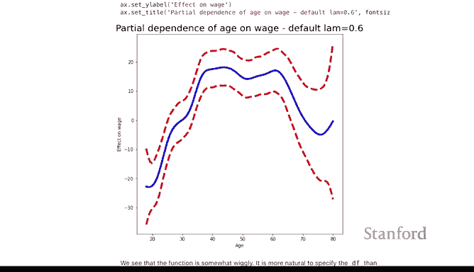

我们所做的是修改了原始 `gam` 的 lambda 值并在此处重新拟合。现在再看偏依赖图，它们比之前更平滑了，我们为每个图大致使用了5个自由度。

## 分类变量的偏依赖图 📉

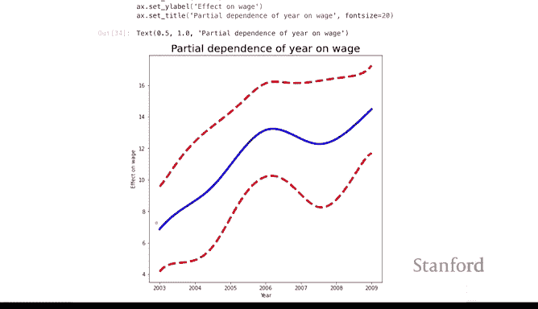

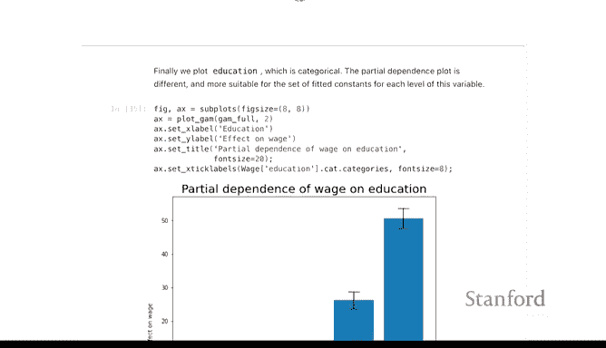

下图展示了分类变量的偏依赖图的样子，它将是每个类别的一个系数。

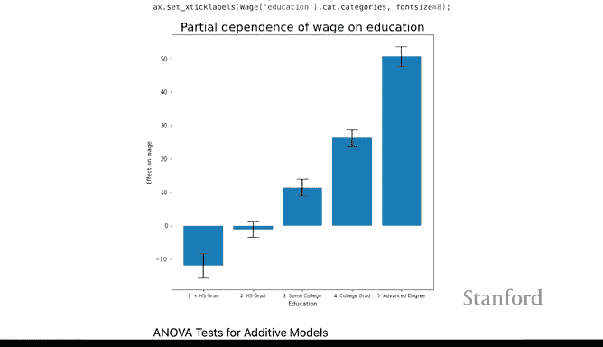

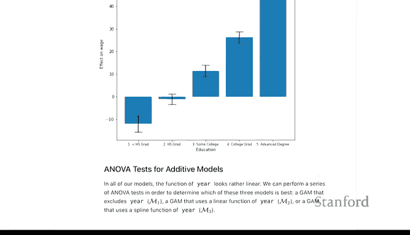

## 逻辑回归GAM示例 🔄

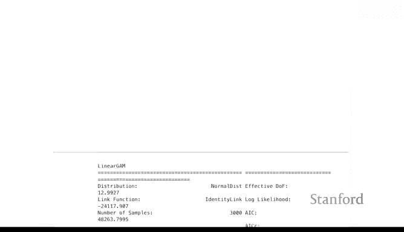

最后，我们用一个例子来演示如何在GAM中使用**二元逻辑回归**。真正的变化只是基础估计器从 `LinearGAM` 变成了 `LogisticGAM`，其他指定方式相同。

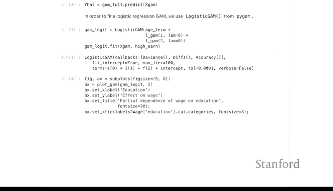

在这个 `gam` 中，对于年份，我将使用线性效应（`l` 代表线性）而不是平滑样条效应。我们使用相同的 `fit` 方法进行拟合。

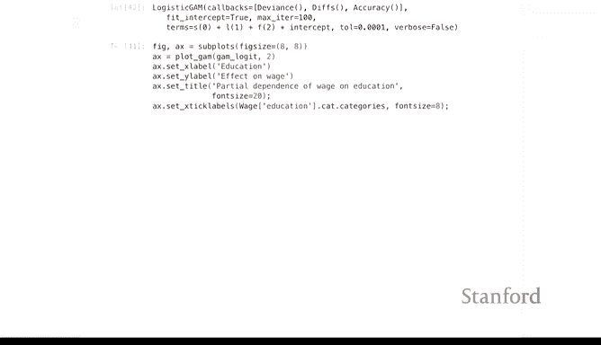

然后我们可以查看偏依赖图。在这些拟合中，我们看到一个不寻常的现象：对于没有高中文凭的高收入者的估计。这种情况发生的原因很可能是现实中几乎没有没有高中学历的人收入超过25万，因此我们无法估计这个参数，导致这些估计看起来非常不稳定。

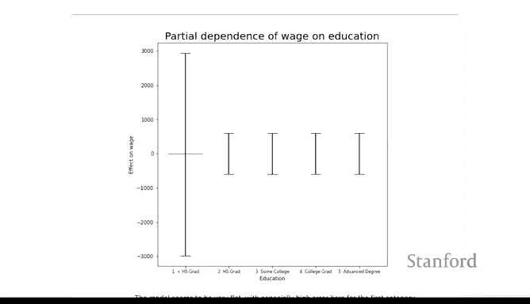

因此，我们将重新拟合模型，排除那些没有高中学历的观测值。现在，我们得到了对不同教育水平成为高收入者效应的合理估计。

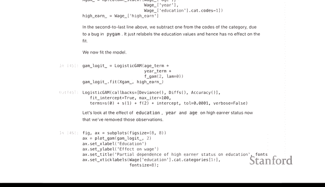

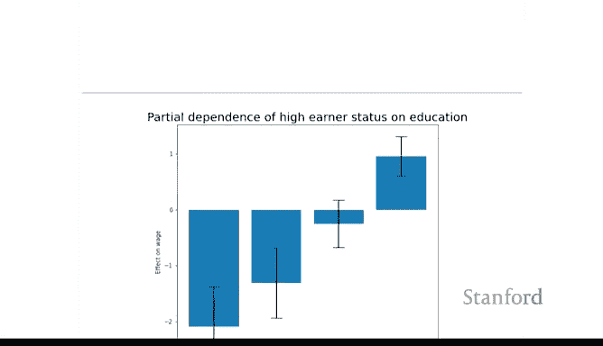

与线性GAM一样，我们可以为这里的每个特征生成偏依赖图。下图是年份的偏依赖图。

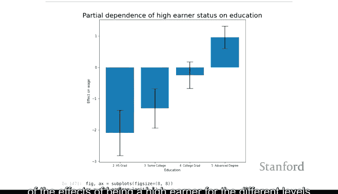

下图是年龄的偏依赖图。有趣的是，这个图似乎没有我们之前仅用年龄建模时看到的急剧下降。这可能是因为我拥有良好的教育背景。

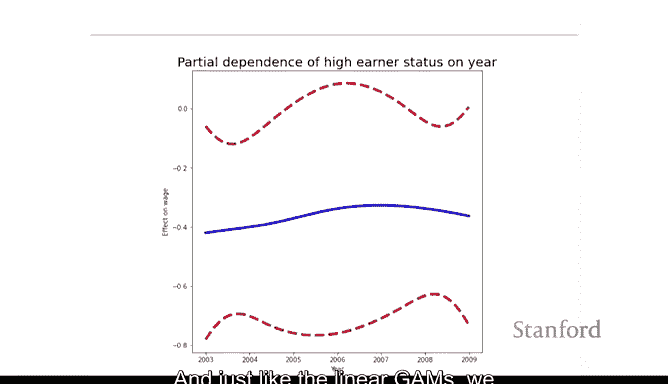

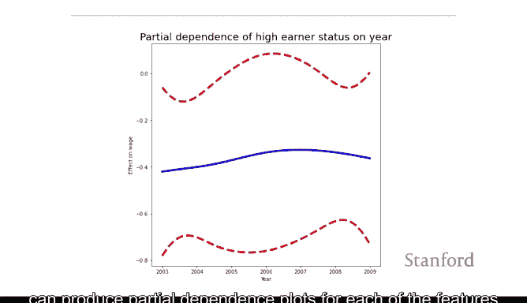

## 总结 📝

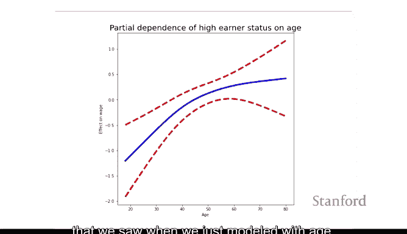

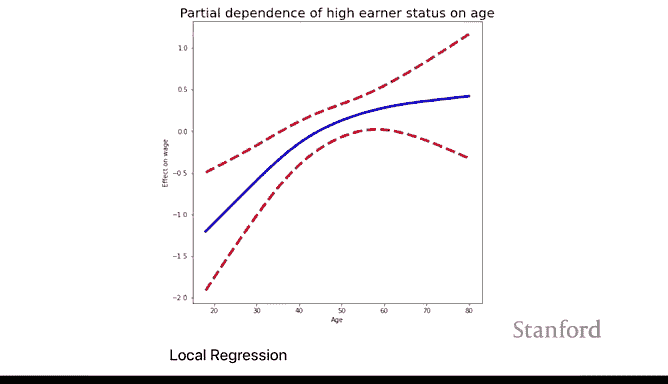

本节课中，我们一起学习了广义可加模型的基础。我们了解了如何拟合包含多个非线性特征的加性模型，如何使用 `pygam` 库实现GAM，以及如何通过偏依赖图可视化每个特征的个体效应。我们还探讨了调整平滑度参数的重要性，并看到了将GAM应用于逻辑回归问题的示例。GAM是对线性模型的强大扩展，它允许我们以更灵活的方式捕捉数据中的复杂关系。