# Python 版 60：🌳 决策树构建与剪枝详解

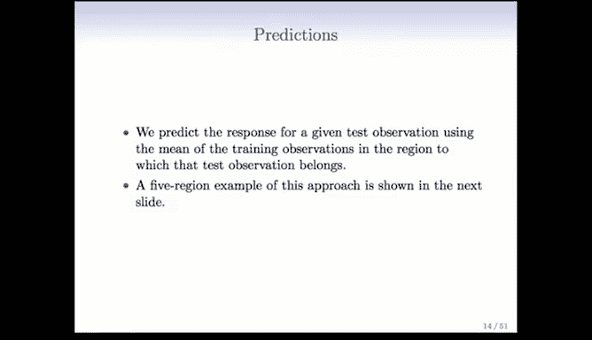

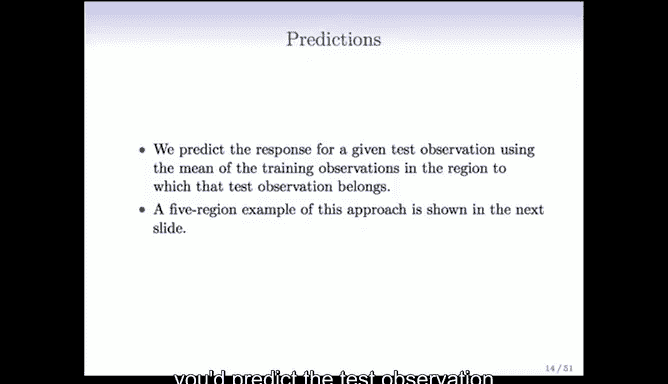

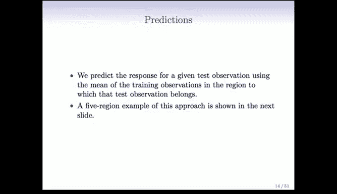

在本节课中，我们将深入学习决策树的构建细节，特别是如何通过“先增长后剪枝”的策略来获得一个泛化能力强的模型。我们将探讨如何预测、如何构建树结构、以及如何通过成本复杂度剪枝来避免过拟合。

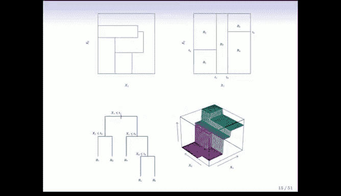

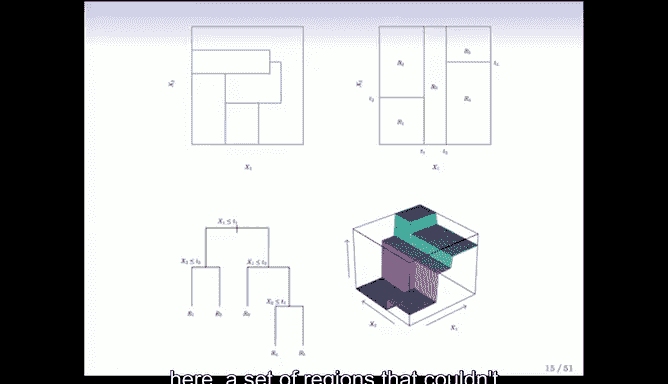

---

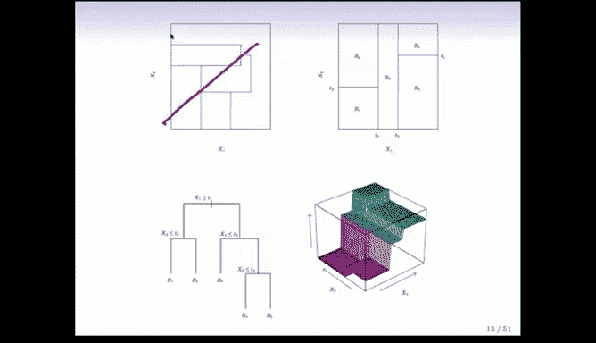

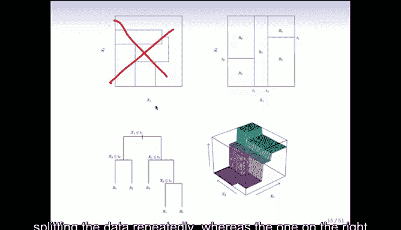

## 预测过程

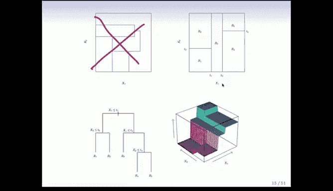

一旦决策树构建完成，对测试观测值进行预测的过程是：从根节点开始，根据每个内部节点的分裂规则，将观测值沿着树向下传递。

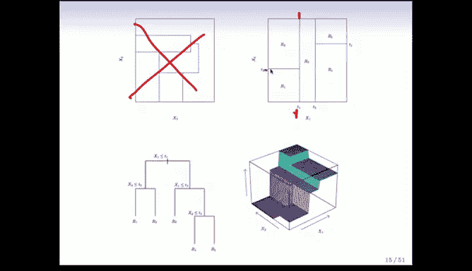

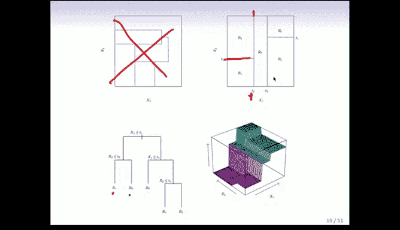

观测值最终会到达一个终端节点（叶节点）。此时，使用该终端节点所对应区域（即该叶节点）内所有训练观测值的**均值**作为预测值。

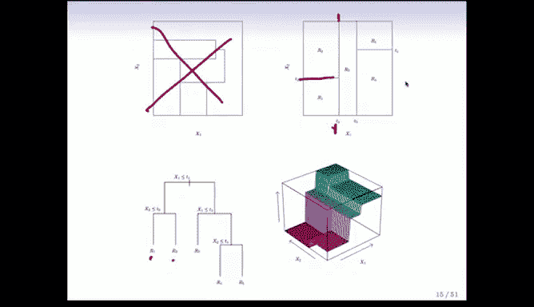

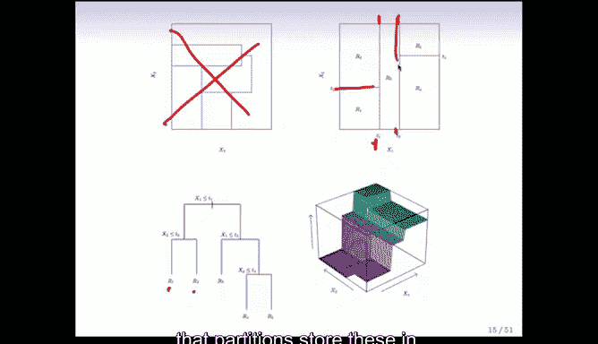

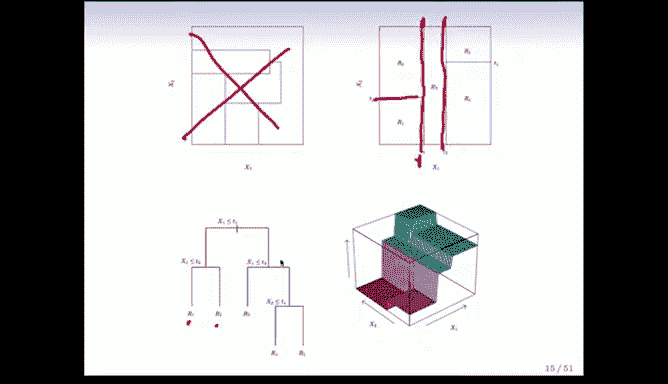

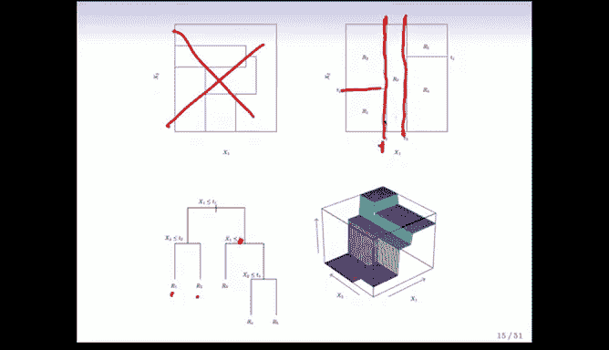

---

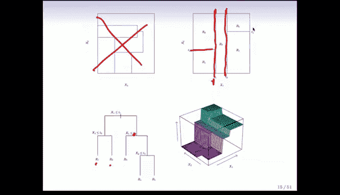

## 树结构示例

为了更好地理解，我们来看一个稍大的示例。下图左侧展示了一种区域划分方式，但这种方式**无法**通过我们描述的顺序分裂过程实现。因为它形成的区域不是通过反复、顺序地分割数据得到的“矩形框”。

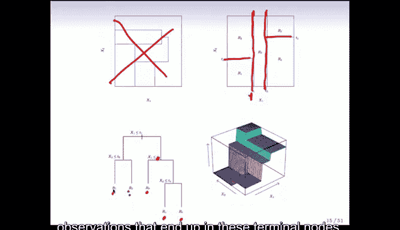

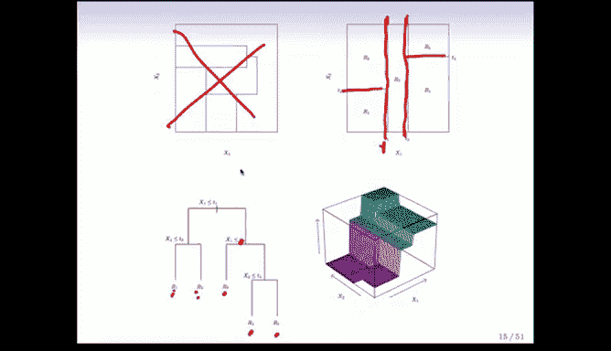

而右侧的划分方式则可以。结合左下角的树状图，我们可以看到构建过程：

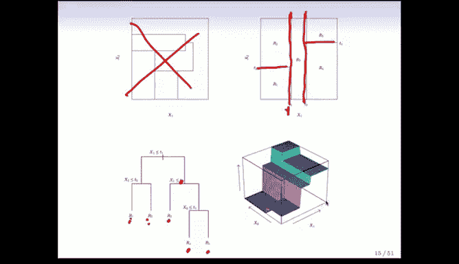

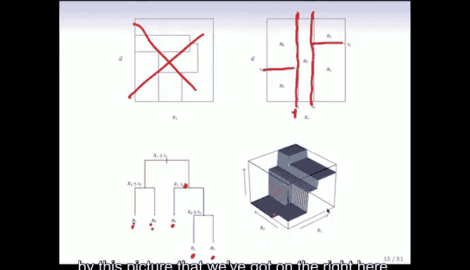

1.  **第一次分裂在 T1 处**：这是一个在变量 **x1** 上的垂直分割，将整个区域分为左右两部分。
2.  **在左侧区域，于 T2 处进行第二次分裂**：这是在变量 **x2** 上的水平分割，将左侧盒子分为上下两部分，形成了**区域1**和**区域2**。
3.  **回到右侧区域，在 T3 处进行第三次分裂**：这又是一个在 **x1** 上的垂直分割。
4.  **在最新的右侧区域，于 T4 处进行最后一次分裂**：这是在 **x2** 上的水平分割，最终形成了**区域3**、**区域4**和**区域5**。

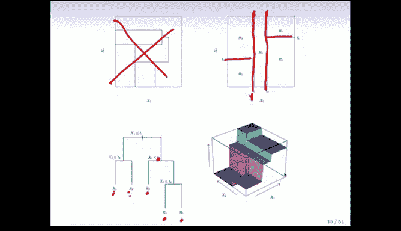

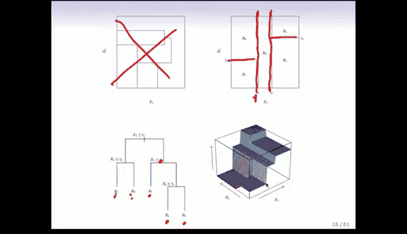

通过这种“贪婪的”、顺序的分裂方式，我们将这个二维空间（变量x1和x2）细分为五个不同的矩形区域。

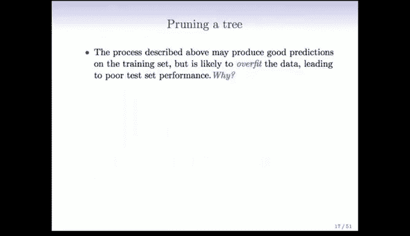

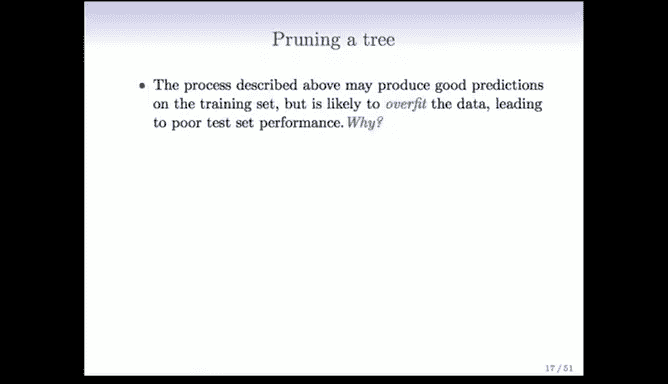

在每个终端节点，我们使用落入该节点的所有训练观测值的**均值**来近似回归函数。这意味着，对于一个测试观测值，你从顶部开始，根据其 **x1** 值是否小于 **T1** 决定向左还是向右走，并依次回答每个内部节点的问题，最终落入某个区域，并以该区域的均值作为预测值。

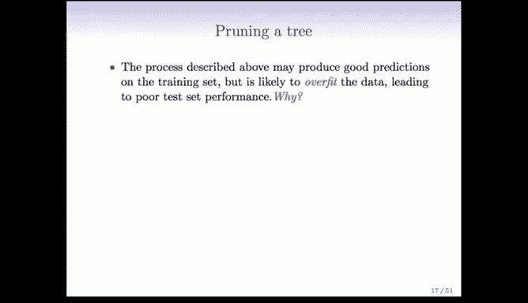

因此，最终的预测函数是一个**分段常数函数**，在每个矩形区域内保持恒定。

---

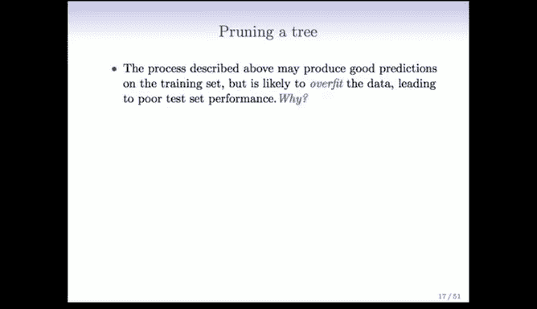

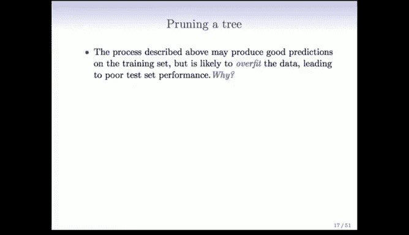

## 树应该有多大？

上一节我们介绍了如何构建一棵树，本节我们来看看一个关键问题：树应该生长到多大才合适？

一种极端策略是尽可能大地生长树，例如让每个终端节点只包含一个观测值。但这几乎必然会导致**过拟合**，因为模型完全适应了训练数据中的噪声，在测试集上表现会很差。

另一种策略是提前停止，即当分裂看起来无法显著减少残差平方和时就停止。但这种方法可能过于短视，因为当前看似没有好的分裂，但如果继续分裂，可能在更深层找到更好的划分。

因此，更好的策略是：
1.  **先生长一棵大树**，只使用简单的停止规则（例如，终端节点最少包含5个观测值）。
2.  **然后对这棵可能过大的树进行剪枝**，得到一个中等大小的树，以平衡偏差和方差，从而获得比单节点树或极端大树更低的预测误差。

---

## 成本复杂度剪枝

在CART算法或R语言的`tree`包中，使用的正是这种“先增长后剪枝”的框架，称为**成本复杂度剪枝**或**最弱连接剪枝**。

其思想类似于回归中的LASSO。我们定义一个目标函数，该函数权衡模型的拟合优度与复杂度（树的大小）：

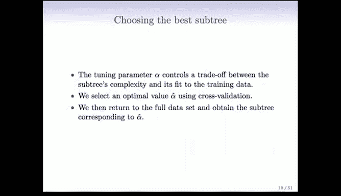

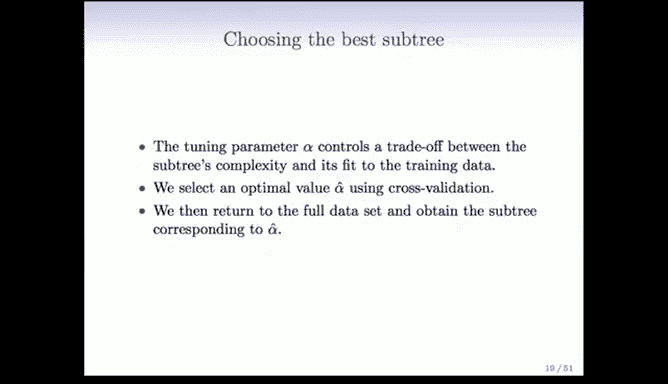

**目标函数公式：**
`Sum of Squares (拟合项) + α * |T| (复杂度惩罚项)`

其中：
*   **Sum of Squares** 是各终端节点内观测值响应值与其节点均值的残差平方和之和。
*   **|T|** 表示树 **T** 的终端节点数量。
*   **α (≥ 0)** 是一个调节参数，控制对树大小的惩罚力度。α=0时无惩罚，得到最大的树；α很大时，惩罚严厉，树会变小。

成本复杂度剪枝通过交叉验证来寻找最佳的 **α** 值，然后选择在全部训练数据上，能使上述目标函数值最小的子树。

以下是树构建与剪枝算法的步骤总结：

1.  **生长大树**：使用简单规则（如节点最小样本数）生长一棵大树 `T0`。
2.  **交叉验证选择 α**：
    *   将数据分为K折（如5或10）。
    *   对于一系列不同的 α 值，在 K-1 折数据上拟合剪枝后的子树，并在留出的一折上评估预测误差。
    *   对所有K折重复，计算每个 α 对应的平均交叉验证误差。
    *   选择使交叉验证误差最小的 α 值。
3.  **得到最终树**：使用上一步选出的最佳 α，在全部训练数据上对大树 `T0` 进行剪枝，得到最终的子树。

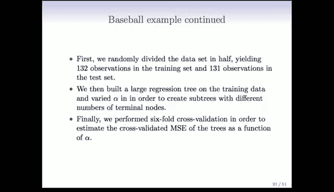

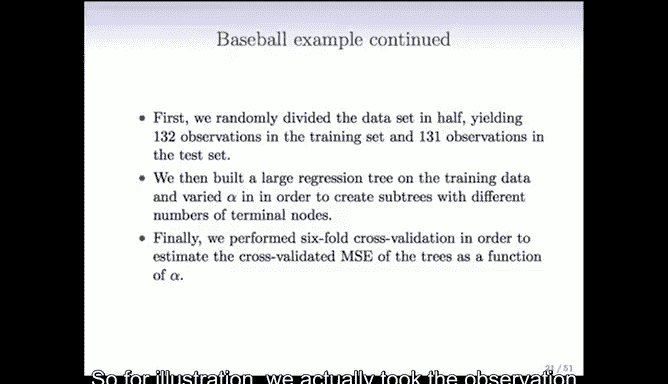

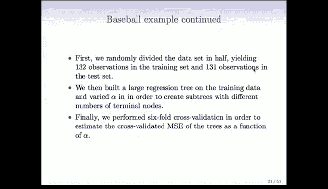

---

## 棒球数据示例

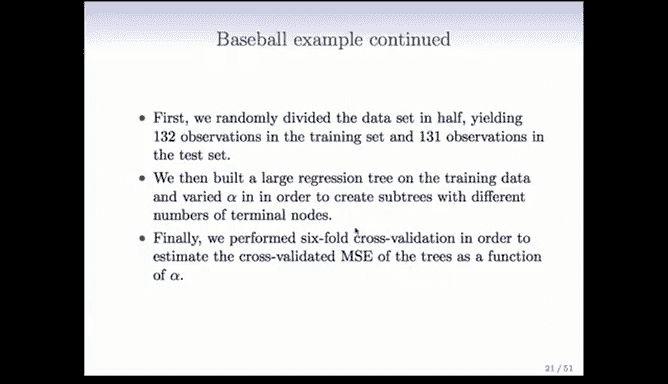

我们以棒球数据为例进行说明。将数据分为训练集（132个观测值）和测试集（131个观测值），以便比较交叉验证误差与独立测试集误差。

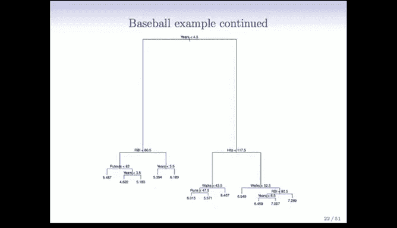

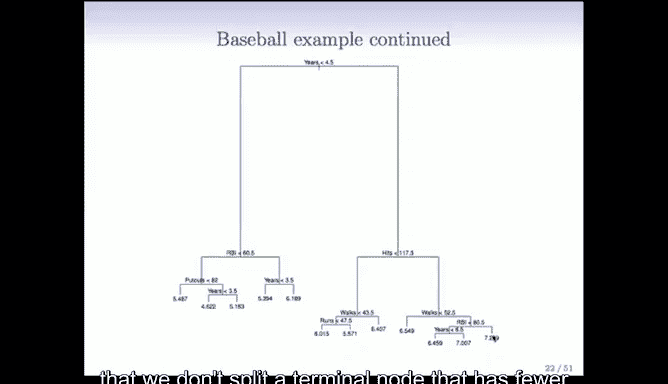

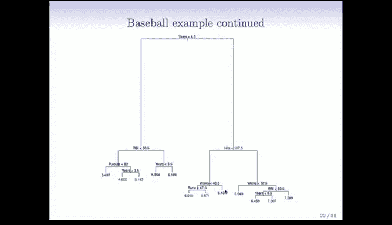

首先，在训练集上生长一棵大树，唯一的停止规则是终端节点最少包含5个观测值，这得到了一个包含约12个终端节点的大树。

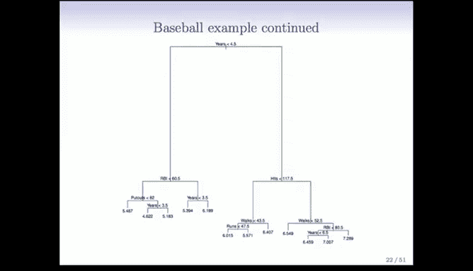

然后进行6折交叉验证（因为132能被6整除）。下图展示了结果：

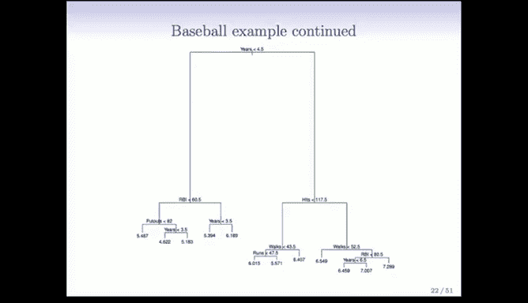

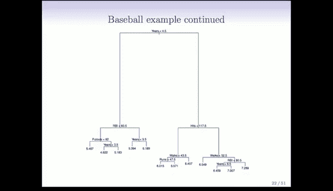

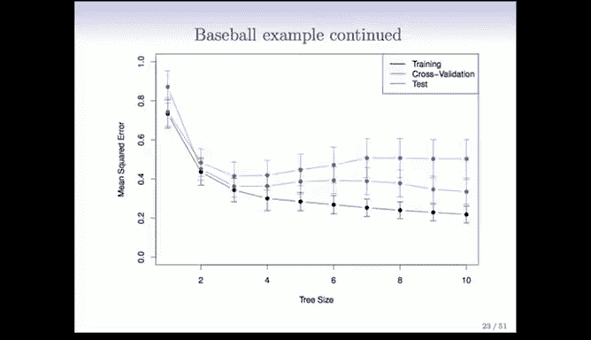

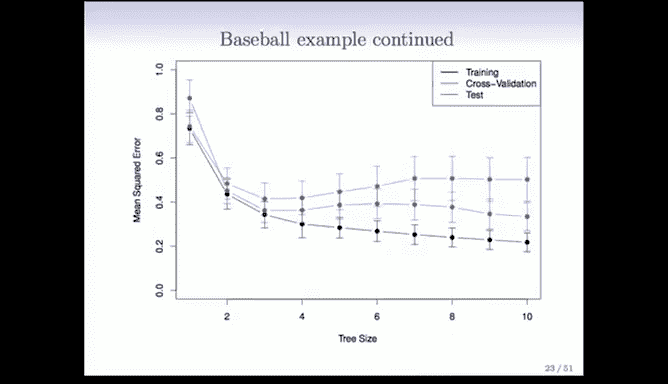

*   **横轴**：树的大小（与 α 值一一对应）。左侧α大，树小；右侧α小，树大。
*   **训练误差（黑色曲线）**：随着树变大（拟合增强），训练误差单调下降，这不能用于选择模型。
*   **交叉验证误差（绿色曲线）**：它先下降后上升，在**大约3个终端节点**处达到最小，表明更大的树开始过拟合。
*   **测试误差（红色曲线）**：来自独立测试集，其趋势与交叉验证误差大致相同，也在3个节点附近最小。

基于这个交叉验证结果，我们选择了具有3个终端节点的树，这就是课程开始时展示的那棵最优树。

---

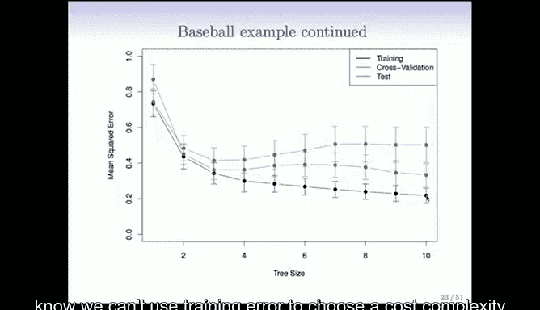

## 总结

本节课我们一起学习了决策树的核心构建与优化流程：
1.  **预测**：通过遍历树的分裂规则到达叶节点，并以节点内样本均值进行预测。
2.  **构建**：树通过递归的二元分裂将特征空间划分为矩形区域。
3.  **剪枝的必要性**：避免过拟合，不能单纯追求最小训练误差。
4.  **剪枝方法**：采用“成本复杂度剪枝”，通过优化结合了拟合误差和树复杂度的目标函数来选择最优树。
5.  **参数选择**：使用交叉验证来确定控制树复杂度的关键参数 **α**，从而在偏差和方差之间取得最佳平衡，获得泛化性能强的模型。

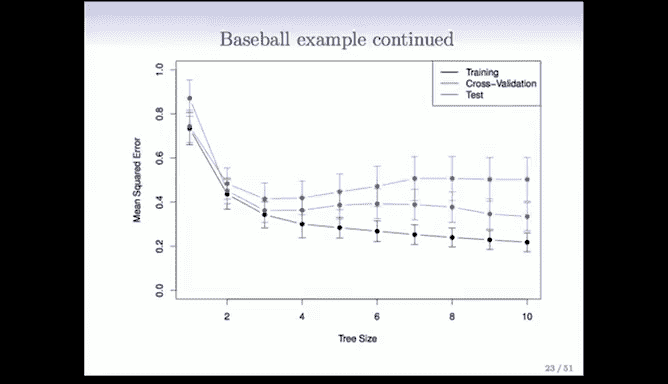

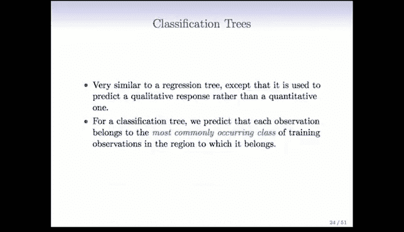

这个过程在`scikit-learn`等现代库中已高度自动化，但理解其背后的原理对于正确应用和解释决策树模型至关重要。