# Python 版 61：🌳 8.3 分类树

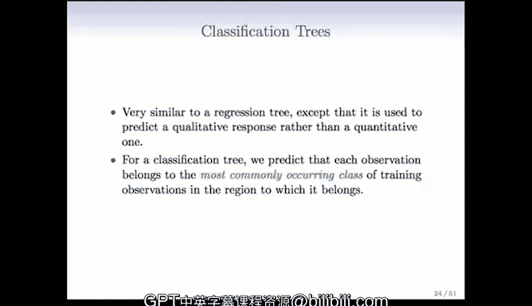

在本节课中，我们将要学习分类树。之前我们讨论了响应变量为定量数据（如棒球运动员的薪水）时的回归树。当响应变量是分类变量时，我们使用的树被称为分类树。两者的技术非常相似，主要区别在于损失函数和衡量性能好坏的标准需要改变。

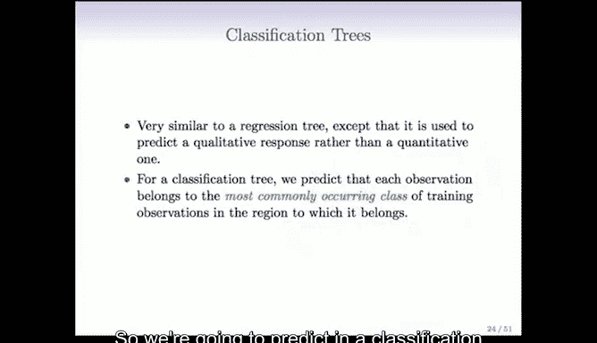

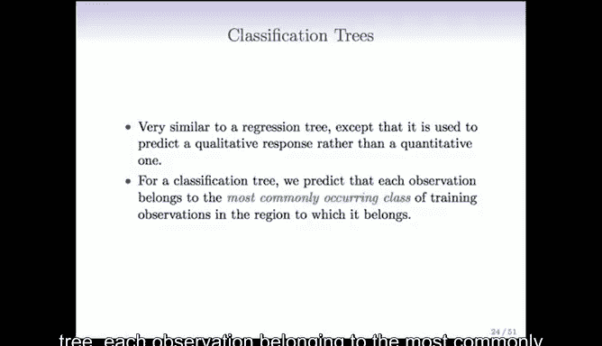

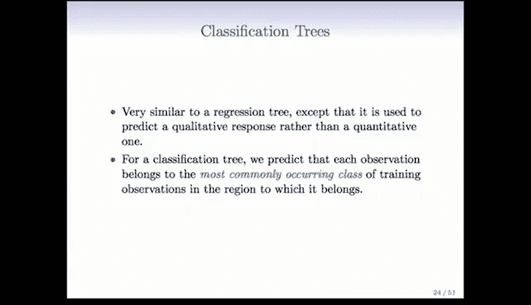

## 从回归树到分类树 🌱

上一节我们介绍了回归树，本节中我们来看看当响应变量是分类变量时，树模型如何工作。

在分类树中，每个终端节点的预测不再是该节点内观测值的均值，而是该节点内**最常出现的类别**。也就是说，我们会将落入该节点的所有观测值分类为节点内占比最大的那个类别。

分类树的生长方式与回归树基本相同，但我们不能使用残差平方和作为选择分割点的标准。我们需要一个更适用于分类问题的标准。

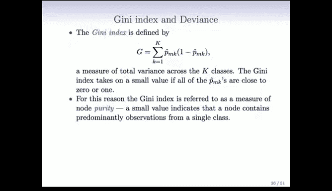

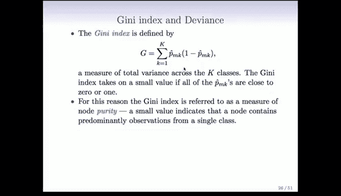

## 分类树的分割标准 📊

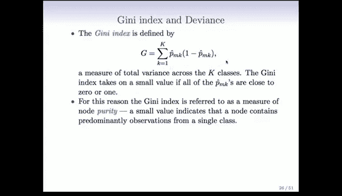

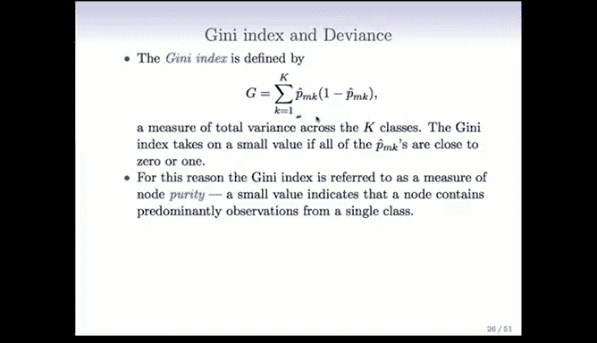

以下是几种常用的、用于决定如何分割节点的标准：

**1. 分类错误率**
这是最容易计算的标准。假设在一个节点内，有 K 个类别，我们计算每个类别的比例。我们预测的类别是比例最大的那个，而分类错误率就是 `1 - 最大比例`。虽然简单，但这个标准在树生长过程中可能不够平滑和稳定。

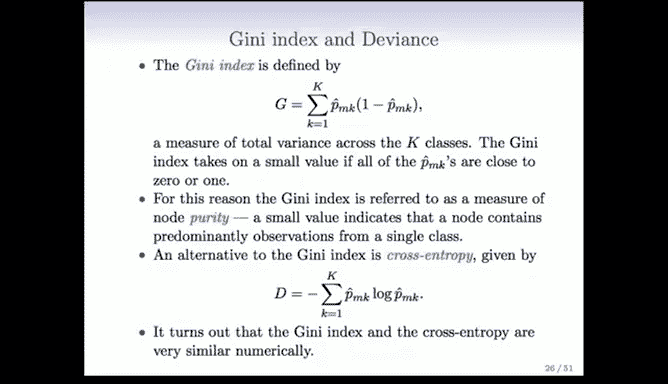

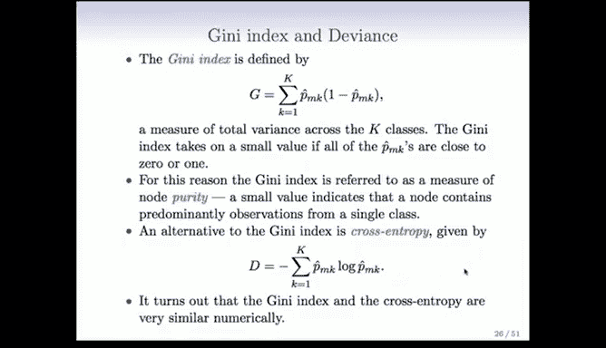

**2. 基尼指数**
这是一个更受欢迎的标准，它衡量了一个节点内类别分布的“不纯度”或“杂质”。对于有 K 个类别的节点，基尼指数 G 的计算公式为：

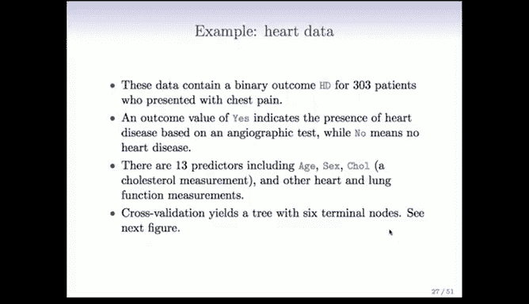

**G = Σ (p̂_k * (1 - p̂_k))**， 其中 k 从 1 到 K。

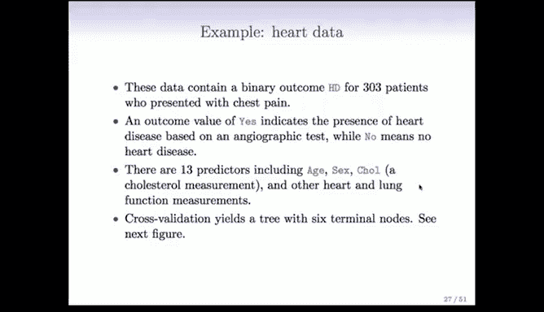

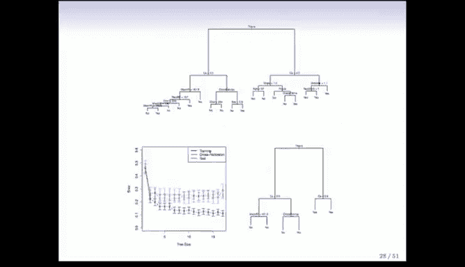

这里，`p̂_k` 是节点内第 k 个类别的比例。当节点非常“纯净”（即只包含一个类别）时，基尼指数为 0。当所有类别均匀分布时，基尼指数最大。基尼指数对类别比例的变化反应平滑，有利于树的稳定生长。

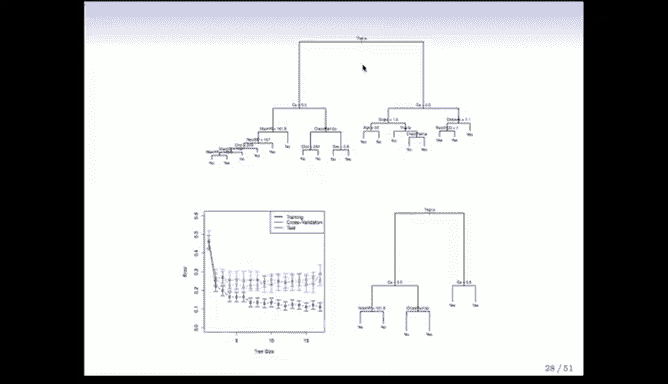

**3. 交叉熵/偏差**
这个标准基于多项式对数似然，其公式为：

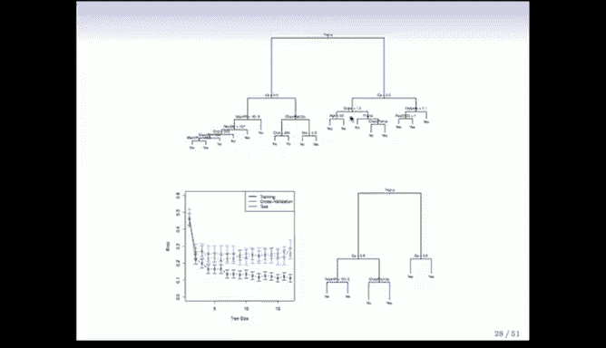

**D = - Σ (p̂_k * log(p̂_k))**， 其中 k 从 1 到 K。

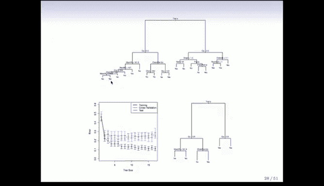

它的性质与基尼指数非常相似，通常也会得到相近的结果。

## 实例分析：心脏病数据 ❤️

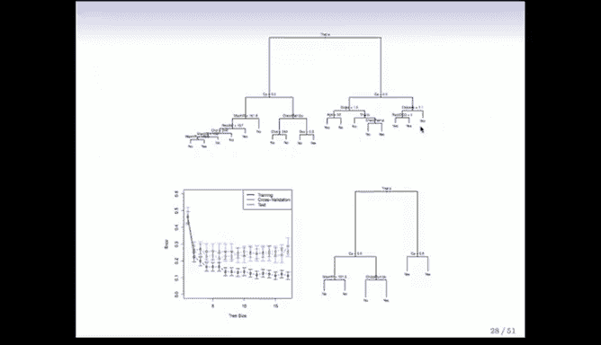

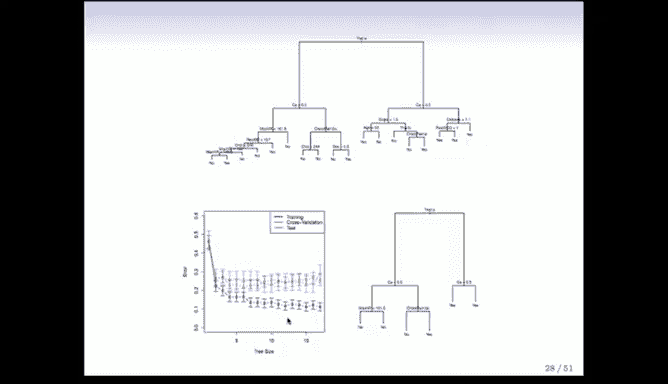

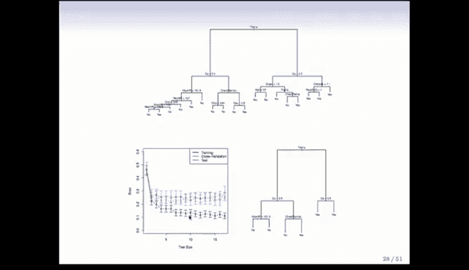

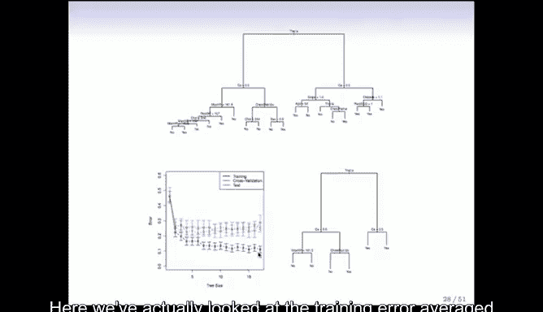

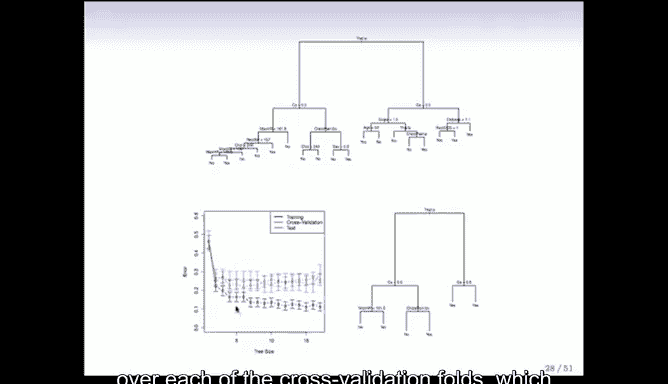

让我们通过一个心脏病数据的例子来理解分类树的应用。该数据集包含 303 名胸痛患者，响应变量 `HD` 是一个二分类变量（是/否患有心脏病），预测变量包括年龄、性别、胆固醇水平等 13 个指标。

我们使用交叉验证来生长和修剪分类树。下图展示了基于全部数据生长的完整树（较为茂密）以及通过交叉验证选择的最佳树规模。

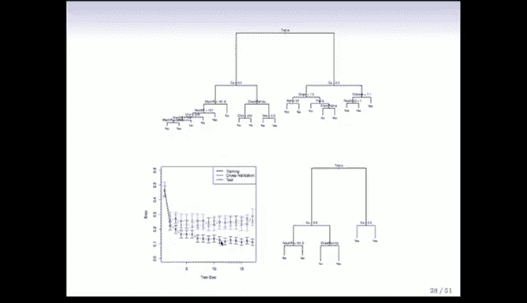

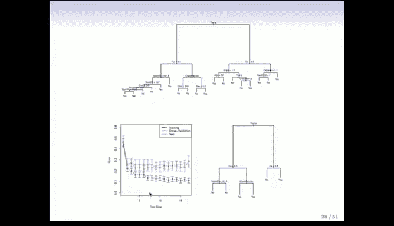

在完整树中，第一个分割基于铊压力测试结果。随后的分割涉及钙含量等指标。在每个终端节点，树会给出“是”或“否”的分类预测。值得注意的是，即使两个子节点最终的预测类别相同，进一步的划分也可能提高节点的“纯度”，这正是基尼指数等标准所追求的。

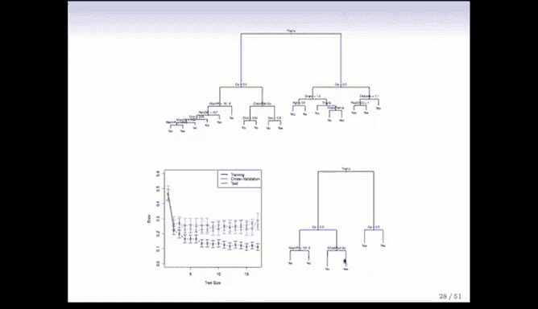

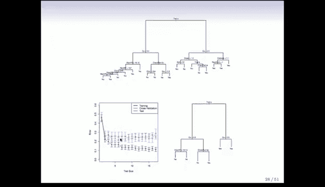

交叉验证结果显示，树规模大约为 6 时表现最佳，估计的分类错误率约为 25%。右侧展示的是经过修剪后、规模为 6 的最佳子树。

## 树模型与线性模型的比较 ⚖️

树模型并非万能，理解其适用场景很重要。我们通过两个假设场景来对比树模型和线性模型。

*   **场景一：线性决策边界最佳**
    当两类数据的最佳决策边界是一条直线时（如图左上），线性模型（如逻辑回归）会表现得很好。而分类树试图用一系列矩形框来逼近这条直线，效果往往不佳，过程笨拙且可能不够精确。

*   **场景二：矩形决策边界最佳**
    当最佳决策边界是矩形区域时（如图左下），情况正好相反。线性模型（一条直线）很难完美拟合矩形边界，会犯很多错误。而分类树只需两次分割就能完美地重现这个矩形边界，表现优异。

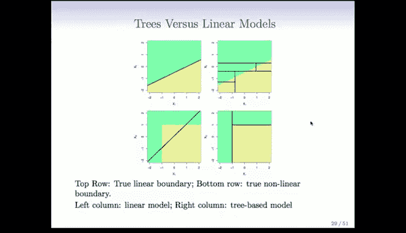

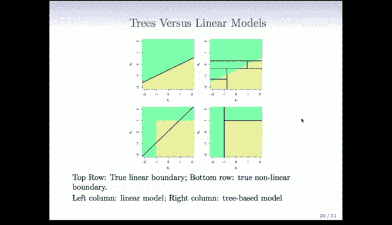

因此，有些问题天然适合用树模型解决，有些则更适合线性模型。树模型是我们工具箱中的一种工具，需要根据问题特点选择使用。

## 分类树的优势与劣势 📝

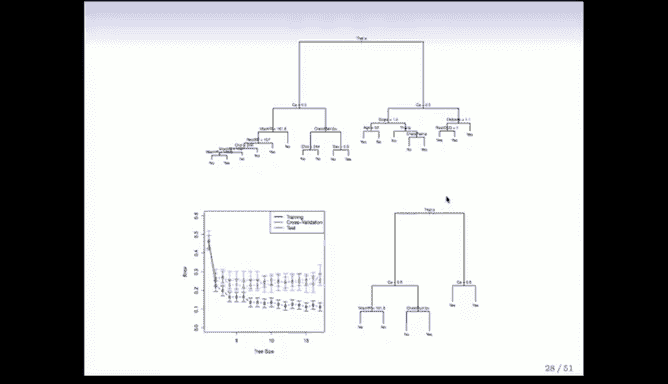

本节课中我们一起学习了分类树的核心概念和应用。最后，我们来总结一下树模型的优势与劣势。

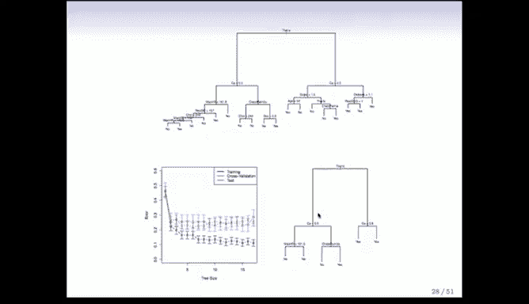

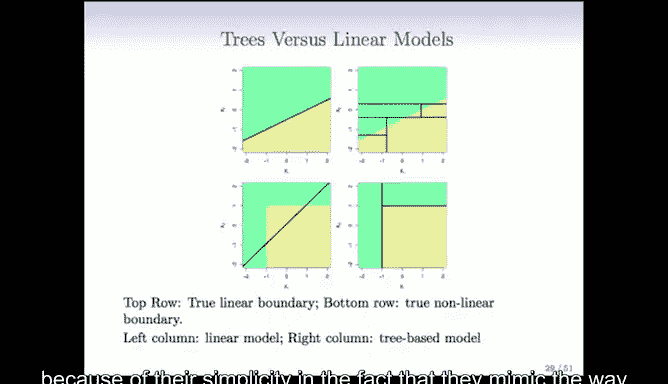

**优势：**
*   **简单易懂：** 如果树规模较小，其结构易于展示和理解，即使对非专业人士也是如此。例如，医生可能喜欢心脏病诊断树，因为它模拟了分步骤的诊断决策过程。
*   **可解释性强：** 决策过程可以表示为一连串简单的“是/否”规则，无需理解复杂方程。
*   **处理定性预测变量：** 可以直接处理多分类的定性变量，无需创建虚拟变量，并能将类别分成任意两组。

**劣势：**
*   **预测精度通常较低：** 与一些更先进的现代方法相比，单棵树的预测准确率往往不高。例如，在心脏病数据上，单棵树的性能可能不如其他方法。
*   **高方差：** 对训练数据的小变化可能非常敏感，导致生成完全不同的树。

正是为了克服这些劣势，特别是为了提高预测精度和稳定性，我们接下来要学习的方法——**集成学习**。这些方法（如随机森林、提升法）的核心思想是构建多棵树并将它们的结果结合起来，从而显著提升模型性能。