# Python 版 62：Bagging与随机森林 🌳

在本节课中，我们将要学习两种强大的集成学习方法：Bagging（自助聚合）和随机森林。这两种方法通过组合多个决策树来显著提升预测性能，是机器学习中非常流行且有效的工具。

---

## Bagging（自助聚合）的基本思想 🧠

上一节我们介绍了决策树，本节中我们来看看如何通过组合多棵树来改进预测。Bagging，全称Bootstrap Aggregation，由Leo Breiman提出。其核心思想源于一个简单的统计学原理：对多个独立观测值取平均可以降低方差。

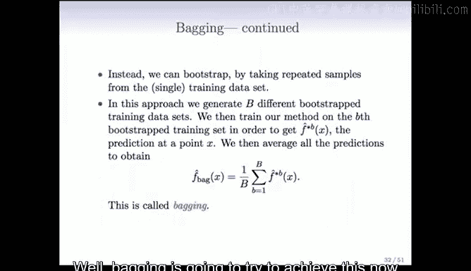

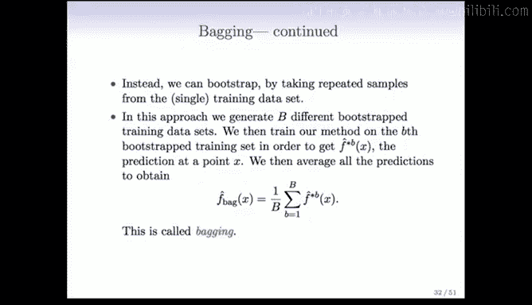

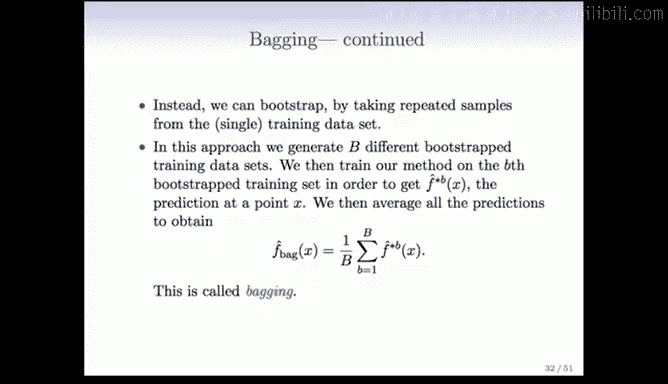

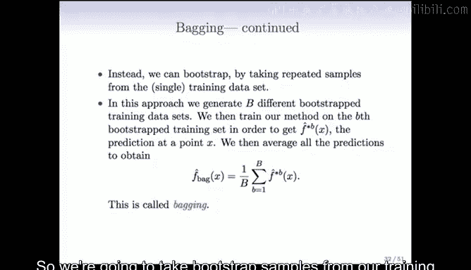

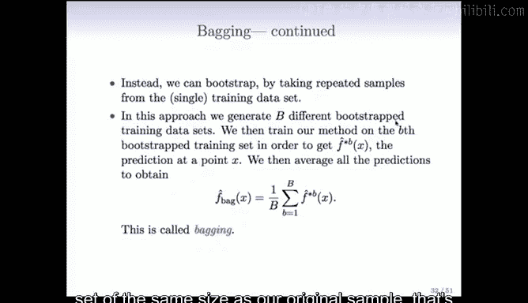

**公式**：如果我们有一组独立观测值 \( Z_1, Z_2, ..., Z_n \)，每个的方差为 \( \sigma^2 \)，那么它们的平均值 \( \bar{Z} \) 的方差为 \( \sigma^2 / n \)。

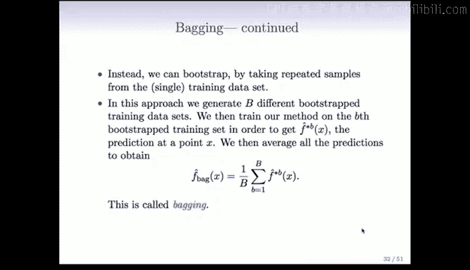

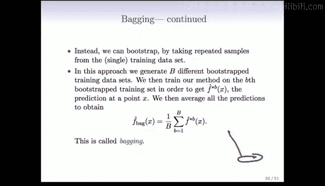

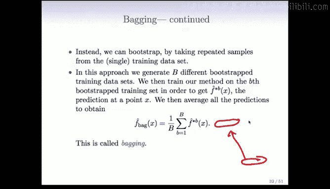

在监督学习中，如果我们有多个训练集，就可以在每个训练集上训练一棵树，然后对它们的预测结果取平均。然而，我们通常只有一个训练集。Bagging巧妙地通过**自助采样法**来生成多个“伪训练集”，从而模拟拥有多个训练集的情况。

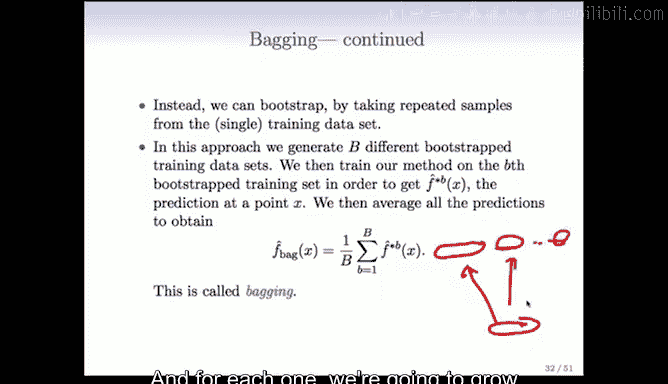

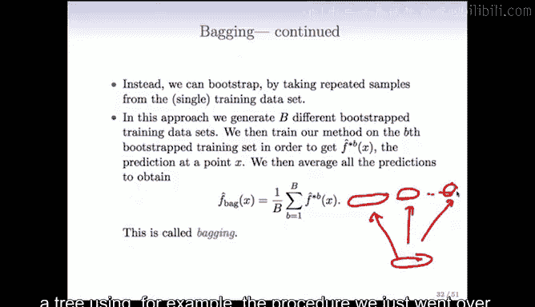

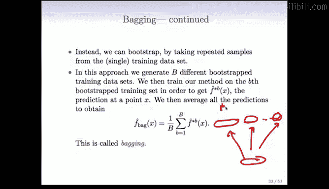

---

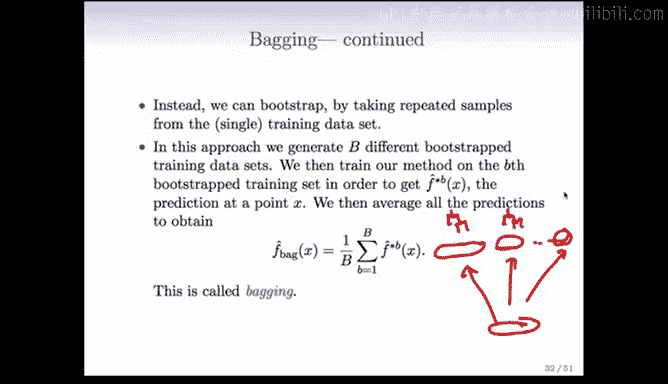

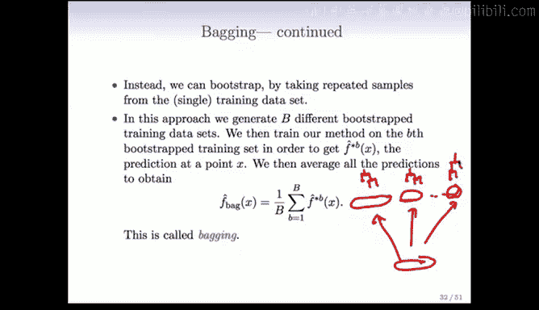

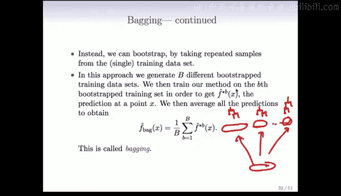

## Bagging的具体步骤 📝

以下是Bagging方法的具体实施步骤：

1.  **生成自助样本**：从原始训练集中，通过有放回地随机抽取，生成B个与原始训练集大小相同的自助样本集。
2.  **训练基学习器**：在每个自助样本集上，独立地训练一棵决策树。与单棵决策树不同，在Bagging中我们通常**不需要对树进行剪枝**，可以生长为大树。因为后续的“平均”操作本身就能有效降低方差。
3.  **聚合预测**：对于一个新的输入特征 \( x \)，让B棵树分别给出预测 \( \hat{f}^{*b}(x) \)。最终的Bagging预测结果是所有树预测值的平均（回归问题）或多数投票（分类问题）。

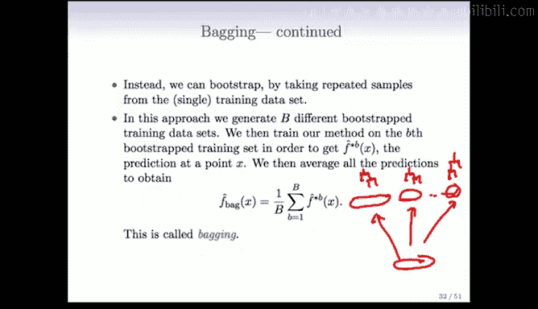

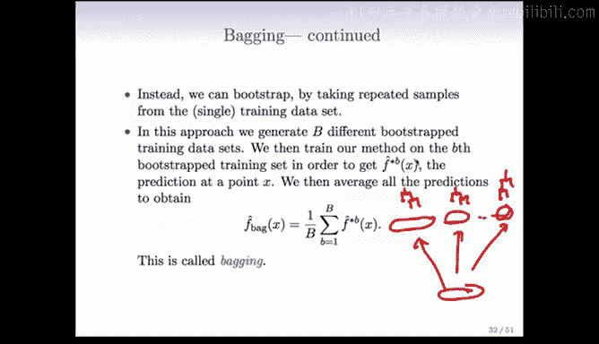

**核心公式**：
对于回归问题，Bagging的最终预测为：
\[
\hat{f}_{\text{bag}}(x) = \frac{1}{B} \sum_{b=1}^{B} \hat{f}^{*b}(x)
\]

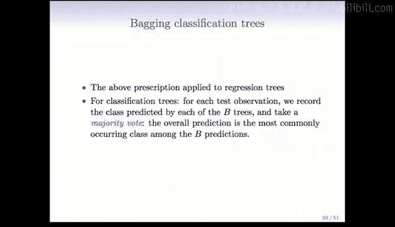

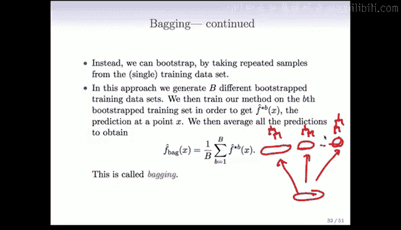

对于分类问题，则采用多数投票原则。

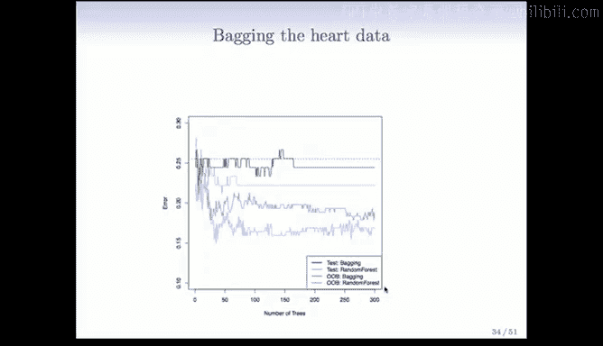

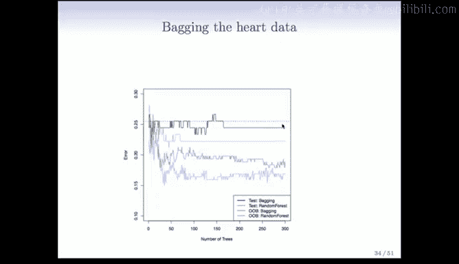

---

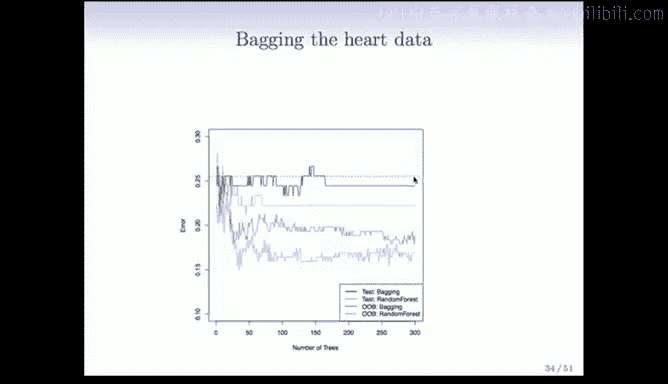

## 袋外误差估计 🎒

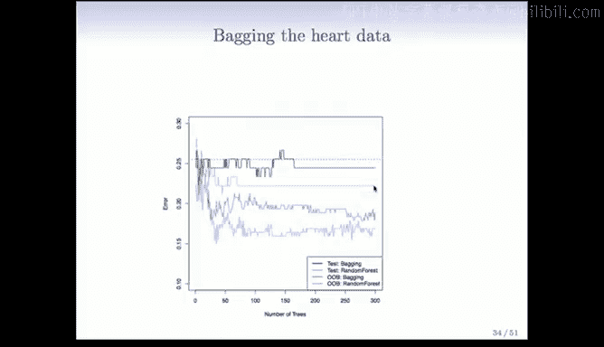

Bagging和随机森林有一个非常实用的副产品：**袋外误差估计**。由于每个自助样本只包含原始数据中约63.2%的观测值，剩下的约36.8%的观测值（袋外观测）并未参与该树的训练。

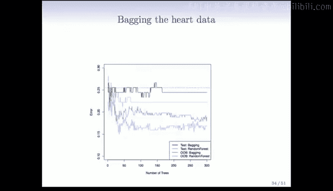

以下是利用袋外观测进行误差估计的原理：

*   对于数据集中第 \( i \) 个观测值，找出所有**没有**使用该观测值进行训练的树。
*   用这些树对第 \( i \) 个观测值进行预测并聚合结果。
*   计算这个预测值与其实标签的误差。
*   对所有观测值重复此过程，得到的平均误差就是袋外误差估计。

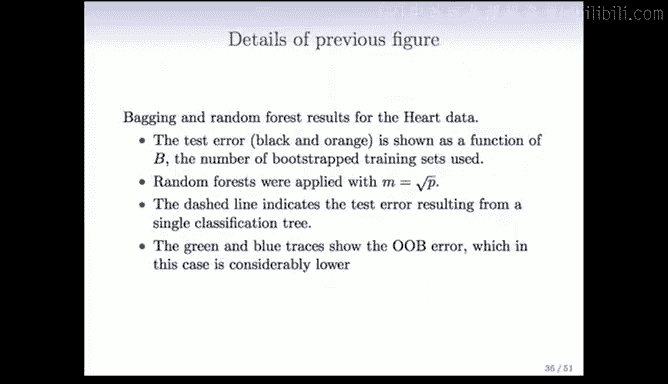

当树的数量B很大时，袋外误差估计近似于留一法交叉验证，并且是“免费”获得的，无需额外划分验证集。

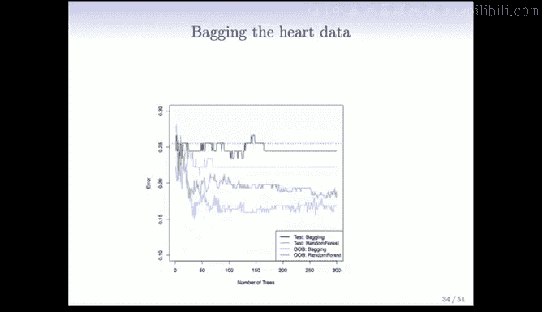

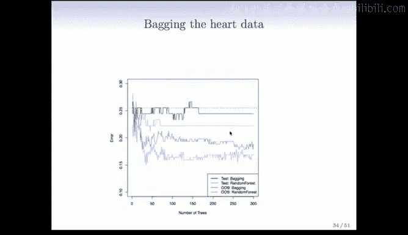

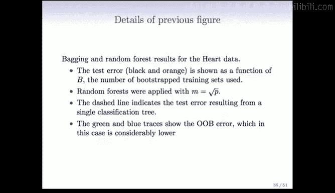

---

## 从Bagging到随机森林 🌲➡️🌳

Bagging通过平均降低了方差，但如果被平均的各个树预测之间相关性较低，平均的效果会更好。随机森林在Bagging的基础上，增加了一个关键步骤来**主动降低树与树之间的相关性**。

具体做法是：在构建每棵决策树的每个分裂节点时，**不是从全部 \( p \) 个预测变量中进行选择**，而是**随机抽取一个包含 \( m \) 个预测变量的子集**（通常 \( m \approx \sqrt{p} \)），然后只在这个子集中寻找最佳分裂变量。

这个方法初看似乎不合常理，因为它“丢弃”了大部分可能有用的信息。但由于我们会构建大量（B棵）树，并且每次分裂都重新随机选择变量，重要的预测变量总有机会在其他树或其他分裂节点被选中。这种强制性的随机性使得每棵树的学习路径不同，从而降低了树之间的相关性，最终提升了集成的效果。

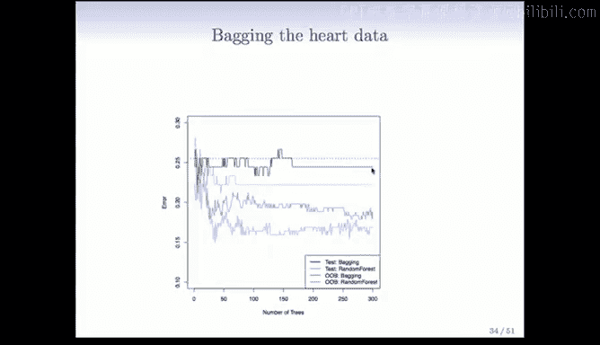

---

## 实例分析：基因表达数据 🧬

让我们看一个高维数据的例子：使用来自349名癌症患者的4718个基因的表达数据，来预测其癌症亚型（共15类，包括1类正常和14类癌症）。

以下是应用随机森林的关键步骤和观察：

1.  **特征预筛选**：由于维度极高（4718个基因），我们先进行无监督筛选，选择在训练集上**方差最大**的500个基因。这不会引入偏差，因为我们没有使用类别标签信息。
2.  **比较不同设置**：我们比较了不同 \( m \) 值（每次分裂考虑的变量数）的效果：
    *   \( m = p \)：即使用所有变量，这等价于标准的Bagging。
    *   \( m = \sqrt{p} \)：随机森林的典型设置。
3.  **结果分析**：
    *   单棵决策树的预测错误率非常高（约60-70%）。
    *   Bagging（\( m = p \)）显著降低了错误率。
    *   随机森林（\( m = \sqrt{p} \)）在Bagging的基础上，进一步将错误率降低了几个百分点，表现最佳。
    *   随着树的数量增加，错误率迅速下降并趋于稳定，大约100棵树后收益不再明显。增加树的数量**不会导致过拟合**，只会降低方差直至稳定。

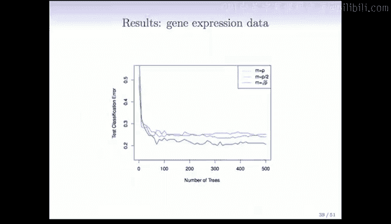

---

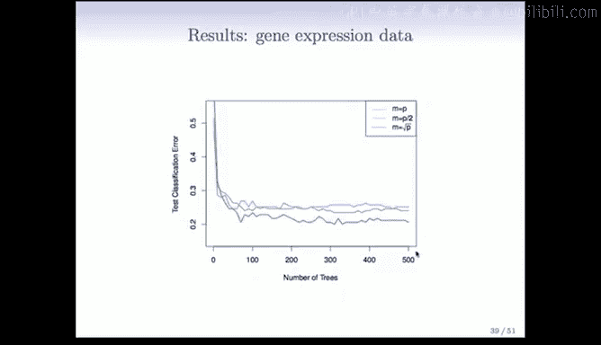

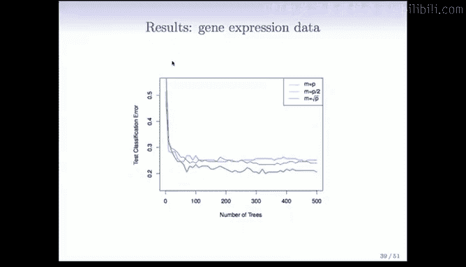

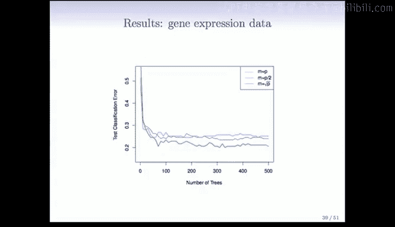

## 总结 📚

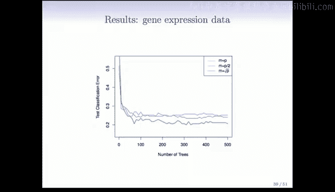

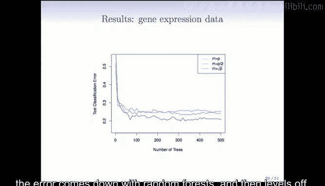

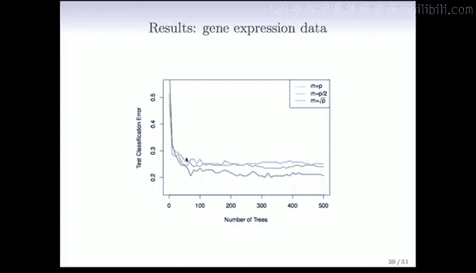

本节课中我们一起学习了两种基于决策树的集成方法：

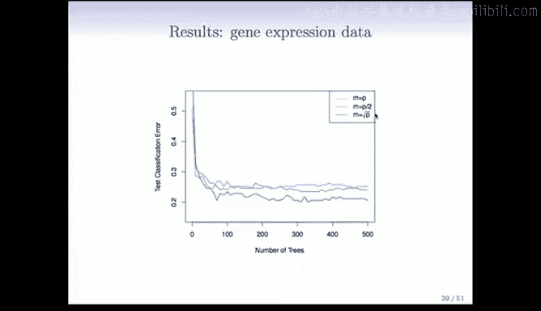

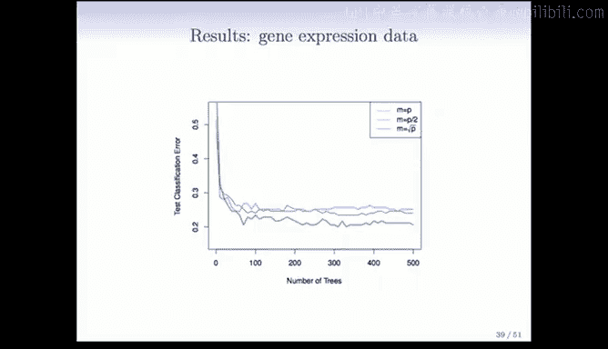

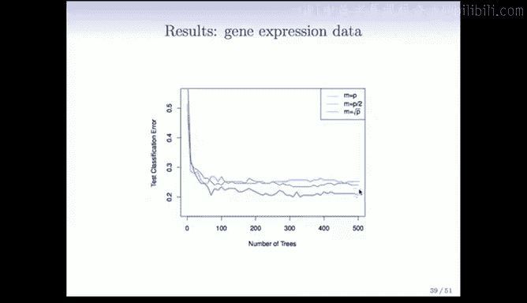

1.  **Bagging**：通过对原始训练集进行自助采样，构建多个树并平均其预测，以降低方差。它还能提供便捷的袋外误差估计。
2.  **随机森林**：在Bagging的基础上，通过在树的每个分裂节点随机限制可选变量，进一步降低树之间的相关性，从而获得比Bagging更优的预测性能。它在处理高维数据时表现尤为出色。

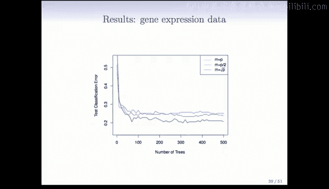

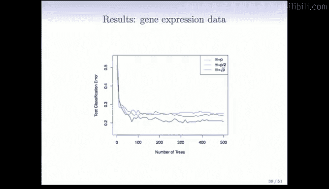

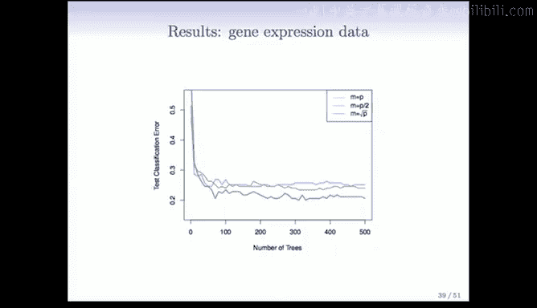

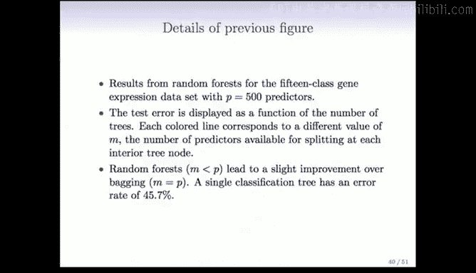

这两种方法的核心在于通过构建并组合多个具有差异性的弱学习器（决策树），来获得一个强大且稳定的强学习器，是统计学习中不可或缺的工具。