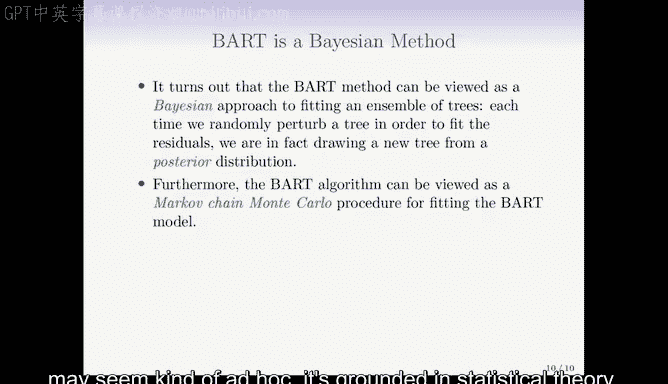

# Python 版 64：贝叶斯可加回归树 🌳


在本节课中，我们将学习一种名为“贝叶斯可加回归树”（Bayesian Additive Regression Trees, BART）的集成学习方法。BART 结合了决策树、随机森林和梯度提升的思想，但其构建树的方式具有独特的贝叶斯特性，使其在减少过拟合方面表现优异。

---

## 1. BART 的基本概念

上一节我们介绍了多种基于决策树的集成方法。本节中，我们来看看 BART 如何以不同的方式构建模型。

BART 是一种使用决策树作为基础构建块的集成方法。与随机森林（通过平均多个独立构建的回归树进行预测）和梯度提升（通过加权和的方式顺序构建树以拟合残差）不同，BART 同时借鉴了二者的思想。

*   **与随机森林的相似之处**：BART 也会通过随机抽样（如自助采样或特征采样）来构建多棵树。
*   **与梯度提升的相似之处**：BART 在构建新树时，会考虑当前模型集尚未捕捉到的信号，类似于拟合残差的过程。

BART 的主要创新在于生成新树的方式。它可以应用于回归、分类等问题，本节课我们主要关注回归任务。

---

## 2. BART 的工作原理

理解了 BART 的基本定位后，我们来深入其具体的工作流程。

BART 会并行维护 **K** 棵树（例如几百棵），并在 **B** 次迭代中不断更新这些树。在每次迭代中，算法会对每棵树进行“扰动”以改变其结构。

以下是 BART 算法流程的示意图：


**算法初始化**：每棵树都从一个仅包含根节点的树开始，根节点的预测值是所有观测值 **y** 的平均值。因此，初始的整体预测就是 **y** 的均值。

**迭代过程**：在后续的每次迭代中（例如第 **b** 次），对于第 **k** 棵树，算法会执行以下步骤：
1.  计算“偏残差”（Partial Residual），即从响应变量 **y** 中减去除第 **k** 棵树外所有其他树的当前预测之和。
2.  不是从头开始拟合一棵新树，而是对第 **k** 棵树在上一步（**b-1**）的状态进行“扰动”，从一系列可能的扰动中选择一个，使得扰动后的树能更好地拟合上一步计算出的偏残差。

**扰动类型**：扰动主要有两种方式：
*   **改变树结构**：通过添加或剪枝分支来改变树的形状。
*   **改变节点预测值**：保持树结构不变，仅调整终端节点（叶子节点）的预测值。

通过这种方式，BART 在“树的空间”中进行一种随机游走，探索各种可能的树模型。

---

## 3. 扰动示例

为了更直观地理解“扰动”，我们来看几个具体的例子。假设在第 **b-1** 次迭代后，我们得到了如下一棵树（第 **k** 棵）：

```
        [根节点]
         /    \
    [叶节点] [叶节点]
    值: 4.079   值: -2.113
```

在下次迭代中，可能的扰动包括：

1.  **改变预测值**：保持树结构不变，仅微调叶节点的值。
    ```
        [根节点]
         /    \
    [叶节点] [叶节点]
    值: 4.422   值: -1.956
    ```

2.  **剪枝分支**：移除一个分支，将树简化。
    ```
        [根节点] (值变为两个旧叶节点值的平均或其他计算值)
    ```

3.  **添加分支**：在现有节点上增加新的分裂，使树变得更复杂。
    ```
            [根节点]
             /    \
        [内部节点] [叶节点]
         /    \     值: -2.113
    [叶节点] [叶节点]
    值: 5.001 值: 3.205
    ```

这些扰动共同作用，在每次迭代 **b** 都会产生一个由 **K** 棵树组成的预测模型，该模型的预测是这 **K** 棵树预测值的和。

---

## 4. 最终预测与优势

在经历了所有 **B** 次迭代后，我们得到了大量的树（**K × B** 棵）。然而，由于算法初期处于“热身”阶段，预测可能不稳定，因此通常会设定一个“燃烧期”（Burn-in Period），例如忽略前 100 次迭代的结果。

**最终预测** 是燃烧期之后所有迭代中、所有 **K** 棵树预测的平均值。

**公式表示**：对于查询点 **x**，其最终预测 `f_hat(x)` 可近似表示为：
`f_hat(x) ≈ (1 / (K * (B - Burn-in))) * Σ Σ T_{k, b}(x)`
其中，`T_{k, b}(x)` 表示第 **b** 次迭代中第 **k** 棵树对 **x** 的预测，求和范围覆盖燃烧期后的所有 **b** 和所有 **k**。

BART 的优势包括：
*   **减缓过拟合**：由于采用“扰动”而非“贪婪拟合”的方式，BART 学习速度更慢，更不易过拟合，测试误差曲线更早趋于平稳。
*   **提供不确定性估计**：由于最终预测基于大量树的后验分布，我们可以计算预测值的分位数（例如 95% 区间），作为预测不确定性的度量。
*   **开箱即用**：与随机森林类似，BART 通常不需要复杂的调参就能获得良好性能。常用的默认设置为：`K=200`, `B=1000到10000`, `Burn-in=100`。

---

## 5. 实例与理论背景

让我们通过一个实例来观察 BART 的表现。下图对比了在心脏病数据集上，梯度提升（Boosting）与 BART 的训练误差和测试误差：



*   **深蓝/深绿线**：梯度提升的训练/测试误差。随着树增多，训练误差持续下降，但测试误差在后期上升，出现过拟合。
*   **金色/浅蓝线**：BART 的训练/测试误差。训练误差下降更缓慢，但测试误差与梯度提升表现相当，且没有明显的上升趋势，显示了其抗过拟合能力。

**那么，这些“扰动”从何而来？它们是否随意？**
实际上，BART 是一种**贝叶斯方法**，这正是其名称的由来。算法中的扰动并非随意，而是对应于模型参数（分裂点、节点预测值）的一个**先验分布**。通过结合数据（似然）和先验，我们得到了参数的**后验分布**。BART 的迭代过程，实质上是一种**马尔可夫链蒙特卡洛（MCMC）** 方法，用于从这个后验分布中进行抽样。因此，BART 有着坚实的统计理论基础。

---

## 总结


本节课中，我们一起学习了贝叶斯可加回归树（BART）。我们了解到：
1.  BART 是一种集成树模型，融合了随机森林（并行、随机）和梯度提升（顺序、拟合残差）的思想。
2.  其核心是通过对一组树进行**随机扰动**（改变结构或节点值）来逐步改进模型，而非完全重新拟合。
3.  最终预测是燃烧期后大量树预测的平均值，这种方法能有效**减缓过拟合**。
4.  BART 可以提供**预测的不确定性区间**，并且通常**开箱即用**，无需精细调参。
5.  该方法具有坚实的**贝叶斯统计基础**，扰动对应于从模型后验分布中的抽样。

BART 为我们提供了一种强大且稳健的回归工具，尤其在希望获得可靠预测并理解其不确定性时非常有用。