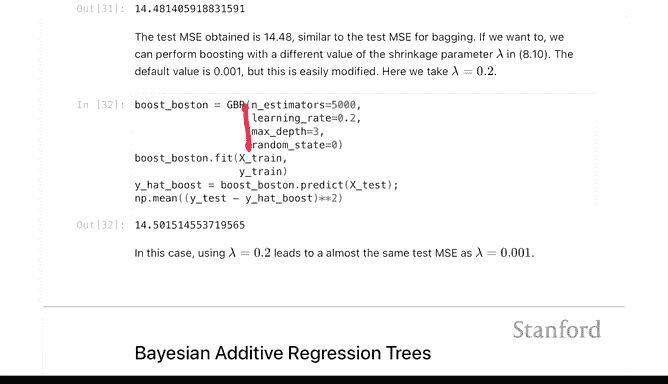
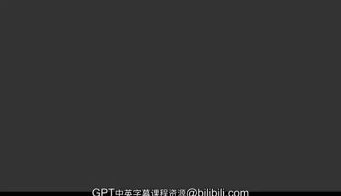

# Python 版 65：基于树的方法 I 实验 🧪🌳

在本节课中，我们将学习第8章关于基于树的方法的实验，重点聚焦于随机森林和提升法。我们将从单棵决策树开始，了解其性能，并与集成方法进行比较。

---

## 实验准备与数据导入

首先，我们进行常规的库导入。对于本章的模型，我们需要引入一些新的模块。

我们将要讨论的主要方法是随机森林和提升法，并且本次实验将专注于回归问题。因此，我们导入的是 `RandomForestRegressor` 和 `GradientBoostingRegressor`，而不是分类器。我们也会简要介绍决策树，使用 `DecisionTreeRegressor`（对应的分类器是 `DecisionTreeClassifier`）。

拟合分类树或回归树的方法，由于都来自 `scikit-learn`，与我们在第4章看到的分类方法几乎完全相同。一旦我们准备好特征集和结果变量，就可以使用 `fit` 和 `predict` 方法。同样，对于交叉验证，我们可以使用第6章中看到的相同设置，因为它是 `scikit-learn` 的估计器。

由于我们将专注于随机森林和提升法的回归应用，因此我们将直接跳到拟合回归决策树的部分，而不是分类决策树。两者看起来很相似，主要区别在于结果变量是二元的/分类的，还是连续的。

我们今天用于回归的数据集是第3章见过的波士顿数据集。预处理非常简单，我们只需要定义一个特征集。我们将通过创建一个设计矩阵来实现，就像进行线性回归一样，然后直接使用这个设计矩阵。不过，我们不希望包含截距项，因此设置 `intercept=False`，因为回归树会拟合自己的截距，在设计矩阵中包含截距列可能会带来问题。

对于回归树，我们将把设计矩阵转换为数组而不是 `DataFrame`。这样我们会丢失一些特征名称，但这是拟合回归树的首选数据格式。

为了进行验证，我们将数据分割为训练集和测试集，在训练集上拟合模型，并在测试集上评估性能。这是我们之前见过的流程。

---

## 拟合与评估回归决策树

要拟合回归树，我们首先构建估计器。请记住，对于 `scikit-learn`，在构建估计器时，我们不在参数中提供数据，而只是指定方法的一些超参数。构建好估计器后，我们调用 `fit` 函数，之后可以调用 `predict` 函数来预测新的结果。

决策树的一个特点是，人们有时希望可视化树的结构。`plot_tree` 函数可以为我们提供树的视觉表示。你可以在每个叶子节点看到一些拟合程度的度量。虽然这张图片的分辨率不高，但你可以追踪一个观测值是如何沿着回归树向下走的。例如，如果房间数量小于6.8，则向左走，然后检查下一个变量 `LSTAT`，依此类推。这就是决策树中形成预测的方式。

让我们看看拟合这个回归树的准确性。作为后续的参考，使用回归树我们得到的均方误差大约为28。这里的“最佳”回归树是指我们通过成本复杂度剪枝路径优化过的树。我们使用训练数据优化了这个参数，试图获得更好的估计器。根据该指标，这是找到的最佳估计器，均方误差约为28。

我们在第6章见过 `GridSearchCV`，当有调优参数时，这是 `scikit-learn` 中用于调整估计器超参数的通用方法。这是我们的回归树估计器。我们为估计器指定一些参数，然后通过网格搜索来获得这个最佳参数。

总结一下，一般流程是：先生长一棵大树，然后使用交叉验证来确定剪枝的程度。在本例中，所有操作都是在70%的训练数据上完成的，而最终对最优剪枝树的误差估计是在30%的测试数据上进行的，我们看到误差略高于28。

以这种方式进行调优，是单棵树能达到的最佳效果。接下来，我们将转向两种集成方法。

---

## 集成方法一：Bagging与随机森林 🌲🌲

我们将讨论的第一个集成方法是Bagging或随机森林。请记住，Bagging和随机森林的主要区别在于，随机森林在每棵树构建时，会随机选择用于分裂的特征。

Bagging的基本方案是自助聚合。从数据中抽取一个自助样本（有放回抽样），对该自助样本拟合一棵树，最终的估计器是这些基于每个自助样本拟合的树的平均值。随机森林在此基础上增加了一个变化：并非在每棵树上使用所有特征。除了对数据行的随机抽样外，在每次进行分裂时，还会对特征进行随机抽样。

那么，我们如何指定呢？随机森林是 `scikit-learn` 的一个估计器。一旦我们使用 `RF`（这是 `RandomForestRegressor` 的简写）构建了估计器，我们只需要在训练数据 `X_train` 和 `y_train` 上调用 `fit` 方法。然后，我们可以在测试数据上进行预测，并以此评估准确性。

请注意，这里我设置了一个参数 `random_state=0`，因为这是一个随机过程，其底层有一个随机数生成器。设置这个状态意味着结果将是可重复的。如果我们再次运行，会得到相同的答案。如果不指定随机状态，那么每次运行的结果都会不同。

仅使用这个简单的回归器，我们得到的均方误差约为14，这大约是单棵树误差的一半。因此，在预测性能方面，集成方法不费太多力气就能轻松超越单棵树。

我在这里称其为树的“Bagging版本”，是因为我设置了 `max_features` 等于 `X_train` 的列数。这实质上告诉 `RandomForestRegressor` 在进行分裂时使用每个特征，因此在分裂时不会对特征进行任何抽样。如果我们把这个值设置得比列数（12）小，那么它就会成为一个随机森林。

另外请注意，在 `scikit-learn` 中，回归随机森林和分类随机森林默认用于分裂的特征数量是不同的。我认为对于回归，默认是进行Bagging（即使用所有特征），而对于分类，默认是特征数的平方根。

你可以在随机森林中指定的另一个参数是生长的树的数量，默认是100棵。让我们尝试将树的数量增加到500棵，看看是否有所改善。结果并没有变得更好，大约在14.6。这里发生的情况是，我们对从同一分布中独立抽取的树进行平均。在某个点上，平均效应会达到饱和，我们将不再看到任何改进。但如果树的数量太少，比如只有一棵，我们就无法达到较低的均方误差。

如果我们想要更像随机森林的效果，可以减少每次分裂考虑的特征数量。这里我们将特征数设置为6，这大于特征数的平方根。这将为每次分裂提供一些特征选择。我们看到，这实际上使性能略有下降，误差是20而不是14.6。

随机森林的一个优点是，你可以获得每个特征的重要性度量，用于事后分析哪些特征在产生这些预测时显得重要。这个度量衡量的是，每当我们在 `LSTAT` 上增加一个分裂时，均方误差的平均改进程度。从某种意义上说，这是我们在任何树中进行分裂时所获得的平均改进。

结果显示，`LSTAT` 和房间数量是迄今为止最重要的特征，其余的特征相比之下显得小得多。回想一下我们单棵树的图，`LSTAT` 和房间数量也是我们首先分裂的几个特征，所以它们对这里的预测似乎很重要。

---

## 集成方法二：提升法 📈

随机森林和提升法都使用树的集合。两者之间的一个主要区别在于每阶段拟合的树的类型。在随机森林中，每个阶段拟合的树与第一阶段相同，因为一旦数据固定，第一阶段的自助样本与第500阶段的自助样本是相同的。在提升法中，可能会有重采样（取决于具体实现），但随着阶段的进行，变化在于我们是在拟合残差，即在移除了到该点为止已拟合模型的部分效应之后。

与随机森林不同，在随机森林中，一旦拟合了足够多的树，结果就不会再变化；而在提升法中，拟合的树越多，就越可能开始过拟合数据。因此，在树的数量上确实会存在偏差-方差的权衡。我们将在接下来的图中看到这一点。随着估计器数量（即树的数量）的增长，我们可以绘制测试误差和训练误差，并看到特雷弗刚刚提到的情况。

在拟合这些模型方面，一旦我们指定了超参数，由于它是 `scikit-learn` 方法，我们就使用 `fit` 方法在训练数据上拟合，并可以在测试数据上进行预测。

让我们绘制训练误差和测试误差随树数量变化的图。为此，对于提升估计器，我们可以使用 `staged_predict` 方法。顾名思义，它分阶段进行预测，这些阶段对应于提升过程中拟合的树。随着阶段的进行，残差发生变化并变小，训练残差随着阶段的进行而变小，训练误差应该下降。在某个点上，测试误差可能会上升。

让我们看一下这个图。在5000棵树之后，我们看到训练误差已经开始饱和。在这个数据集上，我们没有看到明显的过拟合增加，但这并不意味着提升法不会过拟合，只是在这个特定数据集上没有发生。在这个数据集中，随着树数量的增加，测试误差有可能出现上升。

让我们看看在最终阶段，测试数据上的均方误差。大约是14.5，这比随机森林略好一点，但两者非常接近。而Bagging版本的随机森林性能也差不多。

---

## 提升法的其他参数与总结

最后，我们可以讨论其他参数。如果你查看 `GradientBoostingRegressor` 的帮助文档，你会看到许多可以设置的参数，其中之一是学习率。这里，我们只是改变了学习率，向你展示可以改变多个参数。实际上，在这个案例中，改变学习率并没有造成差异，但这并不意味着它永远不会产生影响。提升法有大量的调优参数，我认为一些提升法的实现在过程中也会进行重采样。

总的来说，提升法的核心思想是拟合残差的树，而随机森林的核心思想是在每个阶段拟合相同结构的树到数据的随机化版本上。除此之外，它们的实现细节有所不同。

我们不会讨论最后一个主题——贝叶斯加性回归树。这是结束第8章实验的一个好地方。

---

## 本节课总结

在本节课中，我们一起学习了：
1.  如何用 `scikit-learn` 拟合和评估回归决策树，并使用成本复杂度剪枝进行优化。
2.  集成方法Bagging和随机森林的原理与实现，包括特征重要性分析。
3.  提升法的原理与实现，并观察了其训练误差和测试误差随迭代次数变化的趋势。
4.  通过波士顿房价数据集，对比了单棵决策树、随机森林和提升法的预测性能，发现集成方法显著优于单棵树。

通过动手实验，我们加深了对这些基于树的强大方法的理解。