# Python 版 66：最优分隔超平面 📐


在本节课中，我们将学习支持向量机的基础概念——最优分隔超平面。这是一种直接的分类方法，其核心思想是在特征空间中寻找一个能够分隔不同类别的平面。我们将从超平面的定义开始，逐步理解如何寻找最优的分隔边界。

---

## 什么是超平面？📏

上一节我们介绍了支持向量机的目标。本节中，我们来看看实现这一目标的关键工具——超平面。

在统计学和机器学习中，超平面是一个几何概念。在P维特征空间中，一个超平面是一个平坦的P-1维子空间。其数学定义是一个线性方程：

**公式：**
`β₀ + β₁X₁ + β₂X₂ + ... + βₚXₚ = 0`

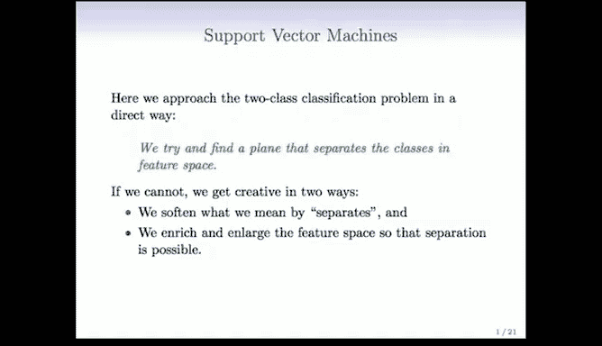

其中：
*   `β₀` 是截距。如果 `β₀ = 0`，则超平面经过原点。
*   `β₁, β₂, ..., βₚ` 构成一个法向量，它指向垂直于超平面表面的方向。

在二维空间中，超平面就是一条直线。下图展示了一个二维超平面的例子：

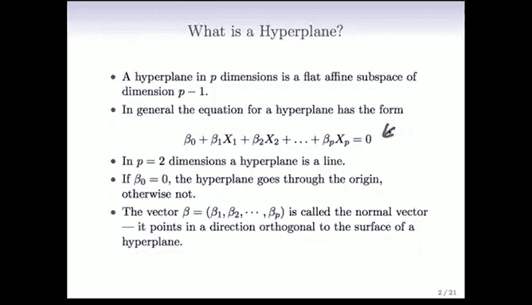

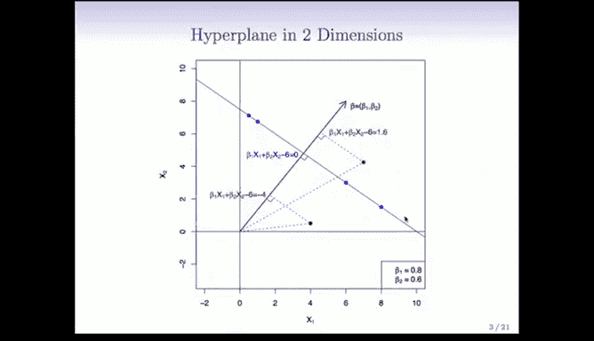

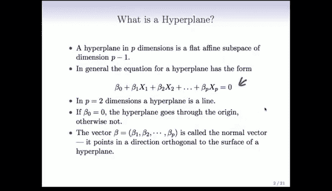

图中：
*   蓝色直线代表超平面。
*   红色箭头是法向量，垂直于超平面。
*   对于空间中的任意一点（如图中所示点），可以将其正交投影到法向量上，投影的长度即为该点到超平面的（有符号）距离。
*   所有位于超平面上的点，其函数值（即到超平面的距离）为0。
*   位于超平面一侧的点，其距离值为正；另一侧的点，其距离值为负。


当法向量 `β₁, β₂, ..., βₚ` 是单位向量（即其平方和为1）时，函数计算出的值就是该点到超平面的欧几里得距离。

---

## 分隔超平面 🧩

理解了超平面的基本概念后，我们来看如何用它进行分类，即寻找分隔超平面。

观察下图，我们有两类数据点（蓝色和紫色），以及三条不同的直线：

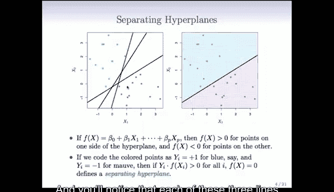

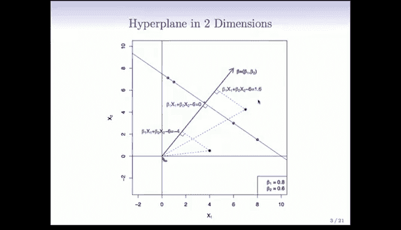

以下是这三条直线的共同点：
*   它们都将蓝色点与紫色点完全分隔在了直线的两侧。
*   从分类的角度看，任何一条直线都可以作为一个分类器：将直线一侧的点预测为蓝色，另一侧的点预测为紫色。

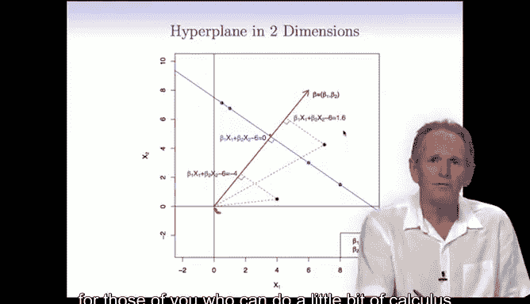

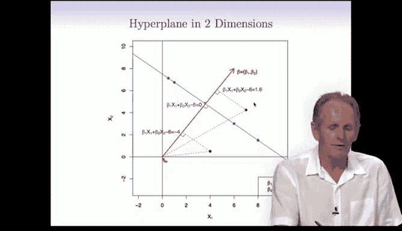

为了用数学语言描述这种“分隔”，我们可以对类别标签进行编码：
*   将蓝色点编码为 `y = +1`
*   将紫色点编码为 `y = -1`

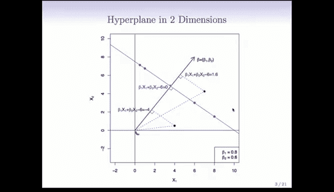

对于一个超平面，如果对于所有训练数据点 `i`，都满足：
**公式：**
`y_i * (β₀ + β₁X_{i1} + β₂X_{i2} + ... + βₚX_{ip}) > 0`


那么该超平面就是一个**分隔超平面**。因为这意味着每个点计算出的函数值（距离）与其类别标签同号，即所有点都位于超平面“正确”的一侧。


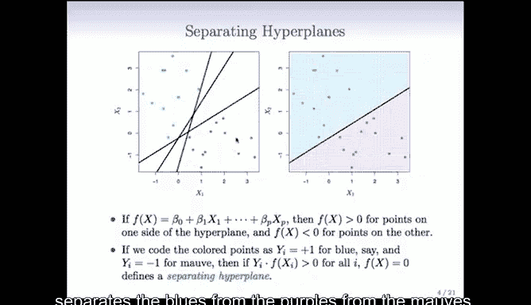

---


## 最大间隔分类器 ⚔️


上一节我们看到，可能存在多个分隔超平面。本节中我们来看看如何从中选择“最优”的一个。


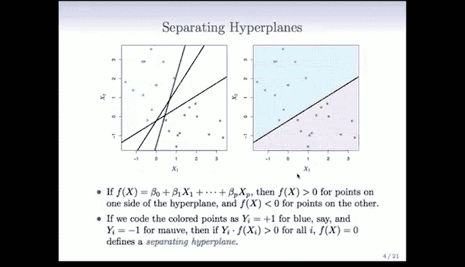

核心思想是：在所有可能的分隔超平面中，选择那个能创造出最宽“安全地带”或“间隔”的一个。这个间隔是超平面到其两侧最近数据点的最小垂直距离。我们称之为**最大间隔分类器**。

下图展示了最优分隔超平面：


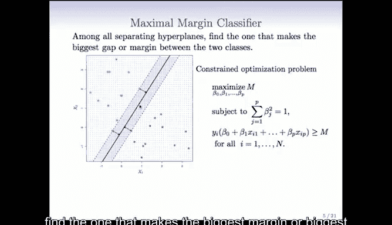


可以看到，这个超平面与两侧最近的蓝色点和紫色点距离相等，并且这个距离是所有可能分隔超平面中最大的。

选择最大间隔分类器的直观原因是：在训练数据上创造一个宽阔的间隔，可以增加模型对于未来新测试数据的泛化能力，使其分类决策更加稳健。

那么，如何找到这个最大间隔超平面呢？这可以通过一个优化问题来形式化求解。

以下是该优化问题的数学描述：
1.  首先，约束法向量为单位长度：`β₁² + β₂² + ... + βₚ² = 1`。这确保了函数值 `f(x)` 等于点到超平面的距离。
2.  对于每个编码后的数据点 `(x_i, y_i)`，我们希望其到超平面的（有符号）距离至少为某个值 `M`：`y_i * f(x_i) ≥ M`。
3.  我们的目标是找到一组参数 `(β₀, β₁, ..., βₚ)`，使得这个最小的间隔 `M` 尽可能大。即，**最大化 M**。

**代码/公式描述的核心优化问题：**
```
最大化 M
约束条件：
1. y_i (β₀ + β₁x_{i1} + ... + βₚx_{ip}) ≥ M, 对于所有 i = 1, ..., n
2. ∑_{j=1}^{p} β_j² = 1
```

这个问题可以通过凸优化技术求解。在实际应用中，我们可以使用现成的软件包（如R语言中的 `e1071` 包或Python中的 `scikit-learn`）来高效地计算出最大间隔分类器。

---

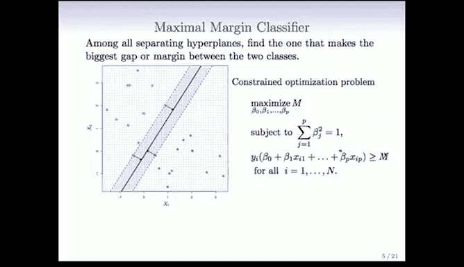

## 总结 📚

本节课中我们一起学习了支持向量机分类方法的基石——最优分隔超平面。
*   我们首先定义了**超平面**，它是一个能将特征空间一分为二的线性边界。
*   接着，我们引入了**分隔超平面**的概念，即能够完美区分两类训练数据的超平面。
*   最后，为了从众多分隔超平面中选择最鲁棒的一个，我们介绍了**最大间隔分类器**。它通过求解一个最大化类别间间隔的优化问题，来找到最优的分隔边界。

然而，最大间隔分类器要求数据必须**线性可分**。在实际问题中，数据往往存在噪声或本身就是非线性可分的。在接下来的课程中，我们将探讨当无法找到完美分隔超平面时，支持向量机如何通过“软化”间隔约束和将数据映射到更高维空间等创造性方法来解决这些挑战。