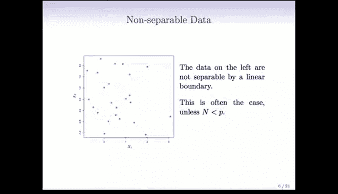
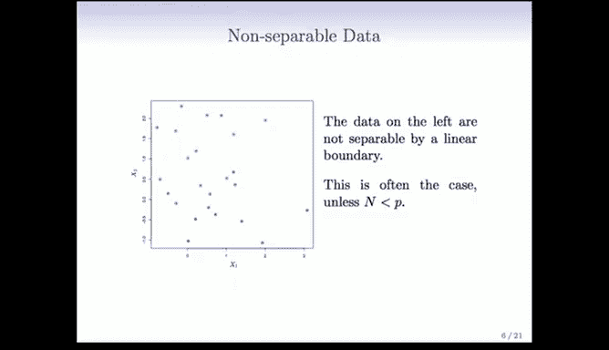
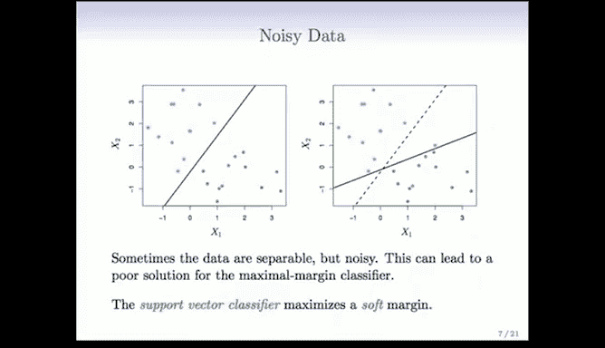
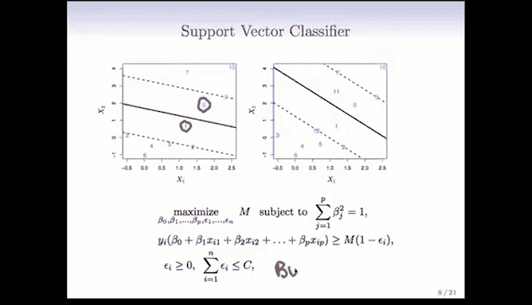
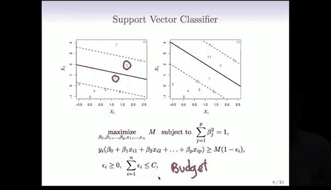
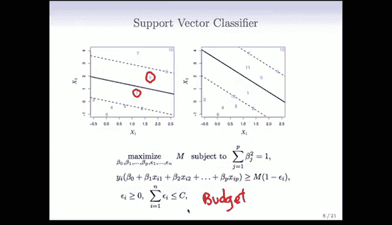
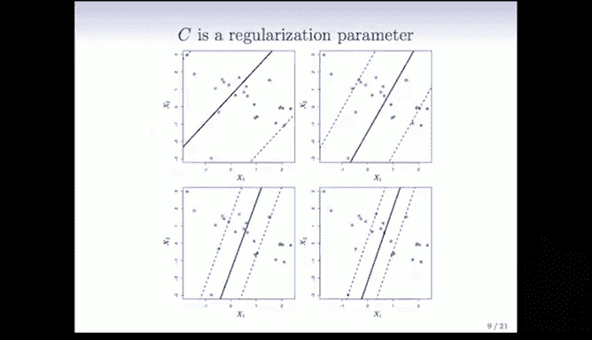
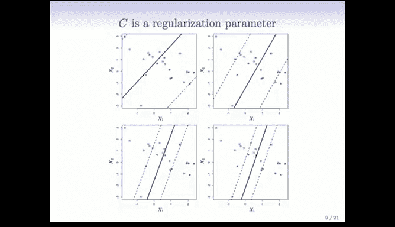
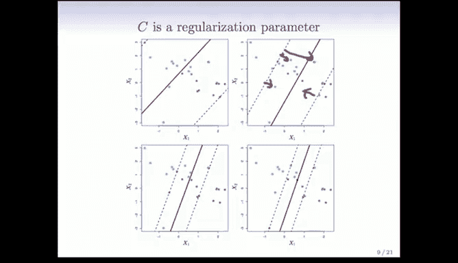
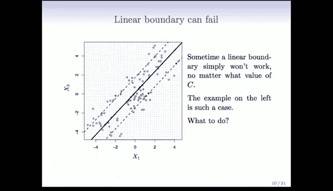

# Python 版 67：支持向量分类器 📊




在本节课中，我们将要学习如何扩展最大间隔分类器，以处理数据无法被完美线性分离的情况。我们将引入**支持向量分类器**的概念，它通过允许一些数据点位于“错误”的一侧，来构建一个更稳健、更灵活的模型。

---

上一节我们介绍了最大间隔分类器，它要求数据必须能被一个超平面完美分离。然而，在实际应用中，数据往往存在重叠或噪声，使得完美分离变得不可能或不理想。

本节中我们来看看当数据无法被完美线性分离时，我们该如何应对。

## 线性不可分数据的问题



考虑以下两种情况：
1.  **数据完全不可分**：如图所示，你无法找到任何一个超平面能将蓝色和粉色点完全分开。当样本数量远大于特征维度时，这种情况很常见。
2.  **数据存在噪声或异常值**：即使数据原本是可分的，一个异常点的加入也可能迫使分类边界发生剧烈变动，导致模型不够稳健。


为了同时解决这两个问题，我们引入了**支持向量分类器**。它的核心思想是最大化一个**软间隔**，即允许一些数据点位于间隔的错误一侧。

## 理解软间隔



以下是软间隔的两种情形图示：


*   **左图**：数据本身是可分的，但我们选择了一个更宽的间隔。代价是允许了两个点（编号80的蓝点和另一个粉点）位于其对应类别的间隔错误一侧。
*   **右图**：数据不可分，我们必须使用软间隔。可以看到有蓝点和粉点不仅位于间隔的错误一侧，甚至越过了决策边界。

通过允许这种“错误”，间隔的确定不再仅仅依赖于最靠近边界的少数几个点，从而使模型对噪声和异常值更具鲁棒性。这本质上是一种正则化手段。

## 支持向量分类器的数学形式

我们需要修改最大间隔分类器的优化问题，以引入“松弛”的概念。

优化目标依然是最大化间隔 `M`。约束条件修改如下：

*   对于每个数据点 `i`，其到超平面的距离现在只需满足：`y_i (β_0 + β_1 x_{i1} + ... + β_p x_{ip}) >= M (1 - ε_i)`。
*   这里引入了**松弛变量 ε_i**。`ε_i >= 0` 衡量了第 `i` 个点被允许“犯错”的程度。
    *   如果 `ε_i = 0`，则该点正确位于其间隔的正确一侧（且距离至少为 `M`）。
    *   如果 `ε_i > 0`，则该点位于间隔的错误一侧（或越过了决策边界）。`ε_i` 越大，错误越严重。
*   同时，我们对总的松弛量设置一个预算上限 **C**：`Σ ε_i <= C`，且 `C >= 0`。



**核心优化问题公式**可总结为：
```
最大化 M
约束条件：
1. Σ_{j=1}^{p} β_j^2 = 1
2. y_i (β_0 + β_1 x_{i1} + ... + β_p x_{ip}) >= M (1 - ε_i), 对于所有 i
3. ε_i >= 0, 对于所有 i
4. Σ_{i=1}^{n} ε_i <= C
```

这是一个凸优化问题，可以使用R或Python中的SVM相关软件包（如 `sklearn.svm.LinearSVC`）来求解。

## 调节参数 C 的作用







参数 **C** 是一个关键的调节参数，它控制着我们对“错误”的容忍度。

*   **C 较大**：松弛预算很宽松。模型会倾向于使用一个**更宽的间隔**，并允许更多点位于错误一侧。这使模型更稳定，受个别点影响更小。
*   **C 较小**：松弛预算很紧张。模型会迫使间隔**变窄**，以尽量减少位于错误一侧的点。这使模型对训练数据拟合更紧，但可能降低稳健性。



以下是不同C值下分类边界变化的示意图，直观展示了其作为正则化参数的作用：


**一个重要提示**：与岭回归和Lasso类似，由于支持向量分类器基于距离（间隔）进行计算，**在训练前对特征进行标准化至关重要**，以确保所有特征在模型中具有同等的重要性。

## 软间隔的局限性

尽管软间隔提供了灵活性，但在某些复杂情况下，仅靠线性边界（即使是软间隔）仍然不够。

考虑下图所示情况，无论我们如何调整线性边界和软间隔，都无法获得一个好的分类器：




我们所需要的是能够“弯曲”决策边界的能力。这引出了我们下一节将要讨论的主题：**支持向量机**，它通过使用核函数将数据映射到更高维空间，从而找到非线性的分类边界。

---



本节课中我们一起学习了支持向量分类器。我们了解到，通过引入松弛变量 `ε_i` 和调节参数 `C`，我们可以构建一个最大化软间隔的线性分类器。这种方法能够有效处理线性不可分的数据和包含噪声的数据，提高了模型的稳健性。参数 `C` 控制着模型对错误的容忍度与间隔宽度之间的权衡。最后，我们也看到了线性方法的局限性，为接下来学习更强大的非线性支持向量机做好了铺垫。