# Python 版 68：特征扩展与支持向量机 📈

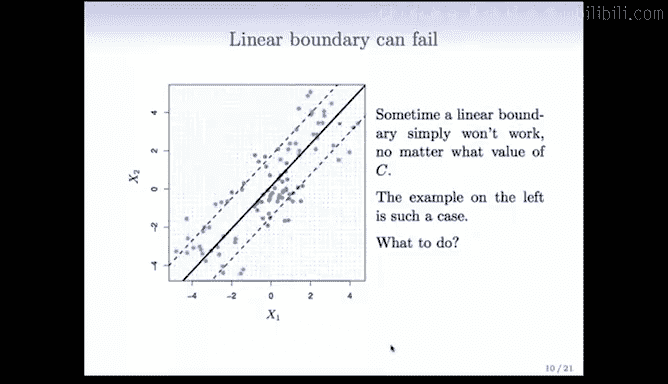

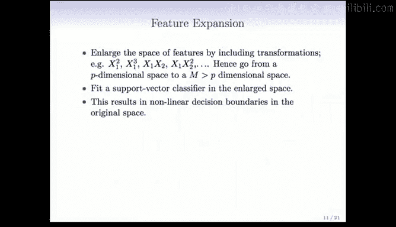

在本节课中，我们将学习如何通过特征扩展来解决线性支持向量机无法处理非线性可分数据的问题，并引入核函数这一更优雅、高效的方法来实现非线性分类。

---

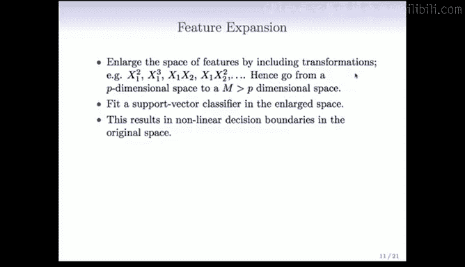

## 概述

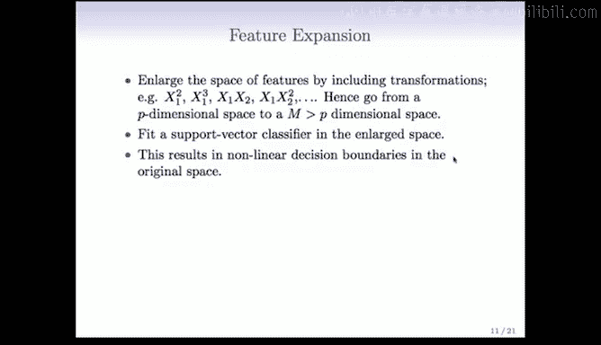

上一节我们介绍了软间隔支持向量机，它允许部分样本点位于间隔内或错误的一侧，以处理线性不可分数据。然而，有些情况下，即使使用软间隔也无法找到合适的线性决策边界。本节中，我们来看看如何通过特征扩展和核技巧来克服这一限制，使支持向量机能够处理复杂的非线性分类问题。

---

## 特征扩展

当数据在原始特征空间中线性不可分时，一个自然的思路是将特征映射到更高维的空间。在这个高维空间中，数据可能变得线性可分。

一种标准且简单的方法是使用多项式变换。例如，我们从两个特征 `x1` 和 `x2` 开始，可以添加 `x1^2`、`x2^2`、`x1*x2` 等多项式项。

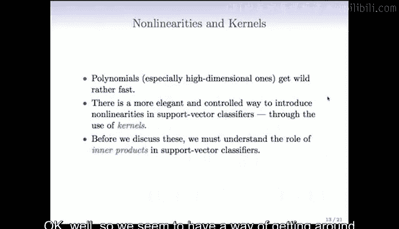

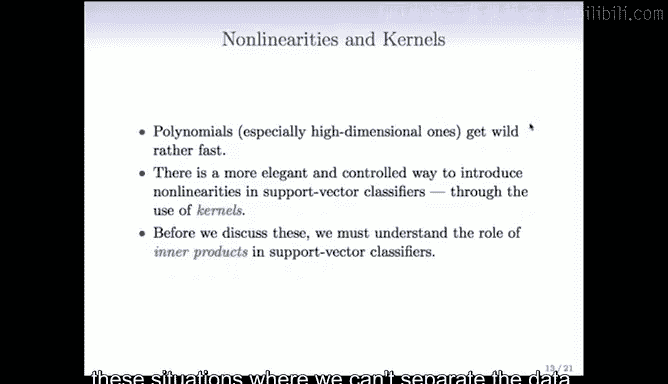

通过这种方式，我们将特征空间从 `p` 维（本例中为2维）扩展到了更高维。添加的变换变量越多，数据在这个高维空间中就越有可能被线性分离。

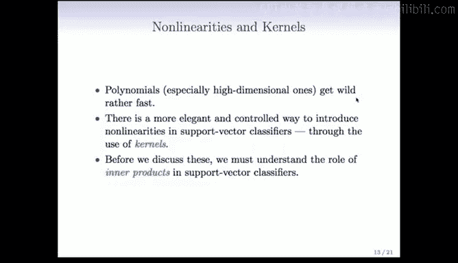

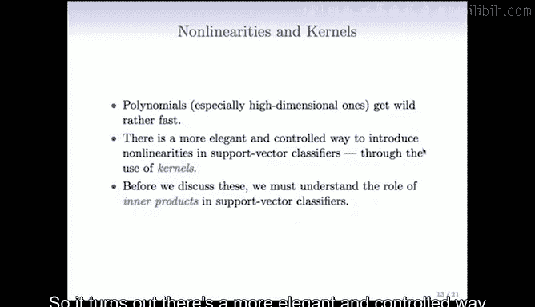

以下是特征扩展的核心步骤：
1.  **扩展特征空间**：将原始特征通过多项式等函数进行变换，生成新的特征。
2.  **在高维空间拟合线性SVM**：在扩展后的高维特征空间中，拟合一个线性的支持向量分类器。
3.  **投影回原始空间**：将高维空间中的线性决策边界投影回原始的二维空间，在原始空间中，这个边界就变成了非线性的。

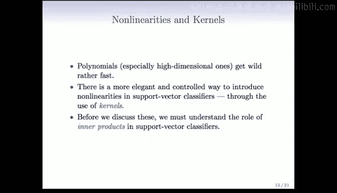

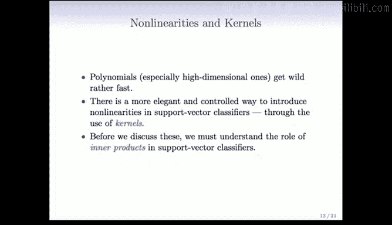

例如，如果我们使用二次多项式（`degree=2`），会得到以下五个新特征：
`x1`, `x2`, `x1^2`, `x2^2`, `x1*x2`

在高维空间中，决策边界是这些新特征的线性组合，其形式为：
`β0 + β1*x1 + β2*x2 + β3*x1^2 + β4*x2^2 + β5*x1*x2 = 0`

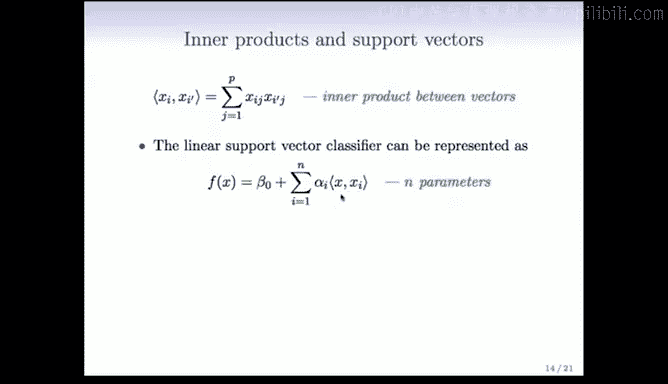

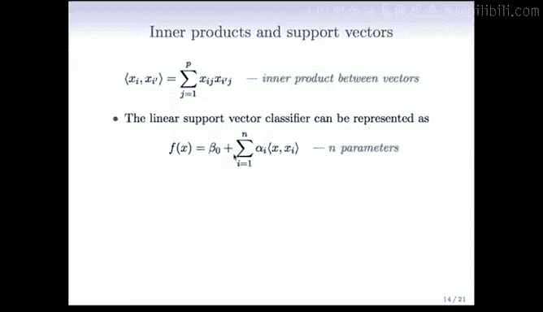

但在原始变量 `(x1, x2)` 的视角下，由于包含了平方项和交叉项，这个边界是非线性的。

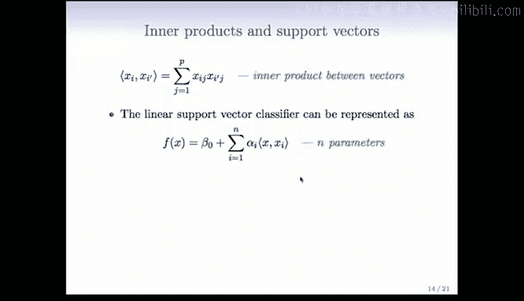

上图展示了在之前线性不可分的例子中，使用二次多项式扩展后得到的非线性决策边界（实线）及其对应的间隔（虚线）。可以看到，它成功地将两个类别分开了。

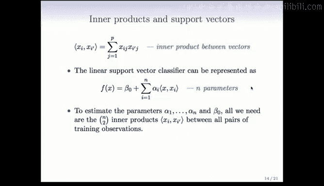

---

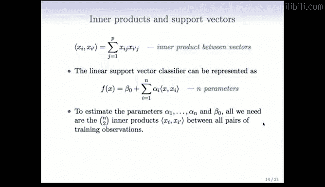

## 从特征扩展到核函数

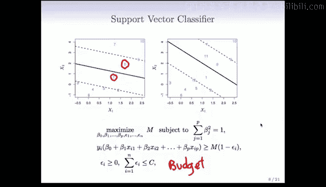

虽然多项式扩展是一种可行的方法，但它存在局限性。特别是在高维原始数据中，即使使用三次多项式，生成的特征空间维度也会急剧膨胀，导致计算复杂且容易过拟合。

因此，我们需要一种更优雅、更可控的方法来为支持向量分类器引入非线性。这就是核方法。

在深入核函数之前，我们需要理解内积在支持向量分类器中的关键作用。

---

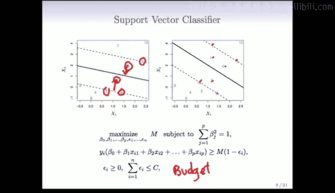

## 内积与支持向量机的对偶形式

两个 `p` 维向量 `xi` 和 `xi‘` 的内积定义为它们各分量乘积之和：
`<xi, xi‘> = Σ (j=1 to p) xij * xi‘j`

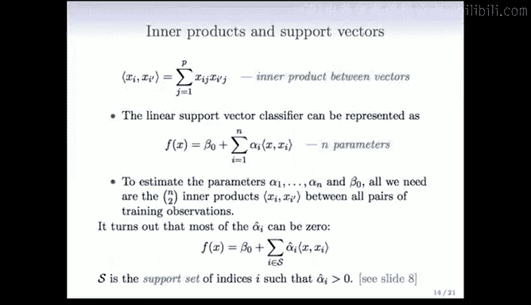

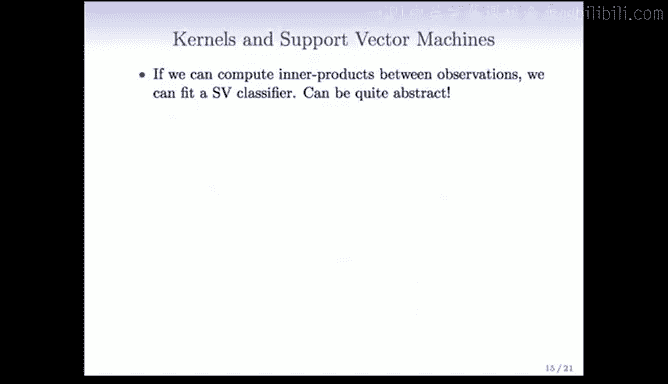

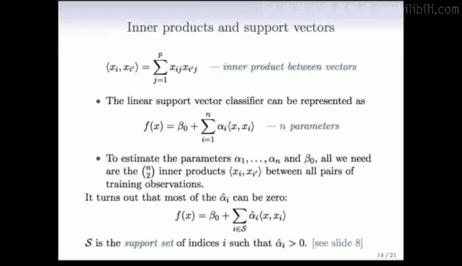

一个重要的发现是，线性支持向量分类器的解可以写成以下形式：
`f(x) = β0 + Σ (i=1 to n) αi * <xi, x>`

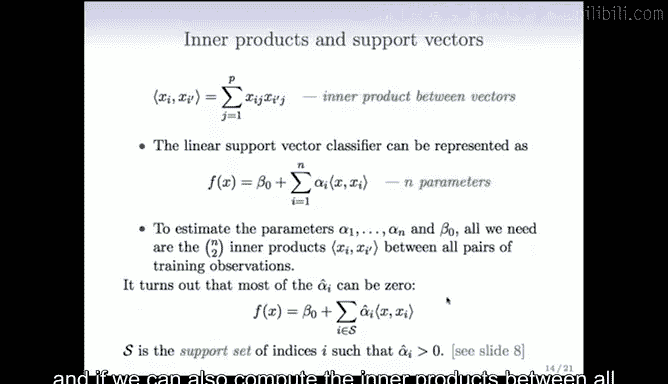

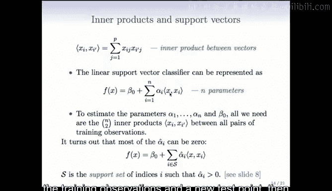

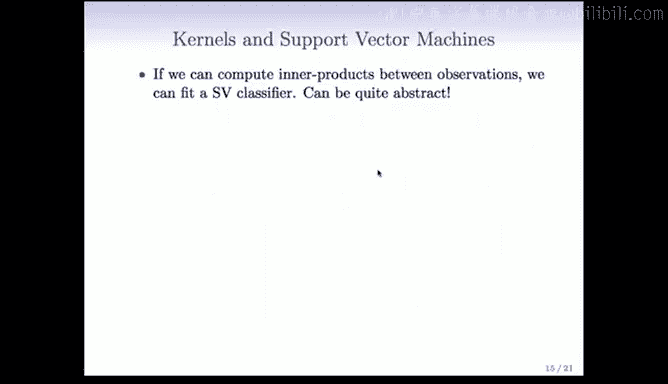

这里，`x` 是一个新的待预测点。`αi` 是模型参数，每个训练样本 `xi` 对应一个 `αi`。值得注意的是，要估计这些参数（`αi` 和 `β0`），我们只需要所有训练样本点两两之间的内积。

这意味着，我们可以通过一个 `n x n` 的内积矩阵来拟合支持向量分类器。在这种表示下，许多 `αi` 的值最终会为0。那些 `αi ≠ 0` 对应的训练样本点，被称为**支持向量**。

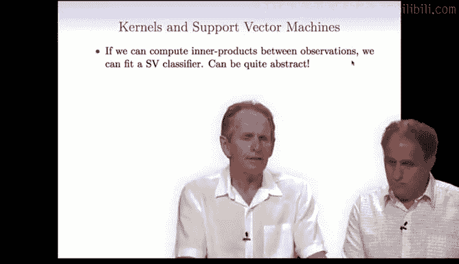

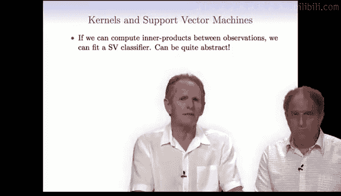

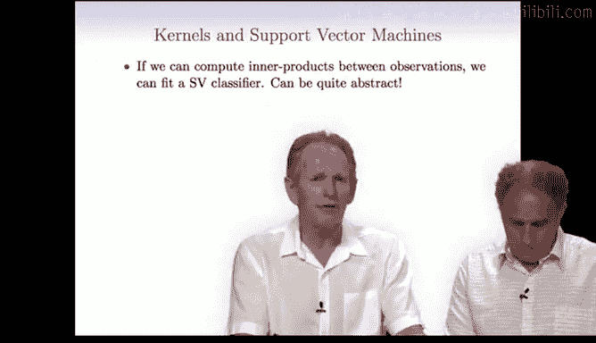

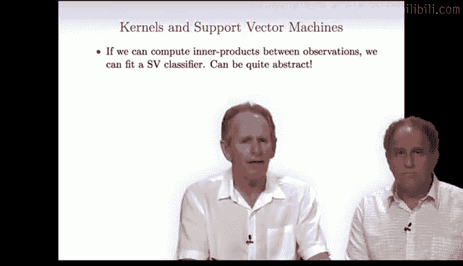

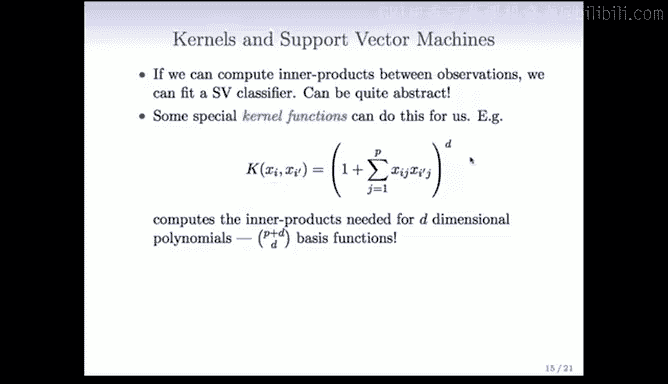

如上图所示，支持向量就是那些位于间隔上或因为违反间隔而被惩罚的点。它们决定了最终的决策边界。这是一种在**数据空间**中的稀疏性，与Lasso在特征空间中的稀疏性不同。

---

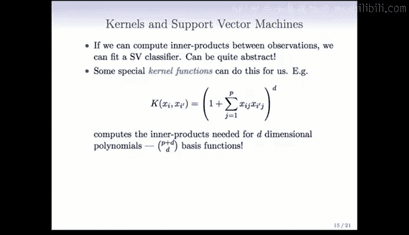

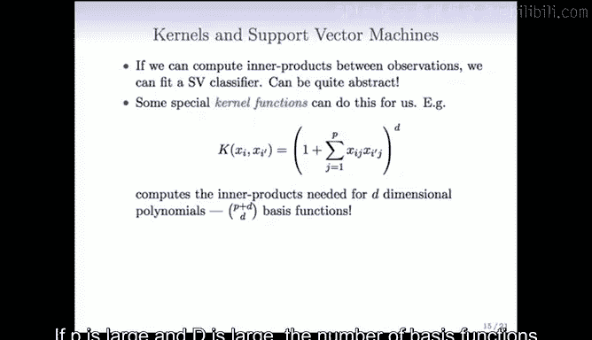

## 核函数：高效计算高维内积的魔法

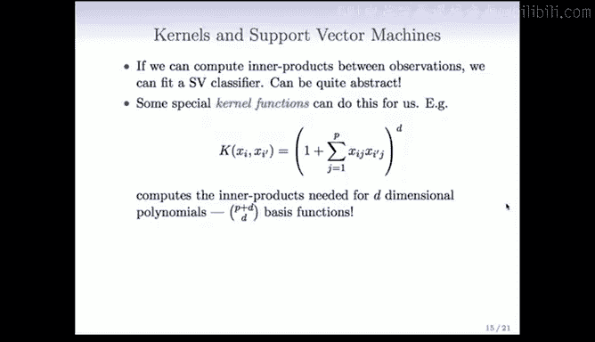

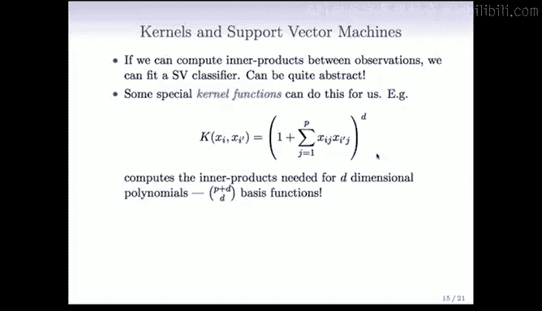

基于上一节的结论，如果我们能计算任意两个观测点之间的内积，以及所有训练点与新测试点之间的内积，那么我们就能拟合和评估支持向量机。

核函数 `K(xi, xi‘)` 正是这样一个计算两个向量某种“相似度”的函数。关键在于，某些核函数可以隐式地计算两个向量在某个**非常高维（甚至无限维）变换空间**中的内积，而我们无需显式地进行特征变换。

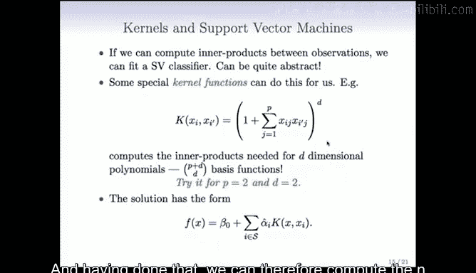

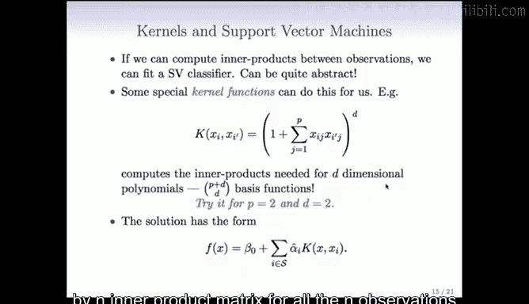

一个具体的例子是多项式核：
`K(xi, xi‘) = (1 + <xi, xi‘>)^d`
这个核函数计算的是原始向量在 `d` 次多项式扩展空间中的内积。当原始维度 `p` 和次数 `d` 较大时，显式扩展后的空间维度 `C(p+d, d)` 会非常巨大，但核函数让我们能直接计算内积，避开了维度灾难。

最流行的核函数之一是**径向基函数核**，也称为高斯核：
`K(xi, xi‘) = exp(-γ * Σ (j=1 to p) (xij - xi‘j)^2)`
其中 `γ` 是一个可调参数。这个核函数对应一个无限维的特征空间。通过调整 `γ`，我们可以控制模型的复杂度：`γ` 越大，决策边界越曲折，可能过拟合；`γ` 越小，决策边界越平滑。

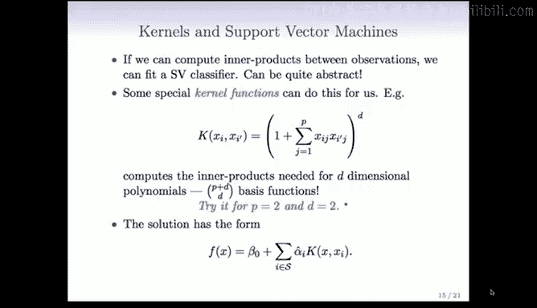

使用径向基核函数，我们可以得到非常灵活的非线性决策边界，如上图所示，它完美地分离了复杂的类别。

你可能会问：在无限维空间中拟合模型，难道不会严重过拟合吗？答案在于核函数带来的“隐式正则化”。虽然特征空间维度极高，但核函数内部机制确保了只有那些对分类真正重要的方向被保留，其他方向被“压缩”了，从而避免了过拟合。

---

## 总结

本节课我们一起学习了支持向量机处理非线性问题的核心方法。
1.  我们首先介绍了**特征扩展**，通过多项式变换将数据映射到高维空间以实现线性可分。
2.  接着，我们探讨了支持向量机的**对偶形式**，发现其解依赖于训练样本间的内积，并引入了**支持向量**的概念。
3.  最后，我们引入了强大的**核方法**。核函数（如多项式核、径向基核）能够隐式地在极高维空间计算内积，使我们能高效地拟合非线性支持向量机，而无需承受显式特征扩展的计算负担。这构成了支持向量机处理复杂模式识别任务的基石。

在下一节中，我们将通过实际例子来应用这些核函数。