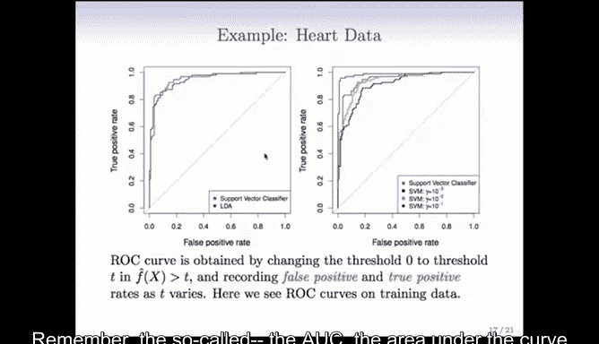
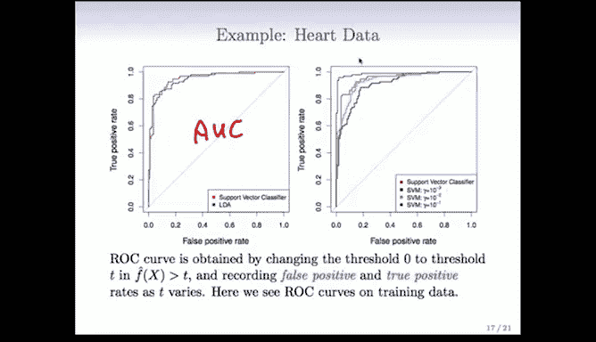
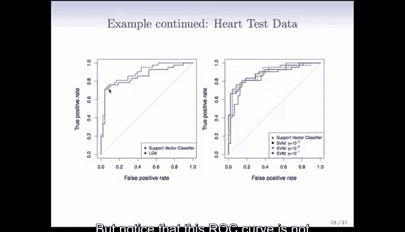
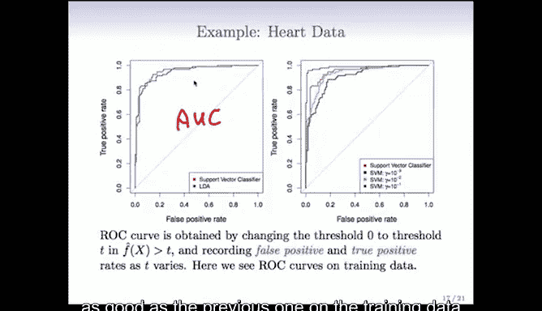
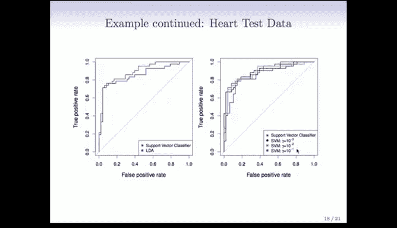
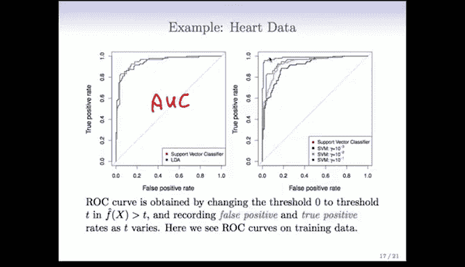
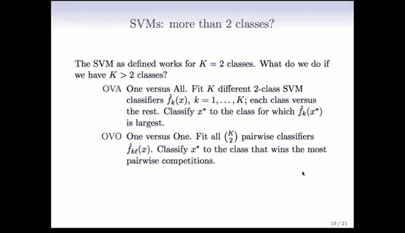
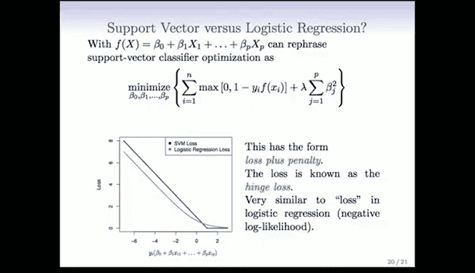
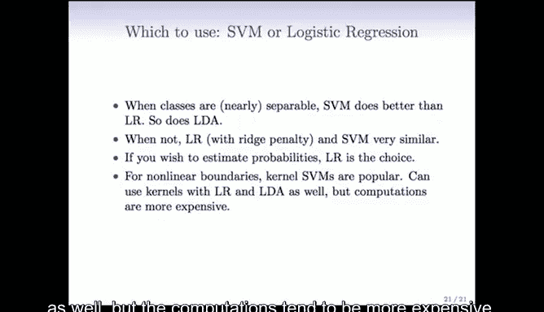

# Python 版 69：支持向量机示例及与逻辑回归的比较 📊

在本节课中，我们将通过一个具体的心脏病数据集示例，来观察支持向量机（SVM）的实际表现，并将其与逻辑回归等分类方法进行比较。我们将重点关注模型在训练集和测试集上的性能差异，以及如何解释这些结果。

---

## 示例：心脏病数据集分析

上一节我们介绍了支持向量机的一般原理。本节中，我们来看看它在一个简单示例上的表现。这个示例使用心脏病数据集，其中包含大约10个变量，目标是将样本分类为“患有心脏病”或“未患心脏病”两类。

我们使用支持向量机进行分类。在以下两张图中，左图展示了模型在训练数据上的性能，右图则展示了在测试数据上的性能。我们使用ROC曲线来评估性能。

### 理解ROC曲线



为了提醒大家，当我们拟合一个函数（最初是线性函数）后，会以零为阈值进行分类决策。如果函数值大于0，则将其分类为一个类别；否则，分类为另一个类别。在这个过程中，会产生一些错误，例如假阳性和假阴性。

ROC曲线描绘了随着阈值变化，真阳性率与假阳性率之间的关系。理想的ROC曲线应紧贴坐标系的西北角。曲线下面积（AUC）是衡量分类器接近该理想角落程度的常用指标。AUC值介于0.5到1之间，值越大表示性能越好。

**公式：** AUC = ∫ ROC曲线下的面积

### 训练数据上的性能比较

在左图中，我们比较了线性支持向量分类器（红色曲线）与线性判别分析（蓝色曲线）。在训练数据上，两者的表现非常相似，支持向量机在某些区域可能略有优势。

在右图中，我们比较了线性支持向量分类器（红色曲线）与使用不同gamma值的径向基核函数的支持向量机。

以下是不同gamma值对应的SVM性能观察：
*   当gamma值为10⁻¹时，模型表现最佳。
*   当gamma值减小到10⁻²（绿色曲线）时，性能开始下降。
*   当gamma值进一步减小到10⁻³时，性能变得更差。



需要记住的是，gamma值越大，决策边界越“曲折”，模型复杂度越高。因此，右图中的比较并非完全公平，因为复杂度更高的模型（gamma值更小）在训练集上自然会拟合得更好。实际上，如果gamma值设置得非常大，我们甚至可能在训练集上得到AUC为1的完美结果，但这显然是过拟合。

### 测试数据上的性能比较



为了进行公平评估，我们预留了80个观测值作为测试集，在训练数据上拟合分类器，然后在测试数据上比较ROC曲线。





同样比较线性SVM与LDA，支持向量分类器的表现似乎略好一些，但优势不大。需要注意的是，测试集上的ROC曲线不如训练集上的好，这表明存在一定程度的过拟合。



在右图中，我们再次比较了不同支持向量机在测试集上的表现。现在，gamma值最大的模型（在训练集上表现最佳）在测试集上表现最差。线性支持向量机的表现几乎是最好的，而正则化程度最高的SVM（gamma=10⁻³）表现与之相近。

**核心概念：** 因此，gamma和成本参数C都是支持向量机的**调优参数**。在实践中，我们需要使用交叉验证或验证集来选择这些参数的最佳值。


**代码示意（调参思路）：**
```python
# 伪代码：使用网格搜索和交叉验证寻找最佳SVM参数
from sklearn.model_selection import GridSearchCV
from sklearn.svm import SVC


param_grid = {'C': [0.1, 1, 10], 'gamma': [1e-3, 1e-2, 1e-1]}
grid_search = GridSearchCV(SVC(kernel='rbf'), param_grid, cv=5)
grid_search.fit(X_train, y_train)
best_params = grid_search.best_params_
```

---

## 多类别分类问题

到目前为止，我们讨论的都是二分类问题。那么，当类别数量超过两个时，我们该怎么办？

处理多类分类时，支持向量机没有完美的扩展方法，通常采用以下两种策略：

### 一对多（OVA）方法

这种方法需要拟合K个不同的二分类支持向量机。每个分类器将一个类别标记为+1类，将所有其他类别合并标记为-1类。最终，对于一个新样本，我们评估这K个分类器给出的函数值，并将其分类到函数值最大的那个类别。



### 一对一（OVO）方法

这种方法需要拟合所有可能的类别对组合的分类器，即K选2个分类器。例如，如果有10个类别，就需要拟合45个分类器。分类新样本时，让这个样本经过所有成对分类器的“投票”，最终将其归类为赢得最多“对决”的类别。

这两种方法看似临时，但有其理论基础。在实践中，当类别数量很大时，通常使用OVA方法；否则，OVO方法更受青睐。

---

## 支持向量机与逻辑回归的比较

在本节末尾，我们将比较支持向量机与逻辑回归。逻辑回归通过建模类别的概率来解决分类问题，而支持向量机则直接优化决策边界。两者看似不同，但实际上存在深刻的联系。

### 损失函数视角

线性支持向量分类器的优化问题可以重新表述为以下形式：最小化一个关于系数β的损失函数之和，加上一个类似于岭回归的二次惩罚项（参数为λ）。

这个损失函数被称为**铰链损失**。它的自变量是y * f(x)，即我们之前提到的“间隔”。如果这个值大于1，则损失为0；如果小于1，特别是为负数时（意味着样本在间隔的错误一侧），损失会线性增加。

**公式（铰链损失）：** L(y， f(x)) = max(0， 1 - y * f(x))

优化这个准则得到的解，等价于标准支持向量机的解。这种表述方式的重要性在于，它允许我们与逻辑回归进行对比。

### 与逻辑回归的对比

逻辑回归也拟合一个线性函数，其优化准则通常是对数似然（可能加上一个惩罚项，如岭惩罚）。逻辑回归对应的损失函数（绿色曲线）与铰链损失（红色曲线）形状相似，但它没有尖锐的拐角，而是更平滑的曲线。



这意味着逻辑回归可以被视为具有一种“软间隔”，它更关注靠近决策边界的点。因此，支持向量机和逻辑回归之间存在很多相似之处。

一个关键区别是：铰链损失的拐角性质赋予了支持向量机“支持向量”的特性（即只有少数样本点对决策边界有影响），而平滑的逻辑损失则不具备这一特性。

### 如何选择？

以下是选择模型的一些指导原则：

*   **当类别近乎可分时**：支持向量机和线性判别分析往往比逻辑回归表现更好。逻辑回归在类别完全可分时甚至会失效（需要正则化）。
*   **当类别存在重叠（不可分）时**：带有岭惩罚或套索惩罚的逻辑回归往往表现更好。两者的结果可能相似，但逻辑回归更有用，因为它直接提供了概率估计。
*   **对于非线性边界**：可以使用核支持向量机，它们非常流行。虽然逻辑回归和LDA也可以使用相同的核函数，但计算成本往往更高，因此在这些场景下更常使用支持向量机。



### 支持向量机的局限性

Rob补充了关于支持向量机的一些局限性：

1.  **缺乏特征选择**：与L1惩罚（如LASSO）不同，支持向量机使用所有特征，不会自动将不重要的特征系数设为零。对于高维问题，这在模型解释性上是一个缺点。
2.  **不直接提供概率估计**：在许多应用（如癌症诊断）中，我们不仅需要分类，还需要知道属于某个类别的概率。支持向量机不提供直接获取概率的简便方法。社区已尝试通过后续拟合逻辑回归等方法来弥补，但这不如直接使用正则化逻辑回归来得直接。

---

## 总结

本节课中，我们一起学习了：
1.  通过心脏病数据集示例，观察了支持向量机在训练集和测试集上的性能，并理解了ROC曲线和AUC指标的意义。
2.  探讨了支持向量机处理多类别分类问题的两种策略：一对多（OVA）和一对一（OVO）。
3.  从损失函数的角度深入比较了支持向量机与逻辑回归，揭示了它们之间的内在联系与关键区别。
4.  总结了在不同场景（如类别是否可分、是否需要概率估计或特征选择）下，如何在实际应用中选择支持向量机或逻辑回归。

理解这些比较和权衡，将帮助您在实际数据分析项目中做出更明智的模型选择。