# Python 版 70：支持向量机（SVM）实验 🧪


在本节课中，我们将学习如何使用Python的scikit-learn库实现支持向量机（SVM），特别是支持向量分类器。我们将从线性可分和不可分的数据集开始，探索SVM的核心参数，并学习如何通过网格搜索优化模型。最后，我们会将线性核扩展到非线性核（如径向基函数核），以处理更复杂的数据模式。

---

## 导入必要的库


在开始之前，我们需要导入一些必要的Python库。除了常用的数据处理库，我们还将引入scikit-learn中的支持向量分类器（SVC）、用于模型评估的ROC曲线工具，以及一个自定义的辅助函数来可视化决策边界和支持向量。

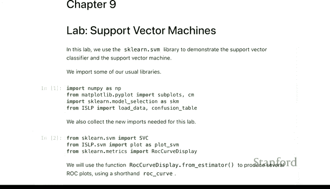

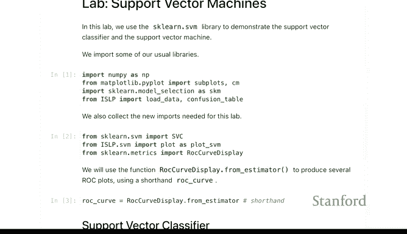

```python
import numpy as np
import matplotlib.pyplot as plt
from sklearn.svm import SVC
from sklearn.metrics import roc_curve, auc
# 假设有一个自定义的 plot_SVM 函数用于可视化
```

---

## 线性支持向量分类器

上一节我们介绍了必要的工具，本节中我们来看看如何应用线性支持向量分类器。我们将首先生成一个线性不可分的数据集，并观察不同成本参数（C）对模型的影响。

### 生成与拟合模型

以下是生成模拟数据并拟合一个线性SVM模型的步骤。

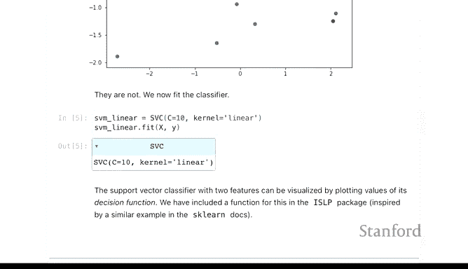

```python
# 生成模拟数据
np.random.seed(1)
X = np.random.randn(20, 2)
y = np.where(X[:, 0] + X[:, 1] > 0, 1, -1)

# 拟合线性支持向量分类器
svm_linear = SVC(kernel='linear', C=10)
svm_linear.fit(X, y)
```

### 可视化结果

我们使用自定义函数来绘制决策边界，并突出显示支持向量（即那些位于间隔内或分类错误的点）。

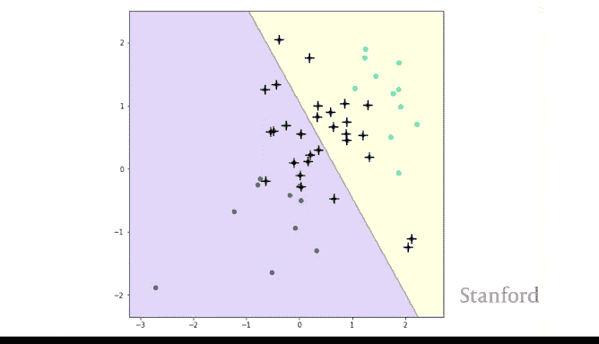

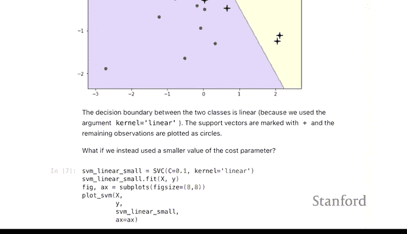

```python
# 使用辅助函数可视化
plot_SVM(X, y, svm_linear)
```

在结果图中，线性决策边界将两类点分开。带有“+”标记的点是支持向量。当成本参数C较小时，模型允许更多的点位于间隔错误的一侧，因此支持向量数量更多，决策边界更“宽松”。反之，较大的C值会减少支持向量的数量，产生更严格的边界。

---

## 调整成本参数C

上一节我们使用了一个固定的C值，本节中我们来看看系统地调整这个参数如何影响模型。成本参数C控制着模型对分类错误的容忍度。

以下是尝试不同C值并观察其影响的代码。

```python
# 尝试不同的成本参数
for C_value in [0.1, 1, 10, 100]:
    svm_temp = SVC(kernel='linear', C=C_value)
    svm_temp.fit(X, y)
    plot_SVM(X, y, svm_temp)
    plt.title(f'SVM with C={C_value}')
```

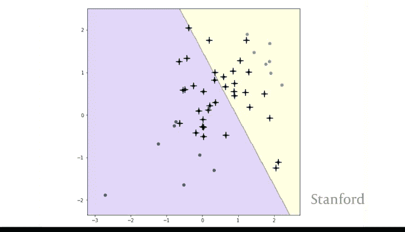

较小的C值（如0.1）意味着模型对分类错误的惩罚较小，因此会使用更多的训练数据点（支持向量）来确定决策边界的方向，这通常会使模型更稳健。较大的C值（如10或100）则对错误零容忍，可能只由少数几个边界点决定决策边界，导致模型对训练数据的变化非常敏感。

---

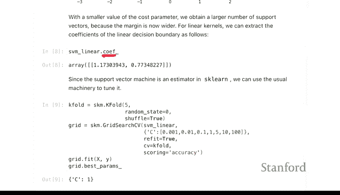

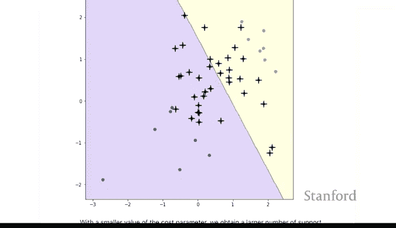

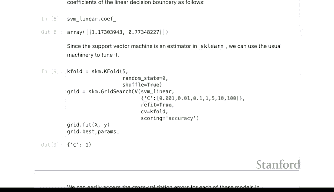

## 自动调参：使用网格搜索

手动尝试不同参数效率低下。我们可以使用scikit-learn的`GridSearchCV`来自动寻找最优的C值。

以下是使用5折交叉验证进行网格搜索的示例。

```python
from sklearn.model_selection import GridSearchCV

# 定义参数网格
param_grid = {'C': [0.001, 0.01, 0.1, 1, 10, 100]}
svm = SVC(kernel='linear')
grid_search = GridSearchCV(svm, param_grid, cv=5)
grid_search.fit(X, y)

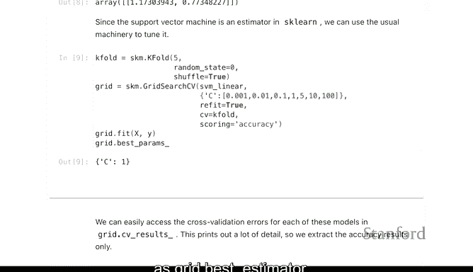

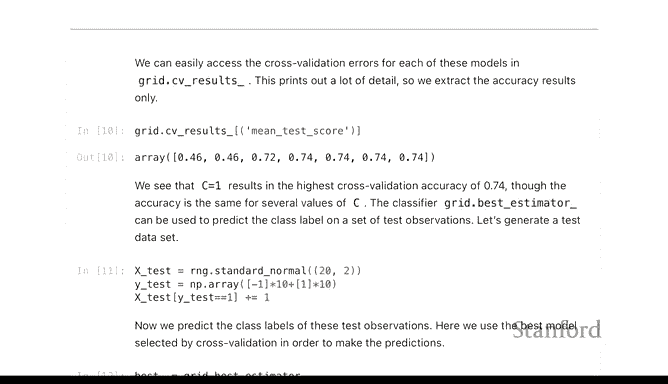

# 输出最佳参数
print(f"Best parameter C: {grid_search.best_params_}")
print(f"Best cross-validation score: {grid_search.best_score_:.2f}")

# 获取最佳模型
best_svm = grid_search.best_estimator_
```

网格搜索会评估每个C值在交叉验证集上的平均性能（默认使用准确率），并选择性能最好的参数。通常，它会倾向于选择正则化程度更高（即C值更小）的模型，如果多个参数性能相近的话。

---

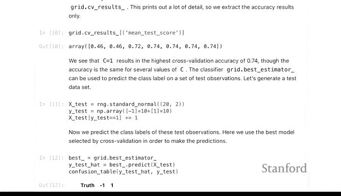

## 评估模型性能

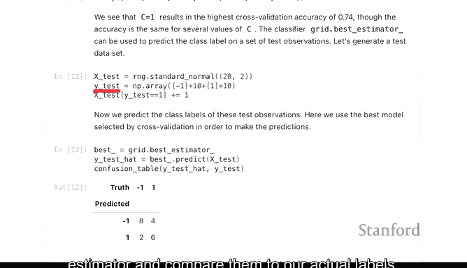

找到最佳参数后，我们需要在独立的测试集上评估模型的泛化能力。

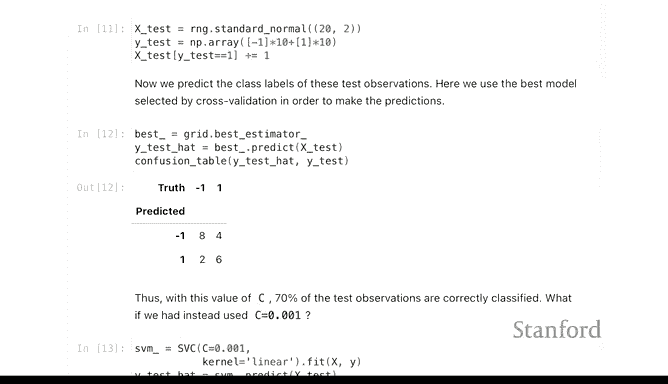

以下是生成新测试数据并计算混淆矩阵的步骤。

```python
from sklearn.metrics import confusion_matrix, accuracy_score

# 生成新的测试数据
X_test, y_test = generate_test_data() # 假设的生成函数

# 使用最佳模型进行预测
y_pred = best_svm.predict(X_test)

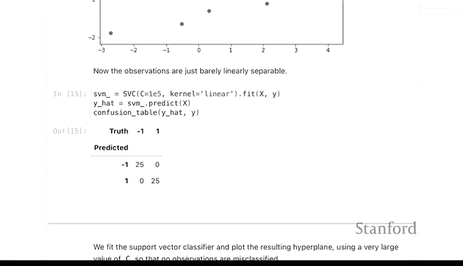

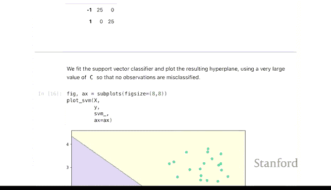

# 计算混淆矩阵和准确率
cm = confusion_matrix(y_test, y_pred)
acc = accuracy_score(y_test, y_pred)
print(f"Confusion Matrix:\n{cm}")
print(f"Test Accuracy: {acc:.2f}")
```

通过比较预测标签和真实标签，我们可以计算出准确率、精确率、召回率等指标，全面了解模型的性能。

---

## 线性可分数据案例

上一节我们处理的是线性不可分数据，本节中我们来看看当数据线性可分时，SVM的表现。我们通过调整数据生成过程，使两个类别的均值相距更远。

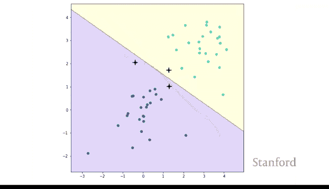

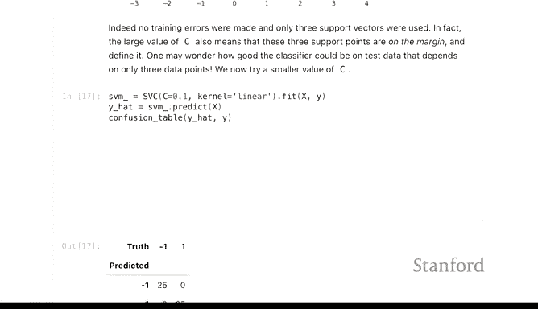

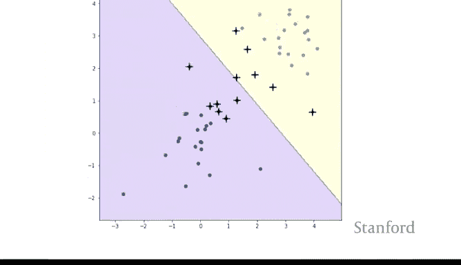

```python
# 生成线性可分数据
X_sep, y_sep = generate_linearly_separable_data() # 假设的生成函数

svm_highC = SVC(kernel='linear', C=1e5) # 使用很高的C值
svm_highC.fit(X_sep, y_sep)
plot_SVM(X_sep, y_sep, svm_highC)
```

在线性可分的情况下，使用高C值的SVM会寻找那个能够完美分开所有训练样本且间隔最大的超平面。此时，支持向量通常很少，只由各类别中离边界最近的点决定。虽然这在训练集上能达到100%准确率，但由于决策边界仅由极少数点决定，其统计稳定性可能较差，对数据的小扰动非常敏感。

---

## 非线性支持向量机：径向基函数核

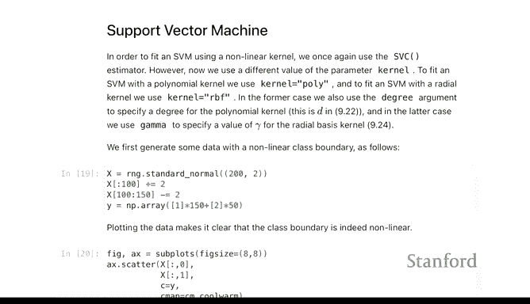

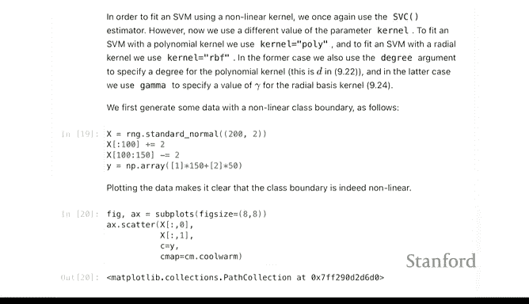

现实中的数据往往不是线性可分的。支持向量机通过使用“核技巧”可以轻松处理非线性决策边界。最常用的核之一是径向基函数（RBF）核，也称为高斯核。

### 生成复杂数据

我们创建一个更复杂的数据集，其中一个类别的点被包围在另一个类别之中，线性边界无法有效分类。

```python
# 生成环形或复杂分布数据
X_nonlin, y_nonlin = generate_nonlinear_data()
plt.scatter(X_nonlin[:, 0], X_nonlin[:, 1], c=y_nonlin)
plt.title("Non-linear Dataset")
```

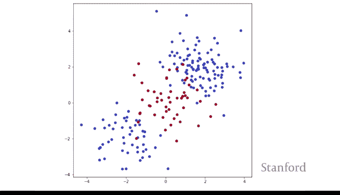

### 拟合RBF核SVM

使用RBF核时，我们需要设置两个主要参数：成本参数`C`和核系数`gamma`。`gamma`控制着单个数据点影响的“范围”，`gamma`值越大，影响范围越窄，决策边界越曲折。

```python
from sklearn.model_selection import train_test_split

# 划分训练集和测试集
X_train, X_test, y_train, y_test = train_test_split(X_nonlin, y_nonlin, test_size=0.3, random_state=42)

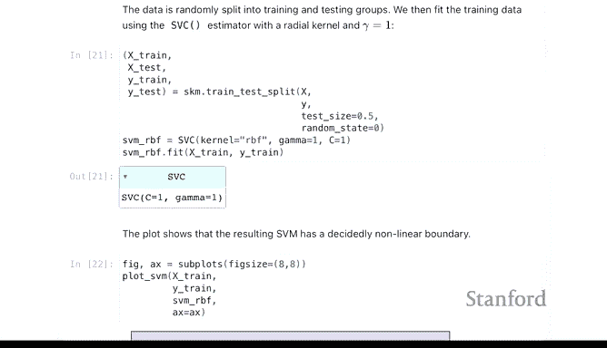

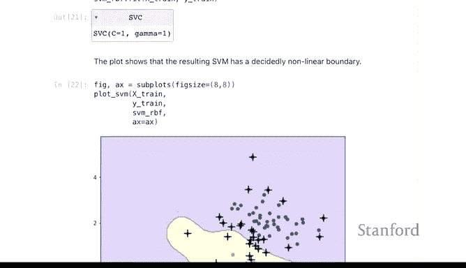

# 拟合RBF核SVM
svm_rbf = SVC(kernel='rbf', C=1, gamma=1)
svm_rbf.fit(X_train, y_train)
plot_SVM(X_train, y_train, svm_rbf)
```

RBF核通过将数据映射到高维空间，在那里数据可能是线性可分的。决策边界是这些高维空间中“基函数”的线性组合在原始空间中的投影，因此可以形成复杂的非线性形状。

---

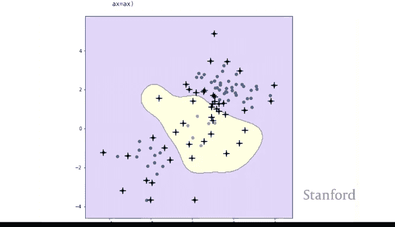

## 调整RBF-SVM的参数

与线性SVM类似，`C`和`gamma`对RBF核SVM的性能有巨大影响。我们可以通过网格搜索同时优化这两个参数。

以下是进行网格搜索的代码示例。

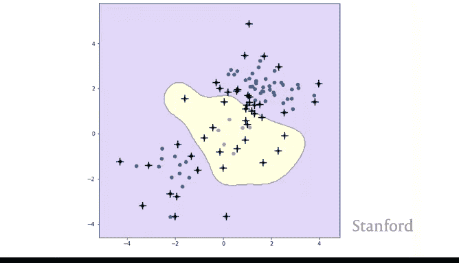

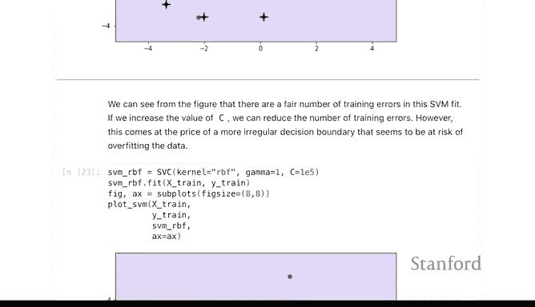

```python
# 定义参数网格
param_grid_rbf = {
    'C': [0.1, 1, 10, 100],
    'gamma': [0.01, 0.1, 1, 10]
}

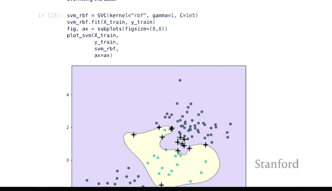

svm_rbf_for_grid = SVC(kernel='rbf')
grid_search_rbf = GridSearchCV(svm_rbf_for_grid, param_grid_rbf, cv=5)
grid_search_rbf.fit(X_train, y_train)

print(f"Best parameters: {grid_search_rbf.best_params_}")
best_svm_rbf = grid_search_rbf.best_estimator_
```

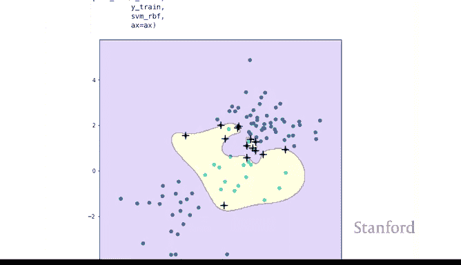

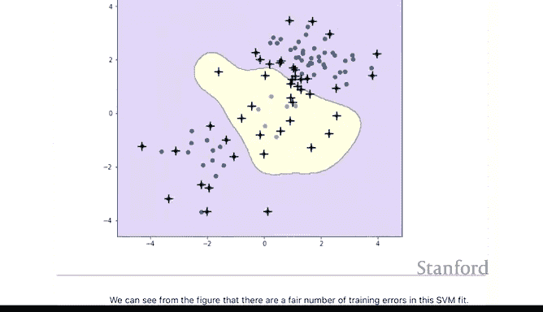

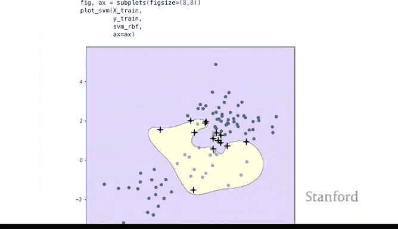

搜索完成后，我们可以在测试集上评估最佳模型，并可视化其决策边界。一个经过良好调参的RBF-SVM应该能产生一个既不过于平滑（欠拟合）也不过于曲折（过拟合）的边界。

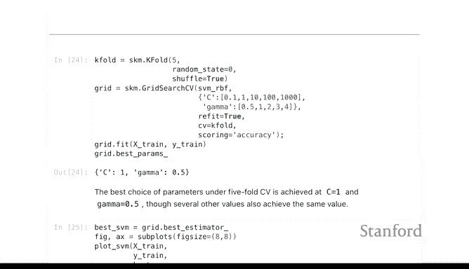

```python
# 在测试集上评估
y_pred_rbf = best_svm_rbf.predict(X_test)
acc_rbf = accuracy_score(y_test, y_pred_rbf)
print(f"RBF-SVM Test Accuracy: {acc_rbf:.2f}")

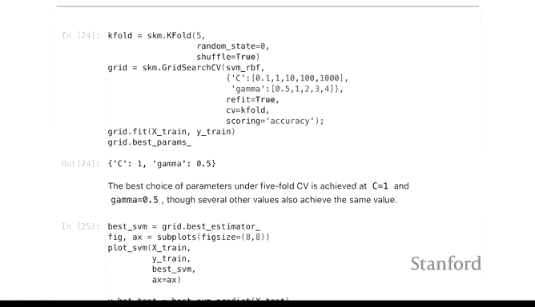

# 可视化最佳模型的决策边界
plot_SVM(X_train, y_train, best_svm_rbf)
```

---

## 总结

本节课中我们一起学习了支持向量机（SVM）的核心概念与实践应用。

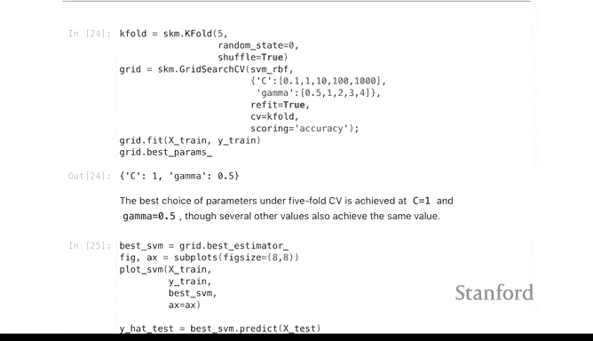

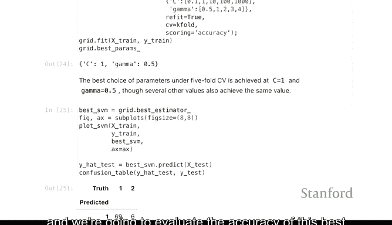

我们首先从**线性支持向量分类器**开始，理解了成本参数 **`C`** 如何控制模型的复杂度与正则化强度。较小的C值产生更宽松的边界和更多的支持向量，模型更稳健；较大的C值追求训练集上的完美分类，可能降低泛化能力。

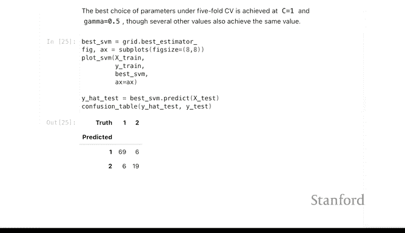

接着，我们学习了使用 **`GridSearchCV`** 自动寻找最优超参数的方法，这是构建高效机器学习模型的关键步骤。

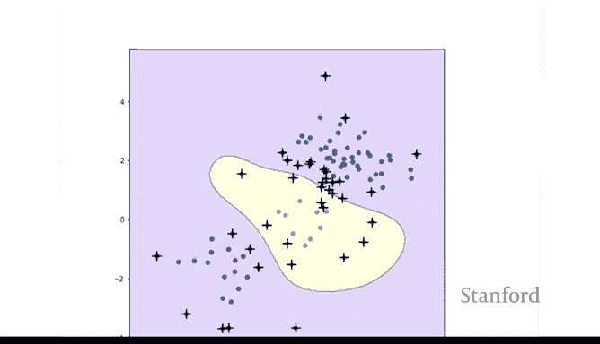

最后，我们探索了SVM处理非线性问题的强大能力——**核技巧**。通过将 **`kernel`** 参数从 `‘linear’` 改为 `‘rbf’`（径向基函数核），并配合调整 **`gamma`** 参数，SVM能够学习极其复杂的决策边界，从而解决线性模型无法处理的数据模式。

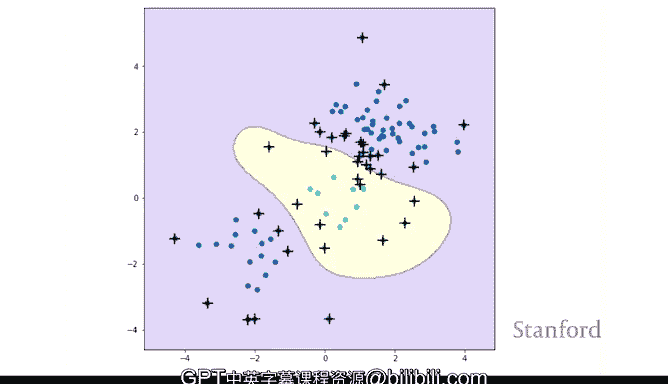


通过本实验，你应该掌握了使用scikit-learn实现和调优支持向量机分类器的完整流程，为将其应用于实际的分类任务打下了坚实基础。