# Python 版 71：ROC曲线 I 📊 

在本节课中，我们将学习ROC曲线（接收者操作特征曲线）。这是一种总结分类器在不同阈值下性能表现的方法。我们将了解其原理，并使用Python的scikit-learn库来绘制和解读ROC曲线。

---

## 概述

ROC曲线是一种用于评估二元分类器性能的工具。它通过绘制不同分类阈值下的**真阳性率**与**假阳性率**，直观地展示了分类器的判别能力。一个完美的分类器对应的ROC曲线会紧贴左上角。

上一节我们介绍了支持向量分类器，本节中我们来看看如何用ROC曲线来评估其性能。

---

## ROC曲线的原理

对于能够输出样本属于某一类概率的分类器，我们可以通过改变判定阈值来得到不同的预测结果。每个阈值都对应一组分类结果，进而计算出不同的准确率、真阳性率和假阳性率等指标。

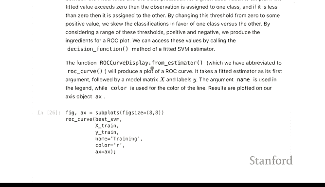

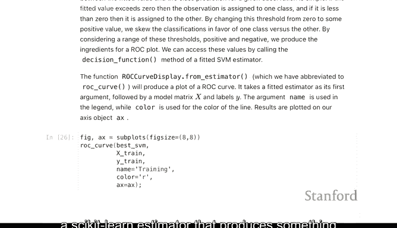

ROC曲线的作用，就是将这些性能指标汇总为一条曲线，展示分类器性能随阈值变化的整体情况。

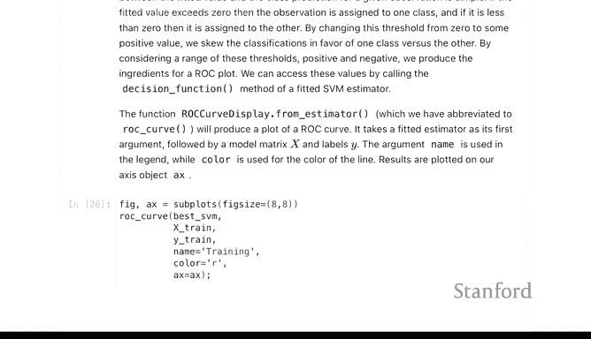

**核心概念公式**：
*   **真阳性率** = 真阳性 / (真阳性 + 假阴性)
*   **假阳性率** = 假阳性 / (假阳性 + 真阴性)

---

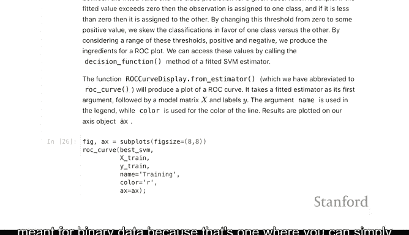

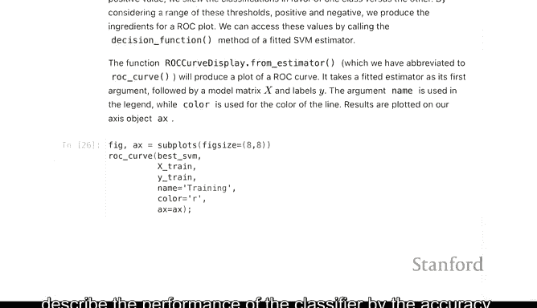

## 使用Scikit-learn绘制ROC曲线

我们将使用`sklearn.metrics`模块中的`RocCurveDisplay.from_estimator`函数。这个函数需要一个能够输出概率（或类似决策分数）的scikit-learn评估器，以便我们通过改变阈值来绘制出完整的性能曲线。

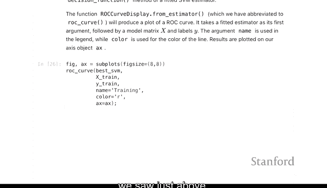

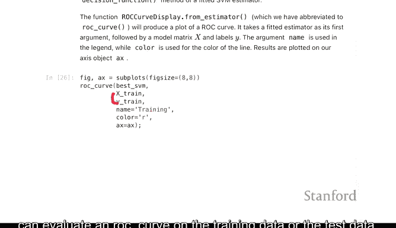

以下是绘制ROC曲线的基本步骤：

1.  **导入必要的库和函数**。
2.  **训练一个分类器**（例如支持向量机）。
3.  **使用`RocCurveDisplay.from_estimator`函数**，传入训练好的分类器、特征数据`X`和真实标签`y`。
4.  **显示图形**。

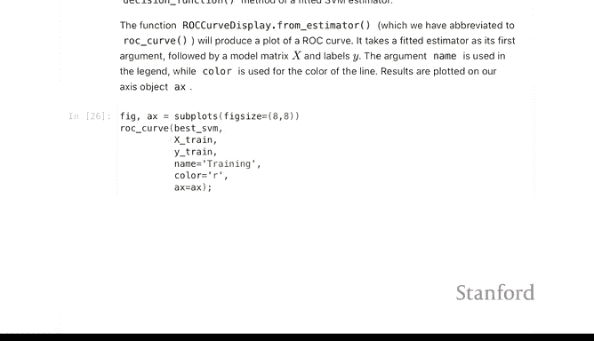

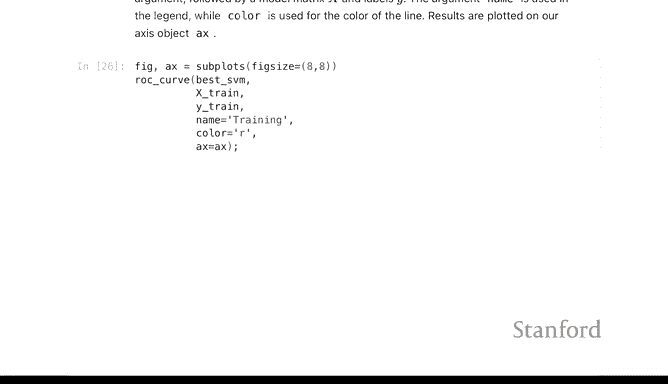

---

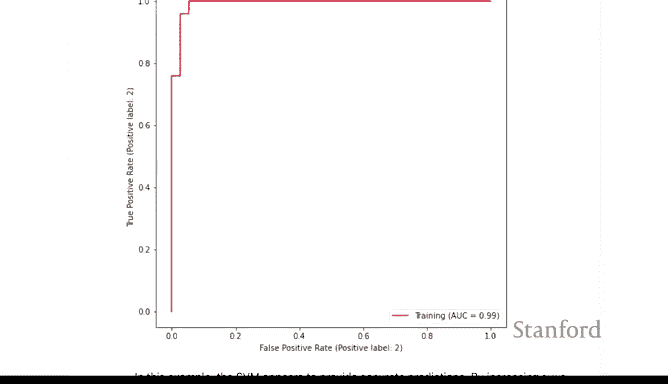

## 在训练数据上绘制ROC曲线

首先，我们在训练数据上评估之前调优过的支持向量机模型，并绘制其ROC曲线。

```python
from sklearn.metrics import RocCurveDisplay

# 假设 `tuned_svm` 是已经训练好的支持向量机模型
# X_train, y_train 是训练集的特征和标签
roc_display = RocCurveDisplay.from_estimator(tuned_svm, X_train, y_train)
roc_display.plot()
```

生成的图形包含两个坐标轴：纵轴是**真阳性率**，横轴是**假阳性率**。一个优秀的分类器，其ROC曲线会偏向图表的左上角，这意味着它具有高真阳性率和低假阳性率。

由于这是在训练数据上评估的，模型通常会表现得非常好。

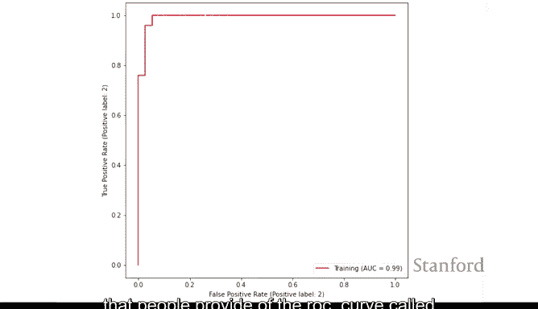

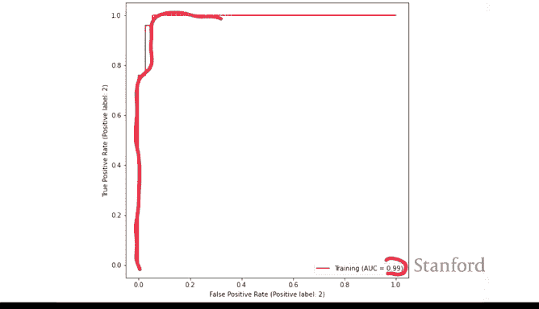

---

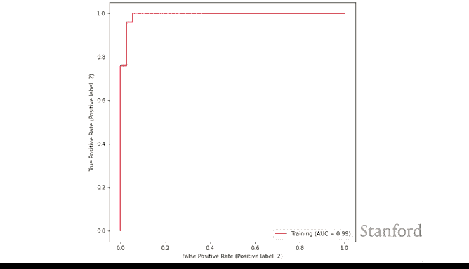

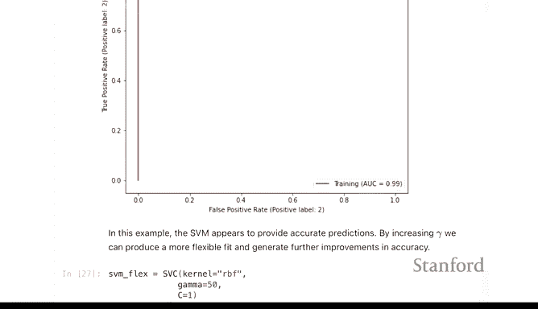

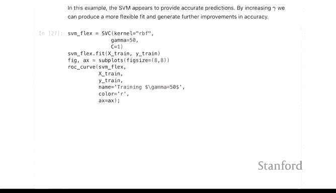

## 解读曲线下面积

人们常用**曲线下面积**来量化ROC曲线的性能。AUC值越接近1，说明分类器性能越好。

*   **完美分类器**的AUC为 **1.0**。
*   **随机猜测**的AUC约为 **0.5**。
*   我们训练数据上的AUC可能达到 **0.99**，这表示模型在训练集上接近完美。

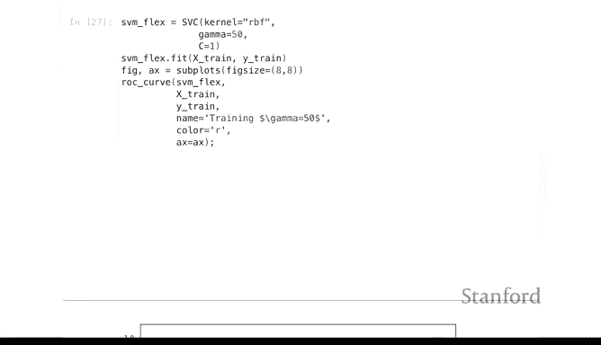

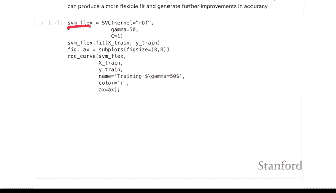

---

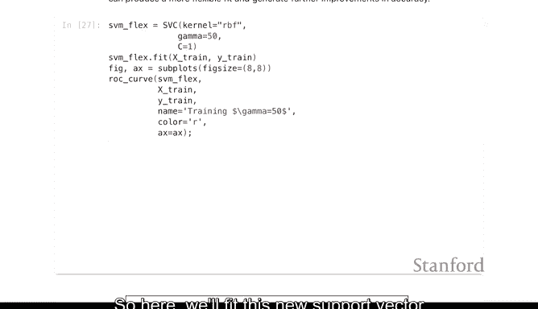

## 比较训练集与测试集的ROC曲线

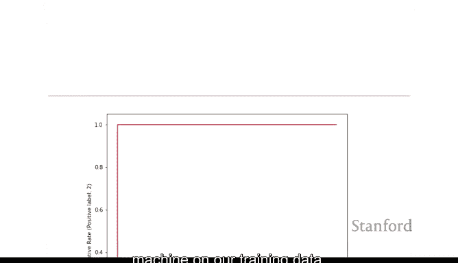

为了更全面地评估模型，我们需要在独立的测试数据上查看其表现。我们预期模型在测试集上的性能会略低于训练集。

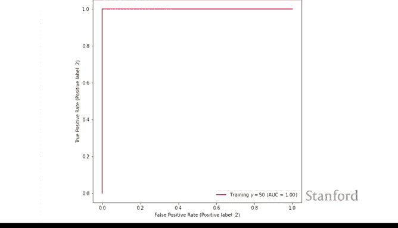

以下是具体操作，我们将训练集和测试集的ROC曲线绘制在同一张图上进行对比：

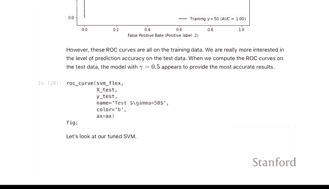

```python
import matplotlib.pyplot as plt

# 创建一个图形和坐标轴
fig, ax = plt.subplots()

# 在训练数据上绘制ROC曲线（红色）
RocCurveDisplay.from_estimator(tuned_svm, X_train, y_train, ax=ax, name='Training Data')

# 在测试数据上绘制ROC曲线（蓝色），添加到同一个坐标轴
RocCurveDisplay.from_estimator(tuned_svm, X_test, y_test, ax=ax, name='Test Data')

# 显示图形
plt.show()
```

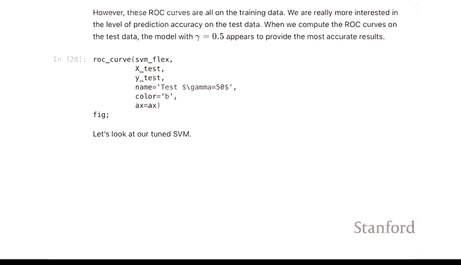

在生成的图中：
*   **红色曲线**代表模型在训练数据上的表现。
*   **蓝色曲线**代表模型在测试数据上的表现。

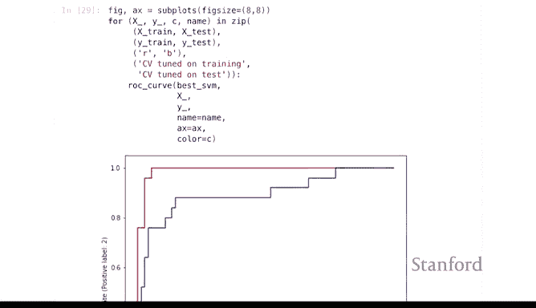

正如我们所料，蓝色曲线（测试集）通常会略低于红色曲线（训练集），这表明模型存在一定的泛化误差。例如，测试集的AUC可能约为0.90，虽然比训练集的0.99低，但仍然是一个不错的结果。

---

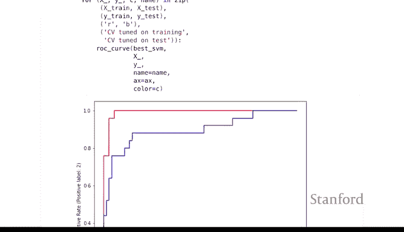

## 总结

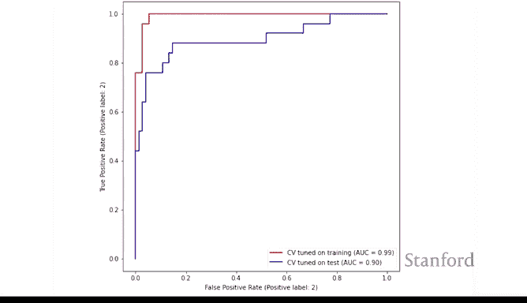

本节课中我们一起学习了ROC曲线。我们了解到ROC曲线是评估二元分类器性能的强大可视化工具，它通过展示不同阈值下的真阳性率和假阳性率，帮助我们理解模型的判别能力。我们还学习了如何使用`RocCurveDisplay.from_estimator`函数绘制ROC曲线，并通过比较训练集和测试集上的曲线来评估模型的泛化性能。最后，我们介绍了曲线下面积作为ROC曲线的量化总结指标。

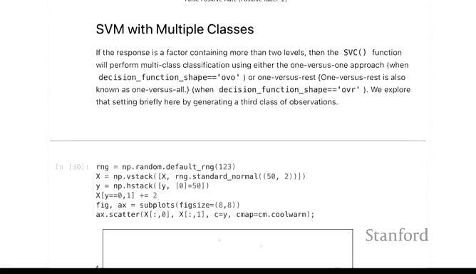

---

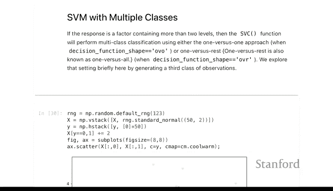


**后续学习建议**：本实验课中还有一个关于**多类别支持向量机**的主题，建议大家在课后自行探索和实践。