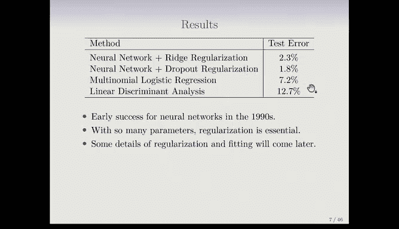

# Python 版 72：神经网络入门 🧠

在本节课中，我们将学习神经网络的基本概念。神经网络是深度学习的基础，它是一种强大的模型，能够学习数据中的复杂模式。我们将从最简单的单层神经网络开始，逐步理解其工作原理。

---

## 概述

神经网络，尤其是深度学习模型，近年来变得非常流行和成功。这种成功得益于计算能力的巨大提升、更大的训练数据集以及先进的软件平台。在本节中，我们将介绍神经网络的基本结构，包括输入层、隐藏层和输出层，并解释激活函数的作用。

## 神经网络的基本结构

上一节我们概述了神经网络的重要性，本节中我们来看看它的具体结构。神经网络通常用网络图来表示。

在上图中，橙色部分代表**输入层**。在这个例子中，我们有四个输入变量。接着是**隐藏层**，这里有五个单元。最后是**输出层**。隐藏层可以看作是输入变量的变换。

字母 **A** 代表**激活值**，我们稍后会详细解释其含义。输入 **X** 和输出 **Y** 是观测到的数据，而激活值 **A** 是在模型训练过程中计算出来的。

图中的小箭头表示，每个隐藏单元接收的是输入 **X** 的线性组合。每个激活值 **A_K** 是输入线性组合的非线性变换，其公式可以表示为：
`A_K = h_K(Z_K)`，其中 `Z_K` 是输入的线性组合。

每个隐藏单元的线性组合参数都不同，这些变换是在训练网络时动态学习得到的。

## 激活函数

我们了解了隐藏层的作用，现在来看看赋予神经网络非线性的关键——激活函数。激活函数 `h(z)` 对线性组合 `Z` 进行非线性变换。

以下是两种流行的激活函数：
*   **Sigmoid函数**：早期神经网络中常用。它是一个平滑的S形函数，将输入映射到(0,1)区间。其公式类似于逻辑回归中使用的函数。
*   **修正线性单元（ReLU）**：目前更流行。当输入 `z` 小于等于0时，输出为0；当 `z` 大于0时，输出为 `z`。其公式为：`h(z) = max(0, z)`。

为什么需要非线性？如果激活函数是线性的，那么整个网络就会退化为一个单一的线性模型，因为线性变换的叠加仍然是线性变换。非线性激活函数使得神经网络能够学习和表示更复杂的关系。

## 一个实际案例：MNIST手写数字识别

理解了基本概念后，我们来看一个经典的神经网络应用实例。MNIST手写数字数据集是神经网络的“试金石”，可以说神经网络的成功始于手写数字分类。

这些数据是扫描的手写数字图像，已被标准化为28x28的灰度图像。这意味着每张图像有784个像素，每个像素的灰度值在0到255之间，代表该点的墨水量。每个图像都带有对应的数字标签（0到9），因此这是一个10分类问题。

在本例中，我们将构建一个**两层前馈神经网络**。其结构如下：
*   第一隐藏层：256个单元
*   第二隐藏层：128个单元
*   输出层：10个单元（对应10个数字）

这个模型总共有 **235,146** 个参数（权重）。这里出现了一个有趣的现象：训练观测值有60,000个，而参数却有235,000个，这听起来容易导致过拟合。我们稍后会讨论如何避免这个问题。

这个网络被称为“深度”网络，因为它有两个隐藏层。在20世纪80年代，神经网络通常只有一个隐藏层。当时有数学定理证明，只要一个隐藏层足够宽，就能近似任何平滑函数。这导致许多人认为只需要单层网络，某种程度上延缓了深度学习的发展。如今我们看到，具有数十甚至上百层的网络性能要好得多。

## 输出层与模型训练

我们构建了网络，最后需要得到预测结果。输出层接收来自第二隐藏层的激活值 `Z_m`。对于这个10分类问题，输出层使用 **Softmax** 激活函数。这与多类逻辑回归中使用的函数相同。

Softmax函数将这10个实数转换为一组概率值，每个值在0到1之间，且所有概率之和为1。公式如下：
`A_m = e^{Z_m} / Σ_{k=0}^{9} e^{Z_k}`

模型通过最小化**负多项对数似然**（在这个领域常被称为**交叉熵损失**）来训练。损失函数公式为：
`L = - Σ_{i=1}^{N} Σ_{m=0}^{9} y_{im} log(A_{im})`
其中，`y_{im}` 是“独热编码”的标签（在统计学中称为虚拟变量），对于观测 `i`，如果其真实类别是 `m`，则 `y_{im}=1`，否则为0。

## 性能与正则化

那么，神经网络的性能如何呢？在MNIST数据集上：
*   带正则化的神经网络错误率可降至 **1.8%-2.3%**。
*   作为对比，多项逻辑回归的错误率为 **7.2%**。
*   线性判别分析的错误率为 **12.7%**。

神经网络的表现显著优于这些更传统、更简单的方法。当然，MNIST是一个被广泛研究的数据集，目前已有错误率低于0.5%的模型报告。人类的错误率大约在0.2%左右。

为了获得如此好的性能并防止过拟合（尤其是在参数远多于观测值的情况下），**正则化**至关重要。除了我们已知的L1和L2正则化，神经网络还常用一种称为 **Dropout** 的正则化技术，我们将在后续课程中详细介绍。

---

## 总结

本节课中，我们一起学习了神经网络的基础知识。我们从简单的单层网络结构讲起，介绍了输入层、隐藏层和输出层，并解释了激活函数（如Sigmoid和ReLU）的核心作用。通过MNIST手写数字识别的案例，我们看到了一个具有两个隐藏层的深度网络如何工作，包括其巨大的参数量以及如何通过Softmax输出层和交叉熵损失进行多分类。最后，我们了解到正则化对于训练高性能神经网络、防止过拟合是不可或缺的。