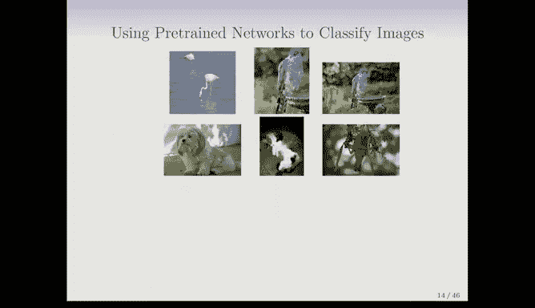

# Python 版 73：卷积神经网络 (CNNs) 🧠

在本节课中，我们将要学习卷积神经网络（CNNs）。这是一种现今广泛用于分类自然图像或其他类型图像的强大工具。我们将了解其核心工作原理，包括卷积层和池化层，并探讨一个预训练网络的实际应用案例。

---

## 卷积神经网络简介

上一节我们讨论了神经网络的基础。本节中，我们来看看专门为图像处理设计的卷积神经网络。

卷积神经网络在2010年左右重新兴起，其巨大的成功源于对图像分类取得的惊人成果。这得益于更大的训练数据集和更强的计算能力。

一个著名的图像数据集是CIFAR-100，它包含100个不同的图像类别，例如鱼、动物、蝴蝶、汽车等。每个图像都是一个32x32像素的彩色图像，这意味着它是一个三维数组或特征图，包含红、绿、蓝三个颜色通道。

---

## CNN的工作原理：层次化特征构建

以下是CNN如何以层次化的方式构建图像理解的直观示意图。

CNN首先尝试识别图像中的微小形状、颜色斑点或边缘等局部特征。在上图的卡通示例中，它识别出了耳朵、部分嘴巴和舌头。

随着网络层数的加深，这些微小的局部特征被用作构建块，组合成图像中更复杂的复合形状，最终组装成目标图像的整体概念。

这种层次化构建是通过**卷积层**和**池化层**实现的，这也是“卷积神经网络”名称的由来。

---

## 卷积层

现在，我们来看看卷积层具体是如何工作的。

卷积操作使用一个称为**滤波器**（或**卷积核**）的小矩阵在输入图像上滑动。以下是其工作原理的步骤说明：

1.  **初始化**：假设输入图像用一个像素值矩阵表示，卷积滤波器是一个小的权重矩阵（例如2x2）。
2.  **滑动与计算**：将滤波器放置在输入图像的左上角。
3.  **点积运算**：将滤波器覆盖区域的像素值与滤波器的权重逐元素相乘，然后将所有乘积结果相加，得到一个输出值。
    *   计算公式可以表示为：`输出值 = Σ (图像块像素值 * 滤波器权重)`
4.  **滑动窗口**：将滤波器向右滑动一个像素（或指定的步长），重复步骤3的计算。
5.  **遍历图像**：完成一行后，向下移动一行，继续此过程，直到遍历整个图像。

这个操作的结果是生成一个新的二维数组，称为**特征图**。如果图像子区域与滤波器相似，则点积结果会是一个较大的数值，从而在该位置“激活”或突出显示该特征。

对于彩色图像（三个通道），滤波器也相应地具有三个通道。分别对每个通道进行卷积计算，然后将三个通道的结果相加，最终生成一个单通道的特征图。

**关键点**：这些滤波器的权重不是手动设定的，而是在网络训练过程中自动学习得到的。一个卷积层通常包含多个滤波器，每个滤波器都会生成一个独立的特征图，用于检测图像中不同类型的特征（如垂直边缘、水平边缘）。

---

## 池化层

在卷积层之后，通常会应用池化层（特别是**最大池化**）。以下是最大池化的工作方式：

1.  **划分区域**：将卷积层输出的特征图划分为不重叠的小区域（例如2x2的方块）。
2.  **取最大值**：对于每个小区域，取其中所有数值的最大值。
3.  **输出简化图**：用这个最大值代表该区域，从而生成一个尺寸更小、更精简的特征图。

池化层的作用：
*   **锐化特征**：通过保留最显著的特征响应，使特征检测更加明确。
*   **引入平移不变性**：允许特征在图像中小范围移动时仍能被检测到，因为池化操作选取的是区域内的最大值。
*   **降维**：显著减少数据的空间尺寸（例如，2x2池化将使每个维度尺寸减半），从而降低计算复杂度。

---

## 典型的CNN架构

了解了核心组件后，我们来看一个典型的CNN架构是如何组合这些层的。

一个CNN通常由多个“卷积-池化”层对堆叠而成，最后连接全连接层用于分类。

1.  **输入层**：接收原始图像（例如32x32x3）。
2.  **卷积层1**：应用多个滤波器（例如6个），生成多个特征图（例如6个32x32的特征图）。每个滤波器学习检测不同的低级特征（如边缘、角点）。
3.  **池化层1**：对每个特征图进行最大池化，减小尺寸（例如变为16x16），特征图数量不变（仍为6个）。
4.  **卷积层2**：应用新的滤波器组。此时，每个滤波器必须具有与输入特征图数量相同的通道数（例如6个通道）。这一层会生成更多数量的特征图（例如16个），用于检测更复杂的特征组合。
5.  **池化层2**：再次进行池化，进一步减小尺寸。
6.  **重复堆叠**：可以继续重复“卷积-池化”过程多次。随着网络加深，特征图的尺寸越来越小，但数量（通道数）可能增加，所表示的特征也越来越抽象和全局化。
7.  **展平层**：将最后的特征图“展平”成一个一维向量。
8.  **全连接层**：将展平后的向量输入到一个或多个全连接层（类似于传统神经网络），最终连接到输出层（例如有100个节点的Softmax层，对应100个图像类别）。

这种架构使得网络能够从局部到全局、从简单到复杂地理解图像内容。著名的ResNet等网络可能包含多达50层甚至更多。

---

## 参数与预训练网络

CNN中的可学习参数主要存在于卷积层的滤波器和全连接层的权重中。

*   对于一个3x3的滤波器，如果输入有`C_in`个通道，则该滤波器有 `3 * 3 * C_in` 个权重。
*   如果一个卷积层有`K`个这样的滤波器，则该层的权重参数数量为 `K * 3 * 3 * C_in`。

训练一个强大的CNN需要海量的图像数据（如ImageNet数据集包含数百万张图像）和巨大的计算资源。因此，像Google、Facebook等公司会训练并发布**预训练模型**（如ResNet、VGG），这些模型已经在大型数据集上学到了丰富的通用图像特征。

### 使用预训练网络

预训练网络可以直接用于新图像的分类，无需重新训练。我们只需将新图像输入网络，即可得到其属于各个类别的概率。

**迁移学习**：预训练网络的更强大用途是**迁移学习**。我们可以利用在自然图像上学到的通用特征（尤其是网络的前几层），来解决数据量较小的特定领域问题（如医学影像分析）。具体做法是：
1.  保留预训练模型的大部分层（尤其是底层）。
2.  移除或替换最后的全连接层，以匹配新任务的类别数。
3.  使用较小的新数据集，主要训练新添加的层或微调部分预训练层。

这种方法允许我们利用从海量数据中学到的知识，即使我们自己的训练数据有限。

---

## 实例演示

课程中演示了使用预训练的ResNet网络对一组自然图像进行分类。

网络为每张图像输出属于1000个ImageNet类别的概率分布。以下是部分结果示例：
*   火烈鸟图片被正确分类为“火烈鸟”，置信度达83%。
*   一只库珀鹰的图片，网络主要判断为“鸢”（一种猛禽），其次是“大灰猫头鹰”。
*   当同一只鹰的图片背景（喷泉）更突出时，网络被混淆，主要分类为“喷泉”。
*   一只拉萨阿普索犬的图片被分类为“西藏梗”（外观相似），其次是正确的品种。
*   一只蜷缩的猫完全迷惑了网络，被判断为“古英国牧羊犬”。

这个演示表明，尽管CNN非常强大，但其性能仍受图像内容、背景和训练数据覆盖范围的影响。

---

本节课中我们一起学习了卷积神经网络（CNNs）的核心概念。我们了解了**卷积层**如何通过可学习的滤波器提取局部特征，以及**池化层**如何通过下采样来锐化特征并引入一定的平移不变性。我们看到典型的CNN通过堆叠这些层来构建从低级到高级的层次化特征表示。最后，我们探讨了使用**预训练网络**进行预测和**迁移学习**的强大实用性，这使我们能够利用在大规模数据集上学到的知识来解决资源有限的新问题。