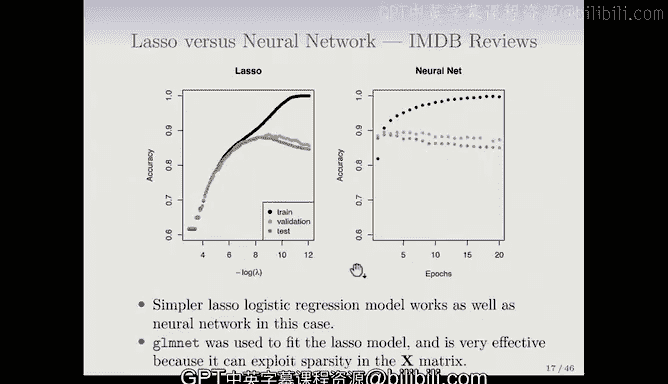

# Python 版 74：文档分类 📚 

## 📖 概述
在本节课中，我们将学习文档分类问题。我们将以IMDB电影评论数据库为例，探讨如何将文本评论自动分类为正面或负面情感。我们将重点介绍“词袋模型”的特征化方法，并比较Lasso逻辑回归模型与两层神经网络在此任务上的表现。

---

## 🎬 文档分类问题
上一节我们讨论了统计学习的一般概念，本节中我们来看看一个具体的应用：文档分类。

我们将使用IMDB电影评论数据库作为例子。IMDB是一个语料库，它包含用户提交的电影评论。每条评论都是一个文档，通常篇幅较短，内容表达了用户对电影的看法，可能是正面的，也可能是负面的。

IMDB语料库包含50,000条评论。这些评论已被标注者根据情感倾向标记为“正面”或“负面”。该语料库中一半的评论被标记为正面，另一半被标记为负面。

这个任务听起来简单，但语言是微妙的。人们可能使用讽刺手法，或者使用一些计算机可能认为是正面、但实际上表达负面情感的词语。这正是挑战所在。

以下是一个评论的例子：
> “这可能是20世纪90年代最糟糕的电影之一……影院里的其他人开始互相交谈、离场，或者对着他们的爆米花哭泣。”

一个关键问题是：如何表示一篇长度不一、内容开放的评论文档？我们的目标是利用这些词语，自动对评论的情感进行分类。

---

## 📝 特征化：词袋模型
上一节我们介绍了文档分类的任务，本节中我们来看看如何将文本转换为可用于建模的特征。

我们使用的方法是“词袋模型”。文档长度不同，由一系列词语组成。我们通过以下步骤创建特征来表征文档：

1.  从一个词典中，我们识别出英语中最常出现的10,000个单词。这里的10,000是一个我们可以决定的参数。
2.  接着，我们创建一个长度为10,000的二进制向量。
3.  对于每个文档，如果对应的单词在文档中出现，我们就在该单词对应的向量位置上标记为1。如果一个单词出现多次，我们在此模型中仍然只标记为1。

因此，如果我们有 `n` 个文档，最终会得到一个 `n` 行 `P` 列的稀疏特征矩阵 `X`。这里 `P` 是10,000。对于每个观测（即每条评论），由于评论通常只包含几百个单词，所以这个10,000维向量中的大部分值都是0。

**公式表示：**
对于一个文档 `d`，其特征向量 `x_d` 可以表示为：
`x_d = [I(w_1 in d), I(w_2 in d), ..., I(w_10000 in d)]`
其中 `I(condition)` 是指示函数，当条件为真时值为1，否则为0。

词袋模型也被称为“一元语法”模型。我们还可以使用“二元语法”（即词语对的出现，如“非常好”）或更一般的“m元语法”。但本节课我们仅使用一元语法模型。

---

## ⚖️ 模型比较：Lasso vs 神经网络
在将文档转化为特征矩阵后，我们就可以应用机器学习模型了。以下是两种模型的比较结果。

我们将Lasso逻辑回归模型与一个两层神经网络（不含卷积层）进行比较。

**Lasso逻辑回归结果：**
我们使用R语言中的`glmnet`程序进行拟合。结果图展示了随着正则化参数λ（图中为 `-log(λ)`）的变化，训练集准确率、验证集准确率和测试集准确率三条曲线的变化。
*   验证集用于决定在Lasso正则化路径上何时停止。
*   测试集准确率（橙色曲线）与验证集准确率几乎重合。
*   模型可以达到接近90%的分类准确率。

**神经网络结果：**
对于神经网络，我们展示了训练误差、验证误差和测试误差随训练“轮数”变化的曲线。
*   训练轮数是指在梯度下降训练过程中，遍历整个训练集的次数。
*   训练轮数本身可以看作一种正则化。
*   随着训练轮数增加，训练误差持续下降（类似于Lasso中的情况），但验证误差在达到一个峰值后开始下降，这表明模型开始过拟合。

**性能对比：**
神经网络的表现似乎略好于Lasso，但差异非常微小。两者性能基本相当。值得注意的是，`glmnet`（Lasso）在此任务上非常高效且快速，远快于神经网络。这是因为Lasso模型能够有效利用特征矩阵 `X` 的稀疏性（即大部分元素为0）。

---

## 🎯 总结
本节课中我们一起学习了文档分类问题。我们以IMDB电影评论情感分析为例，介绍了如何使用“词袋模型”将文本数据转换为数值特征。我们比较了Lasso逻辑回归和两层神经网络在此任务上的表现，发现两者都能达到约90%的准确率，且性能相近。同时，我们也了解到，由于能有效利用特征稀疏性，Lasso模型在训练速度上具有显著优势。