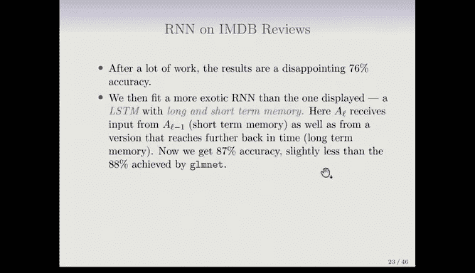

# Python 版 75：循环神经网络 🧠

在本节课中，我们将要学习一种专门用于处理序列数据的神经网络模型——循环神经网络。我们将了解其基本概念、工作原理，并通过一个情感分析的例子来理解其应用。

---

## 什么是循环神经网络？

上一节我们介绍了用于图像建模的卷积神经网络。本节中，我们来看看用于建模序列数据的循环神经网络。

循环神经网络用于处理按顺序出现的数据，即序列数据。以下是一些序列数据的例子：
*   **文档**：是单词的序列，单词的相对位置具有意义。
*   **时间序列**：例如天气数据或金融指数。
*   **语音或音乐**：是音符或音素的序列。
*   **手写文字**：例如医生的笔记，也是一个序列。

循环神经网络的缩写是RNN。它们建立的模型能够考虑数据的顺序特性，并在此过程中构建对过去信息的“记忆”。

---

## RNN的基本结构与符号

为了理解RNN，我们首先需要明确其符号表示。每个观测样本的特征是一个向量序列，序列长度为 `L`。因此，我们有 `x1, x2, ..., xL`，其中每个 `x` 都是一个数值向量。这就像一个输入特征向量，但现在我们有一个它们的序列。

目标变量 `Y` 通常是常规类型，例如代表整个文档情感的一个单一变量，或者用于多分类任务的独热编码向量。但 `Y` 也可以是一个序列，例如在进行语言翻译时，目标是与原文对应的另一种语言的文档序列。我们首先处理简单情况，以情感分析为例。

---

## 简单的RNN架构图

以下是简单的循环神经网络架构图。我们首先以这种简化的循环形式展示它，强调其循环特性。然后我们将其展开为一个序列来表示。

如图所示，你有一个输入序列 `x1, x2, x3, ..., xL`。我们将每个观测样本视为相同长度的序列。如果长度不同，我们会通过填充等方式强制使其长度相同，当然也有不需要等长的RNN变体。

与输入序列并行的是一个隐藏层序列。这些是激活单元，就像我们之前见过的，但它们与输入序列同步推进，因此有 `a1, a2, ..., aL`。在这个图中，每个 `a` 也是一个向量。`x1` 是序列第一个位置的输入向量，`a1` 则是序列第一步的激活单元向量（可能维度不同）。

现在来看权重。以进入 `a2` 的权重为例：`a2` 接收来自 `x2`（输入序列的对应元素）的输入，同时也接收来自前一个隐藏向量 `a1` 的输入。类似地，`a3` 接收来自 `x3` 和 `a2` 的输入。

由此可见，这些 `a` 向量在某种程度上累积了序列中已发生事件的“记忆”。记忆部分通过这些 `a` 向前传递。你通过获取前一步的记忆，并加入序列中下一个输入向量的信息来更新记忆，从而得到 `a3`。

另一个需要注意的点是，在序列推进的每一步中，使用的是相同的权重，这正是“循环”一词的由来。具体来说：
*   从输入向量到隐藏单元，使用同一组权重 `W`。
*   从前一个激活向量到当前激活向量，使用同一组权重 `U`。

图中还显示了输出单元 `o`。同样，从隐藏单元到输出单元也使用相同的权重 `B`。这意味着我们可以在序列的每一步都测量一个输出，但我们通常只对累积知识的最终输出感兴趣，即这里的 `y`。当然，也存在对所有输出都感兴趣的应用场景。

需要学习的参数是 `B`、`U` 和 `W`。

---

## RNN的计算细节

假设序列中每个元素（每个输入向量）有 `P` 个分量。再假设隐藏单元序列中的每个单元有 `K` 个分量。

那么，序列中第 `L` 步隐藏单元 `a_L` 的第 `k` 个分量的计算由以下公式给出：

`a_L^k = g( b_k + Σ_{j=1}^{P} W_{kj} x_L^j + Σ_{m=1}^{K} U_{km} a_{L-1}^m )`

其中：
*   `b_k` 是偏置项（截距）。
*   `Σ_{j=1}^{P} W_{kj} x_L^j` 是对该点 `L` 的输入向量 `P` 个值的线性组合。
*   `Σ_{m=1}^{K} U_{km} a_{L-1}^m` 是对前一步激活单元的线性组合。
*   `g(·)` 是一个非线性激活函数，例如ReLU。

输出层 `o_L` 通常是一个线性模型。如果是分类任务，则会使用softmax或logistic变换。如前所述，我们通常只关心序列末尾的预测 `o_L`，例如文档的情感。

---

## 损失函数与参数学习

如果我们只对最后一层的响应感兴趣，那么我们要最小化的损失函数如下（以均方误差损失为例）：

`L = Σ_{i=1}^{N} ( y_i - o_{iL} )^2`

将其展开，你会看到我们需要学习所有权重，即构成权重矩阵 `B`、`U` 和 `W` 的参数。这些权重在整个序列中是相同的。

这个损失只涉及序列中第 `L-1` 步的激活 `a_{L-1}`。那么其他步骤的 `a` 呢？关键在于这些 `a` 是递归定义的。`a_{L-1}` 依赖于 `a_{L-2}`，依此类推。因此，在估计参数时，必须考虑序列中的所有步骤，这通常通过时间反向传播算法实现。

---

## 在IMDB评论数据上应用RNN

我们将对IMDB影评数据应用RNN，这与之前使用的词袋模型不同。现在，文档特征是一个单词序列 `w1, w2, ..., wL`。我们通常将文档填充到相同的单词数。这里，我们将使用每个文档的前500个单词。如果文档超过500词，则截断；如果不足，则用空白填充至500。

我们需要一种方法将每个单词表示为一个向量。一种方法是使用长度为10000的独热编码二进制向量（哑变量）。这看起来可能很夸张，它是一个长度为10000的向量，除了对应词典中该单词位置的一个元素为1外，其余全为0。文档的500个步骤中，每一步都有这样一个稀疏特征向量。

实际上，我们倾向于使用维度低得多、经过预训练的**词嵌入**矩阵。这可以将长度为10000的二进制特征向量降维为一个实数特征向量，其维度 `M` 远小于10000，通常在几百左右。

上图展示了这种思想。底部是一个单词序列。顶部的图像代表独热编码（灰色为0，黑色为1）。中间的图像代表词嵌入，它是一个更小的实数矩阵，用颜色（从冷色蓝到热色红）表示数值大小。

这些词嵌入是在非常大的文档语料库上预训练的，使用了类似于主成分分析的方法。它们非常巧妙，考虑了同义词等因素。例如，“男性”和“女性”，或“国王”和“王后”在这些表示中的相对位置关系是相似的。两个著名的词嵌入模型是Word2Vec和GloVe，你可以从网上下载，选择所需的维度，然后直接插入你的网络。

我们在评论数据上使用了带词嵌入的RNN。经过大量工作后，结果令人失望，准确率仅为76%。而之前（使用其他方法）我们获得了接近89%的准确率。

---

## 更高级的RNN：LSTM

于是，我们拟合了一个比之前展示的更复杂的循环神经网络，即**LSTM**（长短期记忆网络）。不过多深入细节，LSTM单元不仅接收来自前一个隐藏单元 `a_{L-1}`（短期记忆）的输入，还接收来自更早时间步的某个版本（长期记忆）的输入。这样，它就能同时捕捉短期和长期的依赖关系。

使用LSTM后，训练时间要长得多，但准确率达到了87%，略低于CNN获得的88%。就像在MNIST、ResNet等数据集中一样，IMDB评论数据也被用作新RNN架构的基准测试集。在本书（第二版）撰写时，报告的最佳结果约为95%，这当然使用了更复杂的网络。

---

## 总结与提醒

本节课中，我们一起学习了循环神经网络。我们了解了RNN如何通过其循环结构处理序列数据并构建记忆，探讨了其基本架构、计算方式和在文本数据上的应用（包括词嵌入的概念），并简要介绍了更强大的LSTM变体。

最后需要提醒的是，我们经常看到这样的情况：深度网络有一些惊人的成功案例，但在许多问题上，它们并不比简单方法做得更好，甚至更差。然而，由于简单的结果更难发表，我们听到的这类情况并不多。因此，不要只尝试深度网络和花哨的方法，也要尝试更简单的方法，因为它们通常同样有效，而且更容易理解。

---