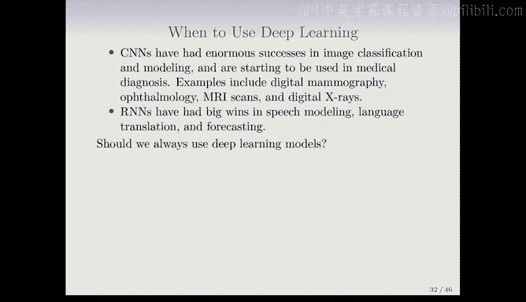
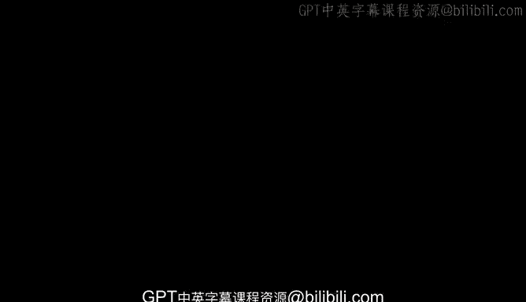

# Python 版 76：时间序列预测 📈 

在本节课中，我们将学习如何使用循环神经网络进行时间序列预测。我们将通过一个具体的金融数据案例，理解如何构建和评估预测模型，并对比RNN与传统自回归模型的表现。

---

## 问题定义与数据介绍

上一节我们介绍了循环神经网络的基本结构。本节中，我们来看看如何将其应用于一个不同的问题——时间序列预测。

这里展示的是三个金融时间序列，数据覆盖了1960年至1990年。这些是日度数据，指每周五个交易日的数据。

*   顶部图表显示的是**交易量的对数**。
*   中间图表显示的是**道琼斯指数收益率**。
*   底部图表显示的是当日的**波动率度量**。

红色垂直线表示我们将使用数据的前一部分来训练模型，并在灰色部分的数据上进行测试。处理时间序列数据时，这种划分方式很重要，因为数据存在自相关性，不能随机选择训练日和测试日。数据总共有6051个交易日，从1962年到1986年。

以下是每个变量的具体定义：
*   **交易量的对数**：这是一个构造变量，表示当日交易量占流通股比例相对于过去100天移动平均换手率的对数值。
*   **道琼斯收益率**：即道琼斯工业指数在连续交易日之间的对数差值。
*   **对数波动率**：基于每日价格变动的绝对值计算得出。

预测目标是：给定截至今日观测到的交易量对数、道琼斯收益率和对数波动率，预测明日的交易量对数。预测交易量相对可行，而预测股价或收益率则要困难得多。

---

## 自相关性与预测基础

为了预测，我们首先需要了解序列自身的相关性。这里展示的是交易量对数的**自相关函数图**。

自相关函数的计算方式如下：对于变量V（交易量对数），我们考察成对的数据点 `(V_t, V_{t-L})`，即相隔L个交易日的数值，然后计算所有这些配对数据之间的相关性，这被称为**滞后L阶的自相关**。

从图中可以看出，交易量对数具有显著的自相关性。例如，今日与昨日数值（滞后1阶）的相关系数约为0.7，两日之间的相关系数也下降不多。这种自相关性意味着过去的值对于预测未来是有帮助的。这是一个有趣的预测问题，因为响应变量 `V_T` 本身也将作为特征的一部分——我们可以使用该序列早期的值来预测未来的值。

---

## 为RNN构建输入序列

我们只有一个数据序列，如何为循环神经网络构建输入呢？以下是具体步骤：

首先，我们决定使用的**滞后阶数L**，在本例中设为5。

接着，我们从原始数据中提取许多短的“迷你序列”作为输入序列。每个输入序列 `X` 的形式为 `[x_1, x_2, ..., x_L]`，其中每个 `x_i` 是一个包含三个数字的向量：
*   `V_{t-L}`：交易量对数
*   `R_{t-L}`：道琼斯收益率
*   `Z_{t-L}`：对数波动率

具体构建方式如下：
1.  第一个元素 `x_1` 包含在时间 `t-L` 的三个变量值。
2.  第二个元素 `x_2` 包含在时间 `t-L+1` 的三个变量值。
3.  依此类推，直到第L个元素 `x_L` 包含在时间 `t-1` 的三个变量值。

对应的响应变量 `Y` 是时间 `t` 的交易量对数 `V_t`。

对于6051个交易日，设定L=5后，我们可以创建6046个这样的 `(X, Y)` 数据对。我们使用前4281个作为训练数据，后1770个作为测试数据。

我们拟合了一个RNN模型，每个时间步（即每个A^）包含12个隐藏单元。

---

## RNN预测结果

下图展示了测试期间交易量对数的预测结果。黑色线为实际观测值，橙色线为RNN模型的预测值。

预测结果看起来不错，虽然未能捕捉到最高峰和最低谷，但基本跟随了序列的趋势。在测试数据上，RNN模型的 **R² 为 0.42**。

作为对比，我们使用一个简单的“稻草人”模型：用昨天的交易量对数来预测今天。由于存在自相关性，这个模型应该不差，其 **R² 为 0.18**。可见，使用RNN可以显著提升预测性能。

---

## 自回归模型

既然讲到了这个例子，我们再介绍另一种使用类似结构进行预测的方法——**自回归模型**。这是一种使用线性模型的方法。

数据结构与RNN的构建类似：我们创建一个数据集，其中响应变量是交易量对数 `V_t`，特征变量是该序列的滞后值 `V_{t-1}, V_{t-2}, ..., V_{t-L}`。此外，我们还可以将道琼斯收益率和波动率的滞后值也加入特征矩阵。

这被称为 **L阶自回归模型** 或 **AR(L)**。如果我们使用5个滞后，并包含三个变量，那么特征矩阵将有 `3*5 + 1 = 16` 列（包含截距项）。

然后，我们在这个数据矩阵上运行一个普通的线性回归来进行预测。

---

## 模型对比与总结

以下是不同模型在测试集上的表现对比：

*   **AR(5) 线性模型**：R² = 0.41，参数数量：16个。
*   **RNN 模型**：R² = 0.42，参数数量：205个。
*   **前馈神经网络**：使用与AR模型相同的数据结构，但用神经网络拟合，性能与RNN相当。

我们还可以加入“星期几”这个变量（周一、周二等），这对预测交易量很有帮助，所有模型的R²都能提升到0.46左右。

**总结一下**：我们展示了两种时间序列预测方法，一种是使用RNN，另一种是使用更标准的统计模型（自回归）。两者结构略有不同，但性能相似。

---

## RNN的扩展与深度学习应用场景

我们介绍的是最简单的RNN，实际上存在许多更复杂的变体：
*   可以将序列视为一维图像，使用**卷积神经网络**进行处理。
*   可以构建具有多个隐藏层的RNN，每个隐藏层本身也是一个序列。
*   可以构建**序列到序列**模型，用于如机器翻译等任务，其中输入和输出都是序列。

那么，何时应该使用深度学习呢？
*   **CNN** 在图像分类和建模方面取得了巨大成功，并开始应用于医疗诊断（如数字乳腺摄影、MRI扫描）。
*   **RNN** 在语音建模、机器翻译和预测方面有重要应用。

深度学习模型通常在**信噪比高**的场景下取得巨大成功，例如图像识别和机器翻译，因为输入数据中包含足够确定目标的信息，噪声较少。对于噪声较多的数据（例如许多生物医学或金融数据集），更简单的模型（如线性模型）通常效果相当甚至更好，并且更易于解释。

我们赞同**奥卡姆剃刀原则**：如果简单模型和复杂模型表现一样好，那么更倾向于选择更简单、可解释性更强的模型。神经网络的优势在于其灵活性，能够根据问题的数据结构（如时空结构）量身定制网络架构，是一个非常丰富的建模工具箱。

---

本节课中，我们一起学习了如何使用RNN进行时间序列预测，理解了自相关性的概念，掌握了为RNN构建输入序列的方法，并通过实例对比了RNN与自回归模型的性能。最后，我们讨论了深度学习模型适用的场景和局限性。