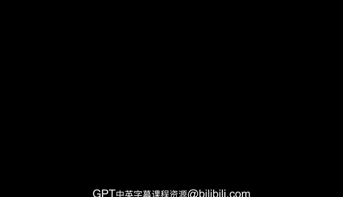
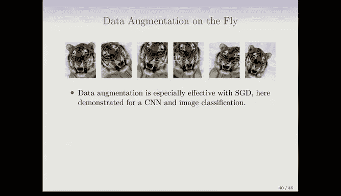

# Python 版 77：神经网络拟合 🧠

在本节课中，我们将学习如何拟合神经网络。我们将探讨神经网络优化的核心挑战——目标函数的非凸性，并介绍梯度下降法、反向传播等关键技术。同时，我们也会了解一些提升神经网络性能的实用技巧，如正则化和数据增强。

---

## 非凸优化问题与梯度下降法

上一节我们介绍了神经网络的基本结构。本节中我们来看看如何训练它，即如何找到最优的参数。

我们有一个目标函数，例如**平方和误差**，我们希望最小化它。这意味着我们需要从数据中学习权重 `W` 和系数 `β`。

**目标函数公式：**
`R(θ) = Σ (y_i - f_θ(x_i))^2`
其中 `θ` 代表所有参数（`W` 和 `β`）。

然而，这个问题是困难的，因为目标函数是**非凸的**。这意味着函数图像上可能存在多个“山谷”（局部最小值），而不仅仅是一个单一的“最低点”（全局最小值）。

为了优化这个非凸函数，我们使用**梯度下降法**。其工作原理如下：
1.  从一个初始参数猜测值 `θ_t` 开始。
2.  计算函数在该点的**梯度**。梯度是一个向量，指向函数值上升最快的方向。
3.  为了下降，我们向梯度的**反方向**移动一小步。步长由一个很小的**学习率** `ρ`（例如 0.001）控制。
4.  更新参数：`θ_{t+1} = θ_t - ρ * 梯度`。
5.  重复步骤 2-4，直到函数值不再显著下降。

梯度下降法可能会收敛到局部最小值，而非全局最小值。有趣的是，对于高度参数化的模型（如神经网络），全局最小值往往对应着严重的过拟合，因此我们通常并不希望找到它。

---

## 反向传播：计算梯度

既然梯度下降法依赖于梯度，那么我们如何高效地计算神经网络这个复杂函数的梯度呢？这就要用到**反向传播**算法。

反向传播的核心是微积分中的**链式法则**。它允许我们将最终损失（误差）的导数，一层一层地反向传播到网络中的每一个参数。

以下是计算梯度的关键步骤：
*   对于输出层的参数 `β`，求导涉及两步链式法则。
*   对于隐藏层的权重 `W`，求导涉及四步链式法则。

在平方误差损失下，梯度公式中的第一项总是**残差** `(y_i - f_θ(x_i))`。你可以将反向传播理解为：将每个观测的残差（预测误差）根据各层单元的“责任”大小，反向分配（传播）给网络中所有的权重和激活值。

幸运的是，现代深度学习框架（如 PyTorch, TensorFlow）都实现了**自动微分**，我们可以直接调用而无需手动推导这些复杂的梯度公式。

---

## 训练技巧与正则化

理解了基础优化方法后，我们来看看提升神经网络训练效果和防止过拟合的一些关键技巧。

以下是几种重要的实践方法：

1.  **慢学习与早停**：使用较小的学习率 `ρ` 会使梯度下降过程更慢、更稳定。**早停**是一种有效的正则化手段——我们并不训练到损失完全收敛，而是在验证集性能开始下降时停止训练。这能防止模型过度拟合训练数据。

2.  **随机梯度下降**：这是目前神经网络训练的标准方法。它不像标准梯度下降那样每次使用全部数据计算梯度，而是每次随机抽取一个**小批量**数据（如 128 个样本）来计算梯度并更新参数。这大大降低了计算开销，并引入了噪声，有时有助于跳出局部最小值。
    *   **周期**：一个“周期”指的是算法完整遍历一遍训练集所需的迭代次数。例如，对于 60000 个样本，批量大小为 128，则 1 个周期大约包含 469 次参数更新。

3.  **Dropout（随机失活）**：在每次小批量训练时，以一定概率 `p`（如 0.4）随机将网络中的一些神经元（及其连接）暂时“丢弃”（置零）。保留的神经元的权重会被按比例放大（除以 `1-p`）以保持输出的期望值。这可以防止神经元之间产生复杂的协同适应，是一种非常强大的正则化方法，其效果类似于 Ridge 正则化。

4.  **数据增强**：这是一种对输入数据（特别是图像数据）进行正则化的方法。通过对训练图像施加随机但合理的变换（如旋转、缩放、裁剪、颜色抖动），我们人工扩展了训练数据集。这相当于围绕每个原始数据点，生成了一个“数据云”。
    *   所有增强后的图像都保留原始标签。
    *   这种方法使模型对输入的小变化更加鲁棒，本质上也是一种正则化，类似于向数据中添加噪声，其效果与 Ridge 正则化等价。

---

本节课中我们一起学习了神经网络的拟合过程。我们首先认识了非凸优化带来的挑战，并学习了使用梯度下降法进行求解。接着，我们探讨了计算梯度的核心算法——反向传播。最后，我们介绍了几项至关重要的训练技巧：慢学习与早停、随机梯度下降、Dropout 正则化以及数据增强。这些技术共同构成了现代深度学习模型能够被有效训练并取得卓越性能的基础。