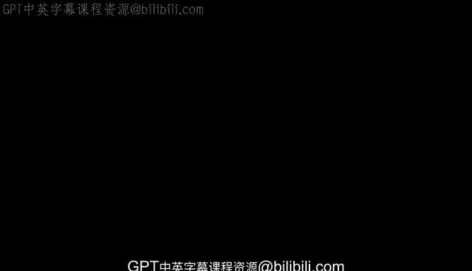
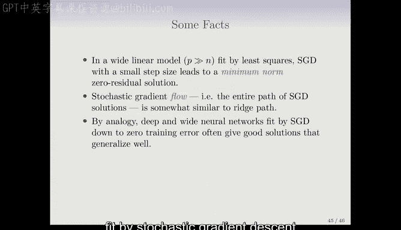

# Python 版 78：插值与双重下降 🧠



在本节课中，我们将探讨一个近年来非常热门的话题——**双重下降**现象。我们将通过一个简单的模拟实验来理解这一现象，并解释它如何挑战了传统的偏差-方差权衡观念。

---

## 概述：什么是双重下降？

上一节我们讨论了模型复杂度的传统权衡。本节中，我们来看看一个看似违反直觉的现象：在某些现代机器学习模型（如深度神经网络）中，**增加模型参数数量，使其远超过训练样本数，有时反而能获得更好的测试性能**。这种现象被称为“双重下降”。

---

## 实验设置：一个简单的模拟

为了理解双重下降，我们进行一个模拟实验。以下是实验的步骤：

1.  **生成数据**：从正弦曲线 `y = sin(x)` 生成数据。特征 `x` 在区间 `[-5, 5]` 上均匀分布。误差项 `ε` 服从标准差为 `0.3` 的高斯分布。
    ```python
    # 伪代码示例
    import numpy as np
    n_train = 20
    x_train = np.random.uniform(-5, 5, n_train)
    y_train = np.sin(x_train) + np.random.normal(0, 0.3, n_train)
    ```
2.  **划分数据集**：使用一个较小的训练集（`n=20`）和一个非常大的测试集（以精确评估测试误差）。
3.  **选择模型**：使用**自然样条**来拟合数据。自然样条通过一组 `D` 个基函数的线性组合来构建灵活的函数。
    ```python
    # 伪代码：使用D个基函数的线性回归
    from sklearn.preprocessing import SplineTransformer
    transformer = SplineTransformer(degree=3, n_knots=D)
    X_basis = transformer.fit_transform(x_train.reshape(-1,1))
    # 然后进行线性回归：y ≈ X_basis * β
    ```
4.  **改变复杂度**：我们将逐渐增加基函数的数量 `D`（即模型的自由度或参数数量），并观察训练误差和测试误差的变化。

当 `D = 20` 时，模型参数数量等于训练样本数，可以完美拟合训练数据（训练误差为0）。当 `D > 20` 时，存在无数个能使训练误差为零的解。此时，我们选择其中**范数最小**的解（即系数平方和 `∑β_j²` 最小的解）。

---

## 结果分析：双重下降曲线

下图展示了随着自由度 `D` 增加，误差的变化情况：


以下是图表的关键解读：

*   **训练误差（橙色）**：随着 `D` 增加而下降，在 `D=20` 时达到零并保持不变。
*   **测试误差（蓝色）**：
    *   在 `D < 20` 的区域，我们看到了经典的**U形曲线**：测试误差先因偏差减小而下降，后因方差增大而上升，这是传统的偏差-方差权衡。
    *   在 `D = 20` 时，测试误差达到一个峰值（“过拟合区”）。
    *   在 `D > 20` 的区域，发生了**双重下降**：测试误差再次下降，达到第二个、更低的低谷，然后缓慢上升。

---

## 现象解释：为什么参数更多反而更好？

当 `D > 20` 时，我们通过选择**最小范数解**来在无数个零训练误差解中做出选择。这意味着尽管系数 `β` 的数量变多了，但它们的**平方和 `∑β_j²` 实际上变小了**。

以下是不同 `D` 下的拟合曲线对比：



*   **`D=8`**：拟合良好，但略有偏差。
*   **`D=20`**：曲线必须穿过所有20个数据点，导致在数据点之间剧烈震荡，泛化能力差。
*   **`D=42`**（双重下降后的最低点）：曲线仍然穿过所有数据点，但震荡更小、更平滑，因为系数值更小、更分散。这相当于一种**隐式正则化**，从而获得了更好的测试性能。
*   **`D=80`**：性能与 `D=42` 类似，没有显著变差。

核心在于：**增加参数提供了更多灵活性，但选择最小范数解约束了这种灵活性，使其朝着更平滑、泛化更好的方向发挥。**

---

## 与深度学习的联系

这一现象有助于理解现代深度神经网络的行为：

1.  **宽线性模型**：在参数 `p` 远大于样本数 `n` 的线性模型中，使用小步长的随机梯度下降法优化至零训练误差，最终会收敛到**最小范数解**。
2.  **类比神经网络**：在深度、宽度的神经网络中，使用随机梯度下降法缓慢训练至零训练误差，其路径类似于**岭回归路径**，产生了一种隐式的正则化效果。
3.  **高信噪比任务**：在像图像识别这类信号主导（高信噪比）的任务中，追求零训练误差的解往往主要捕捉的是信号本身，而非噪声，因此不那么容易过拟合。

---

## 相关软件工具

实践神经网络和深度学习有强大的软件支持：


*   **TensorFlow**：由 Google 开发。
*   **PyTorch**：由 Facebook 开发。
    两者都是主流的 Python 深度学习框架。
*   **R 语言接口**：在教材第10章的实验中，我们演示了如何使用 R 的 `keras` 包（接口 TensorFlow）和 `torch` 包（接口 PyTorch）来拟合神经网络。所有实验的 R Markdown 和 Jupyter Notebook 资源均可在教材网站获取。

---

## 总结

本节课我们一起学习了**双重下降**现象。我们通过一个自然样条的模拟实验观察到，当模型自由度超过训练样本数后，测试误差会再次下降。这源于对**最小范数解**的选择，它起到了隐式正则化的作用。这一现象将随机梯度下降与最小范数解联系起来，为理解大型神经网络为何不易过拟合提供了新的视角。它表明，在某些条件下，传统的偏差-方差 U 形曲线并非故事的全貌。