# Python 版 79：使用PyTorch构建单层神经网络模型 🧠

在本节课中，我们将学习如何使用PyTorch库构建一个简单的单层神经网络模型。我们将以熟悉的Hitters数据集为例，演示从数据准备、模型定义、训练到评估的完整流程，并与之前学过的线性回归和Lasso模型进行性能对比。

---

## 概述与准备工作

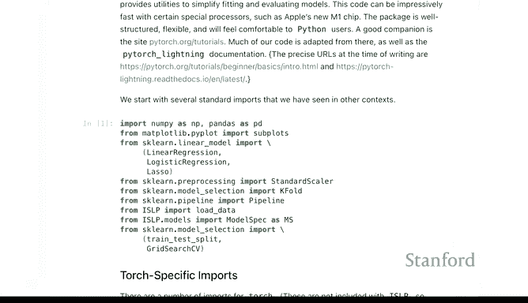

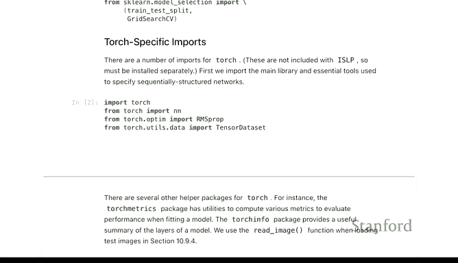

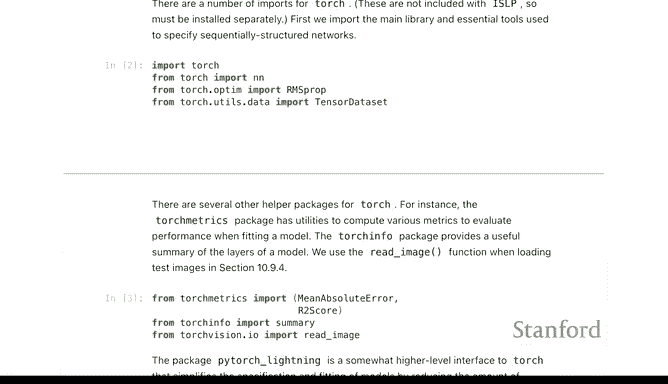

上一节我们介绍了深度学习的基本概念。本节中，我们将通过实践来学习如何使用PyTorch构建和训练一个神经网络。

首先，我们需要导入必要的库。除了之前课程中常见的库（如`numpy`, `pandas`, `sklearn`），我们还需要导入PyTorch及其相关模块。请注意，`torch`等库不是ISLP包的默认依赖，你需要使用`pip`单独安装。

以下是核心导入语句：

```python
import torch
from torch import nn
from torch.utils.data import TensorDataset
import pytorch_lightning as pl
from ISLP.torch import SimpleDataModule, ErrorTracker, regression
```

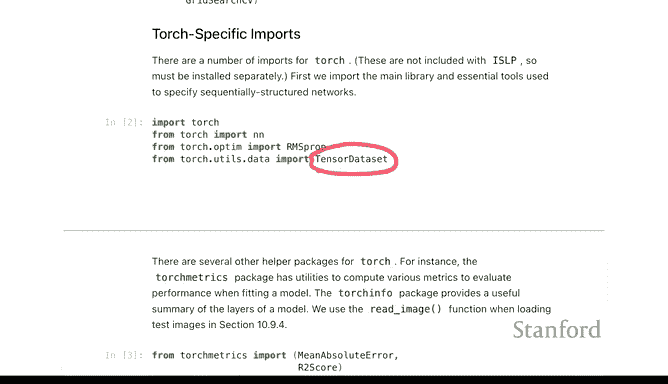

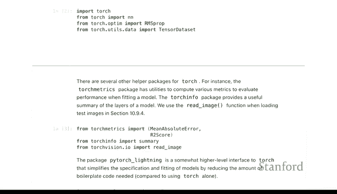

`nn.Module`是PyTorch中构建神经网络层的基类，我们将通过继承它来定义自己的模型。`TensorDataset`用于将数据转换为PyTorch能够高效处理的格式。`pytorch_lightning`是一个简化训练流程的辅助库，而`ISLP.torch`中的模块则进一步封装了常用功能。

---

## 数据准备与基线模型

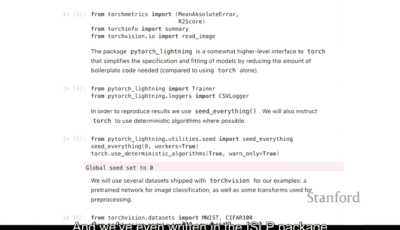

在构建神经网络之前，我们首先按照之前章节的方法准备数据，并建立基线模型以供比较。

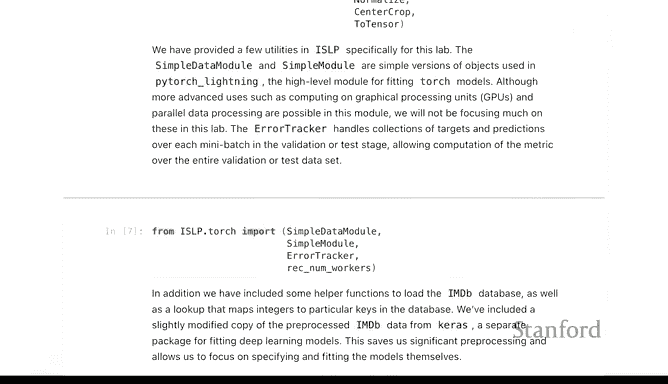

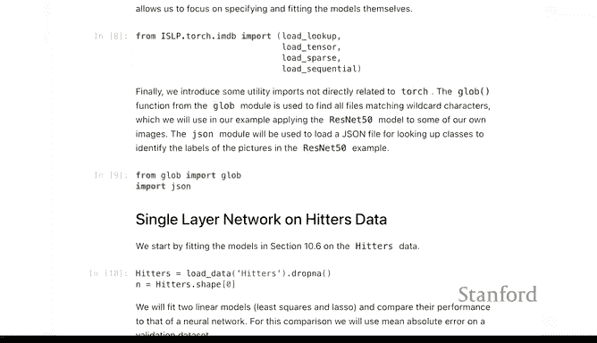

我们使用`model_matrix`从Hitters数据创建设计矩阵`X`和响应变量`y`，并进行常规的训练集/测试集分割。

```python
# 假设 X_train, X_test, y_train, y_test 已通过 sklearn 的 train_test_split 获得
```

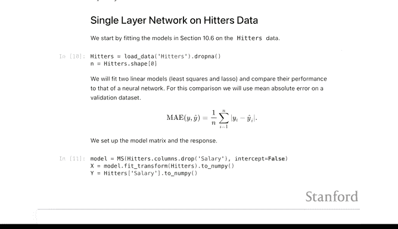

接着，我们拟合一个简单的线性回归模型和一个Lasso模型作为基线。

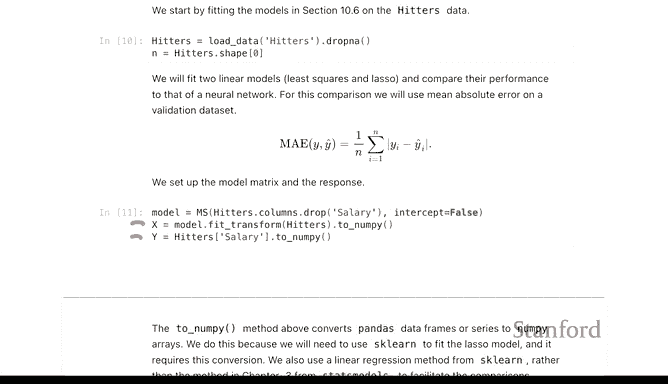

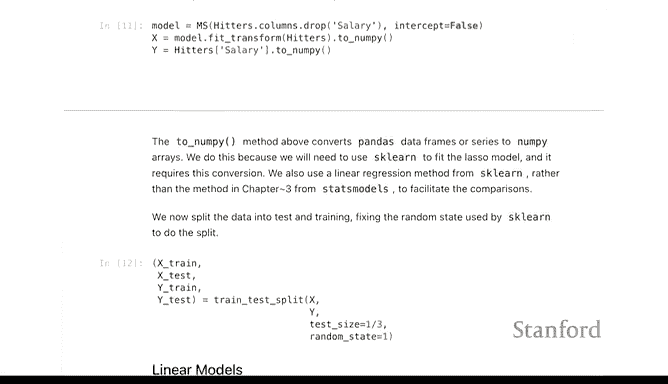

```python
from sklearn.linear_model import LinearRegression, Lasso
from sklearn.metrics import mean_absolute_error

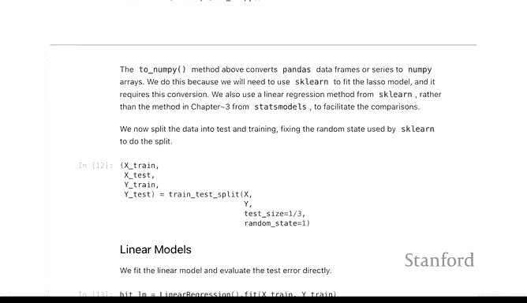

# 线性回归
lin_reg = LinearRegression().fit(X_train, y_train)
y_pred_lin = lin_reg.predict(X_test)
mae_lin = mean_absolute_error(y_test, y_pred_lin) # 结果约为 259

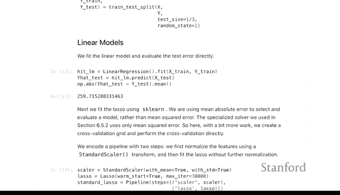

# Lasso回归
lasso = Lasso(alpha=0.01).fit(X_train, y_train)
y_pred_lasso = lasso.predict(X_test)
mae_lasso = mean_absolute_error(y_test, y_pred_lasso) # 结果约为 257
```

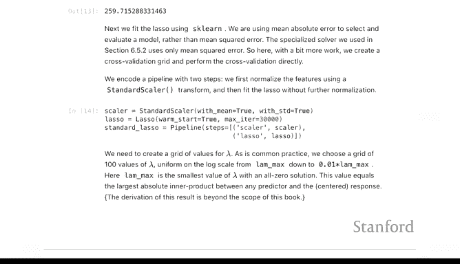

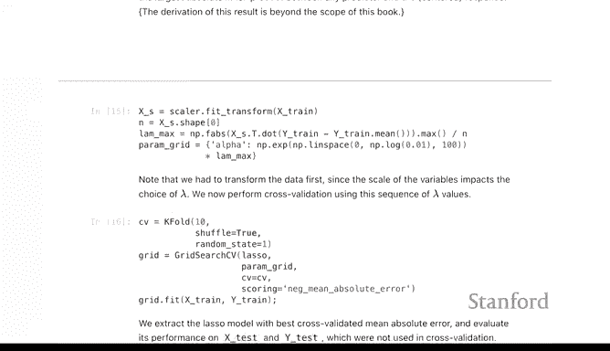

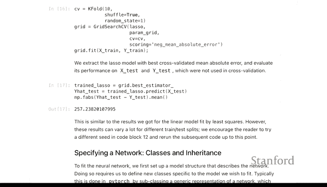

线性回归和Lasso的测试集平均绝对误差（MAE）非常接近，大约在257-259之间。我们将用这个结果来评估神经网络的表现。

---

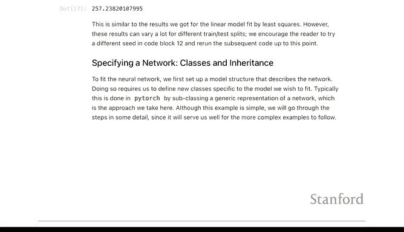

## 定义神经网络模型

现在，我们开始构建第一个神经网络。在PyTorch中，我们通过定义一个继承自`nn.Module`的类来指定网络结构。

以下是定义单隐藏层网络的关键步骤：

```python
class HittersModel(nn.Module):
    def __init__(self, input_features):
        super().__init__()
        # 定义网络层序列
        self.layer_stack = nn.Sequential(
            nn.Linear(input_features, 50), # 从输入特征映射到50个隐藏单元
            nn.ReLU(),                     # 激活函数
            nn.Dropout(0.4),               # Dropout层，随机丢弃40%的神经元以防止过拟合
            nn.Linear(50, 1)               # 从隐藏层映射到单个输出（标量响应）
        )
    
    def forward(self, x):
        # 定义数据的前向传播路径
        return self.layer_stack(x).flatten()
```

我们来解读一下这个类：
*   `__init__`方法：初始化网络层。这里我们定义了一个顺序容器`nn.Sequential`，它包含：
    1.  一个全连接层（`nn.Linear(19, 50)`），将19个输入特征线性变换到50维的隐藏层。这引入了 `(19 * 50) + 50 = 1000` 个参数。
    2.  ReLU激活函数（`nn.ReLU()`），为网络引入非线性。
    3.  Dropout层（`nn.Dropout(0.4)`），在训练期间随机将40%的隐藏单元输出置零，这是一种正则化技术。
    4.  第二个全连接层（`nn.Linear(50, 1)`），将50维的隐藏层映射到最终的预测输出。
*   `forward`方法：定义了输入数据`x`如何通过网络层前向传播以产生预测。`.flatten()`确保输出形状符合预期。

创建模型实例并查看摘要：

```python
model = HittersModel(input_features=19)
# 使用 torchinfo 来总结模型结构（需要安装 torchinfo）
from torchinfo import summary
summary(model, input_size=(175, 19)) # 假设训练批大小为175
```

摘要会显示每一层的输入/输出形状和参数数量，帮助我们确认网络架构是否正确。

---

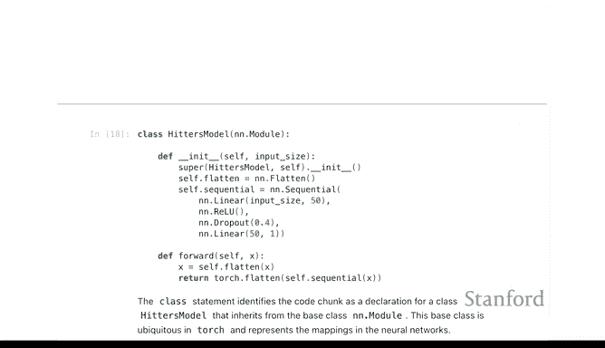

## 准备PyTorch数据与训练模块

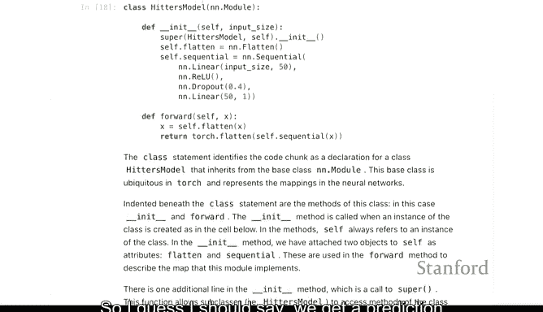

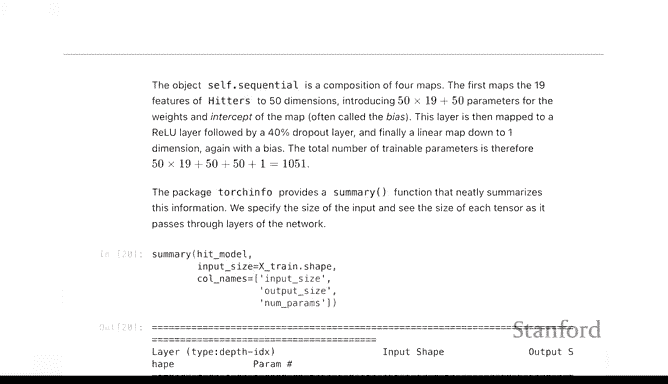

PyTorch使用`DataLoader`来批量加载数据。我们使用`ISLP.torch`中的`SimpleDataModule`来简化这个过程。

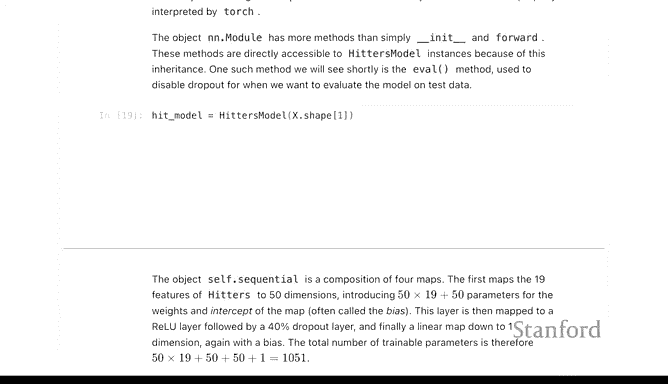

以下是准备数据模块的步骤：

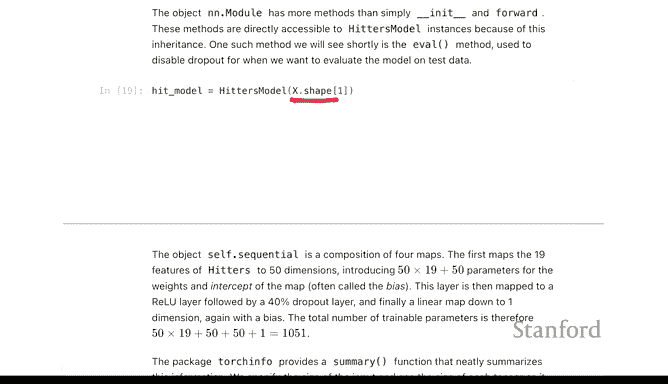

```python
# 将 numpy 数组转换为 PyTorch 张量
X_train_t = torch.tensor(X_train, dtype=torch.float32)
y_train_t = torch.tensor(y_train.values if hasattr(y_train, 'values') else y_train, dtype=torch.float32)
# 对测试集做同样处理得到 X_test_t, y_test_t

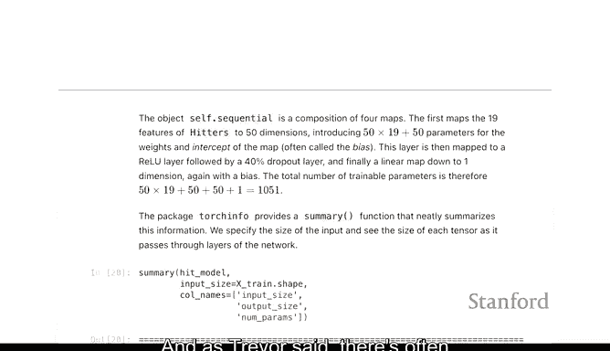

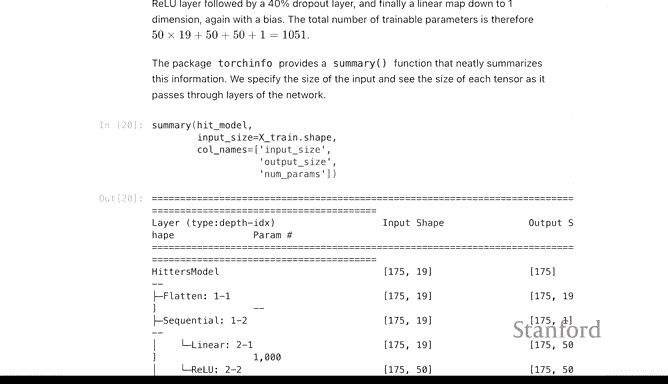

# 创建 TensorDataset
train_ds = TensorDataset(X_train_t, y_train_t)
test_ds = TensorDataset(X_test_t, y_test_t)

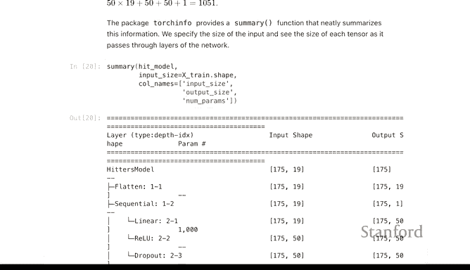

# 使用 SimpleDataModule 封装数据
data_module = SimpleDataModule(train_ds, 
                               test_ds, 
                               batch_size=32, 
                               validation=test_ds) # 这里用测试集作为验证集
```

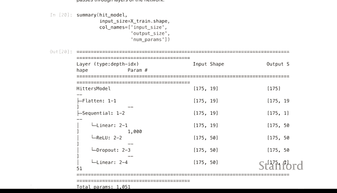

接下来，我们需要指定损失函数和评估指标。对于回归问题，我们使用均方误差（MSE）作为损失函数，并同时跟踪平均绝对误差（MAE）。

```python
# 使用 ISLP.torch 中的 regression 辅助函数来设置
loss_module = regression(model, 
                         loss_fn=nn.MSELoss(), # 损失函数为 MSE
                         metrics={'mae': mean_absolute_error})
```

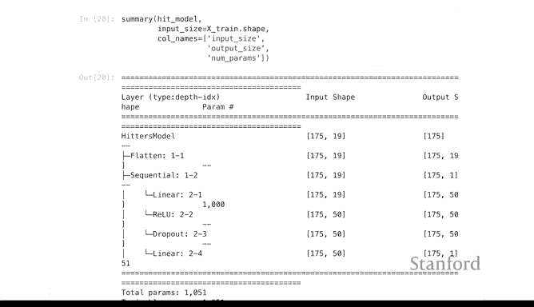

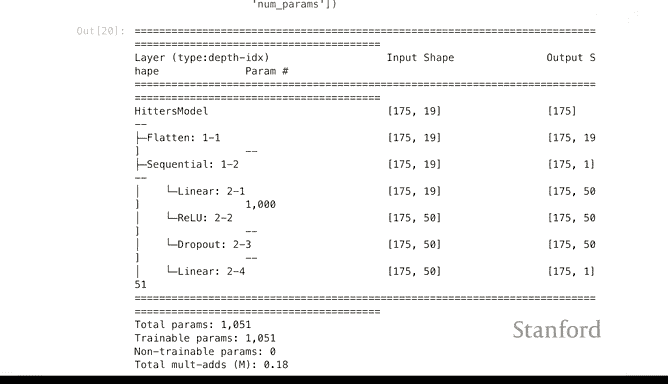

---

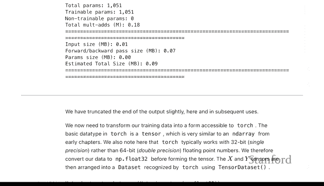

## 模型训练与评估

最后，我们使用PyTorch Lightning的`Trainer`来组织并执行训练过程。`ErrorTracker`回调函数会记录每个训练周期（epoch）的损失值，便于后续分析。

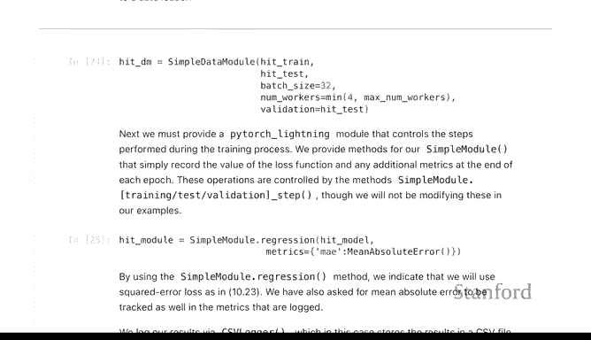

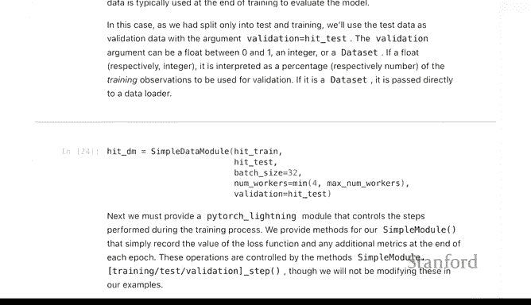

以下是训练模型的代码：

```python
trainer = pl.Trainer(max_epochs=50, 
                     callbacks=[ErrorTracker()], 
                     progress_bar_refresh_rate=0, 
                     enable_model_summary=False)
trainer.fit(loss_module, datamodule=data_module)
```

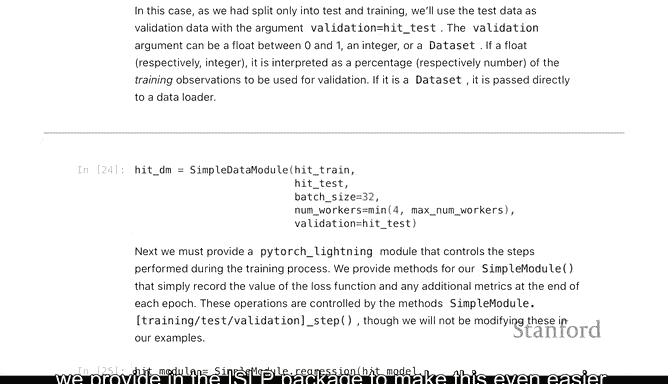

训练开始后，控制台会输出每个epoch的进度。完成50个epoch后，我们可以在测试集上评估模型的最终性能。

```python
test_results = trainer.test(dataloaders=data_module.test_dataloader())
# 从结果中提取测试集 MAE
test_mae = test_results[0]['test_mae']
print(f"神经网络测试集 MAE: {test_mae:.2f}")
```

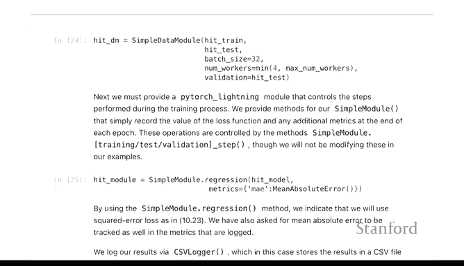

在这个例子中，神经网络的测试集MAE大约为**222**，显著优于线性回归（259）和Lasso（257）的结果。

---

## 可视化训练过程

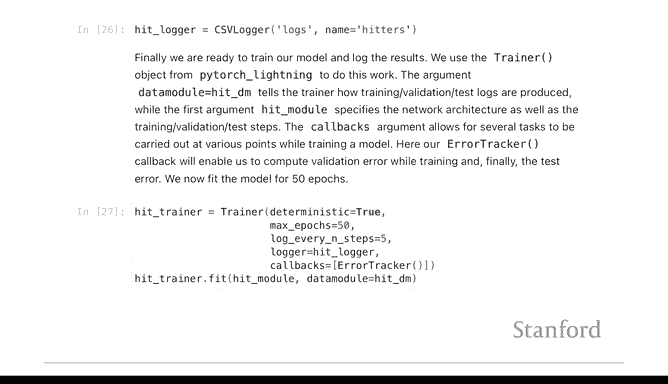

我们可以利用`ErrorTracker`记录的数据，绘制训练损失和验证损失随epoch变化的曲线，以观察模型的学习情况和是否过拟合。

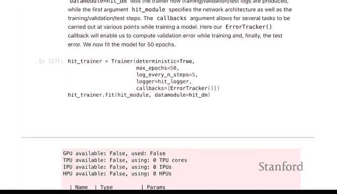

```python
# 假设 errors 是 ErrorTracker 记录下来的 DataFrame
import matplotlib.pyplot as plt
plt.figure(figsize=(10, 6))
plt.plot(errors['epoch'], errors['train_mae'], label='Training MAE')
plt.plot(errors['epoch'], errors['val_mae'], label='Validation MAE')
plt.xlabel('Epoch')
plt.ylabel('Mean Absolute Error')
plt.title('Training and Validation Error over Epochs')
plt.legend()
plt.grid(True)
plt.show()
```

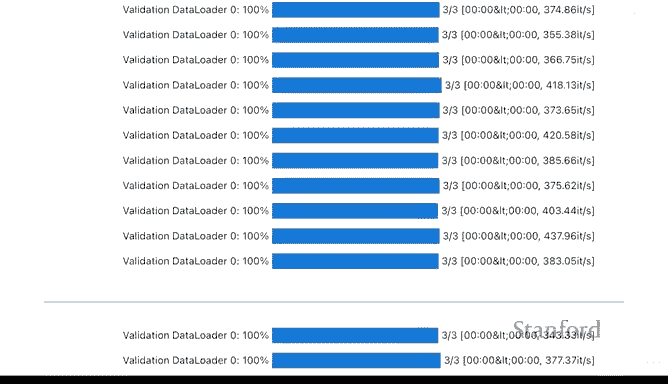

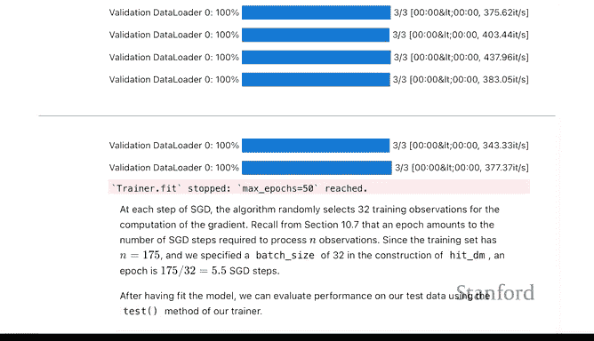

从图中通常可以看到，误差在最初几个epoch快速下降后逐渐趋于平稳。训练误差和验证误差曲线接近，表明模型没有严重过拟合。曲线末端的微小波动是使用随机梯度下降优化算法的典型特征。

---

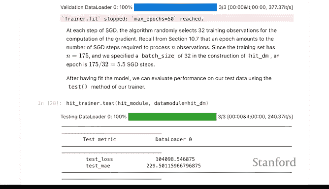

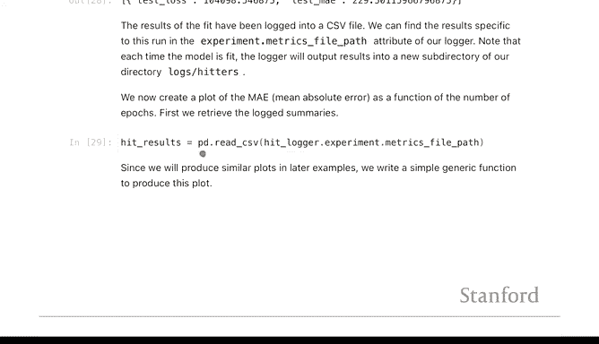

## 总结

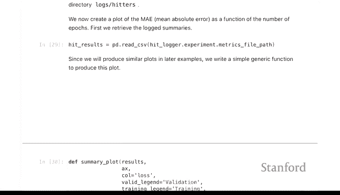

本节课中，我们一起学习了使用PyTorch构建和训练单层神经网络模型的完整流程：

1.  **数据准备**：将`numpy`数组转换为PyTorch张量，并封装成`TensorDataset`和`DataModule`。
2.  **模型定义**：通过继承`nn.Module`类并定义`__init__`和`forward`方法来构建网络架构。
3.  **训练配置**：指定损失函数、优化器（由`Trainer`内部处理），并使用`SimpleDataModule`管理数据流。
4.  **模型训练与评估**：使用PyTorch Lightning的`Trainer` API简化训练循环，并在独立测试集上评估模型性能。
5.  **结果分析**：我们的简单神经网络在Hitters数据集上取得了比传统线性模型更好的预测效果（MAE更低），并可视化训练过程以监控学习动态。

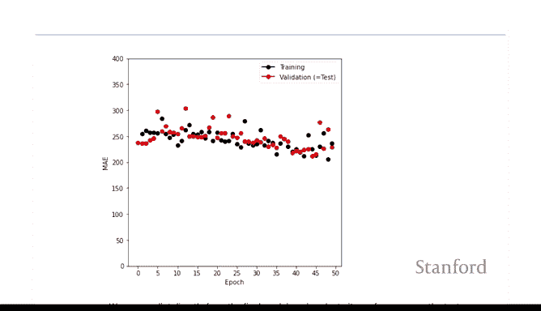


虽然PyTorch的代码起初看起来比scikit-learn更复杂，但其模块化设计提供了极大的灵活性，适用于构建从简单到极其复杂的深度学习模型。掌握这个基本模式后，你可以通过修改网络结构（如增加层数、改变激活函数、调整Dropout率等）来应对各种不同的机器学习任务。