# Python 版 80：多层神经网络模型与MNIST手写数字识别 I 📚

在本节课中，我们将学习如何使用PyTorch构建一个多层神经网络模型，并将其应用于经典的MNIST手写数字识别数据集。我们将从数据加载开始，逐步构建模型，并最终评估其性能。

---

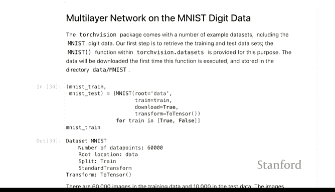

## 概述

我们将使用MNIST数据集，该数据集包含手写数字的灰度图像，目标是将这些图像分类为0到9的十个数字类别。我们将构建一个包含两个隐藏层的神经网络，并学习如何配置数据加载器、定义模型架构以及训练模型。

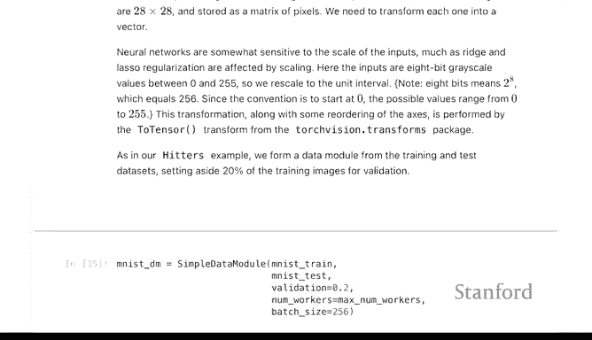

---

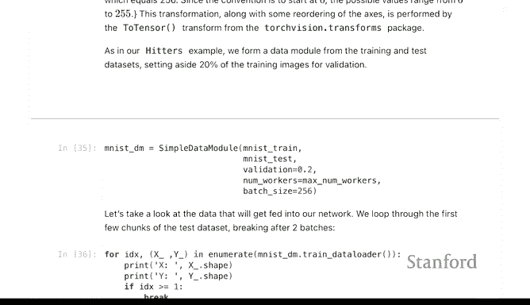

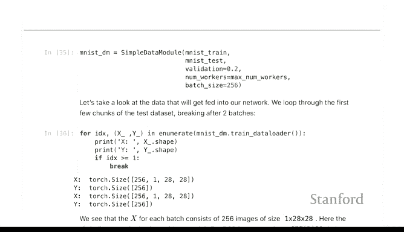

## 数据准备

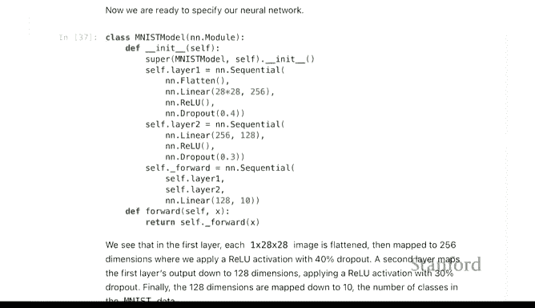

上一节我们介绍了如何为回归问题准备数据，本节中我们来看看如何为图像分类任务准备数据。

MNIST数据集在PyTorch的`torchvision.datasets`库中已预先打包好，便于我们直接使用。我们需要创建一个数据模块来告诉PyTorch如何加载数据。

以下代码定义了数据加载过程，其中每个批次包含256个样本，一个训练周期（epoch）会遍历所有数据点一次。

```python
# 数据加载器配置示例
batch_size = 256
# ... 具体数据加载代码
```

---

## 模型定义

现在我们来指定我们的模型。我们将构建一个比之前稍复杂的模型，即一个包含两个隐藏层的神经网络。

在定义模型类时，有一个关键步骤需要注意：我们必须调用父类`nn.Module`的初始化方法。这是创建`nn.Module`子类时的标准语法。

以下是定义两层神经网络模型的核心代码：

```python
import torch.nn as nn

class MNISTModel(nn.Module):
    def __init__(self):
        super(MNISTModel, self).__init__()  # 关键：调用父类初始化
        # 第一层：输入维度28*28，输出256个隐藏单元，使用0.4的dropout
        self.layer1 = nn.Linear(28*28, 256)
        self.dropout1 = nn.Dropout(0.4)
        # 第二层：输入256，输出128个隐藏单元
        self.layer2 = nn.Linear(256, 128)
        self.dropout2 = nn.Dropout(0.4)
        # 输出层：输入128，输出10个类别
        self.output = nn.Linear(128, 10)
        
        # 使用Sequential组合层
        self.model = nn.Sequential(
            self.layer1,
            nn.ReLU(),
            self.dropout1,
            self.layer2,
            nn.ReLU(),
            self.dropout2,
            self.output
        )
    
    def forward(self, x):
        return self.model(x)
```

**模型结构说明**：
*   **输入层**：MNIST图像是28x28的灰度图，因此输入维度为`28*28=784`。
*   **隐藏层1**：包含256个神经元，使用ReLU激活函数和Dropout正则化（丢弃率0.4）。
*   **隐藏层2**：包含128个神经元，同样使用ReLU和Dropout。
*   **输出层**：包含10个神经元，对应10个数字类别。最终的Softmax变换通常由损失函数处理。

这种模块化的定义方式非常灵活。如果你想添加更多层，只需重复类似的代码块，甚至可以使用循环来简化深层网络的构建。

---

## 模型训练与评估

模型定义好后，其余步骤与之前的例子几乎相同：实例化模型、设置训练器、运行训练循环。

以下是训练和评估的关键步骤：

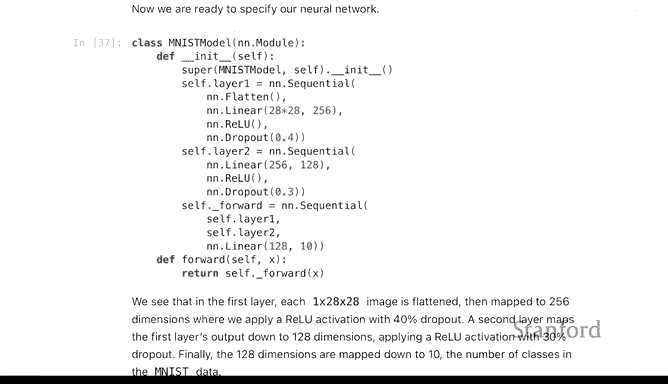

1.  **实例化模型与设置**：
    ```python
    model = MNISTModel()
    # 设置分类任务（包含Softmax）和优化器
    ```

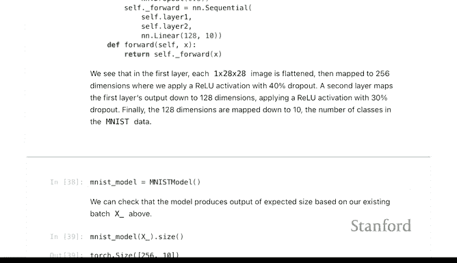

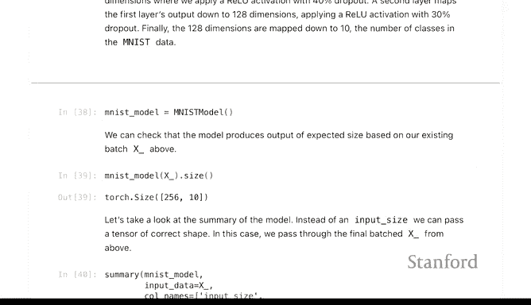

2.  **训练模型**：我们可以监控训练过程中的准确率变化。

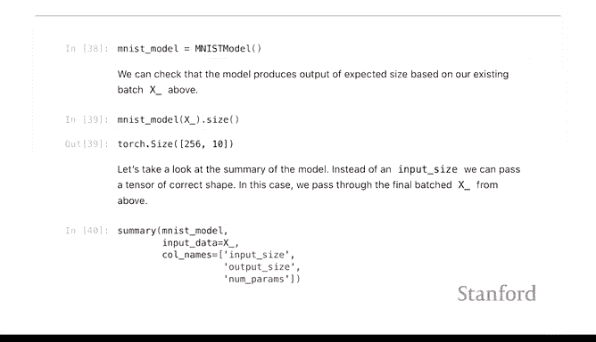

3.  **评估性能**：最终，我们可以在测试集上评估模型的准确率。对于这个两层神经网络，我们获得了约**95%**的测试准确率。

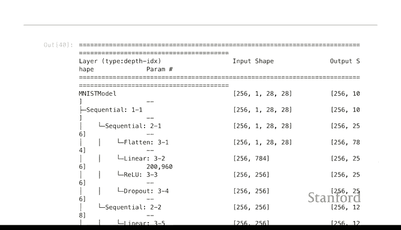

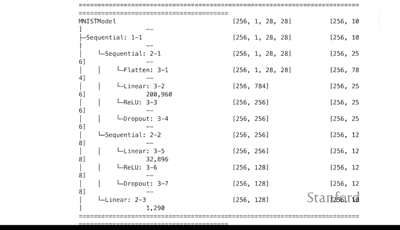

---

## 对比：简单的多项逻辑回归模型

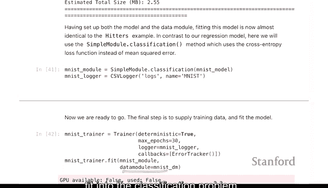

为了对比，我们也可以使用几乎相同的代码框架，拟合一个没有隐藏层的简单模型（即多项逻辑回归模型）。

唯一的区别是模型架构中移除了非线性激活函数和隐藏层，仅保留一个从输入到输出的线性变换。

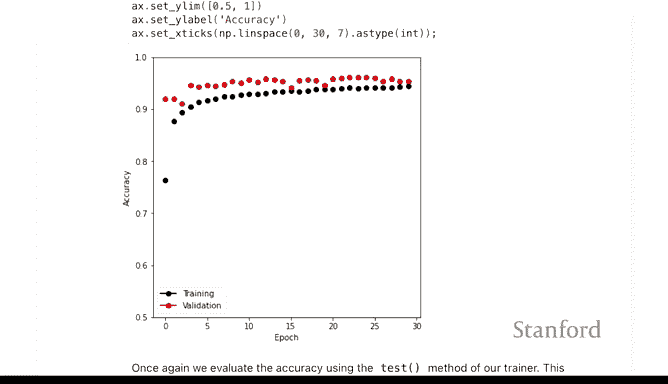

```python
class SimpleMNISTModel(nn.Module):
    def __init__(self):
        super(SimpleMNISTModel, self).__init__()
        # 直接从输入映射到10个输出类别
        self.linear = nn.Linear(28*28, 10)
    
    def forward(self, x):
        return self.linear(x)
```

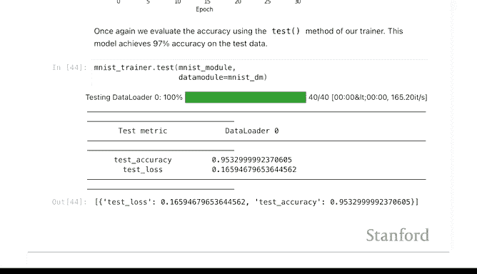

这个简单模型在测试数据上达到了约**90%**的准确率，虽然比神经网络低，但表现仍然不错。

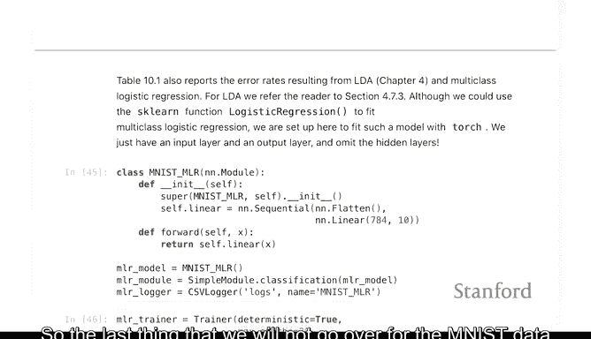

---

## 总结

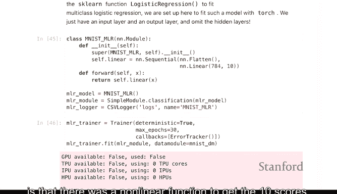

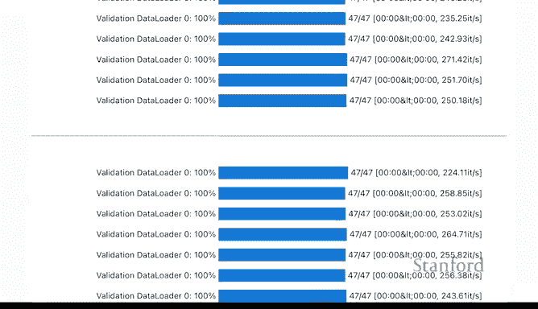

本节课中我们一起学习了：
1.  如何使用PyTorch加载MNIST手写数字数据集。
2.  如何构建一个包含两个隐藏层的神经网络模型，包括正确的类继承和初始化方法。
3.  理解了模型各层的维度设置（输入、隐藏单元、输出）。
4.  完成了模型的训练，并评估了其约95%的分类准确率。
5.  作为对比，实现了一个简单的线性模型（多项逻辑回归），其准确率约为90%。

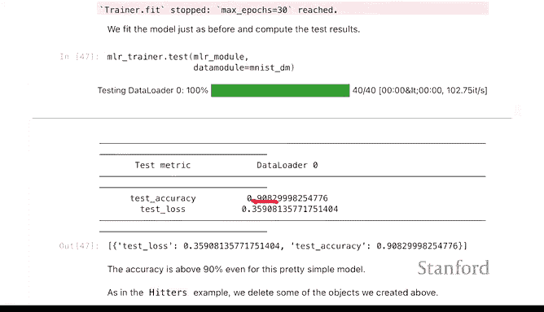


通过这个例子，我们掌握了使用PyTorch构建和训练基本分类神经网络的核心流程。