# Python 版 81：卷积神经网络与CIFAR图像数据 🖼️

在本节课中，我们将学习卷积神经网络。这是一种在图像处理领域非常流行的模型，因为它能很好地捕捉图像的局部特征。我们将使用CIFAR-100数据集的一部分数据，这是一个包含100个类别的图像分类问题。作为参考，随机猜测的准确率约为1%。

## 数据准备与预处理

上一节我们介绍了课程目标，本节中我们来看看如何准备数据。CIFAR数据被打包在Torchvision包中，这非常方便。为了进行模型拟合，我们需要进行一些预处理。

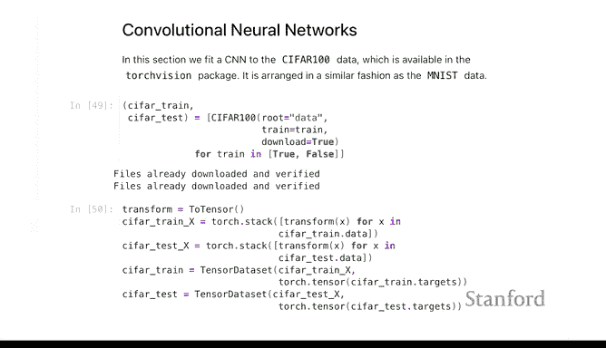

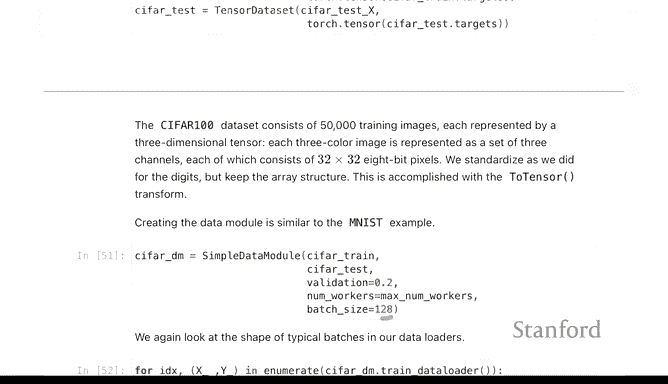

以下是预处理步骤：
*   将像素值从0-255的整数重新缩放到0-1的浮点数。
*   对数组进行转置，重新排列维度顺序。

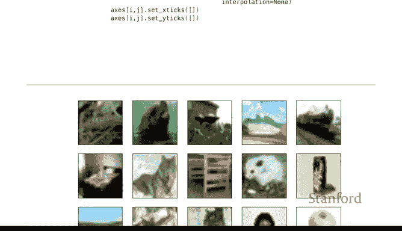

```python
# 预处理示例：缩放和转置
transform = transforms.Compose([
    transforms.ToTensor(), # 转换为张量并自动缩放到[0,1]
])
```

接着，我们像处理其他示例一样创建数据模块。我们拥有训练数据和测试数据，并将使用20%的训练数据作为验证集，每个批次的大小设置为128。

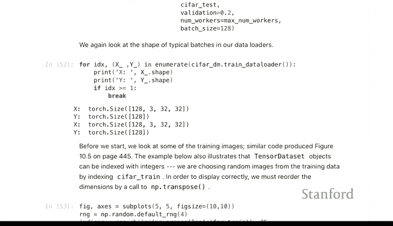

```python
# 创建数据加载器
train_loader = DataLoader(train_dataset, batch_size=128, shuffle=True)
val_loader = DataLoader(val_dataset, batch_size=128)
test_loader = DataLoader(test_dataset, batch_size=128)
```

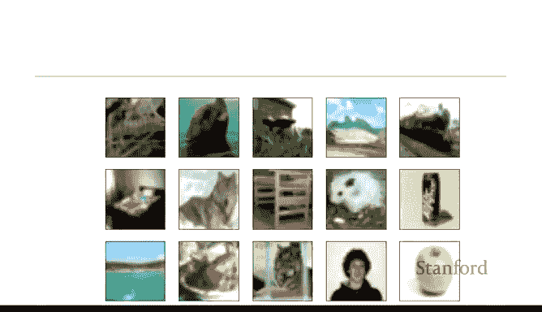

这些输入的图像是三维张量。彩色图像通常用RGB（红、绿、蓝）三通道表示。在CIFAR-100数据集中，图像的尺寸是32x32像素，并带有3个颜色通道。一个典型的批次包含128张随机选择的图像，其维度为 `[128, 3, 32, 32]`。检查数据加载器并理解输入数据的形状是一个好习惯。

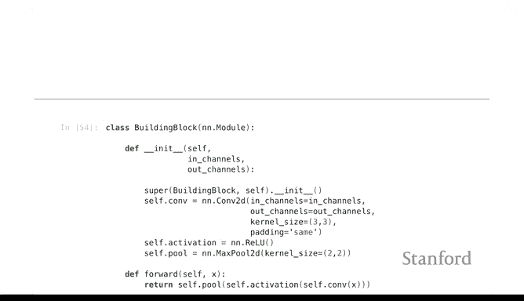

让我们看一下这些图像。虽然32x32的分辨率不高，但其中的物体仍然可以辨认。例如，可以识别出狼、大脚怪和苹果。使用图像作为数据观测的一个优点是，你可以直观地查看它们，而对于其他高维数据则很难做到这一点。

## 构建卷积神经网络模型

现在我们来定义我们的神经网络。常见的做法是构建一个多尺度的分析网络。我们将进行卷积滤波（使用`nn.Conv2d`），然后应用ReLU激活函数，接着对输出进行最大池化操作。我们将在几个不同的尺度上重复这一过程。

为此，我们将定义一个称为“构建块”的基础层，并在我们的多尺度表示网络中使用不同尺寸的构建块。建议在学习本章实验前先阅读卷积神经网络的相关章节，以便更好地理解卷积和池化操作的顺序与原理。

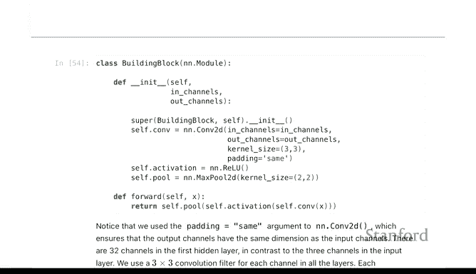

我们在这里所做的是有效地创建一种新的层类型。PyTorch的`nn`模块中已经包含了一些层，如`nn.Sequential`、`nn.Linear`、`nn.ReLU`。`nn.Conv2d`也是其中之一。这里我们创建自己的层，稍后用于构建CIFAR-100网络。

每个构建块层将依次执行卷积、ReLU激活和最大池化操作。

我们将创建一个序列。正如前面所说，我们将使用构建块，并在不同尺度上应用卷积和最大池化。尺度变化如下：这些数字代表每个构建块层输出通道的数量。

输入图像是3通道（RGB），第一层将输出32个通道。由于我们使用了2x2的池化核进行最大池化，每次池化都会使图像的尺寸减半。因此，我们从 `3x32x32` 开始，经过第一层后变为 `32x16x16`，接着是 `32x16x16` 到 `64x8x8`，依此类推。

一旦我们有了可以执行卷积和池化的对象（即之前定义的构建块），我们将按顺序应用它们。我们定义了要查看的尺度，并使用Python的列表推导式创建一个顺序层序列。这里的 `*` 参数将序列中的所有元素作为参数传递给`nn.Sequential`，这是一种非常简洁的写法。

在网络的末端，我们将拥有256个通道，并且图像尺寸将变为2x2。因此，最终最大池化后的输出是 `256x2x2`。我们将其输出到512个单元，再经过一个ReLU激活函数，最后输出到100个单元，对应100个类别。

以这种方式指定网络后，训练等过程将与此前的模型类似。

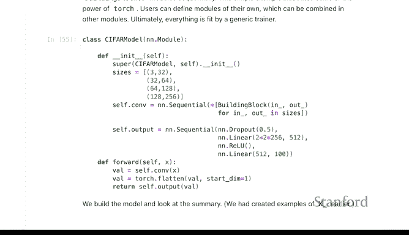

## 模型训练与评估

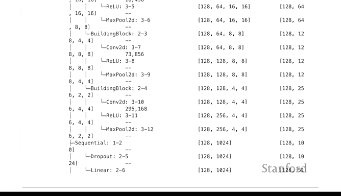

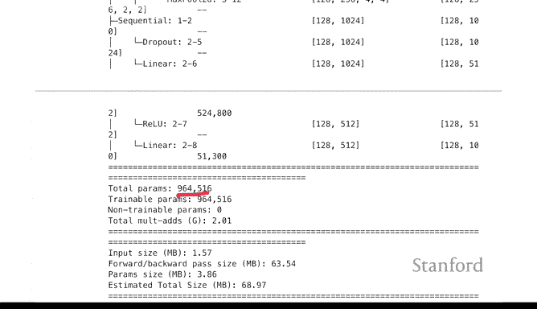

本节中，我们来看看如何训练和评估模型。模型的摘要可能有点长，但阅读方式应该是可预测的。现在有相当多的参数，接近一百万个。

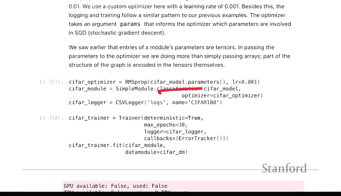

我们不会详细讨论所有细节。到目前为止，我们一直使用默认的随机梯度优化方法。PyTorch提供了几种其他变体，我们在这里将使用其中一种。当我们指定这是一个分类问题时，会使用一个特定的优化器。

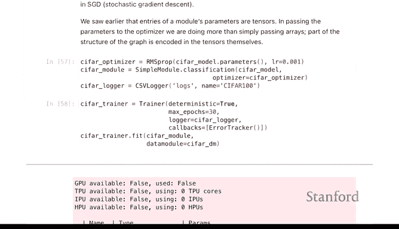

我们将像处理其他所有模型一样进行拟合。这个模型的训练需要更长一点时间。根据你的硬件配置，可能需要一些时间。在一台配备M1芯片的现代Mac笔记本电脑上，大约需要10分钟。我们只进行了30个训练周期，你可能会进行更多周期，特别是如果准确率仍在提升的话。

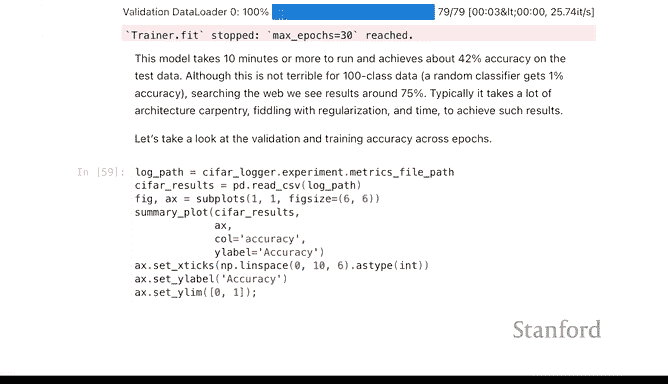

让我们看一下结果。看起来验证准确率有点趋于平稳，所以可能30个周期后提升不会太大。训练准确率当然会越来越好。

在100个类别的分类问题上达到约40%的准确率是相当不错的，相比1%的基线提升显著。目前在这个数据集上的最先进水平可能在70%左右。人们会不断调整和优化这些模型以提高准确率。最终，整个领域可能会在数据上过拟合，即使任何不同的方法也无法避免。

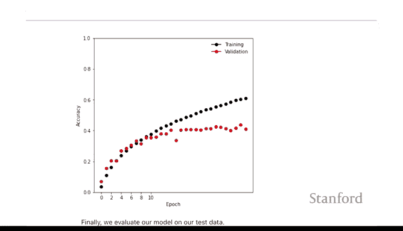

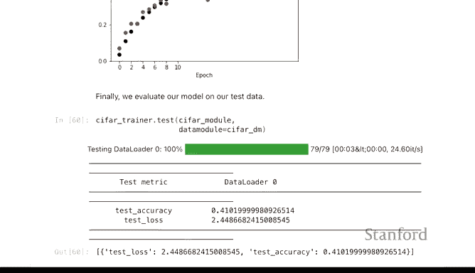

测试数据的准确率约为41%。

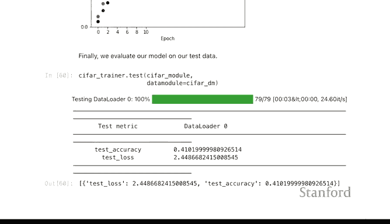

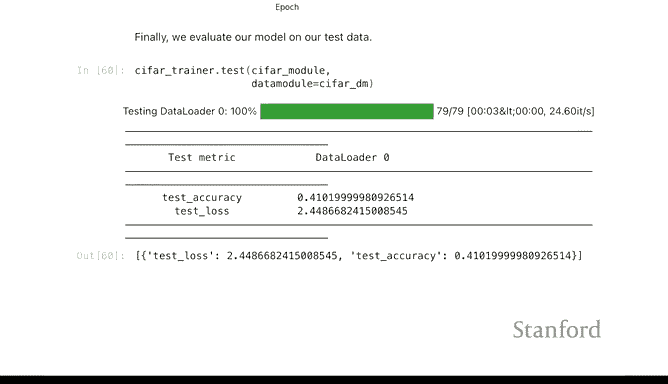

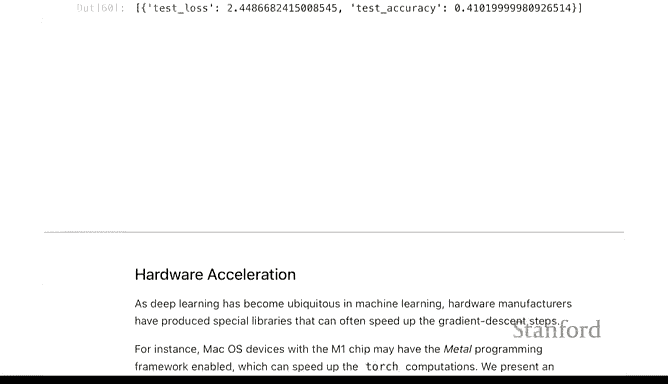

## 扩展知识与预训练模型

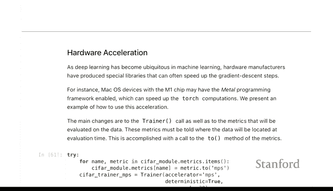

关于卷积神经网络还有其他一些主题。如果你有特定的硬件，可以尝试使用加速功能。最后，这些模型的一个优点是，你不必仅仅使用自己的计算机来运行它们，有时可以利用他人已完成的工作。

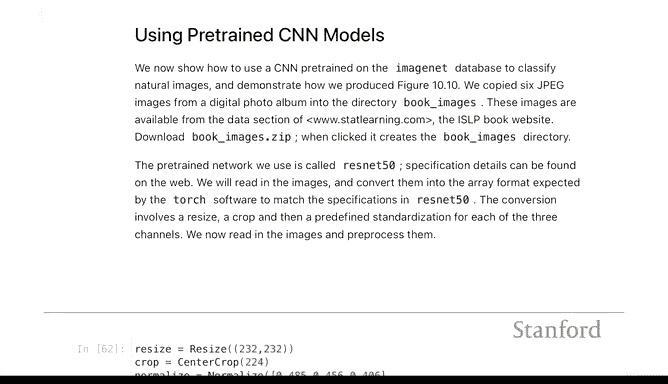

你可以使用预训练模型。Torchvision数据集包含称为Resnet的模型，有各种尺寸，如Resnet 50。这里的“50”可能指的是卷积和最大池化层的数量。这些模型是在一个包含1000个类别的图像分类问题上训练的。


因此，你现在可以传入自己的图像并查看不同的分类结果。我们鼓励你在课后尝试书中的一个示例，该示例展示了如何对照片进行分类，并提供了相应的代码。