# Python 版 82：文档分类与循环神经网络 📄➡️🧠

在本节课中，我们将学习如何使用两种不同的方法对IMDB电影评论进行情感分类（正面或负面）。我们将首先使用一种不考虑词序的“词袋”模型，然后将其与一种能够捕捉词序信息的循环神经网络模型进行对比。

---

## 概述

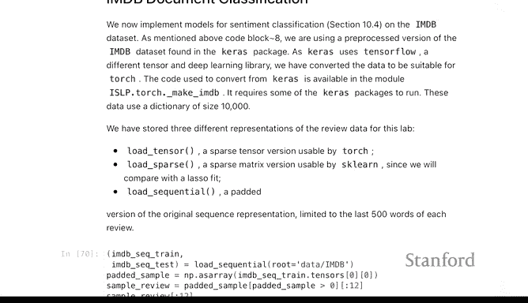

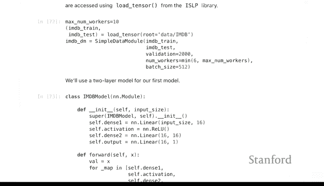

我们将处理一个文档分类任务。数据是IMDB的电影评论，每条评论是一个短文档。我们的目标是预测每条评论的情感是正面还是负面。我们将探索两种建模方法：
1.  **词袋模型**：忽略词序，仅统计每个词在文档中出现的次数。
2.  **序列模型**（使用LSTM）：考虑词在句子中的顺序信息。

我们将使用PyTorch来实现这些模型，并比较它们的性能。

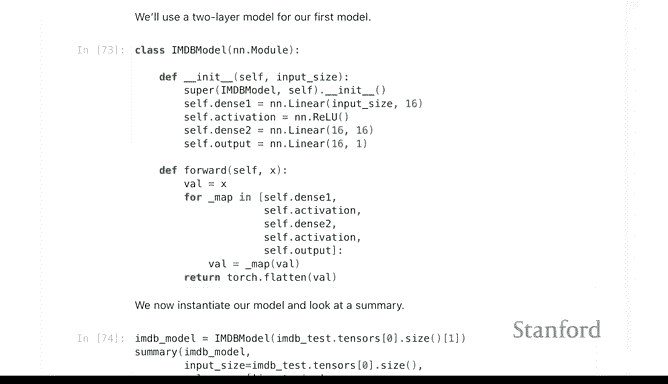

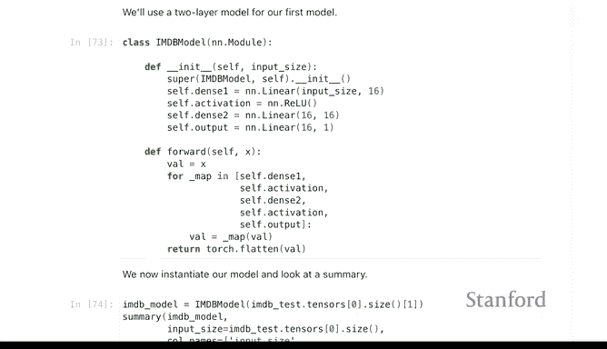

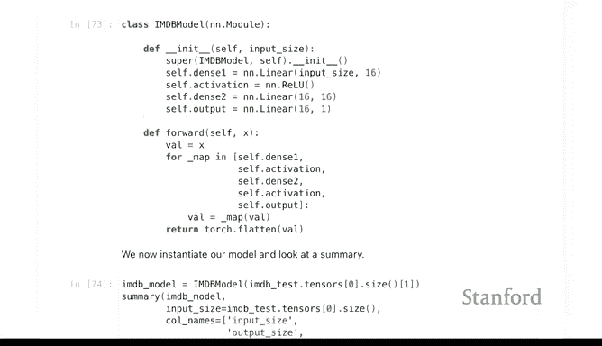

---

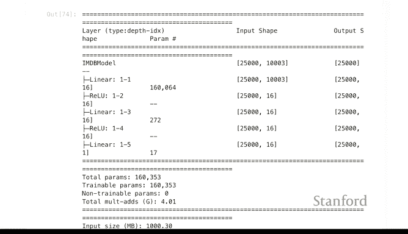

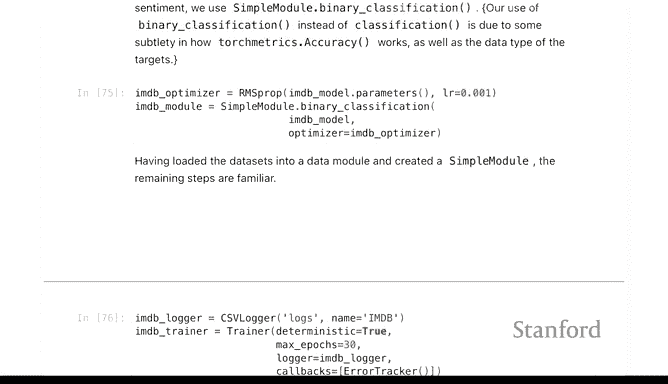

## 词袋模型方法 🛍️

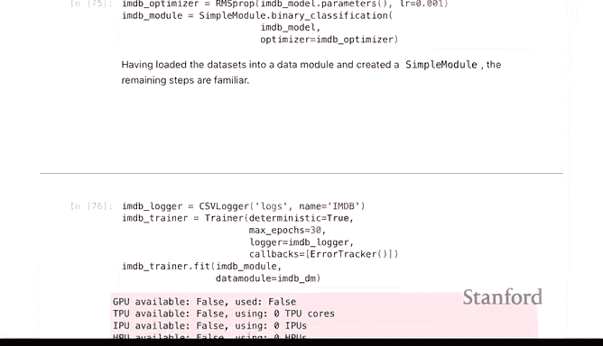

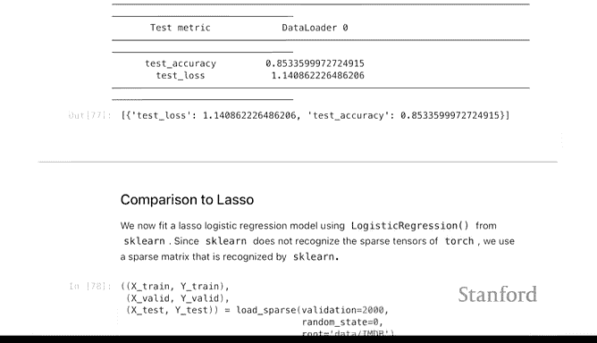

上一节我们介绍了任务背景，本节中我们来看看第一种方法——词袋模型。这种方法将每个文档表示为一个长向量，向量的长度等于词典的大小（本例中为10000）。向量中的每个元素对应一个词，其值表示该词在文档中出现的次数。由于文档通常只包含少量词汇，这个向量大多是0。

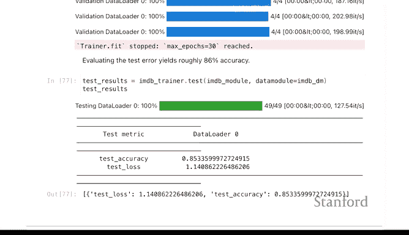

以下是构建和训练词袋模型神经网络的关键步骤：

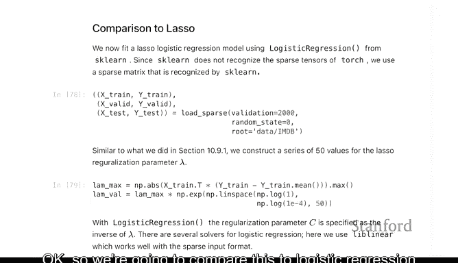

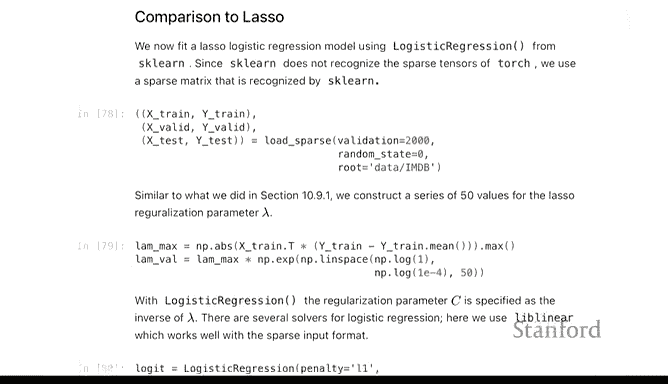

1.  **数据准备**：数据已预先处理。每条评论被转换为一个长度为10000的向量，其中包含了每个词的出现次数。
2.  **模型定义**：我们使用一个简单的单隐藏层神经网络。
    ```python
    class Net(nn.Module):
        def __init__(self, input_size):
            super(Net, self).__init__()
            self.hidden = nn.Linear(input_size, 16)  # 输入层到隐藏层
            self.output = nn.Linear(16, 1)           # 隐藏层到输出层
        def forward(self, x):
            x = torch.relu(self.hidden(x))
            x = torch.sigmoid(self.output(x))  # 用于二分类的Sigmoid激活函数
            return x
    ```
    其中 `input_size` 为 `10000`，对应输入特征的维度。
3.  **模型训练**：使用25000个训练样本进行训练，并在25000个测试样本上评估。
4.  **结果**：该模型在测试集上达到了约 **85%** 的准确率。

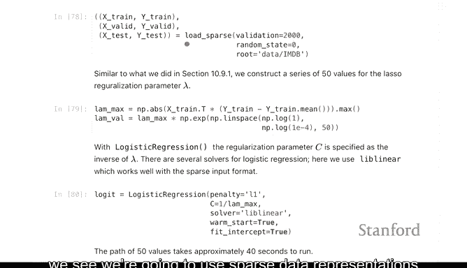

---

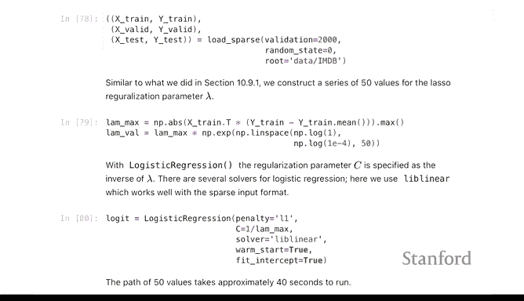

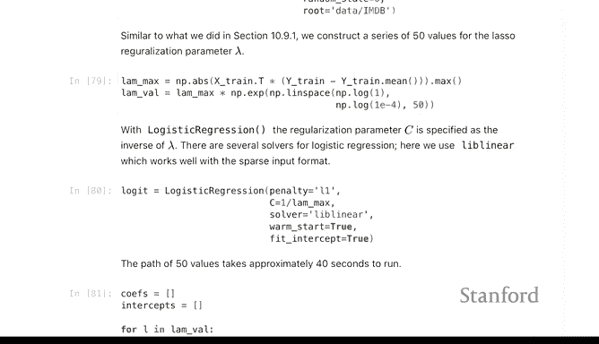

## 与Lasso逻辑回归对比 ⚖️

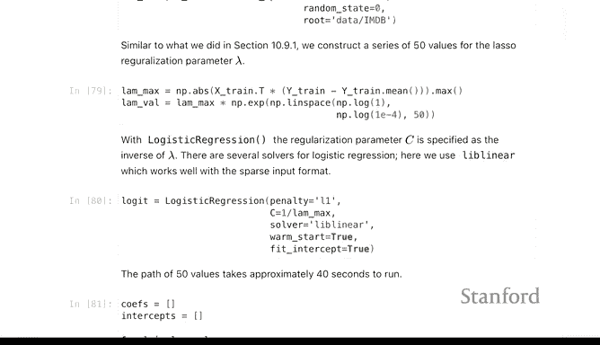

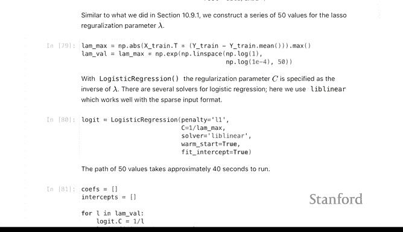

由于词袋模型相对简单，我们可以将其与传统的线性方法（如Lasso正则化逻辑回归）进行比较。Lasso特别适合这种特征维度（10000）远大于样本量的“宽”数据集，因为它可以自动进行特征选择。

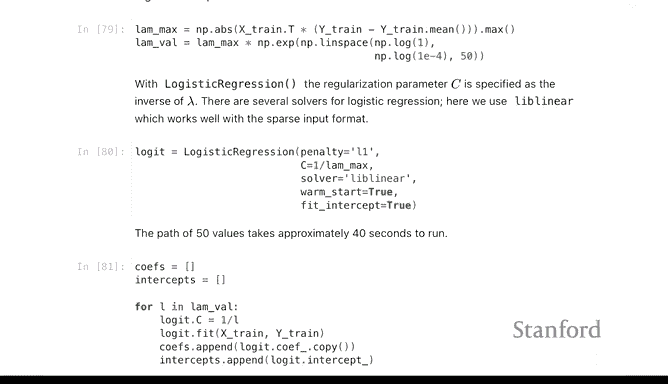

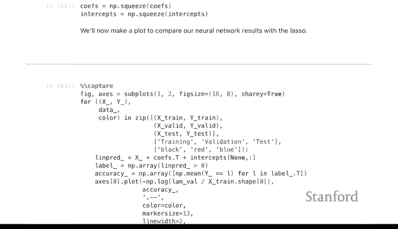

以下是关键对比点：

*   **数据表示**：为了高效处理大量零值，我们使用稀疏矩阵来表示数据。
*   **性能比较**：我们绘制了Lasso在不同正则化强度（λ）下的测试准确率曲线，以及神经网络在不同训练周期（epoch）下的测试准确率曲线。
*   **对比结论**：Lasso模型在测试集上的准确率峰值约为 **88%**，略高于简单的单层神经网络（约85%）。这个例子表明，对于某些问题，复杂的神经网络并不总是必要的，简单的线性模型也能取得相当甚至更好的效果。

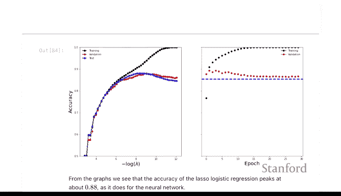

---

## 序列模型：LSTM与词嵌入 🔄

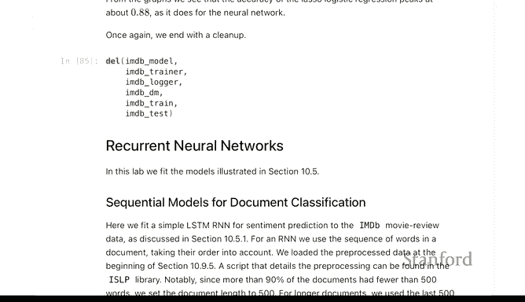

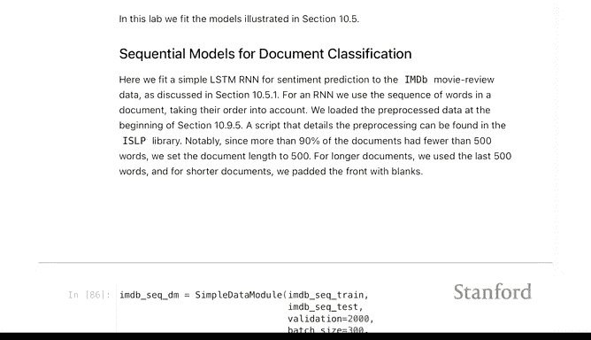

现在，我们转向第二种方法，看看如何利用词序信息。我们将使用长短期记忆网络（LSTM），这是一种循环神经网络（RNN），专门用于处理序列数据。

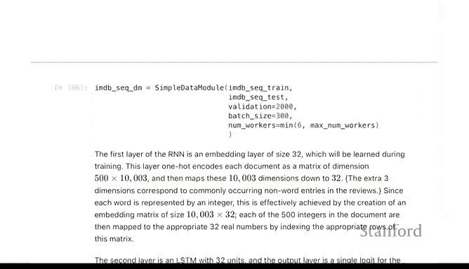

与词袋模型不同，序列模型需要保留词的顺序。因此，数据被重新处理：每条评论被填充或截断为固定长度500个词，并表示为这些词在词典中的索引序列。

以下是构建LSTM模型的核心步骤：

1.  **词嵌入层**：首先，我们使用一个嵌入层将每个词的索引（1-10000）映射到一个低维的连续向量空间（例如32维）。这可以表示为：
    `嵌入向量 = Embedding(词索引)`
    这一层将 `10000 x 32` 个参数，把稀疏的高维表示转换为稠密的低维表示。
2.  **LSTM层**：嵌入层的输出是一个500x32的序列矩阵（500个时间步，每个时间步一个32维向量）。LSTM层会按顺序处理这个序列，尝试捕捉前后文信息。我们使用一个具有32个隐藏单元的LSTM。
3.  **输出层**：最后，我们将LSTM最后一个时间步的输出（或所有输出的聚合）通过一个全连接层映射到单个值，用于情感预测。
4.  **模型定义示例**：
    ```python
    class SeqNet(nn.Module):
        def __init__(self, vocab_size=10000, embed_size=32, hidden_size=32):
            super(SeqNet, self).__init__()
            self.embedding = nn.Embedding(vocab_size, embed_size)
            self.lstm = nn.LSTM(embed_size, hidden_size, batch_first=True)
            self.fc = nn.Linear(hidden_size, 1)
        def forward(self, x):
            x = self.embedding(x)  # 形状: (batch, 500, 32)
            _, (hidden, _) = self.lstm(x)  # 获取最后时间步的隐藏状态
            output = torch.sigmoid(self.fc(hidden.squeeze(0)))
            return output
    ```
5.  **结果**：这个更复杂的LSTM模型在测试集上的准确率也约为 **85%**，与简单的词袋神经网络和Lasso模型性能相近。

---

## 总结

本节课中我们一起学习了IMDB文档分类任务。我们比较了三种方法：
1.  基于词袋表示的单层神经网络。
2.  Lasso正则化逻辑回归。
3.  结合词嵌入的LSTM循环神经网络。

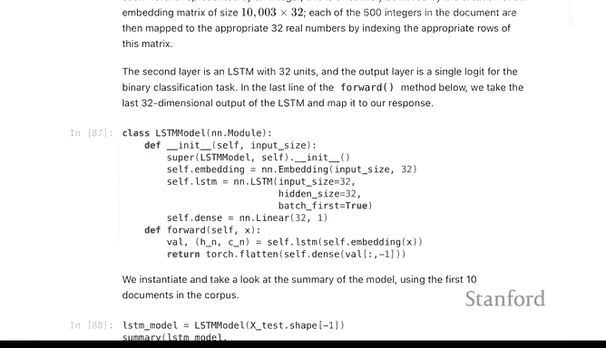

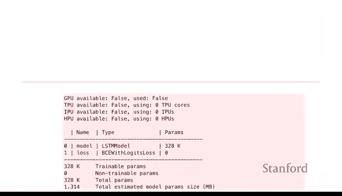

关键结论是：**在这个特定任务上，更复杂的序列模型（LSTM）并未显著超越简单的词袋模型或线性模型（Lasso）**。这说明了几个重要观点：
*   对于文本分类，词袋模型常常是一个强大且高效的基线。
*   像Lasso这样的线性模型在高维稀疏数据上表现优异，且计算效率高。
*   尽管PyTorch等工具让定义复杂模型（如嵌入层和LSTM）变得简单，但模型选择仍需基于具体问题和数据，并非越复杂越好。

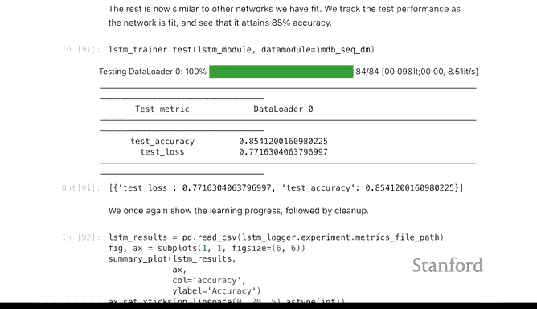


在实践中，建议从简单模型开始，将其作为基准，再尝试更复杂的模型，以确定性能提升是否值得增加的复杂性。