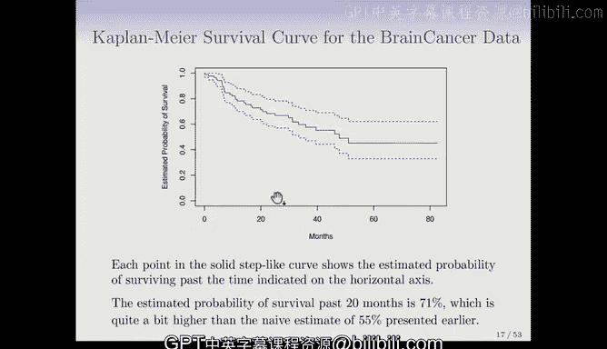

# Python 版 83：生存数据与删失介绍 📊

在本节课中，我们将学习生存分析的基础知识。生存分析处理一种特殊类型的结局变量：事件发生所需的时间。我们将了解什么是删失数据，为什么它很重要，以及如何在不丢弃这些宝贵信息的情况下进行分析。

---

## 什么是生存分析？⏳

生存分析关注一种特殊类型的结局变量，即事件发生所需的时间。

例如，假设我们进行了一项为期五年的医学研究，患者接受了癌症治疗。我们希望建立一个模型，利用患者的特征（如健康指标或治疗类型）来预测患者的生存时间。

这听起来像是一个回归问题，但这里有一个重要的复杂情况：一些患者可能存活到了研究结束。这类患者的生存时间被称为**删失**。

删失数据会带来问题，因为有时高达70%或80%的患者数据是删失的。我们不想丢弃这些数据，因为即使是不完整的信息（例如，患者至少存活了五年）也包含了关于患者及其特征的重要信息。

---

## 生存分析的应用领域 🌍

生存分析最初主要应用于医学领域，但也适用于任何存在删失结局的场景。

例如，一家公司想要对客户流失进行建模。流失事件是指客户取消服务订阅。公司可能会在一段时间内收集客户数据，以找出哪些客户最有可能取消服务。在研究结束时，并非所有客户都取消了订阅。对于这些客户，流失时间（即事件发生时间）是删失的。

如果公司能预测哪些客户可能流失，他们就可以采取行动，例如致电客户并提供特别优惠以留住他们。

生存分析在统计学领域已被深入研究五六十年，但在机器学习社区中尚未得到广泛关注，不过它正变得越来越流行和重要。

---

## 核心概念与符号 📝

对于每个个体（可以是人或观察单位），我们假设存在一个真实的**失效时间**（或事件时间）和一个真实的**删失时间**。

*   **生存时间** `T`：感兴趣事件（如死亡）发生的时间。
*   **删失时间** `C`：删失发生的时间（例如，患者退出研究或研究在其发生事件前结束）。
*   **观测时间** `Y`：我们实际观测到的时间，是 `T` 和 `C` 中的较小值：`Y = min(T, C)`。
*   **事件指示符** `Δ`：这是一个指示变量，用于标记观测到的是否为真实事件。
    *   `Δ = 1` 如果 `T ≤ C`（观测到失效/事件）。
    *   `Δ = 0` 如果 `T > C`（观测到删失）。

因此，我们的训练数据通常由 `n` 对 `(Y, Δ)` 组成，每个观测对应一对。

---

## 删失的类型与潜在偏倚 ⚠️

我们需要关注删失的性质，以及它是否会偏倚我们的分析。

假设许多患者因为病情严重而退出一项癌症研究。如果他们退出的原因与他们的生存时间相关（例如，病情越重越可能提前退出），而我们不考虑这个原因，就会产生偏倚。

在这种情况下，生存时间会被高估，因为我们把他们当作普通的删失处理，而实际上他们可能很快就会死亡。同样，在比较不同群体（如男性和女性）时，如果某一群体因特定原因（如病情）更可能退出，比较结果也会产生偏倚。

为了处理这个问题，我们通常需要做出一个关键假设：在给定观测到的特征条件下，事件时间 `T` 与删失时间 `C` 是独立的。

这个假设非常便利，但每次分析时都需要仔细检查其合理性。通常无法通过统计方法直接检验，更多地需要与研究调查者沟通，了解删失发生的原因。

---

## 生存曲线 📉

处理生存数据时，一个基本的汇总工具是**生存曲线**。

生存函数 `S(t)` 定义为真实生存时间 `T` 大于某个固定时间 `t` 的概率：`S(t) = P(T > t)`。它是一个关于时间 `t` 的函数，并且随着 `t` 增大而减小。

例如，在客户流失的例子中，如果 `T` 是客户取消订阅的时间，那么生存函数 `S(t)` 就表示客户在时间 `t` 之后才取消订阅的概率。`t` 值越大，客户在 `t` 时间点之后才流失的可能性就越低。

---

## 卡普兰-迈耶估计量 🧮

现在，我们来看看如何利用包含删失的数据来估计生存曲线。这就是著名的**卡普兰-迈耶估计量**。

假设我们想估计患者存活超过20个月的概率。最直接的方法是计算存活超过20个月的患者比例。然而，这并不准确，因为它错误地处理了删失数据：如果把删失患者都当作死亡处理，会低估生存概率；如果忽略他们，又会高估。

卡普兰-迈耶估计量提供了一种巧妙的方法来无偏地处理删失。它的核心思想是计算一系列条件概率。

以下是其工作原理的简化说明：
1.  将数据按事件发生时间排序。
2.  在每个事件发生的时间点，计算“在存活到该时间点的条件下，度过该时间点（即在该时间点未发生事件）的概率”。
3.  将这些条件概率相乘，得到存活超过某个时间点的总体概率。

这种方法充分利用了删失数据的信息：删失个体只要仍在研究期内，就会参与风险集（分母）的计算，直到他们被删失。

对于之前提到的脑癌数据集，使用简单比例法（将删失视为死亡）估计的20个月生存概率为55%。而使用卡普兰-迈耶估计量得到的估计值为71%，这是一个更合理、更准确的估计。

卡普兰-迈耶曲线是生存分析中任何研究的首要且非常重要的数据汇总工具。

---

## 总结 🎯

本节课我们一起学习了生存分析的基础。我们了解到生存数据的特点是包含事件发生时间，并且经常存在删失。我们定义了生存时间 `T`、删失时间 `C`、观测时间 `Y` 和事件指示符 `Δ` 等核心概念。我们讨论了删失可能带来的偏倚问题，以及需要做出的独立性假设。最后，我们介绍了生存函数 `S(t)` 的概念，并学习了如何使用卡普兰-迈耶估计量来有效地估计生存曲线，从而充分利用包含删失信息的数据。