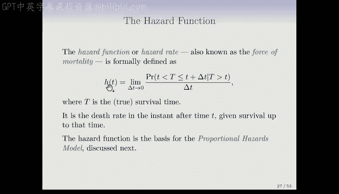
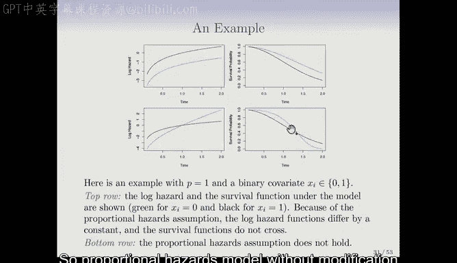

# Python 版 84：比例风险模型 📊

在本节课中，我们将学习生存分析中的核心回归模型——比例风险模型。我们将从回顾两样本比较的Log-rank检验开始，逐步过渡到如何利用协变量对生存时间进行建模。

---

## 从两样本比较到回归模型

上一节我们介绍了用于比较两组生存曲线的Log-rank检验。本节中，我们将看看如何将这种比较扩展到多组或连续型协变量的情况，即引入回归模型。

在生存分析中，由于存在删失数据，我们不能简单地使用线性回归模型对生存时间 `Y` 或其对数 `log(Y)` 进行建模。比例风险模型采用了一种巧妙的方法来解决这个问题。

## 风险函数：一个新的核心概念

在介绍模型之前，我们需要理解一个关键概念：**风险函数**，有时也称为“死亡力”。

风险函数 `λ(t)` 的定义是：个体在存活到时间 `t` 的条件下，在接下来一个极短的时间区间 `[t, t+Δt)` 内死亡的概率瞬时率。其数学表达式为：

`λ(t) = lim (Δt→0) [ P( t ≤ T < t+Δt | T ≥ t ) / Δt ]`

风险函数与生存函数 `S(t)` 存在一一对应的关系，但它为接下来的建模提供了更便利的形式。

## Cox比例风险模型

这个由David Cox在1972年提出的著名模型，其形式如下：

`λ(t | X_i) = λ_0(t) * exp(β_1 X_i1 + β_2 X_i2 + ... + β_p X_ip)`

其中：
*   `λ(t | X_i)` 是给定特征向量 `X_i` 的个体的风险函数。
*   `λ_0(t)` 是**基线风险函数**，它是任意、未指定的，随 `t` 变化。
*   `exp(β_1 X_i1 + ... + β_p X_ip)` 是**相对风险**，它依赖于特征 `X_i` 和待估计的参数 `β`。

该模型的核心假设是**比例风险**：不同个体间的风险函数成比例，比例系数为 `exp(X_i^T β)`，且不随时间改变。

## 比例风险假设的含义与示例

比例风险假设意味着什么？让我们看一个简单的二分类协变量例子（例如，性别：男/女）。

以下是比例风险情况下的图示：
*   **左图（对数风险）**：两条曲线平行，差距恒定。这正是 `log(λ(t))` 中 `X` 的效应为加性常数 (`β`) 的体现。
*   **右图（生存函数）**：对应的生存曲线不会相交。一组始终比另一组有更好的生存率。

相反，如果风险函数曲线发生交叉（即非比例风险），那么生存曲线也会交叉。此时，标准的Cox模型无法很好地刻画这种关系。比例风险是一个常用且合理的起点假设，实践中也有方法对其进行检验。

## 模型的优势

Cox模型之所以强大和流行，主要因为两点：
1.  **半参数特性**：它不对基线风险函数 `λ_0(t)` 的具体形式做任何假设，这使得模型非常灵活、稳健。
2.  **可解释性**：系数 `β_j` 具有明确的解释。`exp(β_j)` 表示在其他特征不变的情况下，特征 `X_j` 每增加一个单位，其**风险比**（Hazard Ratio）的变化倍数。

---

本节课中，我们一起学习了从Log-rank检验到Cox比例风险模型的过渡。我们介绍了风险函数的核心概念，详细阐述了Cox模型的形式与比例风险假设，并解释了该模型半参数特性的优势及其参数的可解释性。在接下来的课程中，我们将探讨如何拟合这个模型并进行参数估计。