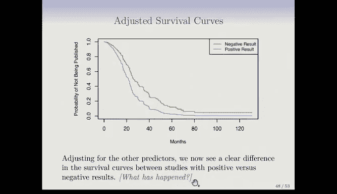

# Python 版 85：Cox比例风险模型的估计与应用 📊


在本节课中，我们将学习如何估计Cox比例风险模型中的系数β，并理解其在实际数据分析中的应用。我们将从部分似然估计的核心思想出发，逐步探讨模型的估计方法、与对数秩检验的关系，并通过实例展示其强大的分析能力。

## 部分似然估计：无需指定基准风险函数

上一节我们介绍了Cox比例风险模型的基本形式。本节中我们来看看如何估计模型中的权重系数β。

Cox提出了一个非常巧妙的“部分似然”思想。其精妙之处在于，我们无需指定之前一直未定义的基准风险函数 `h0(t)`，仍然可以获得系数β的良好估计。

我们采用与构建Kaplan-Meier曲线和对数秩检验相似的、基于时间顺序的逻辑。在给定事件发生时间 `Yi`，所有在该时间仍处于风险中个体的总风险是各自风险之和。以下是其公式表示：

```
总风险 = Σ_{j ∈ R(Yi)} h(Yi | Xj) = Σ_{j ∈ R(Yi)} h0(Yi) * exp(Xj^T β)
```

其中 `R(Yi)` 表示在时间 `Yi` 仍处于风险中的个体集合（即尚未发生事件或删失）。

假设我们观察在此时刻实际发生事件的个体，其风险与所有处于风险中个体的总风险之比是多少？可以想象在给定时刻，我们有一个装着彩色球的袋子，并以某种概率抓取其中一个（即发生事件的球）。我们本可能抓到其他任何一个球。因此，实际观察到死亡的个体，其死亡概率可以表示为：

```
P(个体i在Yi死亡 | 在Yi有人死亡) = h(Yi | Xi) / Σ_{j ∈ R(Yi)} h(Yi | Xj)
```

非常巧妙的是，由于这是一个风险比，基准风险函数 `h0(Yi)` 在分子和分母中**恰好抵消**。我们得到一个不依赖于 `h0` 的函数。无论 `h0` 是什么形式，我们都不必关心，只需关注这个相对风险。这个概率就是在模型下，观察到实际死亡的个体在所有可能死亡的个体中发生的概率。

## 构建部分似然函数

请注意基准风险函数的抵消过程。现在，就像我们构建Kaplan-Meier曲线时连乘条件概率一样，我们将所有事件发生时间点的这些概率相乘。

任何似然函数，在样本独立的情况下，都是每个观测样本概率的乘积。部分似然也是如此。在某种意义上，这是在模型下观察到我们实际观测到数据的概率。

以下是部分似然函数的构建步骤：
1.  对于每一个观测到的事件发生时间点 `Yi`，计算该时刻实际事件发生者的相对风险概率。
2.  将所有事件发生时间点的这些概率相乘。
3.  这个乘积就是部分似然函数 `L(β)`，它仅是系数β的函数。

然后，我们将寻找能使这个似然函数值最大的参数β。即使得在当前模型下，观测数据出现的可能性最高。这就是**最大似然估计**的核心思想。

## 一个简单的计算示例

我们沿用之前的例子，有三个失效事件（用金色圆圈表示）和一些删失观测值。

以下是针对三个失效事件计算的部分似然项，与之前看到的类似，但只在死亡时间进行计算：
*   **第一个失效事件**：在第一个死亡时间，计算其相对风险概率 `L1(β)`。
*   **第二个失效事件**：在第二个死亡时间，计算 `L2(β)`。
*   **第三个失效事件**：在第三个死亡时间，计算 `L3(β)`。

删失观测同样会出现在后续死亡时间点的风险集合分母中。我们将这三个似然项相乘，得到完整的部分似然函数 `L(β) = L1(β) * L2(β) * L3(β)`。这个函数是β（我们特征的权重向量）的函数。接下来我们通过最大化这个函数来求解β。

与逻辑回归等许多模型类似，此问题没有**解析解**。我们必须使用迭代算法进行数值优化，但这在现代软件中已非常容易实现。

## 模型输出的丰富信息

我们不仅能得到称为“最大部分似然估计”的系数估计值，还能获得类似于最小二乘回归和逻辑回归中的其他有用信息。

以下是模型输出通常包含的信息：
*   **假设检验的P值**：用于检验某个系数 `βj = 0`。这常用来判断某个特征是否对患者的风险有贡献。
*   **标准误**：衡量系数估计的精度。
*   **置信区间**：为系数估计提供范围。

因此，我们从线性模型和回归中熟悉的所有统计工具，在Cox模型的部分似然框架中同样可用。

## Cox模型与对数秩检验的联系

我们已经掌握了回归方法和对数秩检验。回想在线性回归中，我们检验系数是否为零。当预测变量是单一的0/1变量（如性别）时，对系数的T检验等价于两样本T检验。如果两者不等价，我们会感到困惑，但事实上回归分析中它们是一致的。

同样的情况也发生在Cox比例风险模型中。当存在一个只取两个值的单一预测变量时，我们可以拟合Cox模型，也可以执行对数秩检验。书中提到了一些细节：从Cox模型中提取检验统计量有几种方法，其中一种常用的是**得分检验**。

令人满意的是，在单一二分类协变量的情况下，Cox比例风险模型中检验 `β=0` 的得分检验，**完全等价于对数秩检验**。这就像线性模型中的T检验与回归检验一致，是一个简洁完美的联系。

## 关于模型细节的说明

关于比例风险模型，你可能注意到模型中没有截距项。为什么？如果我们在模型中加入截距 `β0`，它会以 `exp(β0)` 的形式出现，而这个因子可以被吸收到未指定的基准风险函数 `h0(t)` 中。因为它不是X的函数，在计算风险比时同样会被抵消，不提供任何信息，因此没有包含的必要。

我们之前讨论过对数秩检验中**结事件**（同一时间点发生多个事件）的可能性。Cox模型也能处理结事件，虽然更复杂一些，但相关软件已经由聪明的研究者们完善解决了。

你可能会好奇为什么称之为“部分似然”。因为它并非完整似然，由于未指定 `h0(t)`，这种构建方式非常方便，但不是完全的“最大似然”，而是一种非常好的近似。若对底层理论感兴趣，建议阅读更多资料。

## 从模型获取预测生存曲线

我们最初从Kaplan-Meier生存曲线谈起，生存函数是生存数据的重要概括。对于带有协变量的Cox模型，我们不仅关注相对风险参数，也关注基于协变量的生存曲线 `S(t|X)`。我们可能想问：对于具有特定特征向量（如特定临床测量的男性或女性）的个体，其预测生存曲线是怎样的？

你也可以从Cox模型中得到这个，即**整个预测生存曲线作为其特征的函数**。这与通常的回归不同：在回归中，我们通常只估计给定X时响应的均值；而在这里，我们得到了**整个条件分布**的估计。

## 实例分析：脑癌数据

现在让我们看一个将比例风险模型应用于脑癌数据的实例。模型会输出一个类似回归的摘要表格，包含特征、系数估计、标准误、Z统计量和双侧P值。

这是一个**多元模型**，所有特征被一起拟合。结果显示，“Karnofsky指数”和“诊断结果”（高级别胶质瘤）是显著的特征。这正是Cox比例风险模型的卓越之处：它将包含删失的复杂生存分析问题，转化为一个拥有所有常规统计量的回归问题，使其非常易于使用，这也是其广受欢迎的原因之一。

**系数的解释**关乎相对风险。以Karnofsky指数为例，其系数β约为-0.5，这意味着相对风险为 `exp(-0.5) ≈ 0.95`。解释为：Karnofsky指数每增加一个单位，相对风险**降低约5%**。这里需要注意系数的符号：负系数通常被认为是“不好”的，但在此模型中，因为建模的是相对风险，**负系数是好的**，表示风险降低。这是一个需要牢记的重要细节。

## 实例分析：论文发表数据

另一个例子是教材中提到的论文发表数据集，研究的是美国国立卫生研究院报告的临床试验结果发表所需的时间（以月为单位）。共244项试验，其中88项在研究期间未发表（视为删失），其余已发表。

以下是该数据集的关键信息：
*   **结局变量**：直至发表的时间。
*   **协变量**：包含许多特征，其中一个特别受关注的是：临床试验结果是否显著阳性是否会使其更早发表。

如果忽略其他特征，仅绘制两组（阳性结果 vs. 阴性结果）的Kaplan-Meier曲线，两者差异似乎不大。对数秩检验的P值为0.36，在忽略其他特征的情况下，结果似乎不显著。

但当我们使用Cox比例风险模型进行**多元分析**时，情况发生了变化。在调整了其他可能的混杂因素后，“阳性结果”这一特征的P值变得**非常显著**，期刊影响因子等其他特征也重要。这表明最初生存曲线的相似性可能是由**混杂因素**造成的，而多元分析的目的正是为了调整这些因素。调整后显示，阳性结果对缩短发表时间有强烈的正面效应。

## 绘制调整后的生存曲线

我们可以利用这个多元模型更进一步，绘制**调整后的生存曲线**。我们希望得到给定特征X的生存曲线估计 `S(t|X)`，并针对阳性和阴性结果进行比较，同时调整其他特征。

最初绘制两条曲线时，我们只是简单地在两组内平均了其他特征。如果这些特征在两组中的分布不同，就会产生混杂。现在，为了清晰比较，我们需要确保在观察两条曲线时，两组中的其他特征取值相同。这意味着我们需要为这些其他特征选择一个固定值。最合理的做法是使用**均值**（对于连续变量）和**最常出现的类别**（对于分类变量，如资助机制中的R01类别）。

将其他特征设定为固定值后，我们可以在阳性结果和阴性结果之间进行清晰的比较。此时，我们看到的生存曲线呈现出**明显的差异**。这正是通过统计模型控制混杂、揭示真实关联的威力所在。

---



**本节课总结**：我们一起学习了Cox比例风险模型的估计方法——部分似然估计，它巧妙地避免了指定基准风险函数。我们探讨了模型系数的解释、其与对数秩检验的等价关系，以及如何从模型中获得预测生存曲线。通过脑癌数据和论文发表数据的实例，我们看到了Cox模型在多元生存分析中的强大应用，包括如何通过调整协变量来揭示被混杂因素掩盖的真实效应，并绘制调整后的生存曲线进行比较。