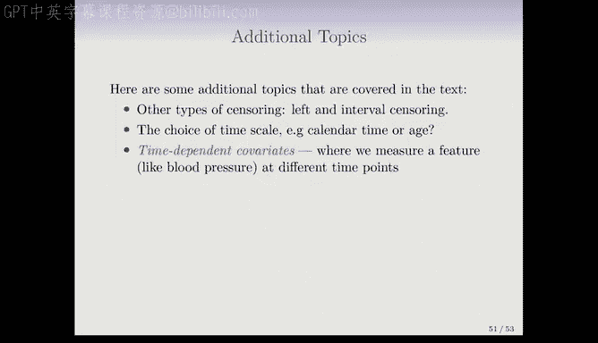
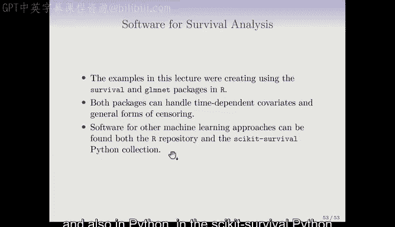

# Python 版 86：模型评估与进阶主题 🧪

在本节课中，我们将学习生存分析中一个重要的模型评估指标——C指数，并简要了解生存分析中的一些进阶主题，如不同类型的删失、时间尺度选择、时变协变量以及比例风险假设的检验。


---

## C指数：生存分析的AUC 📈

上一节我们介绍了生存分析中的Cox比例风险模型。本节中，我们来看看如何评估这类模型的预测性能。对于分类问题，我们常用AUC（曲线下面积）来衡量分类器的准确性。在生存分析中，有一个与之类似的、非常有用的指标，称为C指数（或一致性指数）。

C指数提供了一种评估Cox模型（或任何生存模型）在测试集上拟合效果的吸引人的方法。

以下是计算C指数的基本思路：
1.  首先，根据Cox模型为测试集中的每个个体计算一个估计的风险评分。例如，在之前的出版物数据中，我们得到系数后，为每项研究计算估计的风险评分 `\hat{\eta}_i`（其中 `i` 索引一个观测）。
2.  C指数计算的是**模型能正确预测观测相对顺序的配对比例**。

具体而言，我们在测试集中考虑任意两个个体（或研究）的配对。如果一个个体的事件发生时间比另一个长，那么一个正确的模型应该预测其风险评分更低（因为风险越低意味着生存时间可能越长）。

C指数的公式可以表示为在所有**可比较**的配对 `(i, i')` 中，模型预测正确的比例：

```
C-index = (可比较的配对中，满足 Y_i > Y_i' 且 \hat{\eta}_i' > \hat{\eta}_i 的配对数量) / (总可比较配对数量)
```

这里的 `Y` 表示生存时间，`\Delta`（事件指示符）用于筛选那些我们能够确定谁先发生事件的配对。例如，如果一个患者在9个月时被删失，另一个患者在10个月时死亡，我们无法确定谁的生存时间更长，因此这样的配对不计入可比较的范围。

**核心概念解释**：C指数本质上是模型在所有能够确定顺序的配对中，正确预测相对生存时间的比例。

对于出版物数据，我们在测试集上计算出的C指数约为0.773。这大致意味着，对于任意一对论文，模型能以约77.3%的准确率预测哪一篇会先发表。这种解释非常类似于分类问题中AUC的解释。

---

## 生存分析中的进阶主题 🔮

在介绍了核心的模型评估方法后，我们简要浏览一些生存分析中的其他重要主题，这些内容在教材中有更详细的阐述。

### 不同类型的删失

我们之前讨论的删失主要是**右删失**（在研究结束时个体尚未发生事件）。但实际上还存在其他类型的删失：
*   **左删失**：在研究开始前，事件已经发生，但我们只知道它发生在某个时间点之前。
*   **区间删失**：我们只知道事件发生在某个时间区间内，而非精确时间点。
值得庆幸的是，我们讨论过的生存曲线、对数秩检验和Cox模型等统计方法，都可以处理这些不同类型的删失。

### 时间尺度的选择

通常，生存分析使用日历时间作为时间尺度。但在某些研究中，选择其他时间尺度可能更有意义。例如，如果研究年龄对生存的影响，可能会选择以年龄作为时间尺度。这是一个有时会遇到的有趣话题。

### 时变协变量

在之前看到的大多数回归例子中，每个个体的协变量（预测变量）通常是在研究开始时测量一次，之后保持不变。然而，在一些生存研究中，我们会随时间跟踪患者并多次测量某些指标（如血压）。

Cox模型的一个非常强大的特性是它能够纳入这种**时变协变量**的影响。这是因为在构建风险集时，一个观测会出现在多个时间点的风险集中。在计算每个时间点的风险时，只需使用该个体在该时间点的当前协变量值即可。虽然背后有丰富的统计理论，但其实现相对直观。

### 比例风险假设的检验

比例风险假设是Cox模型的一个核心前提。检查数据是否满足这一假设非常重要，教材中对此有简要讨论。如果假设不成立，则需要考虑其他模型或对Cox模型进行扩展。

### 其他机器学习方法

本课程主要讨论了Cox比例风险模型，它是生存数据的线性回归类比。但课程中介绍的其他学习方法，如随机森林、提升法和神经网络，也有各自处理生存数据的方式，其中一些方法避免了比例风险假设。这些方法正变得越来越流行，并且目前仍在积极发展中。



### 软件实现

本章的所有示例都是使用R语言中的`survival`包（由Terry Therneau开发）和`glmnet`包完成的。这些软件包能够处理我们讨论过的所有内容，包括时变协变量和其他形式的删失。

当然，在其他编程语言中也有相应的软件：
*   **R语言**：除了`survival`包，还有其他包可以实现不同类型的生存模型。
*   **Python**：例如`lifelines`库等，也提供了丰富的生存分析工具。

---

## 总结 📝


本节课中我们一起学习了：
1.  **C指数**：作为生存分析中类似于AUC的模型评估指标，它衡量了模型预测个体生存时间相对顺序的准确率。
2.  **进阶主题概览**：包括左删失与区间删失、时间尺度的选择、时变协变量的纳入、比例风险假设的检验，以及其他机器学习方法在生存分析中的应用。
3.  **软件工具**：了解了在R和Python中实现生存分析的主要软件包。



掌握C指数有助于我们量化生存模型的预测性能，而了解这些进阶主题则为处理更复杂的生存数据分析问题奠定了基础。