# Python 版 87：生存分析实验 - 脑癌数据 I 🧠

在本节课中，我们将学习生存分析的基本方法。生存分析用于研究事件发生的时间，例如癌症患者的死亡时间或文档的发表时间。我们将重点学习如何绘制**Kaplan-Meier曲线**以及拟合**Cox比例风险模型**，这些方法专门用于处理包含**删失数据**（即研究结束时事件尚未发生或个体提前退出研究的数据）的时间数据。

---

## 导入必要的库 📦

首先，我们需要导入一些常用的数据分析库，以及专门用于生存分析的 `lifelines` 包。

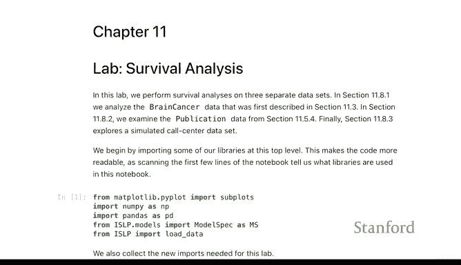

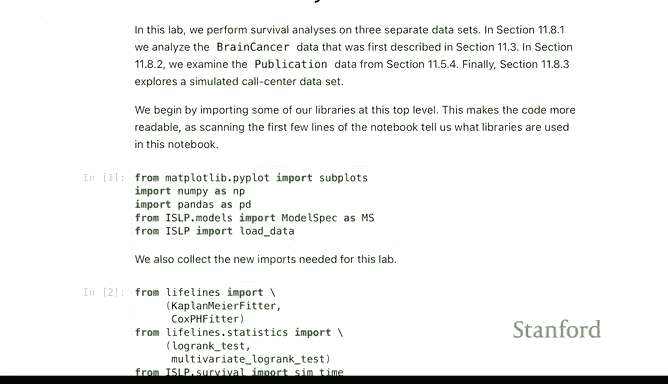

```python
import pandas as pd
import numpy as np
import matplotlib.pyplot as plt
import seaborn as sns
from lifelines import KaplanMeierFitter, CoxPHFitter
from lifelines.statistics import logrank_test
```

---

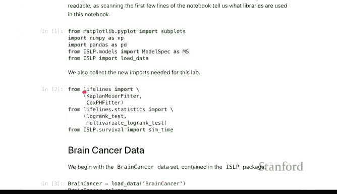

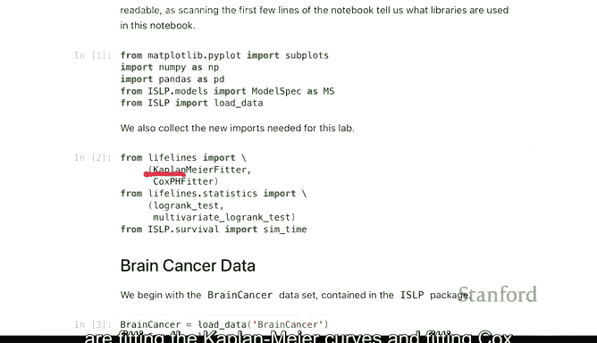

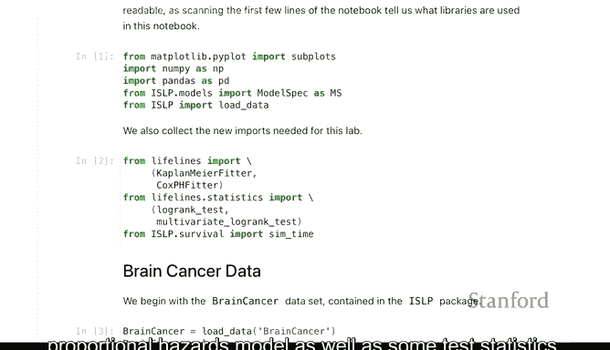

## 加载与理解数据 🔍

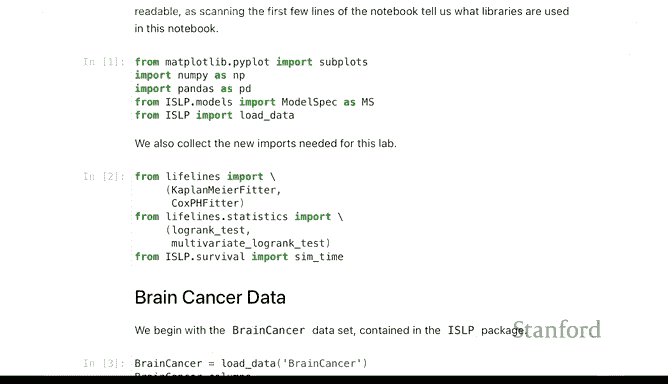

我们使用的第一个数据集是脑癌数据集。让我们加载并查看其结构。

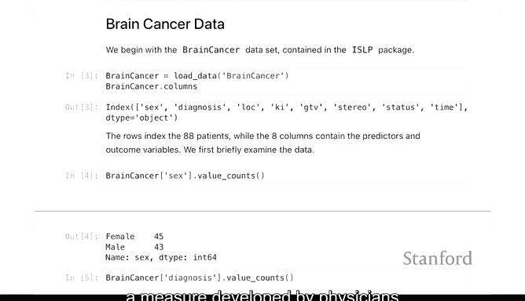

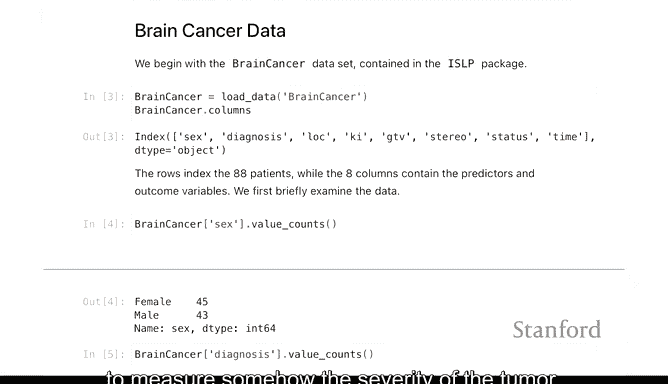

```python
# 假设数据已加载为 DataFrame `brain_cancer`
print(brain_cancer.head())
print(brain_cancer.info())
```

数据集中包含每位患者的多个特征，例如诊断类型、性别、**Karnofsky指数**（衡量肿瘤严重程度的指标）和肿瘤体积。最关键的两个变量是：
*   `time`: 记录的时间（生存时间）。
*   `status`: 删失指示变量。通常，`status=1` 表示事件（如死亡）发生，`status=0` 表示在研究结束时个体仍存活（数据被删失）。

---

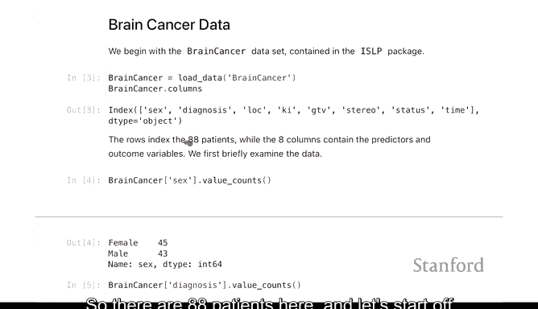

## 绘制Kaplan-Meier生存曲线 📉

上一节我们介绍了生存数据的特点，本节中我们来看看如何直观地展示整体的生存情况。**Kaplan-Meier曲线**是估计生存函数 \( S(t) \) 的非参数方法，它表示生存时间超过 \( t \) 的概率。

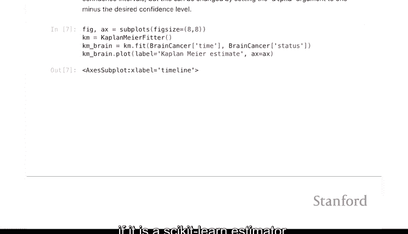

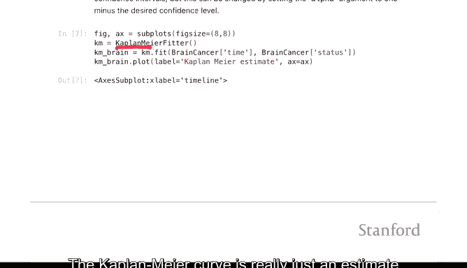

以下是绘制整体Kaplan-Meier曲线的步骤：

```python
# 初始化KaplanMeierFitter
kmf = KaplanMeierFitter()

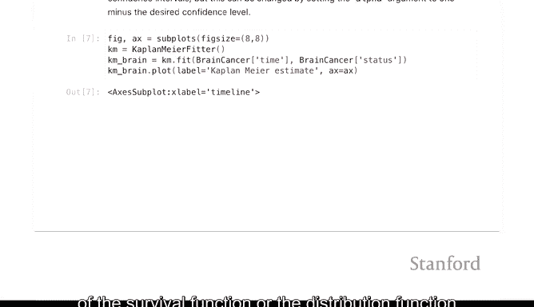

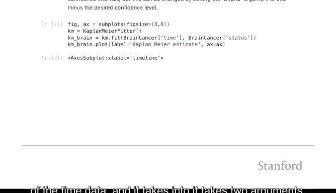

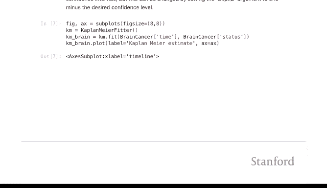

# 拟合模型，需要传入时间列和事件状态列
kmf.fit(durations=brain_cancer['time'], event_observed=brain_cancer['status'])

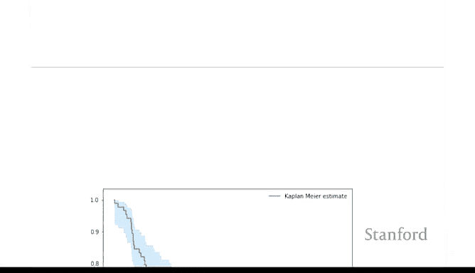

# 绘制生存曲线
kmf.plot_survival_function(linewidth=2)
plt.title('Kaplan-Meier Survival Curve (Overall)')
plt.ylabel('Estimated Survival Probability S(t)')
plt.xlabel('Time')
plt.grid(True, alpha=0.3)
plt.show()
```

曲线显示了生存概率随时间下降的趋势。随着时间推移，置信区间（误差带）会变宽，这是因为在后期，仍然处于风险中并可用于估计的个体数量减少。

---

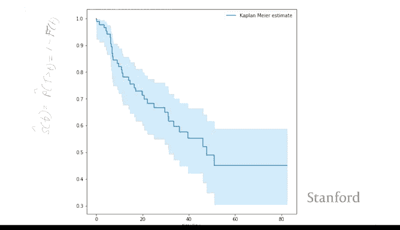

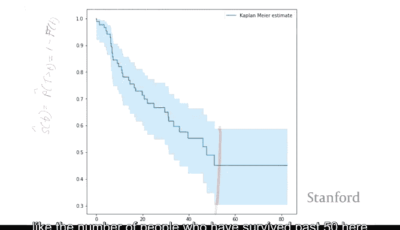


## 按组别比较生存曲线 ⚖️

通常，我们关心不同组别（如不同性别）的生存情况是否有差异。我们可以绘制分层的Kaplan-Meier曲线进行比较。

以下是按性别分组绘制生存曲线的代码：

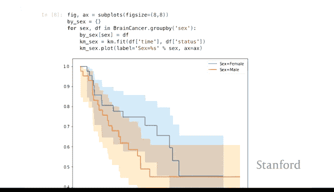

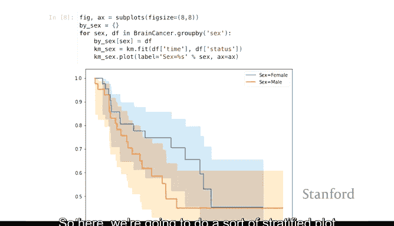

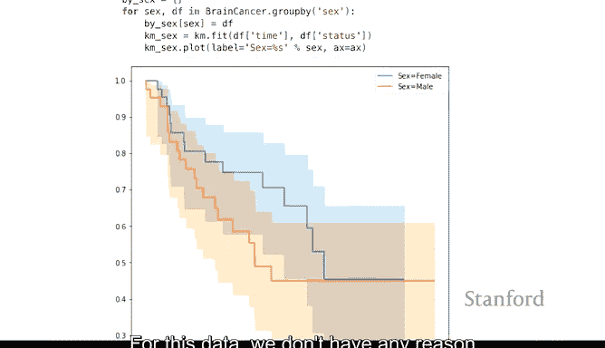

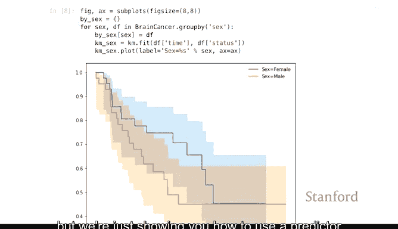

```python
# 按性别分组数据
groups = brain_cancer['sex'].unique()
ax = plt.subplot(111)

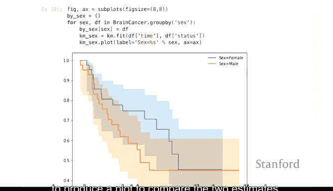

for name, grouped_df in brain_cancer.groupby('sex'):
    kmf = KaplanMeierFitter()
    kmf.fit(durations=grouped_df['time'], event_observed=grouped_df['status'], label=name)
    kmf.plot_survival_function(ax=ax, linewidth=2)

plt.title('Kaplan-Meier Survival Curve by Sex')
plt.ylabel('Estimated Survival Probability S(t)')
plt.xlabel('Time')
plt.grid(True, alpha=0.3)
plt.show()
```

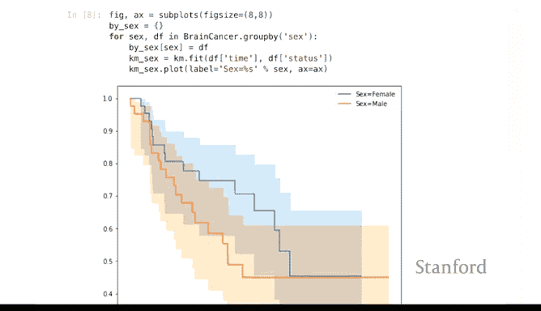


从图中可能观察到差异，但需要统计检验来确认。

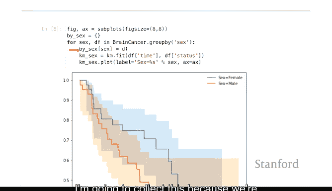

---

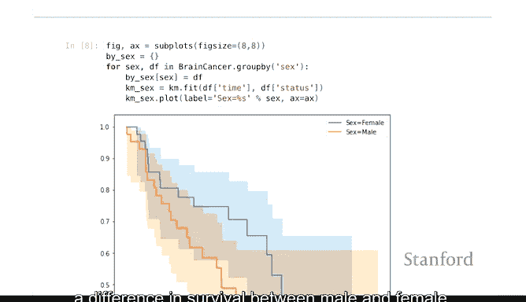

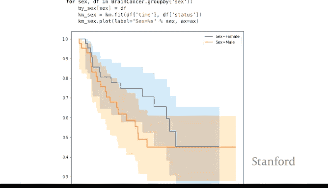

## 使用Log-Rank检验进行统计比较 📊

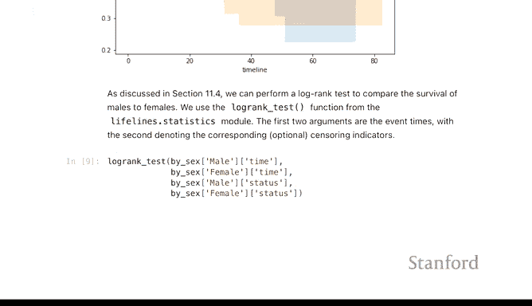

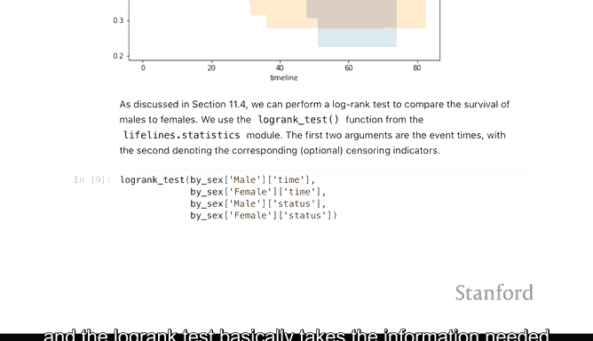

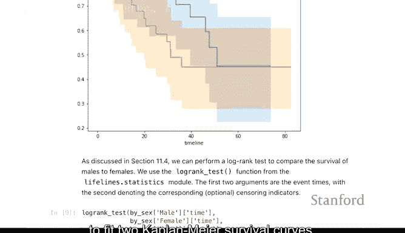

为了定量评估两组（如男性和女性）生存曲线是否存在显著差异，我们使用**Log-Rank检验**。

以下是执行Log-Rank检验的代码：

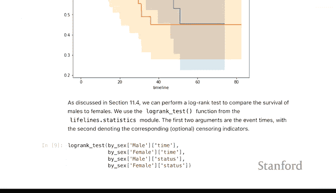

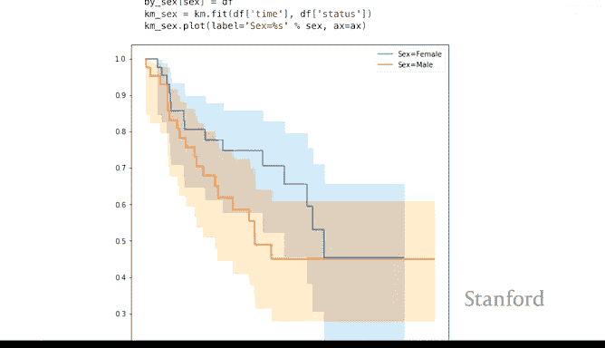

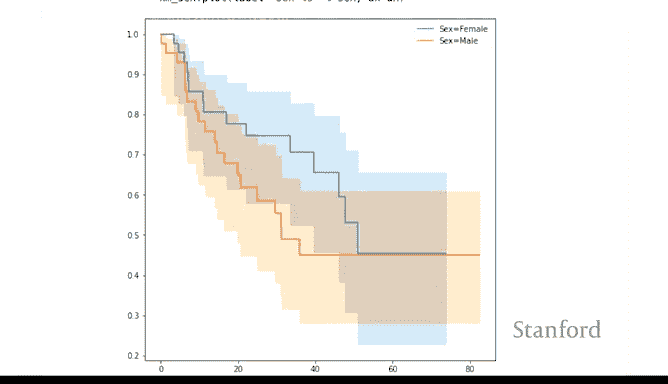

```python
# 将数据按性别分开
T_male = brain_cancer[brain_cancer['sex'] == 'Male']['time']
E_male = brain_cancer[brain_cancer['sex'] == 'Male']['status']
T_female = brain_cancer[brain_cancer['sex'] == 'Female']['time']
E_female = brain_cancer[brain_cancer['sex'] == 'Female']['status']

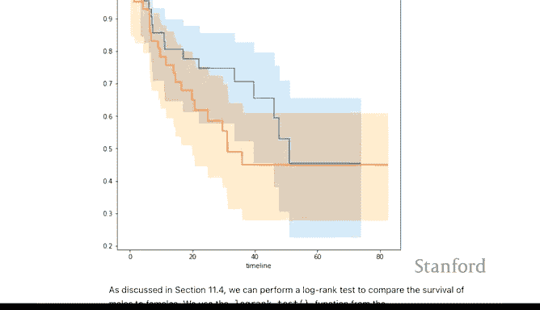

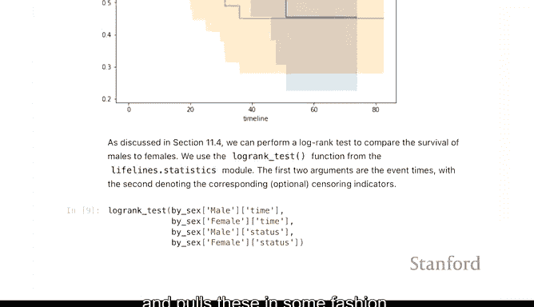

# 执行Log-Rank检验
results = logrank_test(T_male, T_female, event_observed_A=E_male, event_observed_B=E_female)
results.print_summary()
```

如果p值很小（例如<0.05），则表明两组生存率存在显著差异。在本例中，p值约为0.23，说明在这个数据集上，性别间的生存差异在统计上并不显著。

---

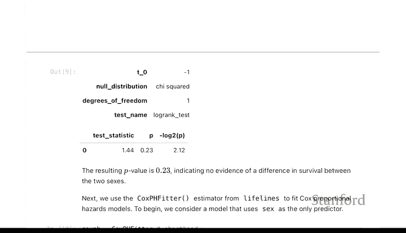

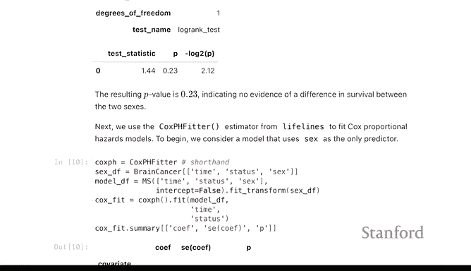

## 拟合Cox比例风险模型 📈

当我们需要同时考虑多个预测变量（协变量）对生存时间的影响时，就需要使用回归模型。**Cox比例风险模型**是生存分析中最常用的回归模型。它的风险函数形式为：
\[ h(t, \mathbf{x}) = h_0(t) \exp(\beta_1 x_1 + \beta_2 x_2 + ... + \beta_p x_p) \]
其中 \( h_0(t) \) 是基准风险函数，\( \beta \) 是模型系数。

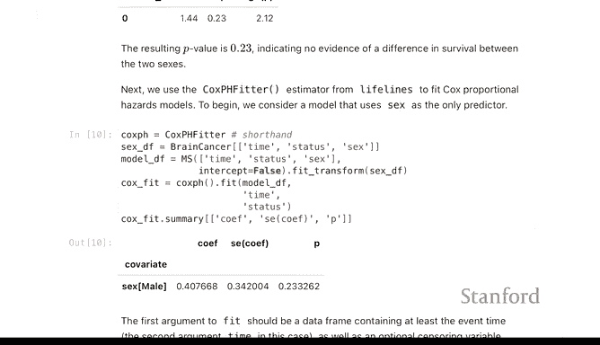

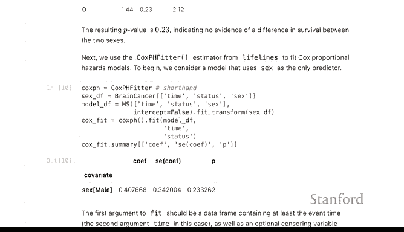

首先，我们拟合一个只包含性别变量的简单Cox模型。

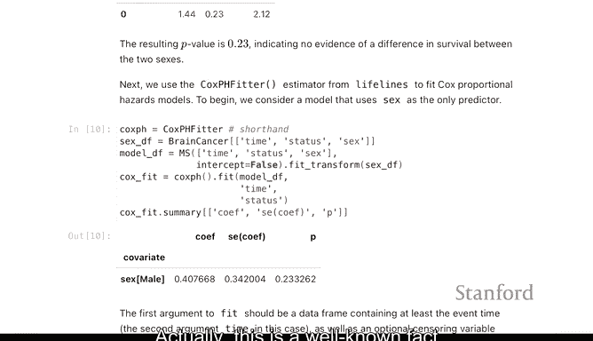

```python
# 创建设计矩阵（这里只包含性别，需要转换为数值或虚拟变量）
# 假设我们已经将‘sex’列处理为虚拟变量‘sex_Male’（1=男，0=女）
from patsy import dmatrices

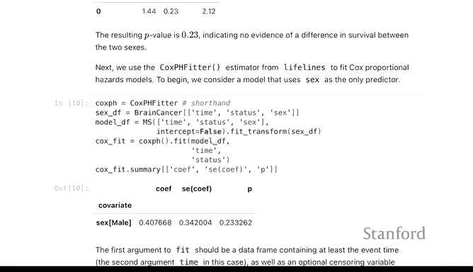

# 准备数据
model_data = brain_cancer[['time', 'status', 'sex']].copy()
model_data['sex'] = model_data['sex'].map({'Male': 1, 'Female': 0}) # 简单编码

# 初始化并拟合Cox模型
cph_simple = CoxPHFitter()
cph_simple.fit(model_data, duration_col='time', event_col='status')
cph_simple.print_summary()
```

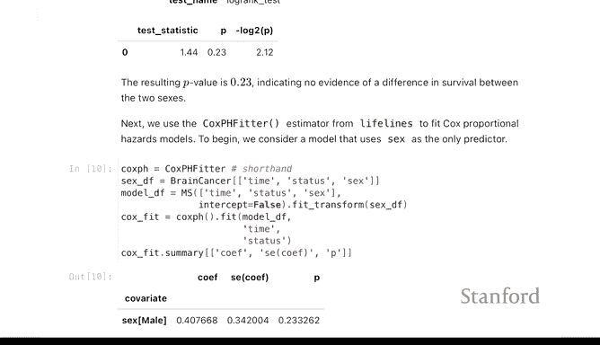

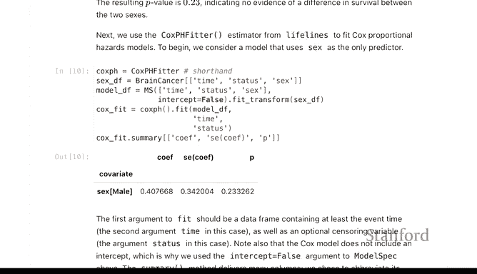

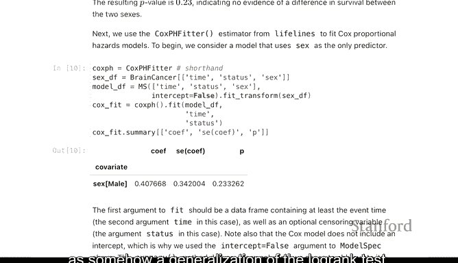

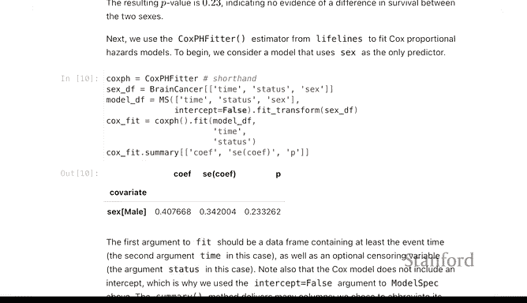

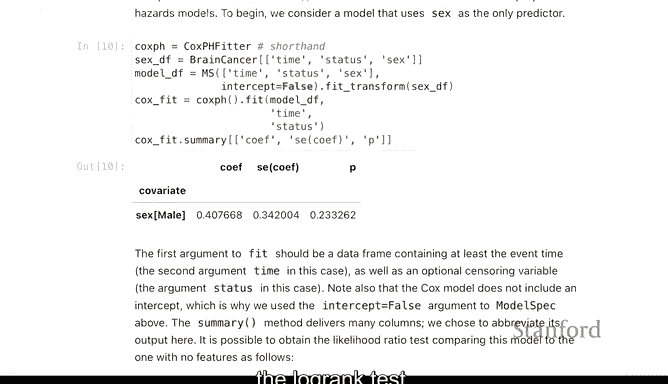

模型输出中，`sex` 变量的p值与之前的Log-Rank检验p值相同。这是因为对于单个二分类变量，Cox模型的得分检验等价于Log-Rank检验。

---

## 拟合多变量Cox模型 🔧

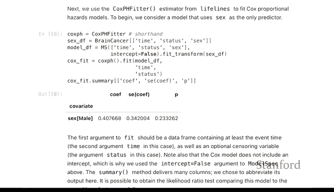

在实际分析中，我们通常需要纳入多个潜在的影响因素。下面我们拟合一个包含诊断类型、Karnofsky指数、性别和肿瘤体积的完整模型。

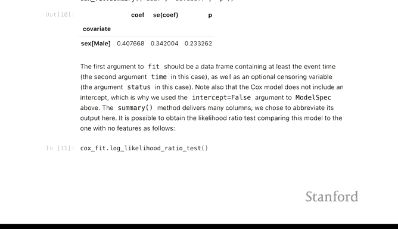

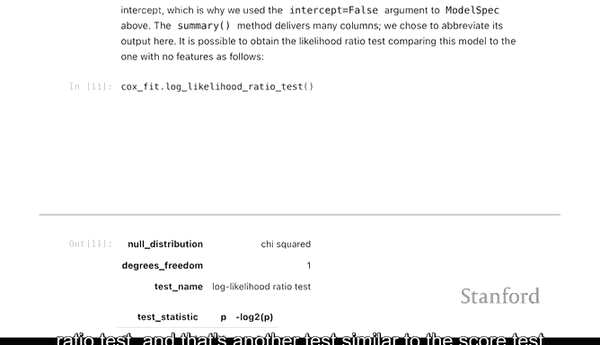

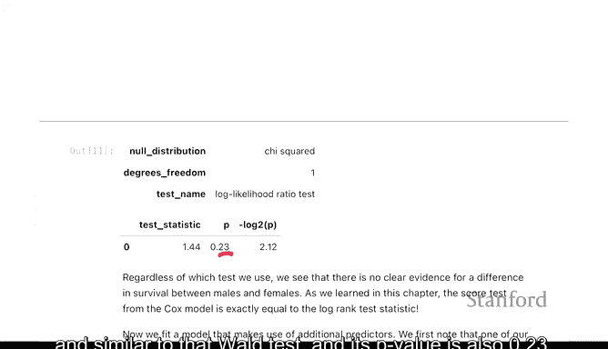

以下是拟合多变量Cox模型的步骤：

```python
# Python 版 1. 处理缺失值
brain_cancer_complete = brain_cancer.dropna(subset=['diagnosis'])

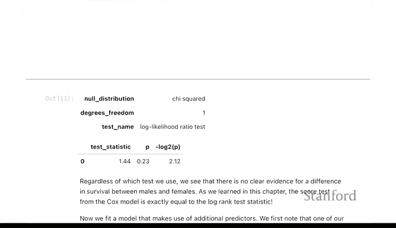

# Python 版 2. 使用patsy创建设计矩阵（自动处理分类变量）
y, X = dmatrices('time + status ~ diagnosis + ki + sex + gv', data=brain_cancer_complete, return_type='dataframe')
# 注意：`y` 是一个包含‘time’和‘status’两列的DataFrame
survival_data = pd.concat([X, y], axis=1)

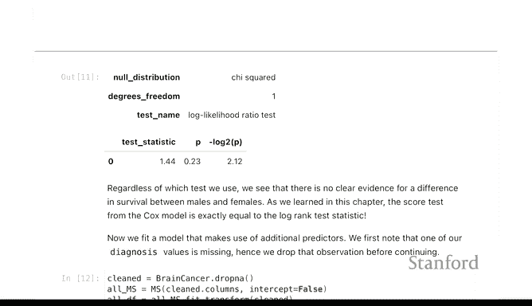

# Python 版 3. 拟合Cox模型
cph_full = CoxPHFitter()
cph_full.fit(survival_data, duration_col='time', event_col='status')
cph_full.print_summary()
```

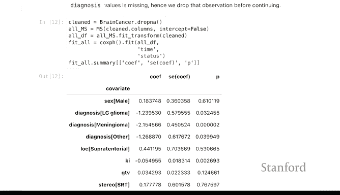

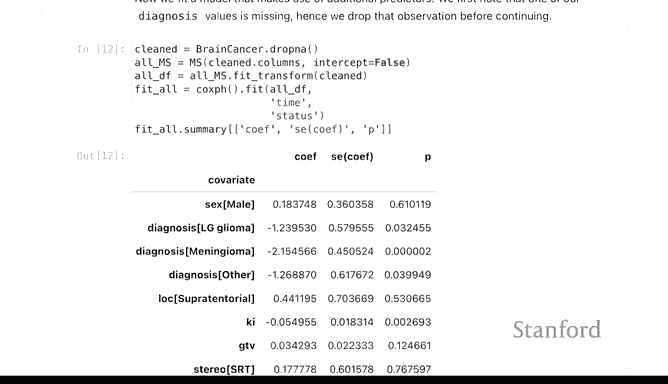

在结果中，我们可以解释系数：
*   系数为负（如 `ki`），意味着该变量值越高，风险越低，生存时间可能越长。
*   系数为正，意味着该变量值越高，风险越高，生存时间可能越短。
*   对于分类变量（如 `diagnosis`），系数是相对于基准组而言的。

---

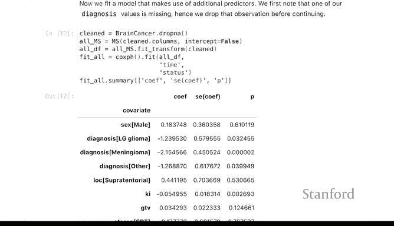

## 基于模型预测生存曲线 🎯

最后，我们可以使用拟合好的Cox模型，为具有特定协变量值的个体预测生存曲线。例如，我们想比较四种诊断类型在“典型”患者（其他协变量取平均值或众数）下的生存曲线。

以下是预测并绘制特定协变量组合生存曲线的代码：

```python
# 定义“典型”患者的协变量值（例如，取数值变量的中位数，分类变量的众数）
typical_covariates = X.median().to_frame().T # 取中位数作为一个示例
# 为每种诊断类型复制这个“典型”行
diagnosis_types = X['diagnosis[T.Meningioma]'].unique() # 需要根据实际虚拟变量名调整
# 此处简化处理，实际中需要为每个诊断类型创建对应的行

# 更实际的方法：使用模型已有的数据框，并指定我们感兴趣的协变量组合
# 假设我们想固定性别为女性，ki为其中位数，gv为其中位数，然后改变诊断类型
# 我们需要手动创建一个包含这些组合的新DataFrame `new_data`

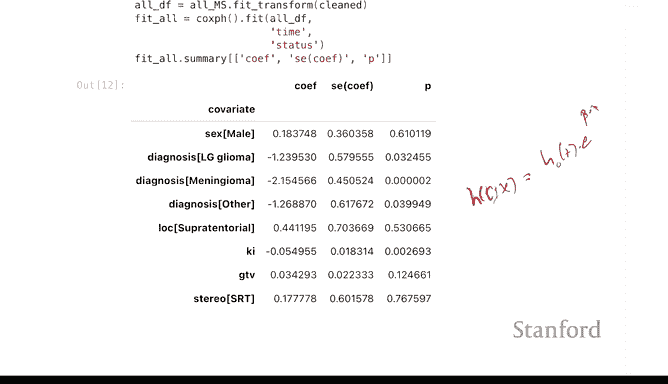

# 初始化画布
ax = plt.subplot(111)

# 假设 `new_data` 是创建好的包含不同诊断类型的DataFrame
# cph_full.predict_survival_function(new_data).plot(ax=ax) # 这是预测多条曲线的方法

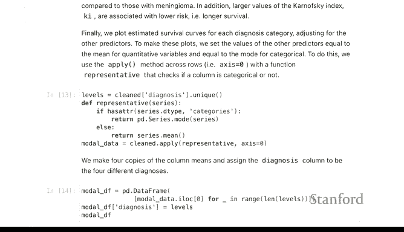

# 由于创建 `new_data` 需要具体的数据转换步骤，这里展示概念
# 实际代码需要根据X的列结构来构建
print("概念上，我们使用 cph_full.predict_survival_function(new_data) 来为新的协变量组合生成生存曲线。")
```

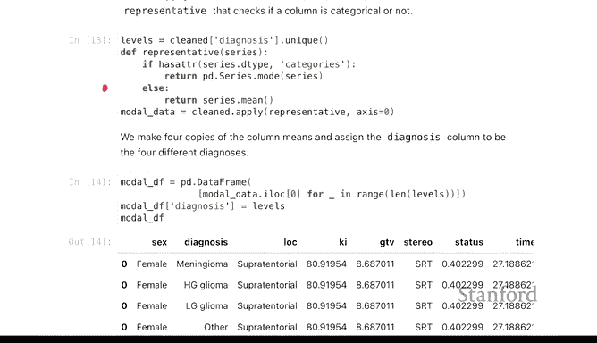

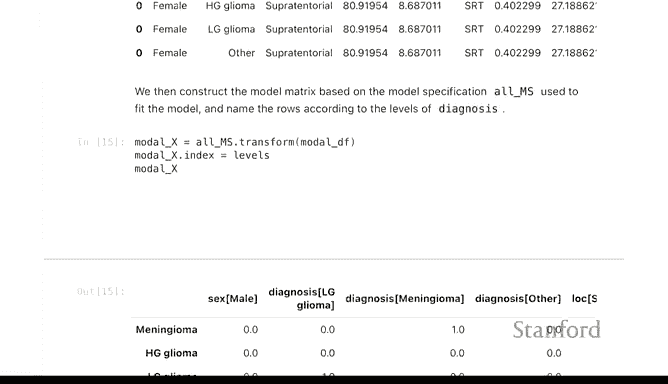

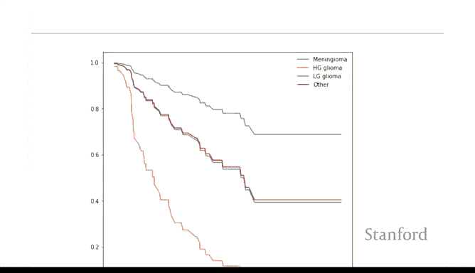

通过比较不同诊断类型的预测生存曲线，我们可以直观地看到在控制其他因素后，诊断类型本身带来的生存差异。

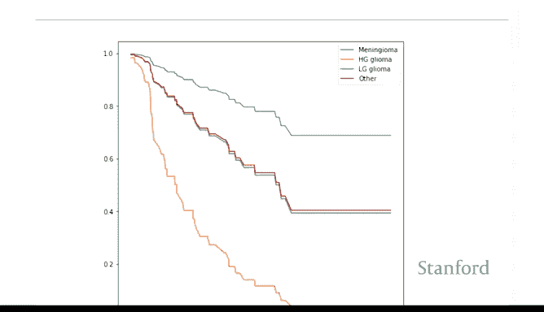

---

## 总结 📝

本节课中我们一起学习了生存分析的基础：
1.  **Kaplan-Meier曲线**：用于直观展示和比较单变量或分组后的生存概率。
2.  **Log-Rank检验**：用于比较两组生存曲线是否存在统计显著差异。
3.  **Cox比例风险模型**：用于评估多个协变量对生存时间的联合影响。我们学习了如何拟合模型、解释系数（正系数增加风险，负系数降低风险），以及如何基于模型预测特定患者的生存曲线。

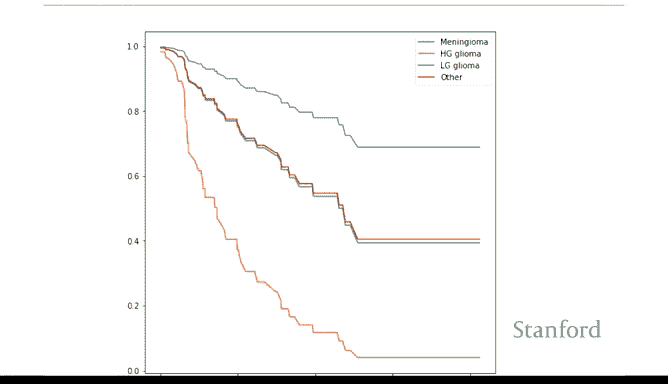

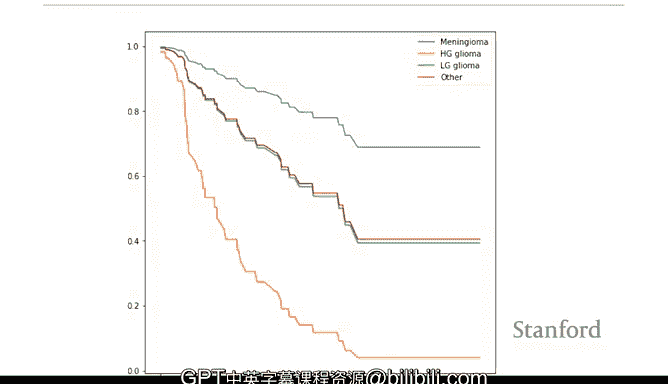


这些工具对于分析时间-事件数据至关重要，尤其是在医学研究、客户流失分析等领域。