# Python 版 88：Cox比例风险模型应用：临床试验发表时间数据 I 📊

在本节课中，我们将学习如何将Cox比例风险模型应用于另一种类型的数据——临床试验的发表时间数据。我们将分析影响论文发表速度的因素，并比较单变量与多变量模型的结果差异。

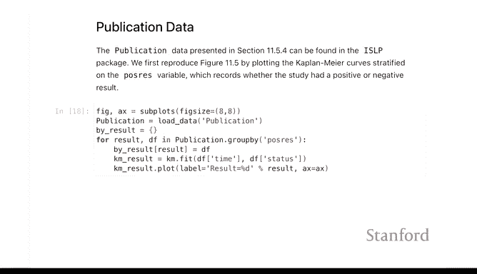

---

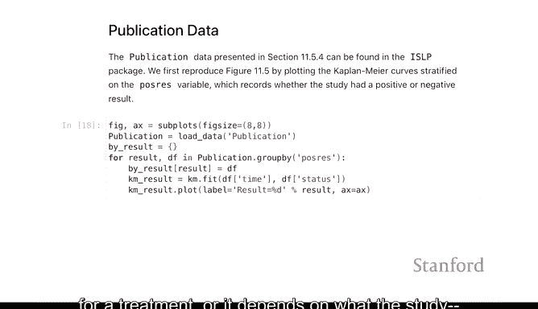

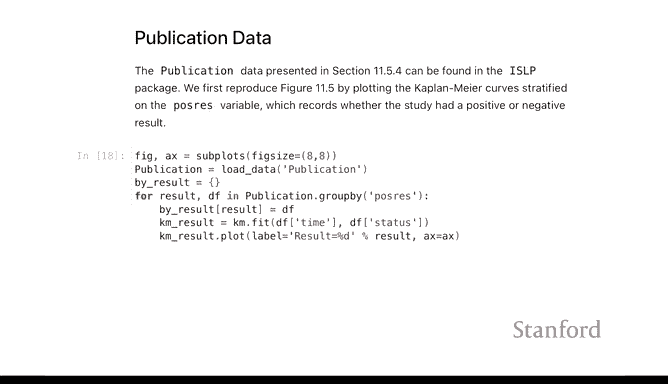

上一节我们介绍了生存分析在生物统计中的应用。本节中，我们来看看如何将同样的方法应用于非“生存”类的时间数据，例如学术发表过程。

我们接下来要分析的数据类型相对不那么沉重。它关注的是临床试验结果发表所需的时间。正如之前提到的，生存分析虽然常因分析实际生存时间而得名，但它是一种通用的时间数据分析方法。这里我们将使用并非真实生存时间的数据，即论文发表所需的时间。

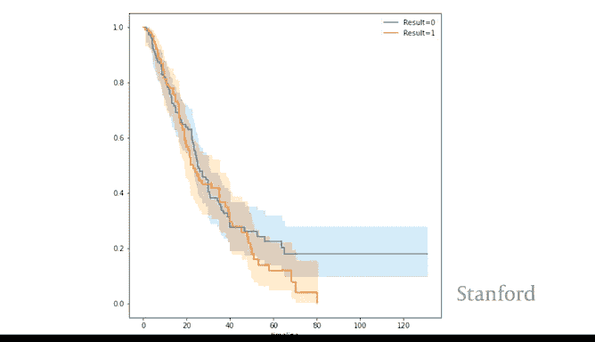

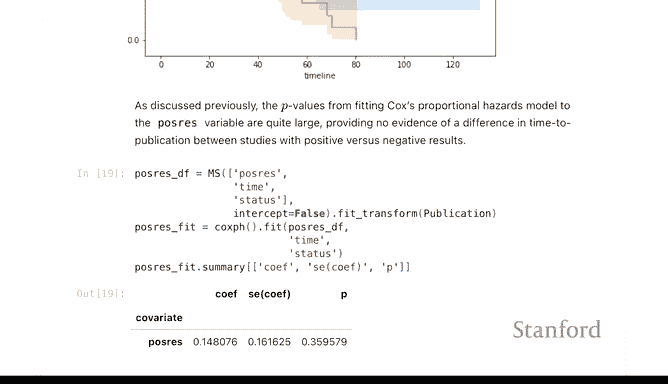

我们将关注的一个分类变量特征是 `posres`，它代表“阳性结果”。这个特征表示临床试验是否得出了积极的结果（例如，一种治疗方法有效），还是阴性结果（例如，治疗方法无效）。这取决于研究目的，即试验是否成功验证了其预设目标。

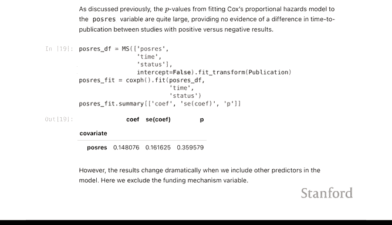

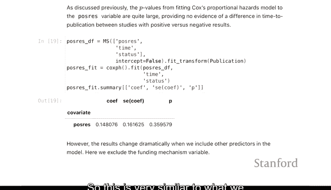

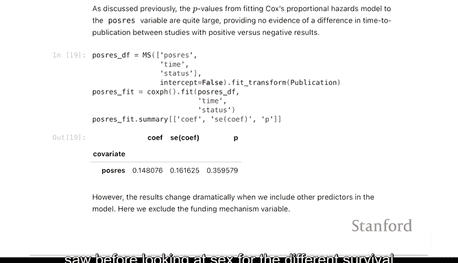

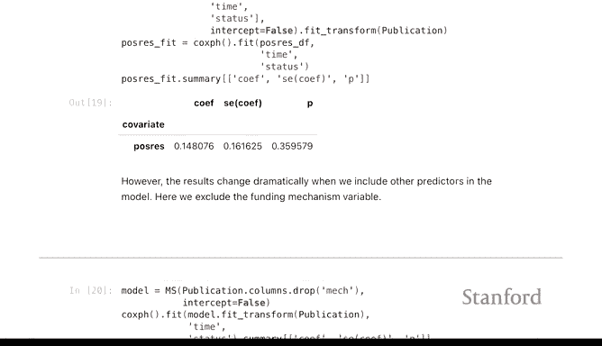

以下是数据中结果变量的含义：
*   `result = 0` 代表阴性结果。
*   `result = 1` 代表阳性结果。

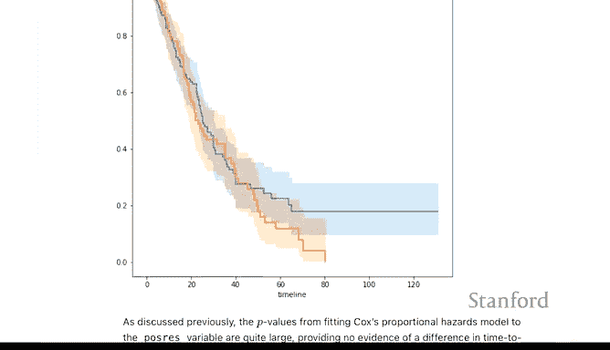

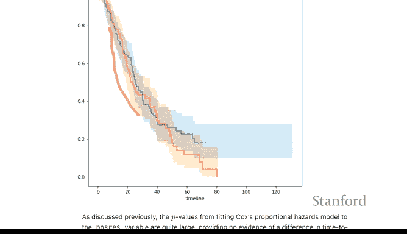

我们可以观察到，阴性结果的试验有些从未发表。这在科学文献中是已知现象，因为发表阴性结果通常比较困难。在这个例子中，高风险是好事，因为“事件”是论文发表，高风险意味着发表得更快。

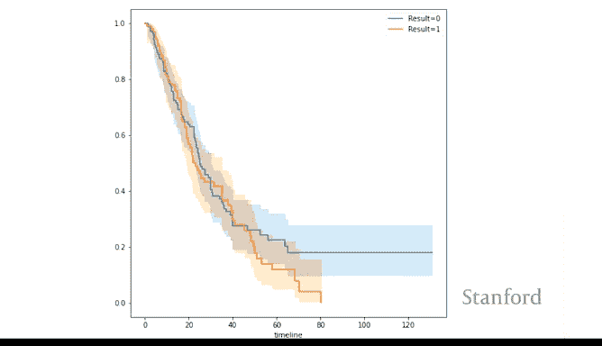

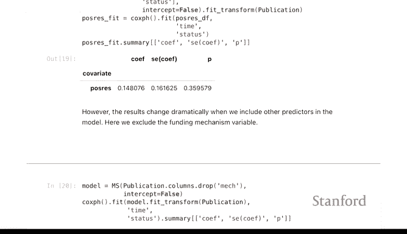

我们可以拟合一个Cox模型。如果我们想进行类似对数秩检验的分析，也可以用Cox模型来实现。这与之前分析癌症数据中性别差异的生存曲线非常相似。

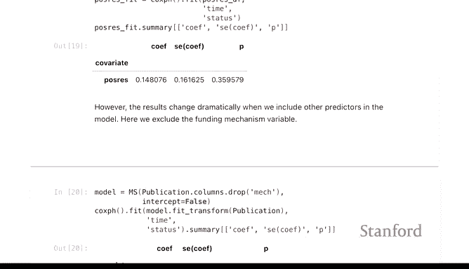

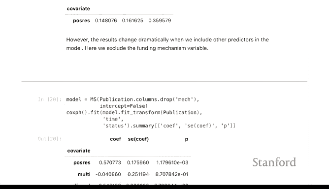

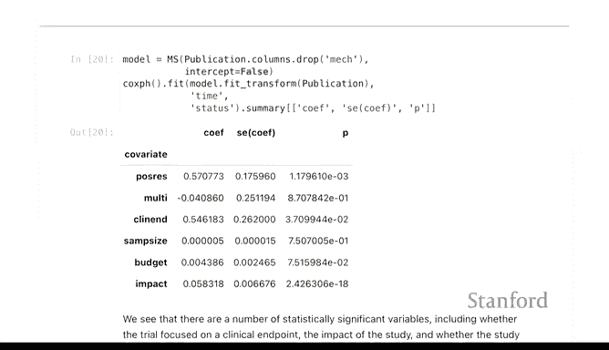

该模型的P值并不显著。从绘制的生存曲线图中也可以看出，尽管两条曲线似乎有些分离，但置信区间相当宽。特别是在这个时间区域，两者差异不大。如果我们事先假设在这个特定时间段存在差异，或许能得到显著的P值。但对数秩检验考察的是整个生存曲线。

现在，我们将引入其他一些特征来构建模型。

我们将加入 `multi`（资助机制，例如是NIH、私人基金还是NSF资助）等特征，然后拟合一个Cox模型。

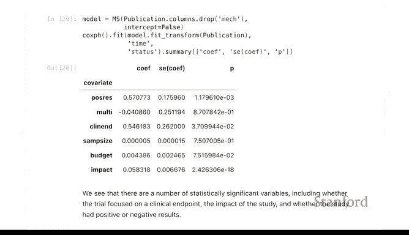

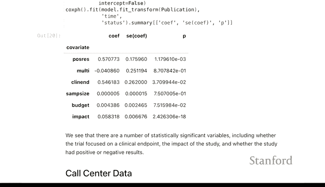

现在模型中出现了一些显著的因素。`impact`（影响力）变得显著了。这大概是论文发表后对其影响力的衡量。结果表明，发表相对较快的研究与较高影响力相关。同样地，`posres`（阳性结果）的效应现在变得更强，P值也更小。这很有趣，有时一个变量单独看可能不显著，因为存在其他混杂因素的干扰。当把所有变量都放入模型后，它可能就变得显著了。在线性回归的语境中，控制其他变量可以减少额外变异，从而使差异更加显著。

课程中还有第三个关于呼叫中心数据的例子，这是模拟数据。其分析与我们已做的非常相似，因此我们将留给学员自行练习。需要指出的一点新内容是，在呼叫中心数据中，你会看到**多元对数秩检验**。可以类比理解：对数秩检验用于处理具有两个水平的分类变量，而这里我们有的分类变量具有三个水平。因此，对应的列联表将是2x3或3x2，这就是多元对数秩检验，但其解释非常相似。

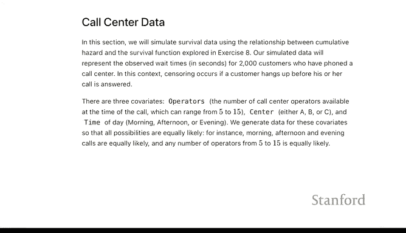

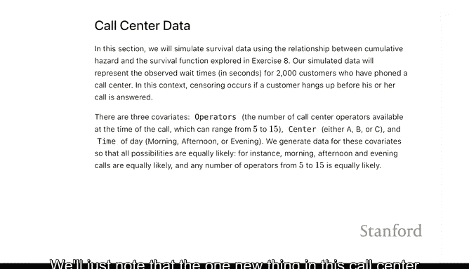

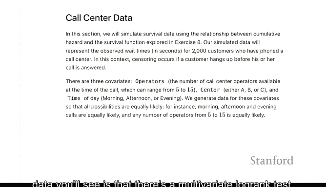

---

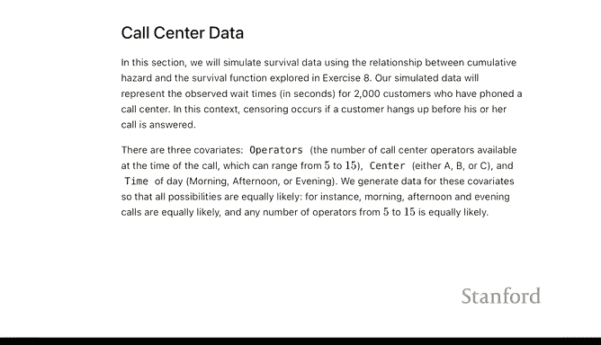

本节课中，我们一起学习了如何将Cox比例风险模型应用于分析临床试验发表时间。我们探讨了“阳性结果”对发表速度的影响，并演示了在控制其他变量（如资助机制和影响力）后，模型结果可能发生的变化。最后，我们简要介绍了处理多水平分类变量的多元对数秩检验概念。