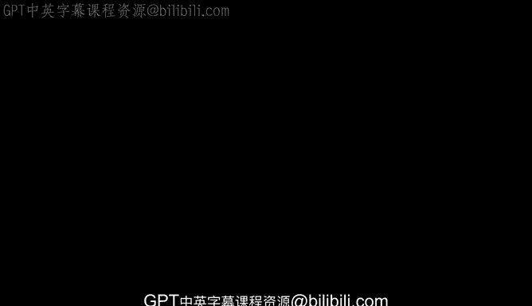
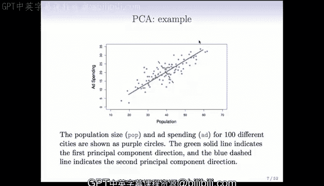

# Python 版 89：无监督学习与主成分分析入门 🎯

在本节课中，我们将要学习无监督学习的基本概念，并重点介绍其中一种核心方法：主成分分析。我们将了解它与监督学习的区别，以及它如何帮助我们理解没有标签的数据。

## 无监督学习概述

上一节我们回顾了监督学习，本节中我们来看看它的对比面：无监督学习。

在监督学习中，我们拥有一个目标变量或标签 `y`，我们的任务是从特征 `x` 中预测它。这就像一个幼儿园老师告诉孩子哪些是房子，哪些是汽车，从而“监督”学习过程。

而无监督学习则没有这样的标签。我们只有特征 `x1, x2, ..., xp`。我们的目标是探索这些特征之间的关系，发现数据中隐藏的模式或结构。这就像老师只给孩子看一堆物品，让孩子自己发现哪些看起来相似并归为一组。

由于没有明确的预测目标，无监督学习的目标通常更为模糊，但也因此更加灵活和具有探索性。

## 无监督学习的目标与应用

尽管目标模糊，无监督学习在数据科学中正变得越来越重要。以下是其主要目标和一些应用场景：

**主要目标：**
*   在观测数据中发现子群或分组。
*   找到观察数据的重要视角，识别变异最大的特征。

**应用示例：**
*   **生物医学：** 根据基因表达数据将乳腺癌患者分组，这些分组可能在生物学特性和生存率上存在显著差异。
*   **市场营销：** 根据浏览和购买历史对消费者进行细分，以便进行定向广告投放。
*   **推荐系统：** 根据观众评分对电影进行分组（如惊悚片、爱情片等）。

无监督学习日益重要的另一个原因是，未标记的数据远比标记数据更容易获得。例如，网络上的大量图片、文本评论，获取其特征（像素、文字）是自动化的，但为其打上准确的标签（图片内容、情感倾向）通常需要耗时费力的人工干预。

## 主成分分析简介

现在，让我们深入今天要介绍的第一种核心方法：主成分分析。

主成分分析是一种用于获取数据集低维表示的工具。它找出一系列变量的线性组合，这些组合具有最大方差，并且彼此之间不相关。

**核心思想：** 想象你有很多相关变量，PCA试图将其精简为少数几个能概括数据大部分信息的“综合变量”，即主成分。

它的用途主要有两方面：
1.  **数据可视化：** 对于高维数据，PCA提供了一种最重要的数据展示方式。
2.  **特征预处理：** PCA提取出的新变量（主成分）可以作为更有效的特征，用于后续的监督学习任务。

## 主成分的数学定义

我们来正式定义主成分。

假设我们有 `p` 个特征变量 `x1, x2, ..., xp`。**第一主成分** `Z1` 是这些变量的一个线性组合：

`Z1 = φ11 * x1 + φ12 * x2 + ... + φ1p * xp = Σ φ1j * xj`

我们选择一组权重 `φ11, ..., φ1p`（称为**载荷**），使得 `Z1` 的方差在所有可能的线性组合中最大。为了避免权重无限增大，我们施加约束：载荷向量的平方和为1。

`Σ φ1j² = 1`

第一主成分的方向（载荷向量）是数据方差最大的方向。投影到这个方向上的数据值 `z11, z12, ..., zn1` 称为**主成分得分**，它们构成了我们得到的新变量。

## 计算与几何解释

那么，如何计算主成分呢？

1.  **中心化：** 由于我们只关心方差，首先将每个特征变量减去其均值，使其均值为0。即，令 `X` 矩阵的列均值为0。
2.  **优化问题：** 我们的目标是找到载荷向量 `φ1`，使得 `Z1` 的方差最大。方差公式为 `(1/n) * Σ zi1²`。将 `zi1` 用 `Σ φ1j * xij` 代入，问题转化为一个在约束条件 `||φ1||² = 1` 下的优化问题。
3.  **求解：** 这个优化问题可以通过**奇异值分解** 这一标准的数值分析方法高效求解。

**几何解释：** 回到之前广告支出与人口的二维例子。第一主成分是数据点投影后方差最大的那条线的方向（如图中东北方向的线）。载荷向量 `(φ11, φ12)` 就指向这个方向。每个数据点的第一主成分得分，就是它投影到这条线上后，到原点（数据中心）的距离。

计算出第一主成分后，我们可以继续寻找**第二主成分** `Z2`。它是与 `Z1` 不相关（在几何上正交）的所有线性组合中方差最大的一个。在二维情况下，第二主成分方向自然就是与第一主成分垂直的方向。

## 总结

本节课中我们一起学习了无监督学习的基础知识。我们了解到它与监督学习的核心区别在于没有标签 `y`，目标在于探索数据内部结构。我们介绍了无监督学习的两个常见目标：发现子群和降维/特征总结。

我们重点学习了**主成分分析** 这一强大的工具。PCA通过寻找数据中方差最大的方向（主成分），将高维、可能相关的特征集，转换为一组低维、不相关的新变量。这既有助于我们直观理解高维数据，也能为后续分析提供更精炼的特征。第一主成分是方差最大的线性组合，后续成分在保证与前面所有成分不相关的条件下，依次最大化剩余方差。