# Python 版 90：高阶主成分分析 📊

在本节课中，我们将学习如何计算高阶主成分，理解它们如何提供数据的不同视角，并通过一个关于美国各州犯罪数据的实际案例来演示主成分分析的应用。

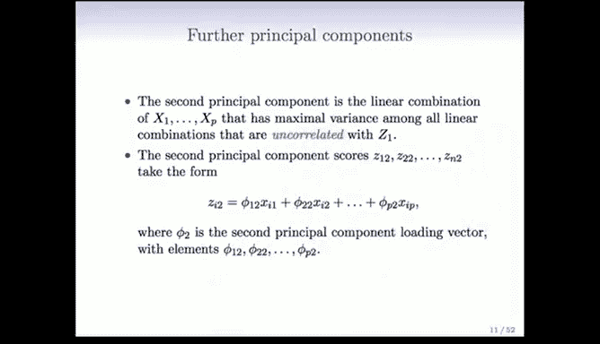

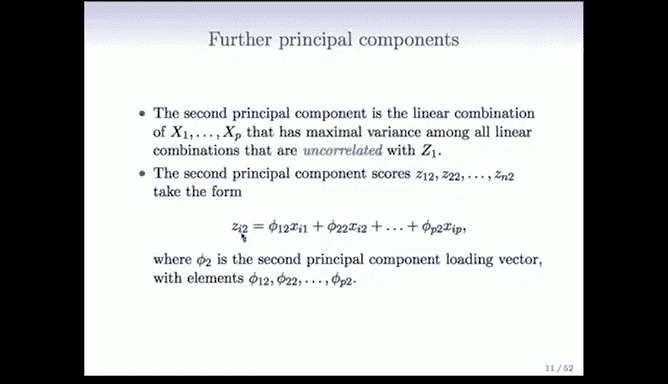

## 概述

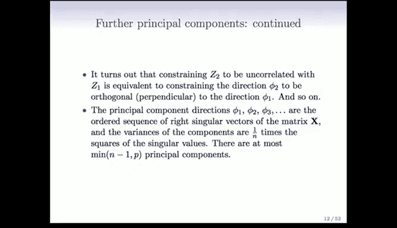

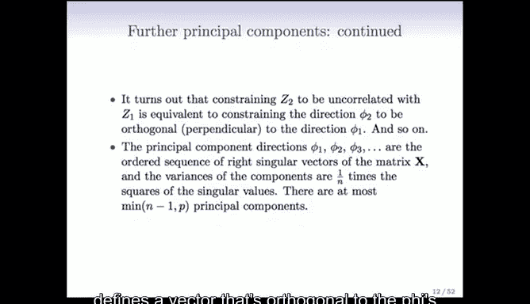

上一节我们介绍了第一主成分，它是对数据方差最大的线性组合。本节中，我们来看看当数据包含多个变量时，如何计算第二、第三乃至更多的主成分。这些高阶主成分在保证与之前成分不相关的前提下，依次最大化剩余方差，从而提供关于数据的不同信息。

## 第二主成分的计算

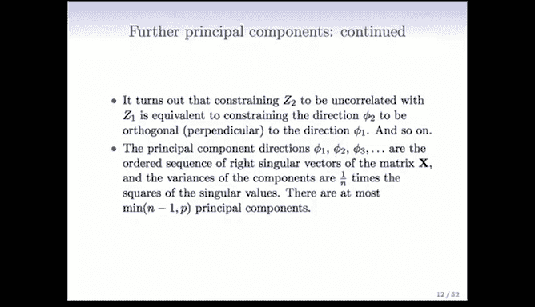

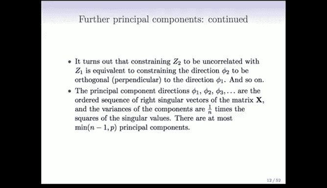

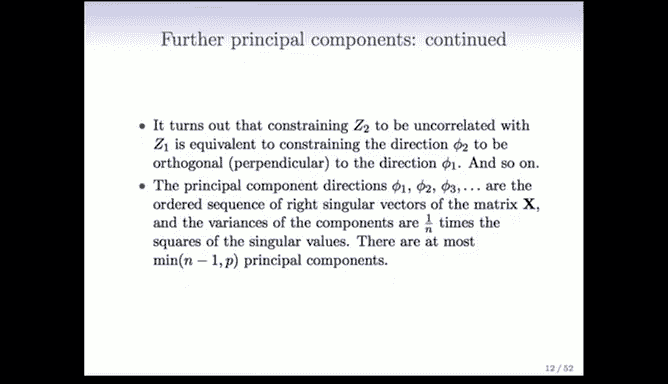

对于拥有 `P` 个变量的数据集，我们可以寻找第二主成分。与第一主成分类似，它也是一个具有大方差的线性组合。但为了避免得到与第一主成分相同的结果，我们需要施加一个约束条件：第二主成分必须与第一主成分**不相关**。这样，它就能提供关于数据的不同信息。

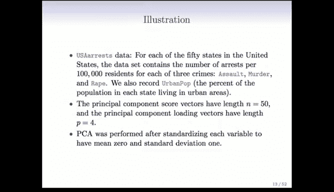

在数学上，第二主成分 `Z2` 可以表示为：
`Z2 = φ21 * X1 + φ22 * X2 + ... + φ2p * Xp`
其中，系数向量 `φ2 = (φ21, φ22, ..., φ2p)` 需要在与第一主成分的系数向量 `φ1` 正交（即不相关）的约束下，使得 `Z2` 的方差最大化。

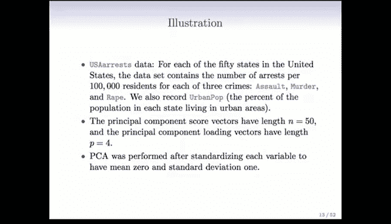

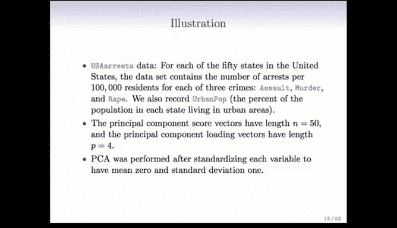

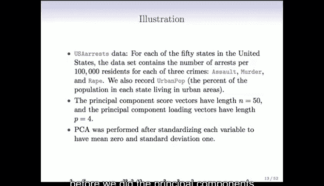

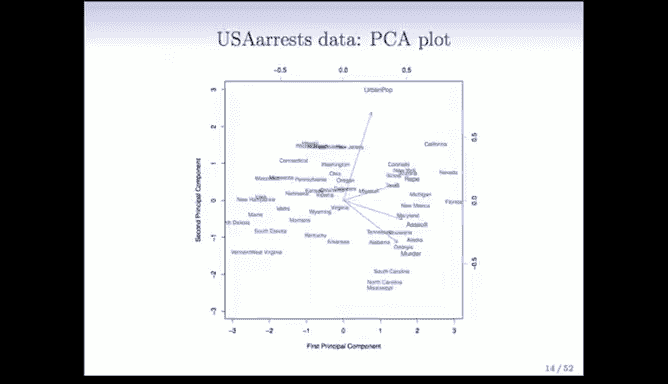

一个有趣的性质是，不相关性在数学上等价于两个主成分的**载荷向量**（即系数向量 `φ`）彼此**正交**。

## 主成分的完整分解

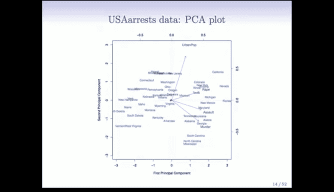

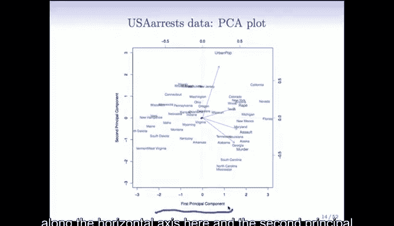

我们可以依次计算第三、第四主成分，最多可以得到 `min(n-1, p)` 个主成分，其中 `n` 是样本数，`p` 是变量数。所有主成分的解都来自于数据矩阵 `X` 的**奇异值分解**。具体来说，第 `m` 个主成分由 `X` 的第 `m` 个**右奇异向量**定义。

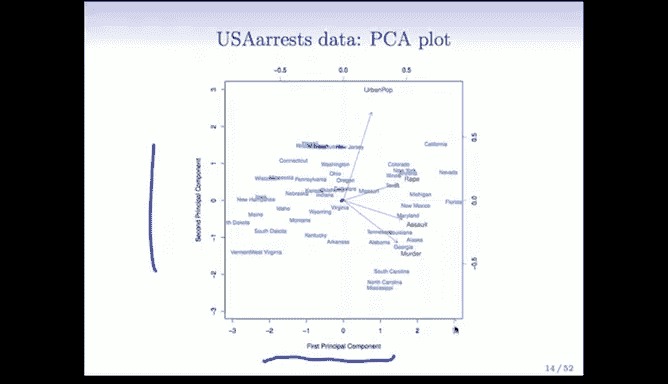

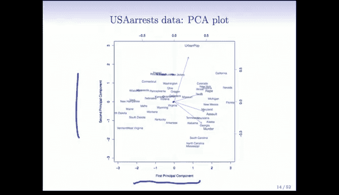

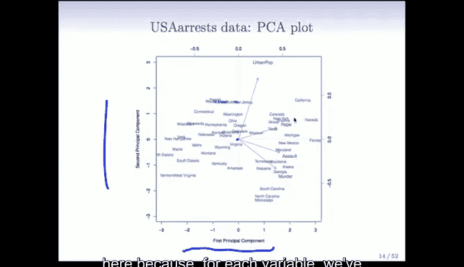

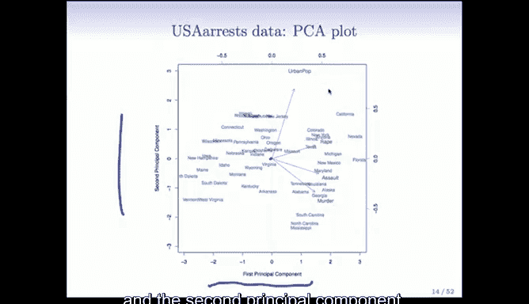

通过这种方式，我们可以得到数据矩阵在主成分空间上的完整分解。

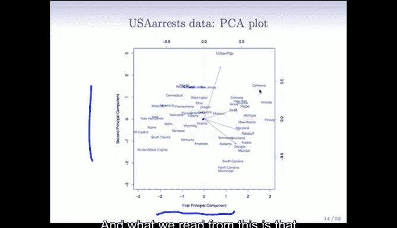

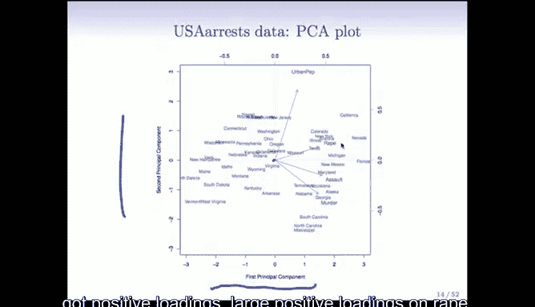

## 案例：美国各州犯罪数据

为了具体说明，我们使用一个关于美国各州犯罪的数据集。该数据集包含美国50个州每10万居民中三种犯罪（谋杀、袭击、强奸）的逮捕人数，以及各州城市人口占总人口的百分比。

在进行分析前，我们通常会将每个变量**标准化**，使其均值为0，标准差为1。这是一种标准做法，可以避免因变量量纲不同而导致方差大的变量主导主成分。

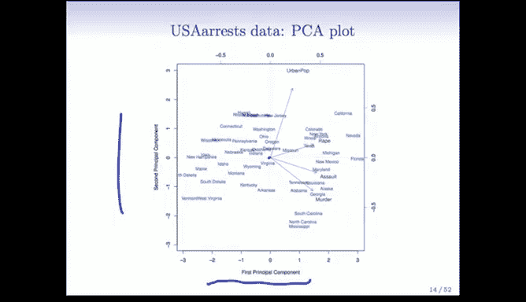

以下是分析得到的前两个主成分的双标图：

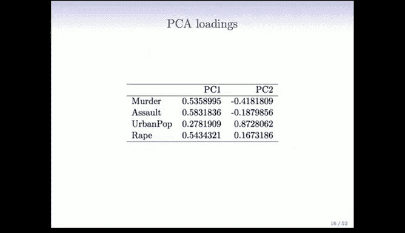

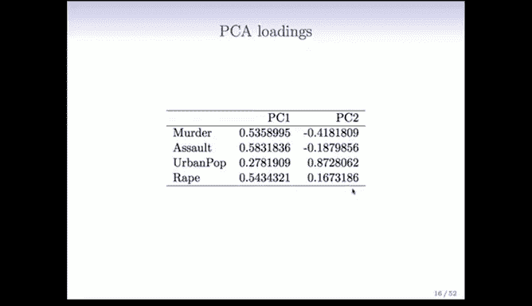

*   **图的解读**：
    *   图中的每个点代表一个州，其位置由该州在第一主成分（横轴）和第二主成分（纵轴）上的得分决定。
    *   原点在中心，所有数据都已中心化。
    *   图中的箭头代表**载荷向量**，显示了每个原始变量（谋杀、袭击、强奸、城市人口）对两个主成分的贡献。

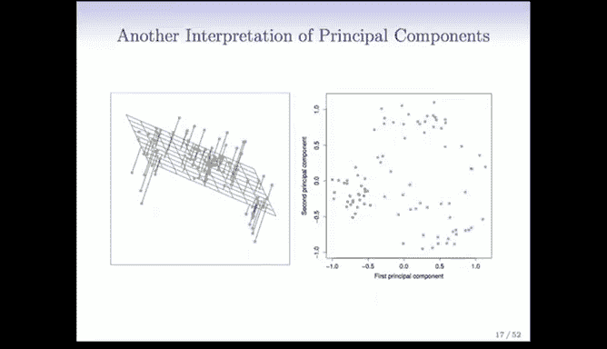

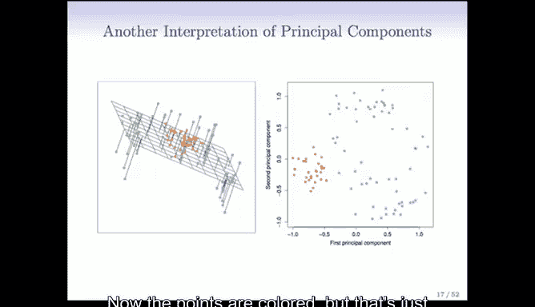

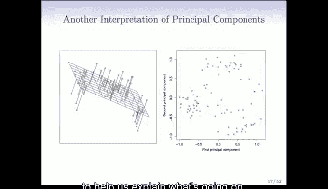

*   **主成分的含义**：
    *   **第一主成分**：在谋杀、袭击和强奸三个犯罪变量上都有较大的正载荷。因此，第一主成分大致可以解释为“**总体犯罪率**”。位于横轴正方向的州（如佛罗里达州）犯罪率较高，位于负方向的州犯罪率较低。
    *   **第二主成分**：主要在城市人口变量上有较高的载荷。因此，第二主成分主要反映了“**城市化程度**”。同时，强奸变量在第二主成分上也有轻微的正载荷，暗示高城市化地区可能与较高的强奸犯罪率相关。

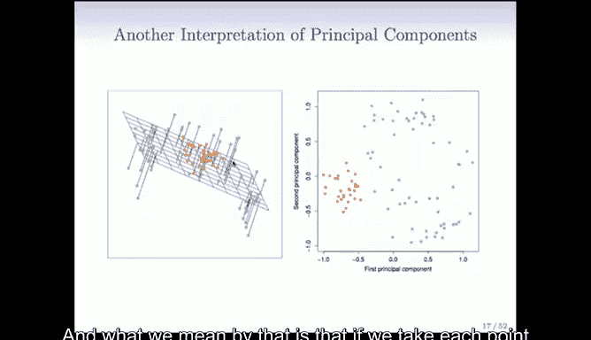

通过观察各州在双标图上的位置，我们可以直观地比较各州的犯罪率和城市化水平。例如，缅因州、新罕布什尔州、爱荷华州等位于左下区域，属于低犯罪率地区。

## 主成分的另一种视角：数据近似

主成分分析还有另一种等价的解释：寻找一个**低维超平面**来最佳地近似数据点云。

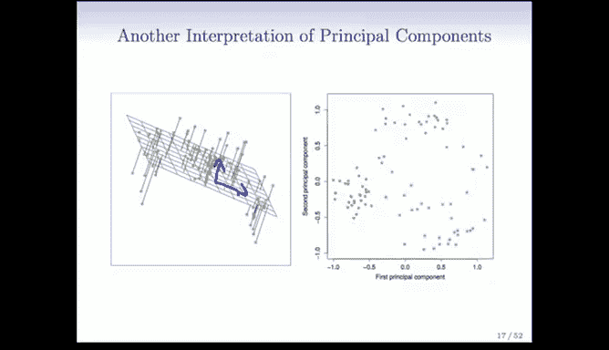

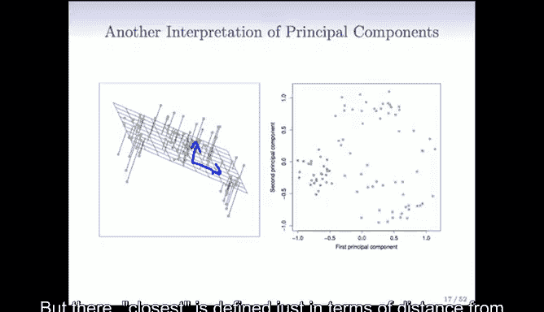

想象一个三维空间中的数据点云。主成分分析可以找到一个二维平面，使得所有数据点到这个平面的**垂直距离的平方和最小**。这个最佳拟合平面恰好由前两个主成分的方向所张成。

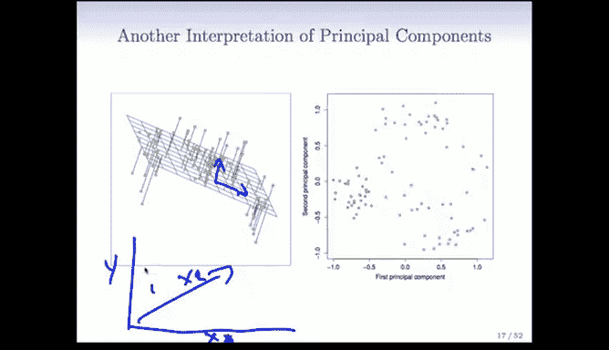

这与线性回归有本质区别：
*   **线性回归**：寻找一个超平面来最小化响应变量 `Y` 在垂直方向上的预测误差（有监督）。
*   **主成分分析**：寻找一个超平面来最小化所有数据点 `X` 到该超平面的**垂直距离**（无监督）。

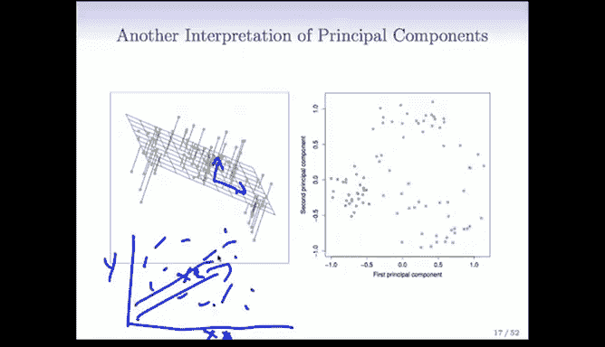

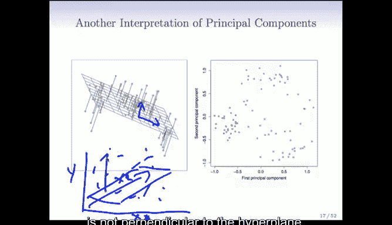

## 变量标准化的重要性

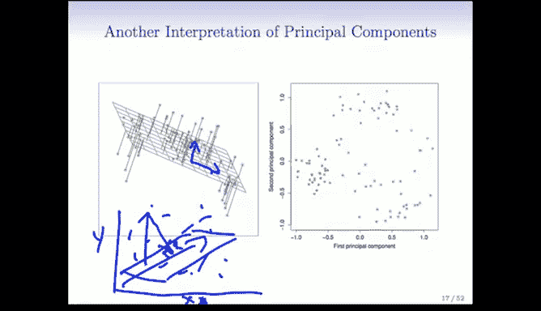

变量是否标准化对主成分分析的结果影响巨大。在我们之前的案例中，我们标准化了数据。如果不标准化，由于“袭击”变量的原始方差远大于其他变量，它将几乎完全主导第一主成分，导致结果失真。

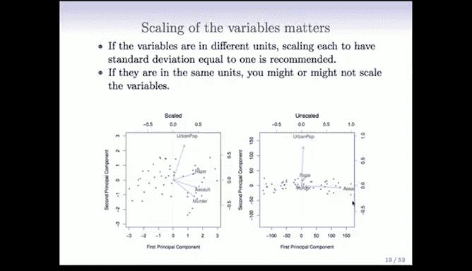

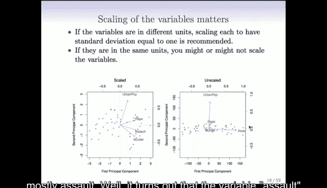

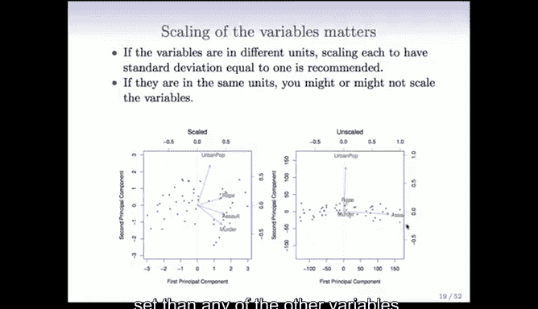

因此，**当变量测量单位不同或方差差异很大时，进行标准化是至关重要的**。标准化后，所有变量处于平等地位，主成分才能反映变量组合的真实重要性。

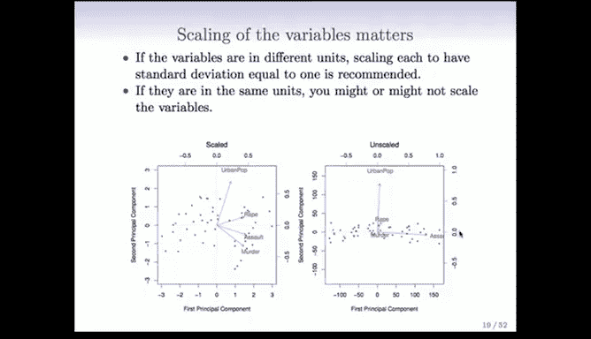

## 方差解释比例

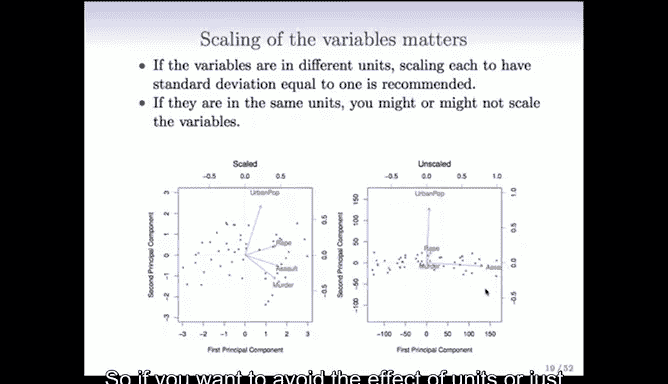

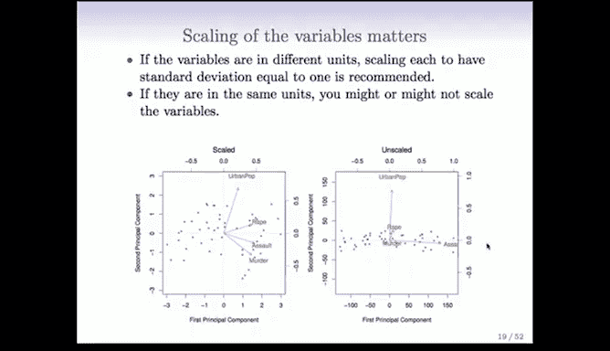

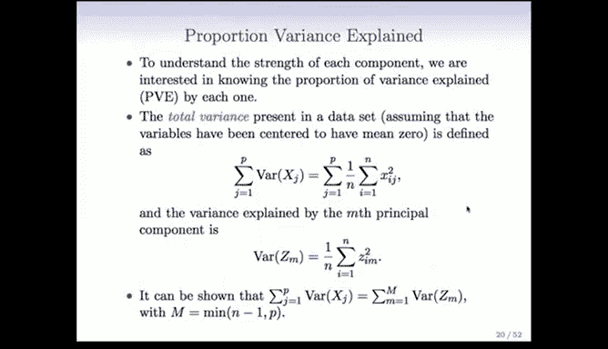

主成分分析的一个重要输出是每个主成分所解释的**方差比例**。

*   **总方差**：所有原始变量方差之和。可以证明，所有主成分的方差之和等于这个总方差。
*   **第m主成分的方差**：`Var(Zm) = (1/n) * Σ(Zim)^2`
*   **方差解释比例**：`Var(Zm) / Σ(Var(Zk))`，其中 `k` 从1到总主成分数。

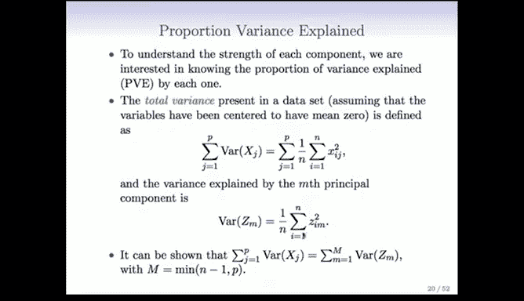

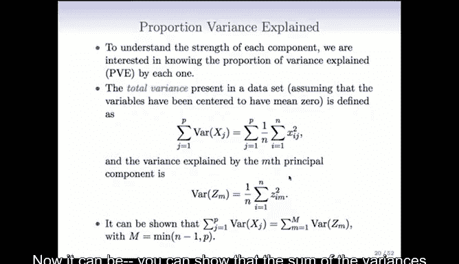

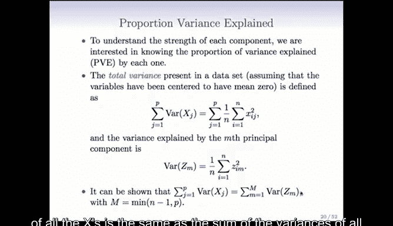

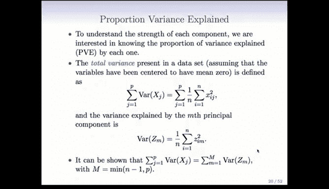

对于犯罪数据，各主成分的方差解释比例如下：

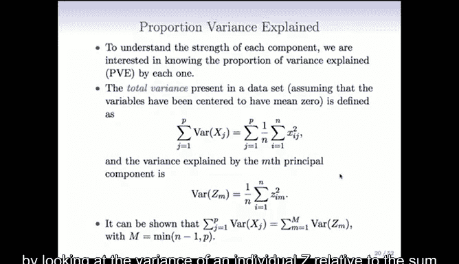

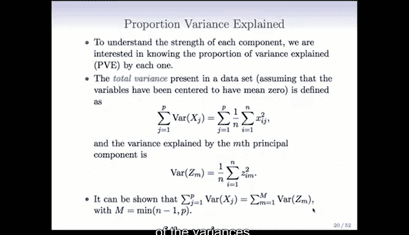

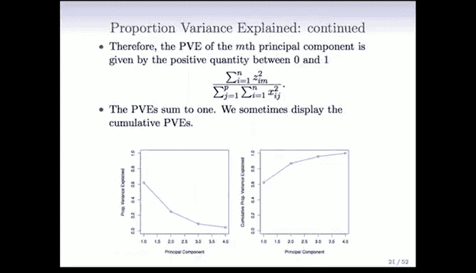

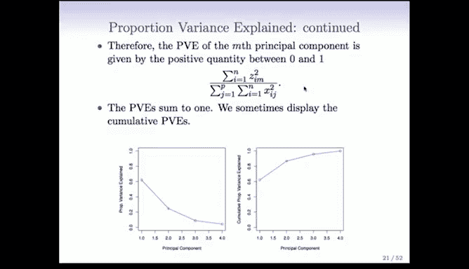

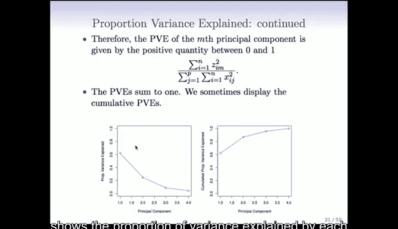

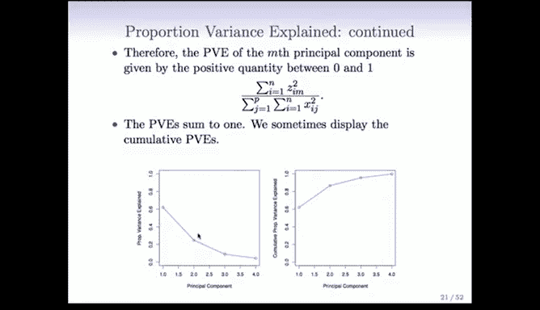

*   第一主成分解释了约60%的总方差。
*   第二主成分解释了约24%的总方差。
*   第三和第四主成分解释的方差依次递减。

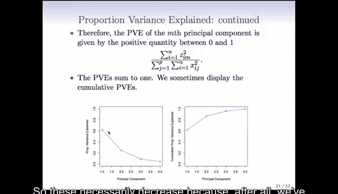

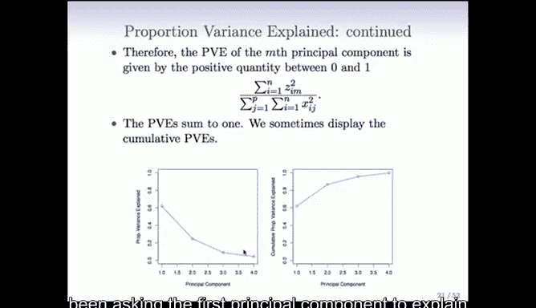

我们通常还会绘制**累计方差解释比例图**（或称碎石图），以帮助决定保留多少个主成分。

## 如何选择主成分数量？

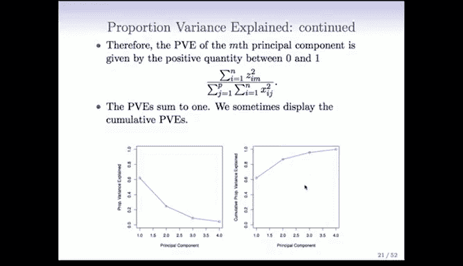

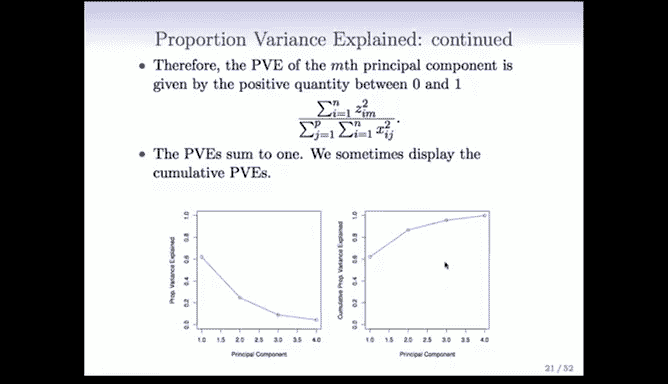

选择保留多少主成分没有绝对规则，但有一些常用方法：

1.  **累计方差比例**：设定一个阈值（例如85%或95%），选择累计解释方差达到该阈值所需的最少主成分数。
2.  **观察碎石图**：寻找图中解释方差比例的“拐点”或“肘部”。拐点之后的主成分解释的方差增加很少，通常可以舍弃。

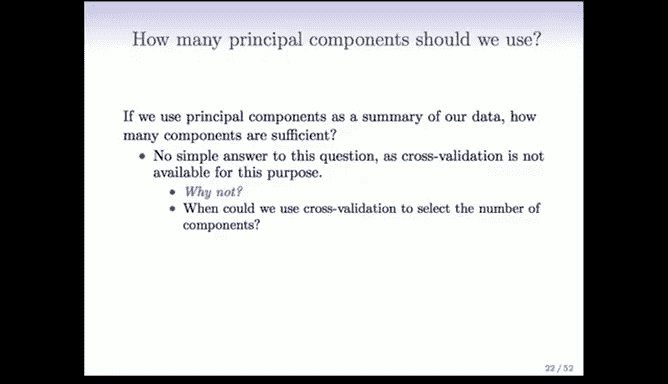

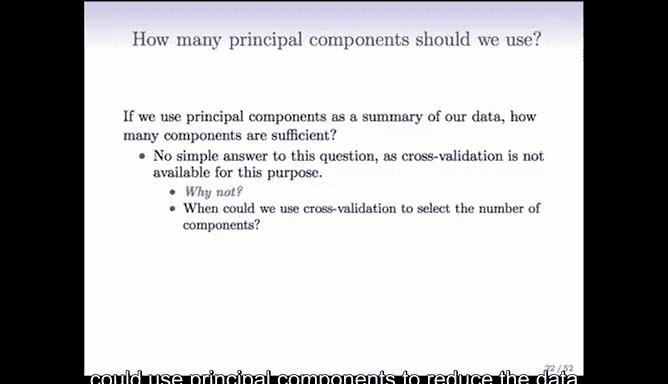

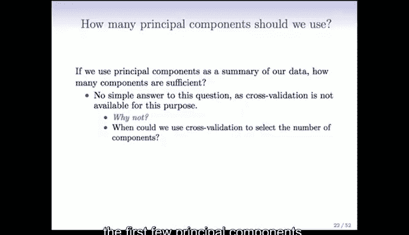

关于交叉验证：标准的PCA是无监督方法，没有响应变量，因此无法直接使用基于预测误差的交叉验证。但是，当PCA用于回归降维（即用前几个主成分作为预测变量）时，由于此时存在响应变量 `Y`，就可以使用交叉验证来选择最优的主成分数量。

## 总结

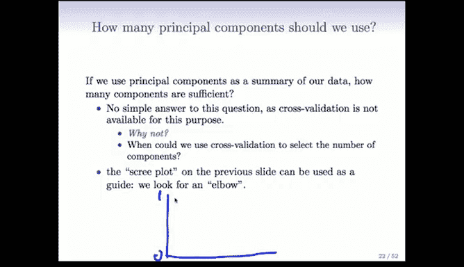

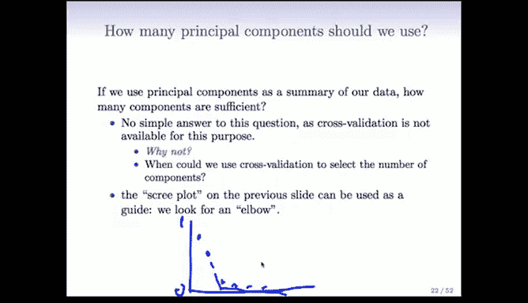

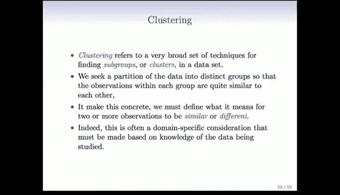

本节课中我们一起学习了高阶主成分分析。我们了解到：
*   高阶主成分是在与之前所有主成分不相关的约束下，依次最大化方差的线性组合。
*   主成分可以通过数据矩阵的奇异值分解求得。
*   双标图是可视化主成分得分和载荷的强大工具。
*   变量标准化对于获得有意义的主成分至关重要。
*   方差解释比例和碎石图可以帮助我们决定保留多少主成分。
*   PCA可以理解为寻找最佳拟合数据点的低维超平面。

主成分分析是应用统计学中最有用、最广泛的工具之一。在下一节课中，我们将介绍另一个非常重要的无监督学习工具：**聚类分析**。