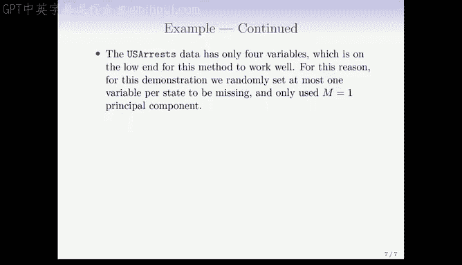

# Python 版 93：矩阵补全与缺失值处理 📊


在本节课中，我们将要学习如何处理数据矩阵中的缺失值，并介绍一种基于主成分分析（PCA）的强大技术——矩阵补全。这种方法不仅是填充缺失值的有效手段，也是许多现代推荐系统的基础。

---

## 概述

数据矩阵 `X` 中经常存在缺失条目，通常用 `NA`（不可用）表示。这是一个棘手的问题，因为许多建模程序（尤其是线性回归、广义线性模型等多变量程序）以及主成分分析都需要完整的数据。然而，有时填补缺失值本身就是预测问题，我们将在推荐系统的例子中看到这一点。

---

## 简单方法：均值填补

一种处理缺失数据的简单方法是**均值填补**。这意味着，对于矩阵 `X` 中的每一列（代表一个变量），用该列非缺失条目的均值来替换所有缺失条目。

**公式表示**：
对于变量 `j`，其均值 `μ_j` 计算如下：
```
μ_j = mean( X_ij for all i where X_ij is not NA )
```
然后，将所有该列的缺失值 `X_ij (NA)` 替换为 `μ_j`。

然而，这种方法完全**忽略了变量之间的相关性**。在填补缺失值时，我们应该能够利用这些相关性。显然，如果只使用每个变量的均值，就丢失了这些信息。此外，我们还需要假设缺失值是**随机缺失**的，即缺失本身不包含信息。

---

## 基于主成分的矩阵补全方法

上一节我们介绍了简单的均值填补及其局限性。本节中，我们来看看一种更高级的方法，它基于主成分分析来填补缺失值。

### 主成分的矩阵近似解释

在本书的第12.2.2节中，我们从矩阵近似的角度解释了主成分。其核心思想是，我们可以用一个低秩矩阵来近似原始数据矩阵 `X`。

**公式表示**：
我们希望通过两个矩阵 `A`（n × M）和 `B`（p × M）的乘积来近似 `X`，以最小化以下目标函数：
```
min_{A, B} Σ_{(i,j) ∈ all entries} ( X_ij - Σ_{m=1}^{M} A_im * B_jm )^2
```
其中，`A_im` 是矩阵 `A` 的元素（可视为主成分得分），`B_jm` 是矩阵 `B` 的元素（可视为主成分载荷）。可以证明，对于任意给定的 `M`，前 `M` 个主成分提供了该问题的一个解。

### 处理缺失值

当矩阵 `X` 存在缺失元素时，我们需要修改上述准则。

**修改后的目标函数**：
我们只对观测到的条目 `(i, j)` 求和，集合 `O` 代表所有观测到的索引对。
```
min_{A, B} Σ_{(i,j) ∈ O} ( X_ij - Σ_{m=1}^{M} A_im * B_jm )^2
```
这里的关键在于，矩阵 `A` 和 `B` 仍然是完整的。一旦我们解决了这个优化问题，得到了 `A` 和 `B` 的估计值，我们就可以用以下公式来估计一个缺失的观测值 `X_ij`：
```
estimated_X_ij = Σ_{m=1}^{M} A_im * B_jm
```
这种方法不仅填补了缺失值，还能近似恢复出完整数据下的前 `M` 个主成分得分和载荷。它通过主成分捕捉了变量间的相关性，本质上相当于利用其他变量对缺失变量进行“回归”来填补。

---

## 应用实例：推荐系统 🎬

为了理解矩阵补全的威力，让我们看一个经典应用：推荐系统。以Netflix电影评分数据为例：

*   我们有一个巨大的矩阵，行代表用户，列代表电影。
*   矩阵中只有约2%的条目有评分（1-5分），其余98%都是缺失的。
*   我们的目标是预测用户对未观看电影的评分。

这个问题的核心就是矩阵补全：我们有一个极其稀疏的评分矩阵，需要填补所有缺失的评分。2005年左右Netflix举办的百万美元竞赛，其优胜方案的基础就是本节课介绍的这种矩阵补全技术。它同时利用了用户之间的相似性（喜欢相似电影的用户）和电影之间的相似性（被相似用户喜欢的电影）。

---

## 迭代算法步骤 🔄

我们已经知道了目标，那么如何求解这个带缺失值的矩阵近似问题呢？以下是一个极其简单的迭代算法：

1.  **初始化**：创建一个完整的初始矩阵 `X_tilde`。可以用任何方法填充缺失值，例如**均值填补**就是一个不错的起点。
2.  **迭代直至收敛**：重复以下三个步骤，直到目标函数值不再显著下降。
    *   **步骤一**：对当前完整的矩阵 `X_tilde` 进行主成分分析（PCA），得到 `M` 个主成分。这相当于求解完整矩阵下的矩阵近似问题，从而得到矩阵 `A` 和 `B` 的当前估计。
    *   **步骤二**：使用上一步得到的 `A` 和 `B`，按照公式 `Σ_{m=1}^{M} A_im * B_jm` 计算出对所有条目（包括原本缺失的）的近似值。
    *   **步骤三**：用步骤二计算出的新近似值，替换 `X_tilde` 中所有原本缺失的条目。对于已观测的条目，通常保持不变。
3.  **输出**：返回最终矩阵 `X_tilde` 中填补好的缺失值。

简而言之，这个算法就是“用当前猜测填补缺失值 -> 对完整矩阵做PCA得到新猜测 -> 再用新猜测填补”的循环，直到结果稳定。

---

## 示例：美国犯罪数据

我们使用美国50个州的犯罪数据（包含谋杀、袭击、强奸和城市人口比例四个变量）进行演示。该数据集本是完整的，但我们**随机**让20个州在其中一个变量上产生缺失值。

**实验设置**：
*   使用 `M = 1` 个主成分进行填补。
*   比较填补值与原始真实值。

**结果**：
*   填补值与原始值之间的相关系数为 **0.63**。
*   作为对比，如果使用完整数据的第一主成分来近似这些值，相关系数约为 **0.73**。
*   这表明，即使在有缺失值的情况下估计主成分并进行填补，结果质量下降并不多。

这个例子变量较少（仅4个），是该方法能有效工作的下限。为了演示，我们只让每个州至多一个变量缺失，并且只使用了一个主成分。

---

## 如何选择主成分数量 M？

在实际应用中，我们必须选择用于填补的主成分数量 `M`。如果 `M` 太大，可能会过拟合；如果太小，则可能无法捕捉足够的数据结构。

**选择方法**：
我们可以使用类似于第5章中验证集的方法：
1.  在已知的观测值中，再随机选择一部分，**人为地将它们设为缺失**。
2.  用不同的 `M` 值运行矩阵补全算法。
3.  对于这些人为缺失的值，我们知道其真实值，因此可以评估不同 `M` 下的预测效果（例如计算均方误差）。
4.  选择在“验证集”上表现最好的 `M` 值。

这相当于为矩阵补全问题生成了一条交叉验证曲线。

---

## 工具与实现



在R语言中，有一个名为 `softImpute` 的软件包专门实现矩阵补全算法，它能够处理像Netflix数据那样大规模的问题。

---

## 总结

本节课中，我们一起学习了：
1.  **缺失值问题的普遍性**及其对建模的影响。
2.  **均值填补**作为一种简单基线方法及其忽略相关性的局限性。
3.  **基于主成分分析的矩阵补全方法**的核心思想：通过低秩矩阵近似来同时利用数据结构和相关性进行填补。
4.  该方法在**推荐系统**等领域的强大应用。
5.  求解该问题的**简单迭代算法**：迭代地进行PCA和缺失值替换。
6.  通过**交叉验证思路**来选择合适的主成分数量 `M`。

矩阵补全是一种优雅而强大的技术，它将缺失值处理从一种数据预处理步骤，提升为一种能够挖掘数据潜在结构的预测模型本身。