# Python 版 94：乳腺癌研究中的聚类分析示例 🧬

在本节课中，我们将通过一个乳腺癌研究的实际案例，学习如何应用层次聚类方法。我们将看到如何利用基因表达数据对患者进行分组，并探索这些分组与临床结果（如生存率）之间的关联。

上一节我们介绍了层次聚类的基本概念和步骤，本节中我们来看看该方法在一个真实科学研究中的应用。

## 概述

该研究由斯坦福大学肿瘤学领域的科研人员开展。研究人员测量了约88名乳腺癌患者的基因表达数据，涉及约8000个基因。这意味着，对于每位患者，我们都有8000个基因的定量测量值，用于表示该基因在患者体内的活跃程度。

此类研究在现代生物学中非常普遍，旨在通过基因表达数据理解疾病（如乳腺癌）的生物学基础，并探索是否存在需要不同治疗方式的疾病亚型。

## 数据与预处理

研究数据量较大，包含88个样本（患者）和8000个特征（基因）。研究人员使用了**平均链接法**进行层次聚类，并选择了**相关性距离**作为度量标准。

选择相关性距离的原因是：虽然基因表达值在某种意义上单位相同，但其绝对测量水平可能因实验条件而异，可靠性不高。相比之下，**同一患者不同基因之间的相对表达模式**被认为包含更重要的生物学信息。相关性距离恰好能捕捉这种模式上的相似性。

最初使用全部8000个基因进行聚类时，得到的结果并不令人满意，对研究人员而言信息量不足。因此，他们转而使用了一个称为“**内在基因**”的子集。

以下是关于“内在基因”筛选方法的描述：
*   研究对每位患者在化疗前后分别采集了样本，并测量了基因表达。
*   对于每个基因，研究人员计算了其在**同一患者**（化疗前后）的变异，以及其在**不同患者之间**的变异。
*   筛选出**患者内变异最小**（即化疗前后表达稳定）而**患者间变异较大**的基因，共约500个。
*   这些基因被认为反映了患者细胞固有的、稳定的生物学特性，因此可能最适合用于驱动聚类，从而根据患者的生物学本质和对治疗的反应进行区分。

## 聚类结果与热图展示

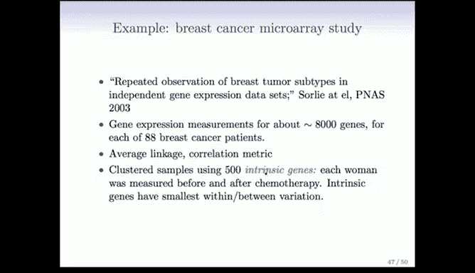

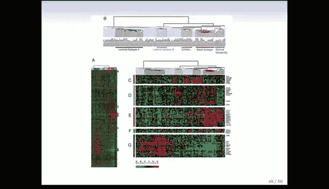

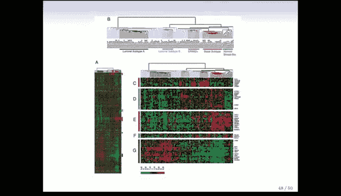

使用筛选出的约500个内在基因进行层次聚类后，得到了以下结果。结果通过一种称为**热图**的常见可视化方式呈现。

热图说明如下：
*   **每一行**代表一个基因（约500行）。
*   **每一列**代表一位患者（88列）。
*   **每个像素**的颜色表示标准化后的基因表达水平：
    *   `绿色`表示该基因在该患者中的表达低于平均水平（负值）。
    *   `红色`表示表达高于平均水平（正值）。

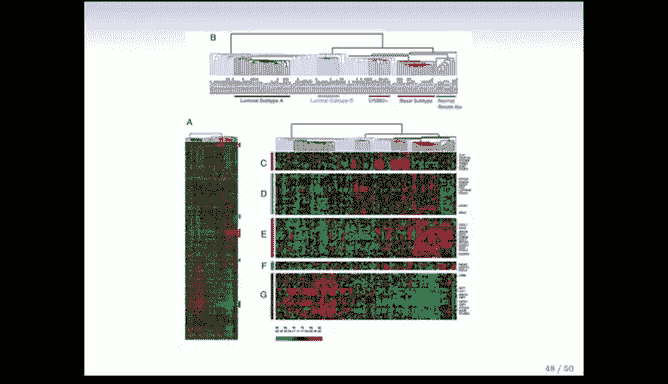

为了生成这幅结构清晰的热图，研究人员进行了双向聚类排序：
1.  对**列**（患者）应用了层次聚类，并根据聚类树中叶节点的顺序对列进行重排。
2.  对**行**（基因）同样应用了层次聚类并重排。

正是这种双向排序，使得数据呈现出大块的红色和绿色区域，结构清晰可见。如果按原始顺序显示，图像会显得随机且杂乱。这种有效的显示方法最早在斯坦福大学的基因组学实验室中使用，对于直观展示海量数据、发现宏观模式非常有帮助。

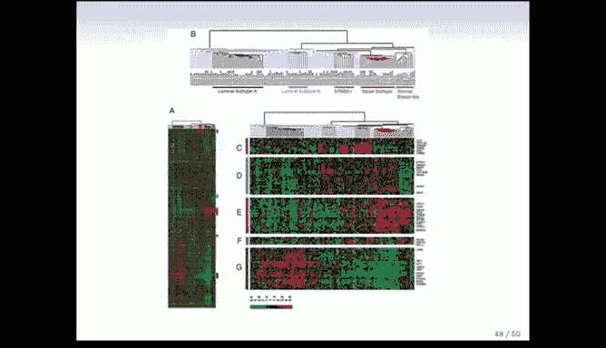

## 患者亚组的识别与解读

在完整的聚类树（显示在热图上方）中，患者被划分为多个簇。研究人员根据每个簇中高表达的基因特征，为主要的簇赋予了生物学名称：

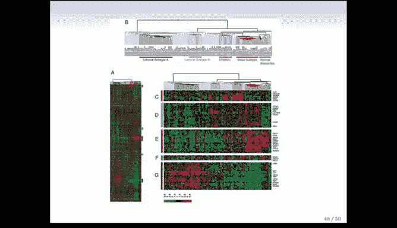
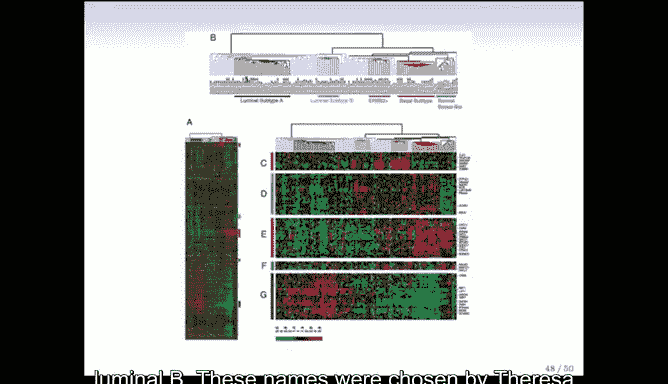

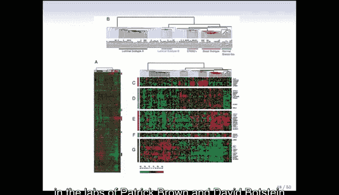

这些名称包括：Normal（正常样）、Basal（基底样）、ERB2（HER2过表达型）、Luminal A（管腔A型）、Luminal B（管腔B型）等。

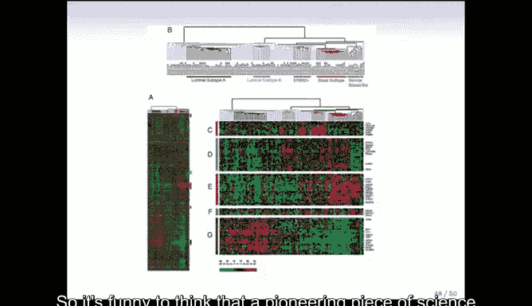

为了进一步理解这些亚组，研究人员提取了在特定亚组中高表达的基因子集进行展示。

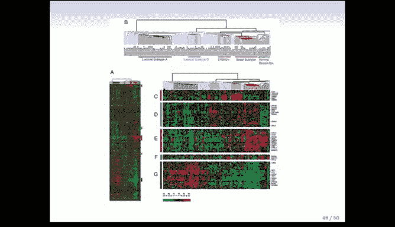
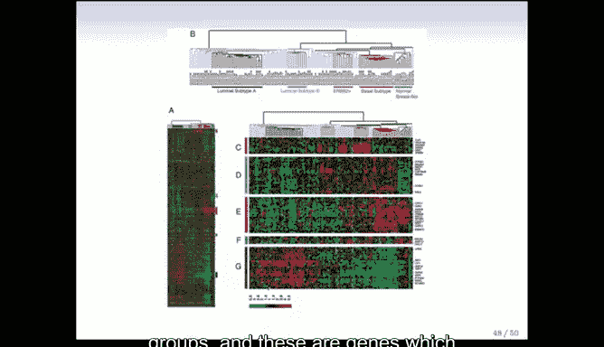

例如，某些基因块在红色和蓝色组中高表达，而另一些基因块则在其他簇中高表达。肿瘤学家通过分析这些基因的功能，来理解不同亚组之间的生物学差异。

## 聚类结果与临床关联

最重要的是，研究进一步探索了这些通过基因表达定义的亚组与患者临床结局之间的关系。下图展示了不同亚组患者的**生存曲线**。

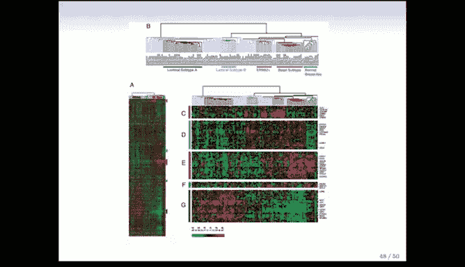

生存曲线分析显示，不同亚组患者的预后存在显著差异：
*   **Basal（基底样）** 和 **ERB2（HER2过表达型）** 亚组的生存率较差。
*   **Luminal A（管腔A型）** 亚组的预后则好得多。

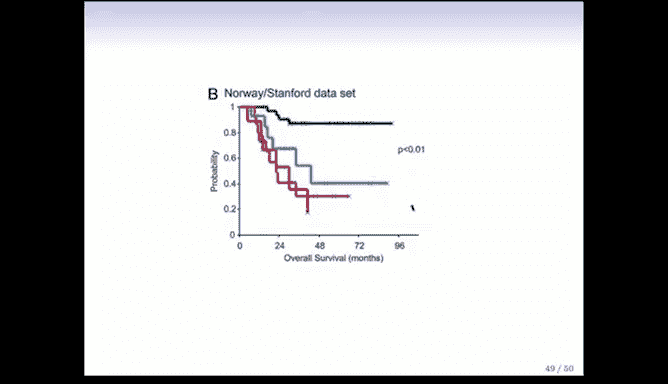

这种生存率的差异促使科学家深入研究这些亚组在基因层面的不同，从而为理解疾病机制和开发针对性疗法提供了线索。

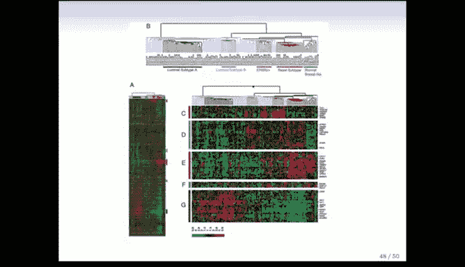
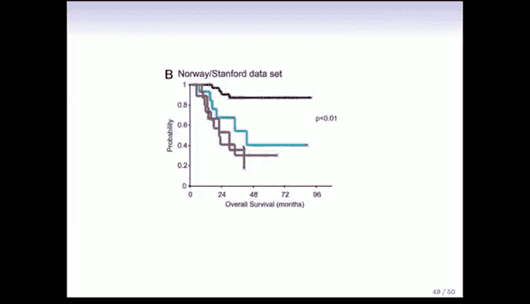
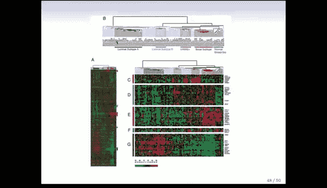

## 本节总结

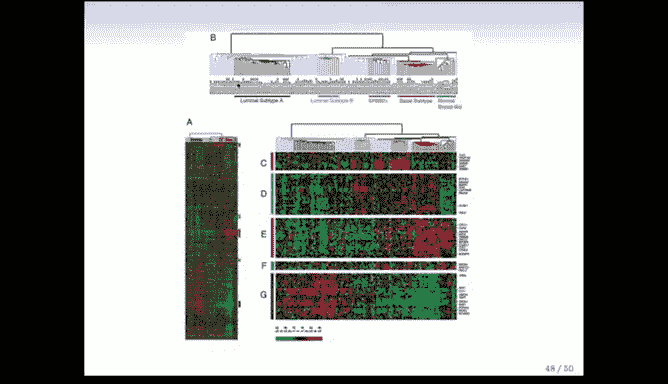

本节课中，我们一起学习了一个将层次聚类应用于重要真实科学问题（乳腺癌研究）的完整示例。

我们回顾了本系列关于**无监督学习**的章节，涵盖了**主成分分析**和**聚类分析**。这些方法对于理解无标签数据的变化模式和分组结构至关重要。它们既可以独立使用（如本例所示），也可以作为监督学习的预处理步骤来筛选特征。

我们也认识到，无监督学习问题本质上比监督学习更困难，因为缺乏“标签”或“黄金标准”，无法使用预测误差来直接评估模型性能。本次课程主要介绍了主成分分析和聚类这两种技术，它们属于一个更大的工具箱。

其他重要的无监督学习技术还包括：
*   自组织映射
*   独立成分分析
*   谱聚类

更多相关技术可以在《The Elements of Statistical Learning》一书的第14章及后续章节中找到。