# Python 版 95：主成分分析 I 实验教程 📊 


在本节课中，我们将学习如何使用Python进行主成分分析。主成分分析是一种无监督学习方法，常用于数据降维和可视化。我们将使用美国各州的犯罪率数据集来演示整个过程。


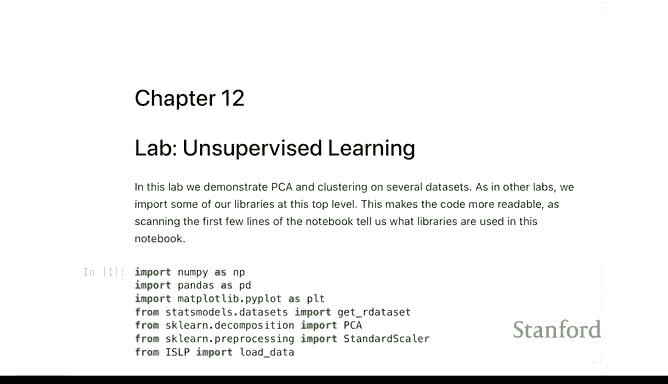

---

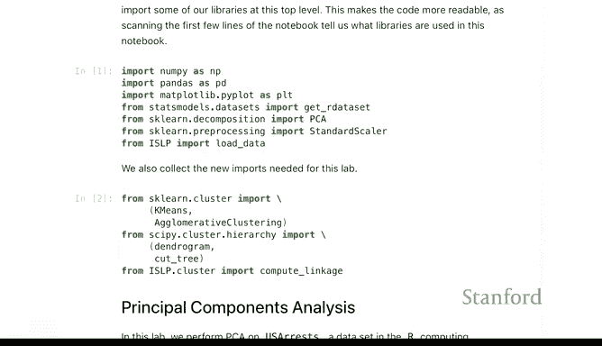

## 🧰 导入必要的库

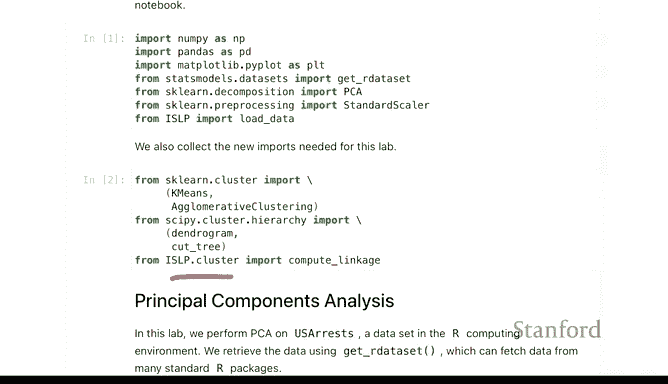

首先，我们需要导入一些必要的Python库。这些库包括用于数据处理、数值计算和主成分分析的工具。

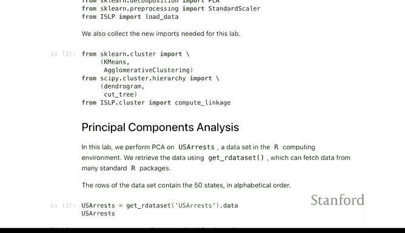

```python
import numpy as np
import pandas as pd
from sklearn.preprocessing import StandardScaler
from sklearn.decomposition import PCA
import matplotlib.pyplot as plt
```

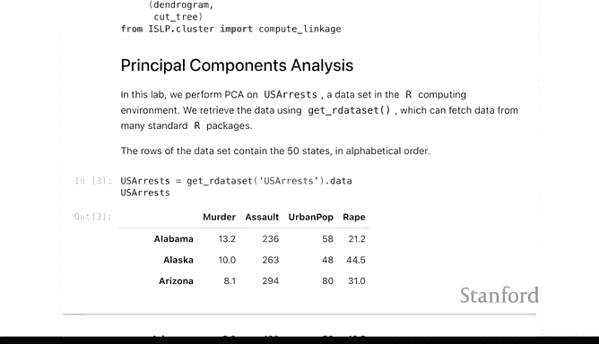

此外，我们还会用到ISLP包中的一些特定函数，以便获取数据集。

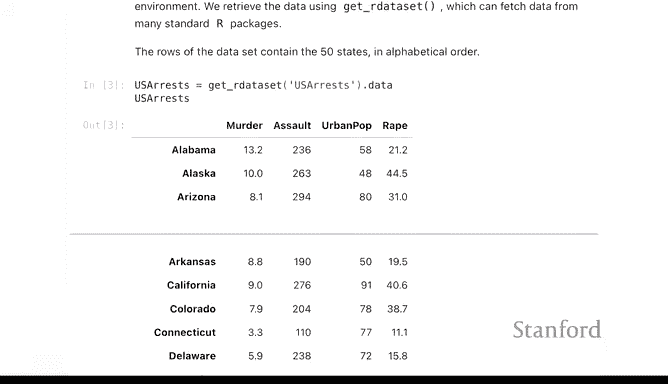

---

## 📁 加载数据集

我们将使用美国各州犯罪率数据集。这个数据集最初来自R语言环境，但我们可以通过一个便捷的函数 `get_R_data` 来获取它。

```python
from ISLP import load_data
USArrests = load_data('USArrests')
```

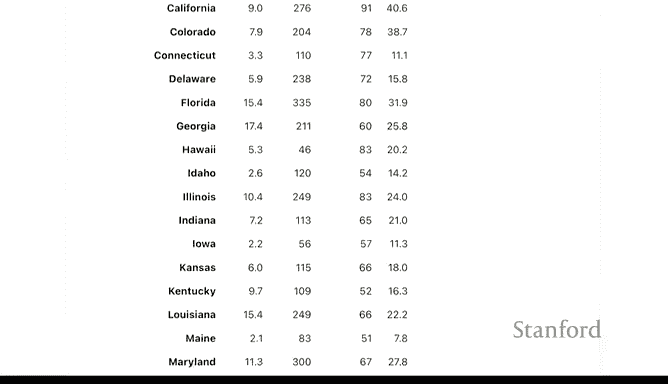

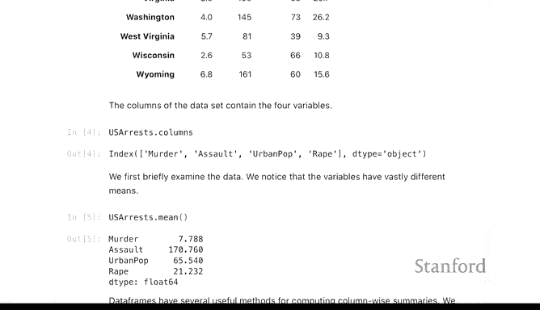

这个数据集包含50个州（行）和4个变量（列）。变量分别是：
*   `Murder`：谋杀率
*   `Assault`：袭击率
*   `UrbanPop`：城市人口百分比
*   `Rape`：强奸率

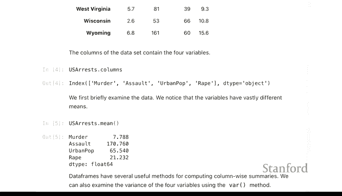

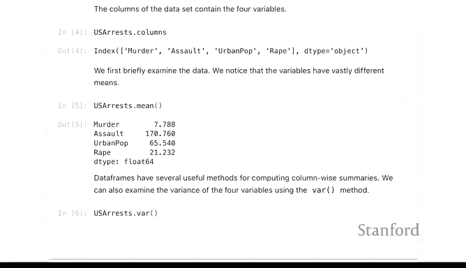

---

## 🔍 探索数据

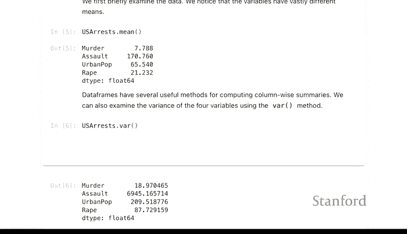

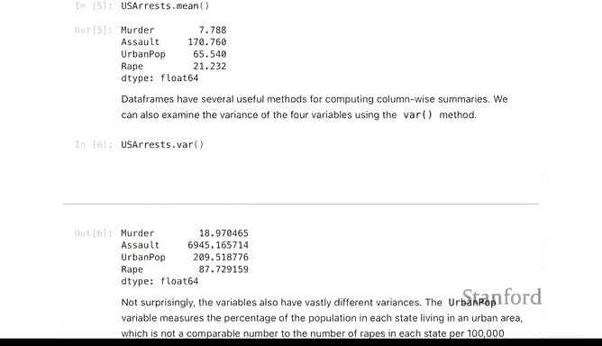

在进行主成分分析之前，我们先查看数据的均值和方差。

以下是计算均值的代码：
```python
means = USArrests.mean()
print(means)
```

以下是计算方差的代码：
```python
variances = USArrests.var()
print(variances)
```

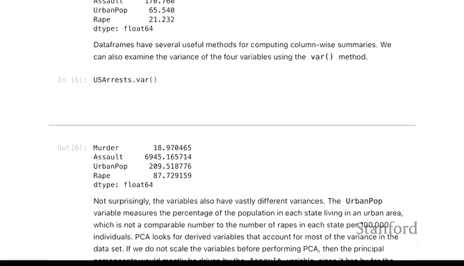

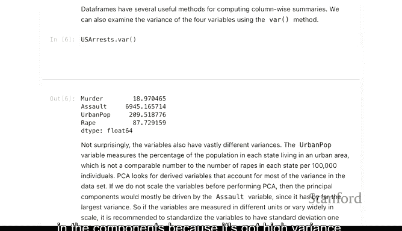

我们注意到各个变量的方差差异很大。由于主成分分析对变量的尺度敏感，它会寻找方差最大的线性组合。如果直接使用原始数据，方差大的变量（如`Assault`）会在主成分中占据过大的权重。

---

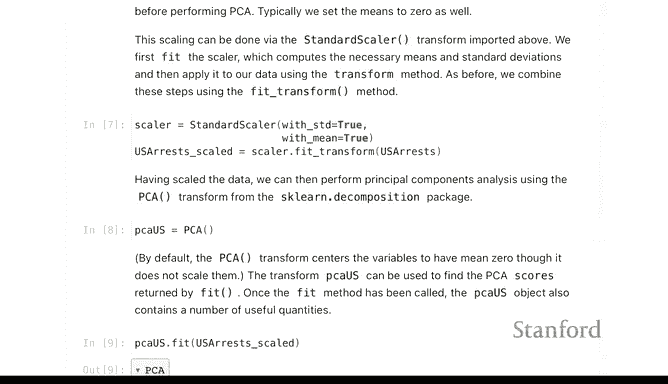

## ⚖️ 数据标准化

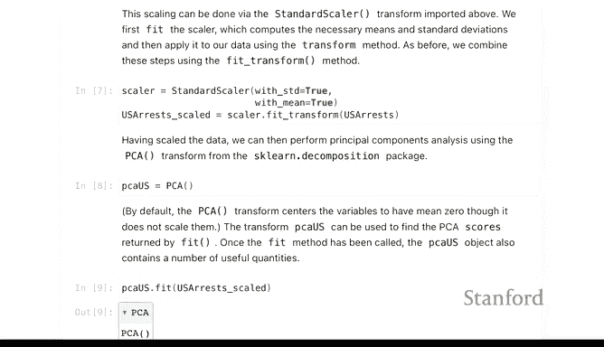

为了解决尺度问题，我们通常会对数据进行标准化，使每个变量的均值为0，标准差为1。

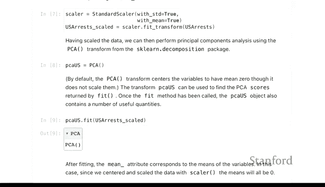

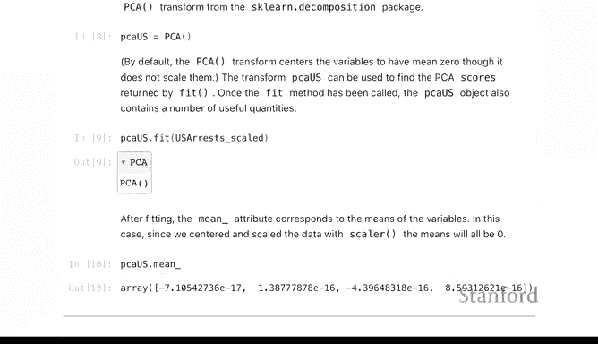

我们使用 `StandardScaler` 来实现：

```python
scaler = StandardScaler(with_mean=True, with_std=True)
USArrests_scaled = scaler.fit_transform(USArrests)
USArrests_scaled = pd.DataFrame(USArrests_scaled, columns=USArrests.columns)
```

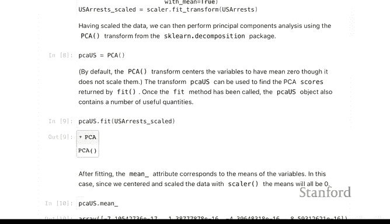

现在，数据已经准备好进行主成分分析。

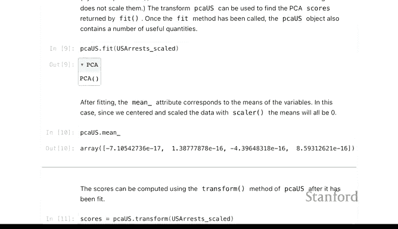

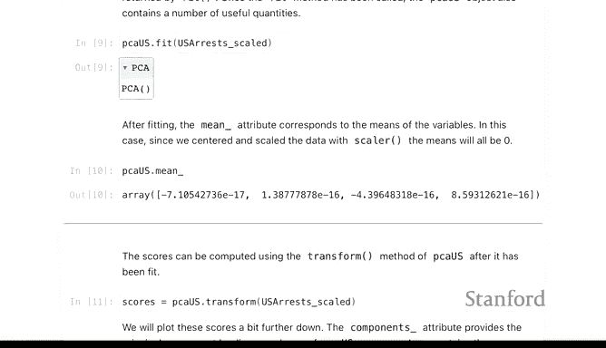

---

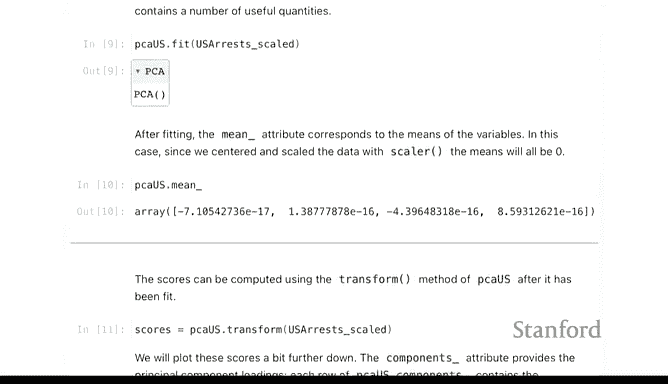

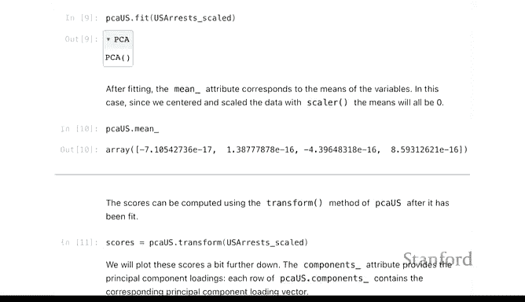

## 🧮 进行主成分分析

接下来，我们使用 `sklearn` 库中的 `PCA` 类来拟合标准化后的数据。

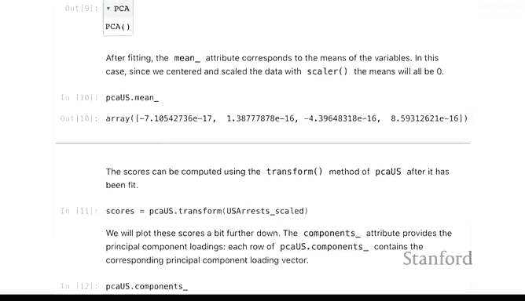

```python
pca_us = PCA()
pca_us.fit(USArrests_scaled)
```

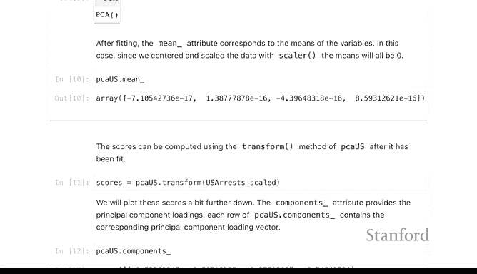

`fit` 方法只需要输入特征矩阵 `X`，这再次提醒我们主成分分析是一种无监督学习方法，没有响应变量。

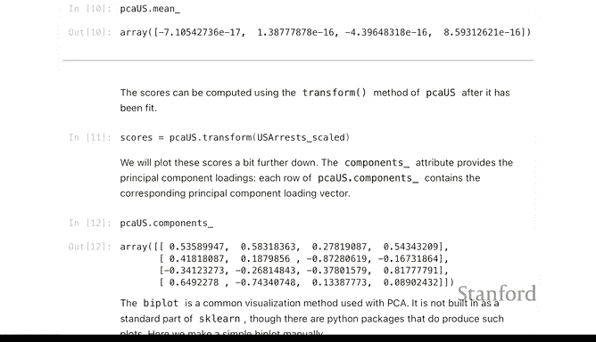

我们可以检查主成分的均值，理论上应该都为0。

```python
print(pca_us.mean_)
```

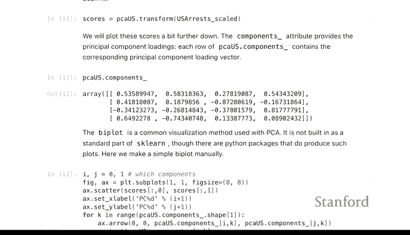

---

## 📈 提取主成分结果

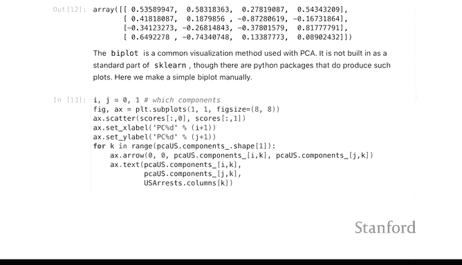

拟合模型后，我们可以提取两个关键结果：主成分得分和载荷向量。

**主成分得分**是原始数据在主成分方向上的投影。我们通过 `transform` 方法获得：

```python
scores = pca_us.transform(USArrests_scaled)
scores = pd.DataFrame(scores, columns=['PC1', 'PC2', 'PC3', 'PC4'])
```

**载荷向量**定义了每个主成分的方向，即每个原始变量所占的权重。

```python
components = pca_us.components_
```

由于我们有4个变量，因此最多可以得到4个主成分。

---

## 📊 可视化主成分

一种常见的做法是绘制前两个主成分的得分图，这被称为双标图。它同时展示了数据点（州）在主成分空间的位置，以及原始变量（箭头）的方向。

以下是绘制双标图的代码框架：

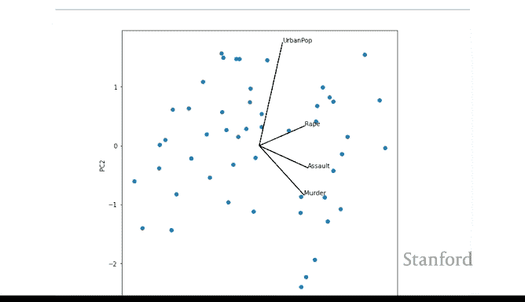

```python
# 此处为绘图代码，包括设置图形、绘制得分散点图和变量方向箭头
```

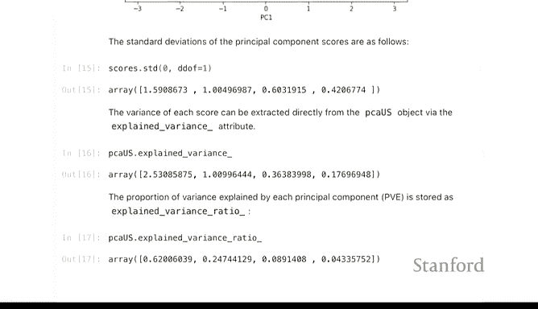

在生成的图中，我们可以通过箭头与坐标轴的对应关系来解释主成分的含义。例如，一个轴可能代表“城市化程度”，另一个轴可能代表“暴力犯罪水平”。

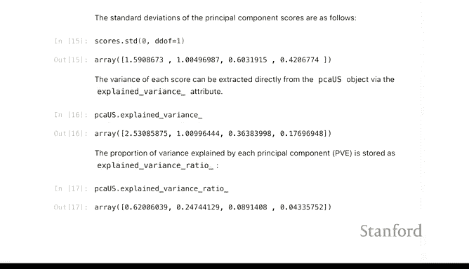

需要注意的是，主成分的符号（正负）是不确定的。有时我们的图可能与教科书上的方向相反，这时可以通过对某个主成分的所有得分乘以-1来翻转方向，这不会改变其解释的方差。

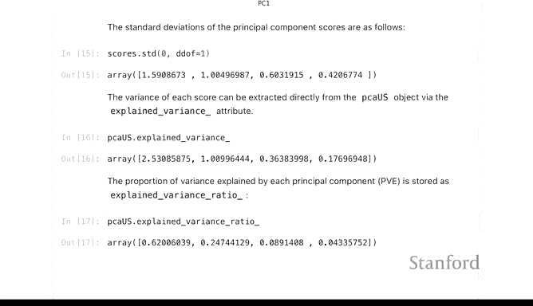

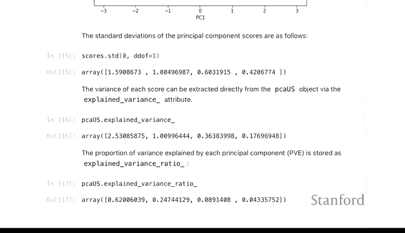

---

## 📉 解释方差

主成分分析的核心目标是数据降维，因此了解每个主成分所解释的方差比例非常重要。

我们可以获取每个主成分的方差（即特征值）：
```python
explained_variance = pca_us.explained_variance_
```

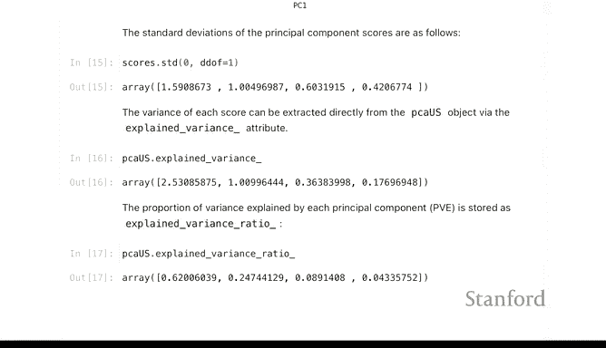

更常用的是**方差解释比例**：
```python
explained_variance_ratio = pca_us.explained_variance_ratio_
```

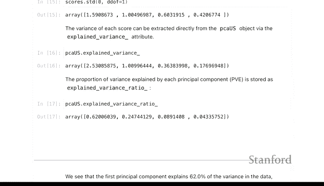

对于标准化后的数据，所有主成分的方差之和等于原始变量数（4）。第一个主成分通常解释大部分方差，第二个次之，依此类推。

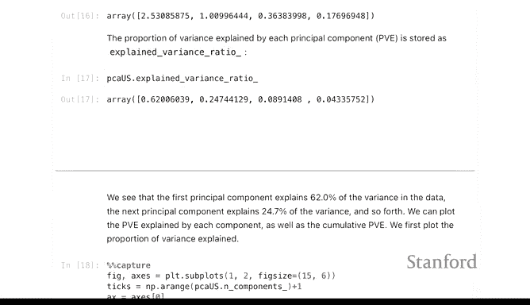

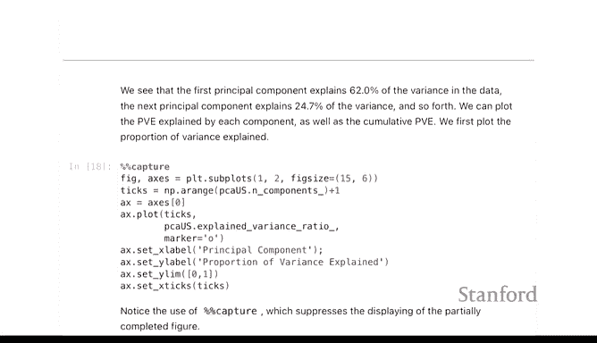

---

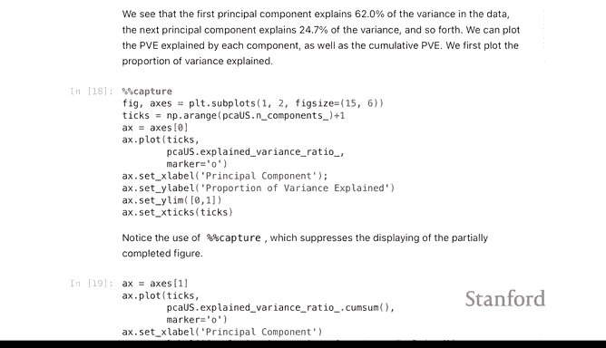

## 🎨 绘制碎石图

为了直观展示方差解释情况，我们通常会绘制两种图：方差解释比例图和累积方差解释比例图。

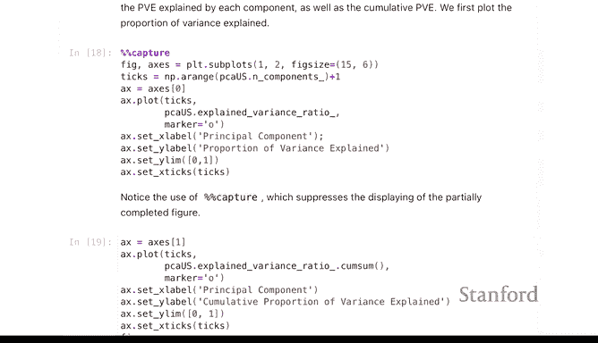

以下是创建包含两个子图的代码示例：

```python
fig, (ax1, ax2) = plt.subplots(1, 2, figsize=(12, 4))

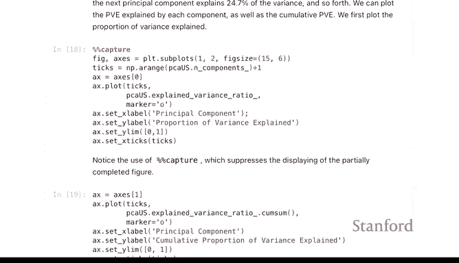

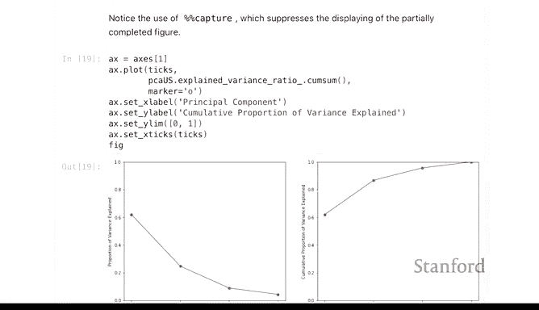

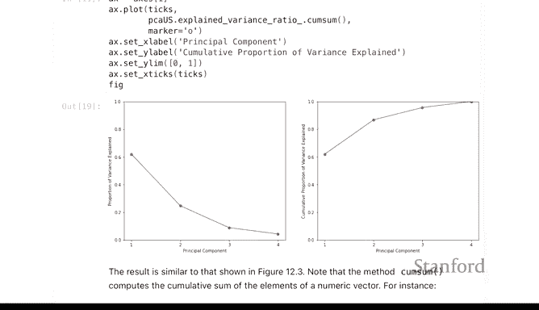

# 第一个图：各主成分方差解释比例
ax1.plot(np.arange(1, 5), explained_variance_ratio, '-o')
ax1.set_title('Proportion of Variance Explained')
ax1.set_xlabel('Principal Component')

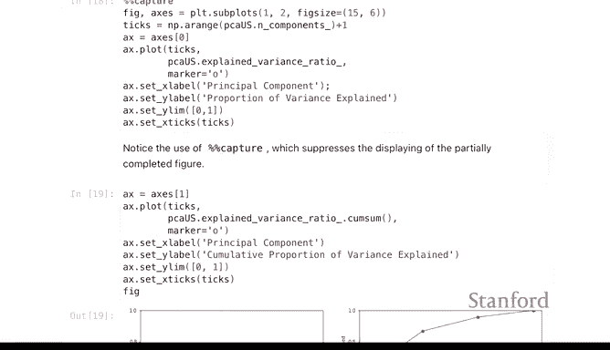

# 第二个图：累积方差解释比例
ax2.plot(np.arange(1, 5), np.cumsum(explained_variance_ratio), '-s')
ax2.set_title('Cumulative Proportion of Variance Explained')
ax2.set_xlabel('Principal Component')

plt.show()
```

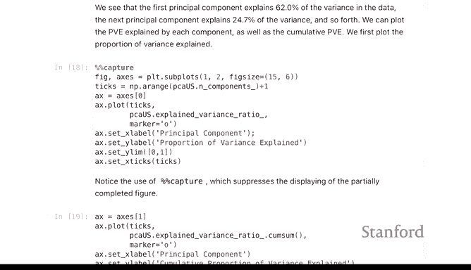

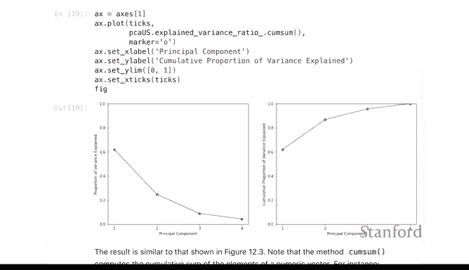

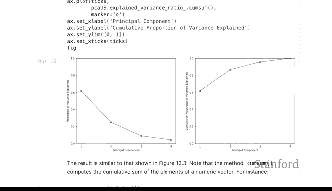

从图中我们可以清楚地看到，前两个主成分已经解释了数据中绝大部分的方差。

---


## 📝 总结

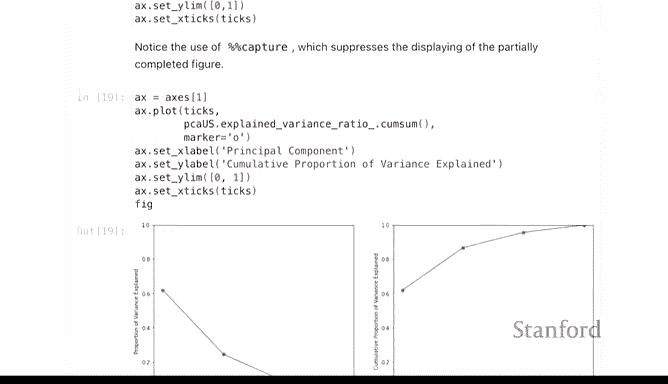

本节课我们一起学习了主成分分析的完整流程。

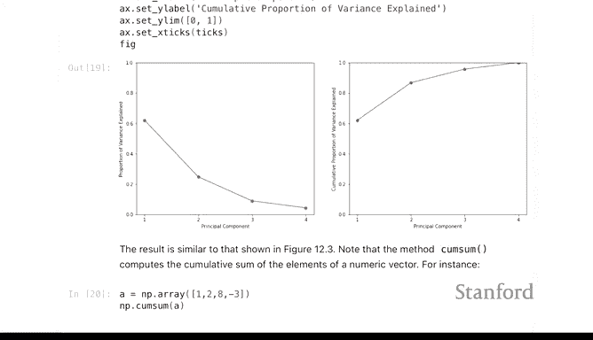

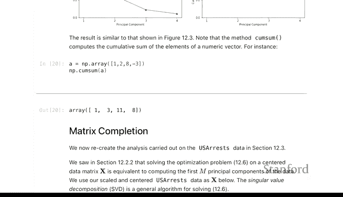

1.  **导入库并加载数据**：我们使用了来自R的犯罪率数据集。
2.  **数据标准化**：由于主成分分析对尺度敏感，我们使用 `StandardScaler` 将数据标准化。
3.  **拟合PCA模型**：使用 `sklearn` 的 `PCA` 类进行拟合，这是一种无监督学习。
4.  **提取与解释结果**：我们获得了主成分得分和载荷向量，并通过双标图进行可视化解释。
5.  **评估主成分**：通过检查方差解释比例和绘制碎石图，我们确定前两个主成分包含了数据的主要信息。

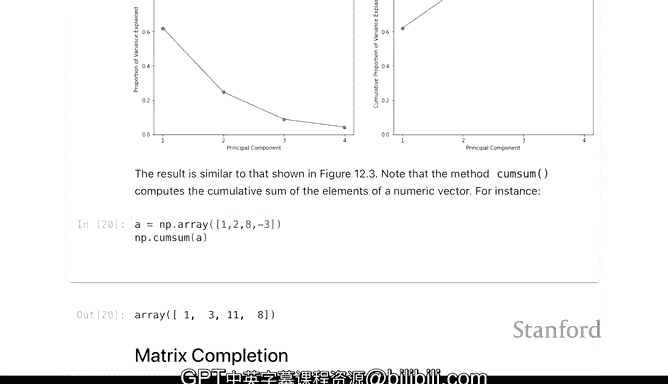


主成分分析是探索高维数据和降维的强大工具。在后续内容中，你还可以了解如何将其应用于矩阵补全等更复杂的任务。