# Python 版 96：聚类分析 I 🧩

在本节课中，我们将学习两种最流行的聚类方法：**K均值聚类**和**层次聚类**。我们将通过Python代码示例，了解它们的基本原理、实现方式以及如何解读结果。

---

## K均值聚类 🎯

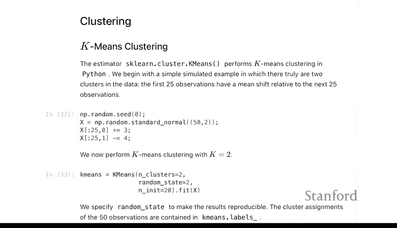

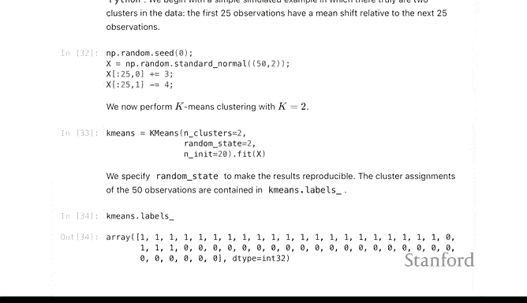

上一节我们介绍了聚类分析的基本概念，本节中我们来看看第一种具体方法：K均值聚类。这是一种“自上而下”的划分式方法，需要预先指定聚类数量K。

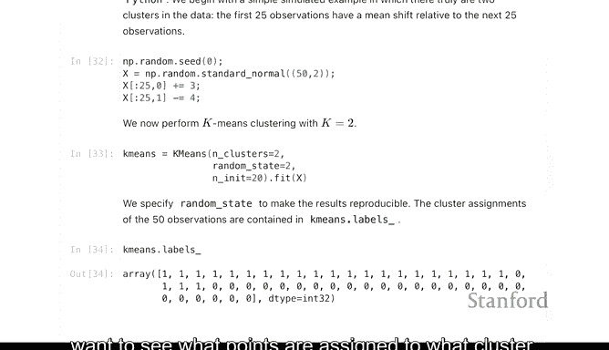

K均值是一种无监督学习方法，我们将使用`scikit-learn`库中的`KMeans`类来实现。与主成分分析类似，我们只需在特征数据上调用`fit`方法。

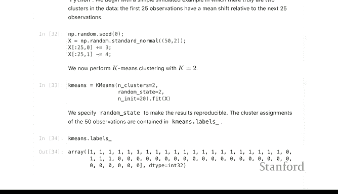

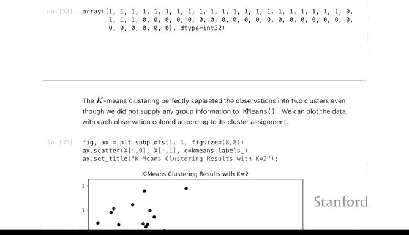

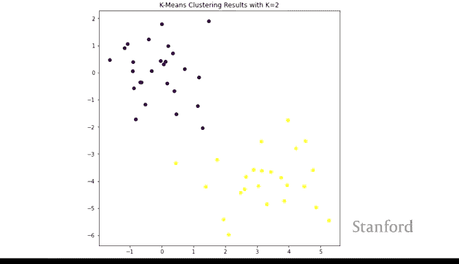

以下是生成模拟数据并应用K均值聚类的步骤：

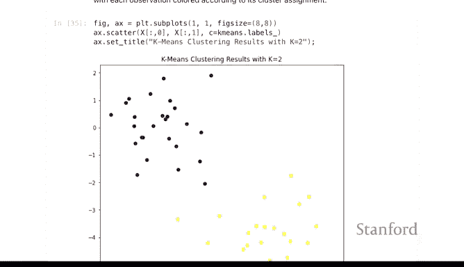

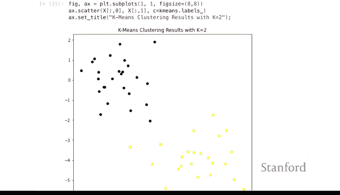

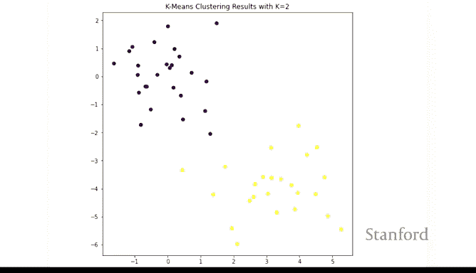

```python
# 生成包含两个自然类别的模拟数据
# 拟合K均值模型，设定K=2
kmeans = KMeans(n_clusters=2, n_init=20, random_state=0)
kmeans.fit(X)
```

模型拟合后，一个关键步骤是查看每个数据点被分配到了哪个簇。这可以通过访问模型的`labels_`属性获得。

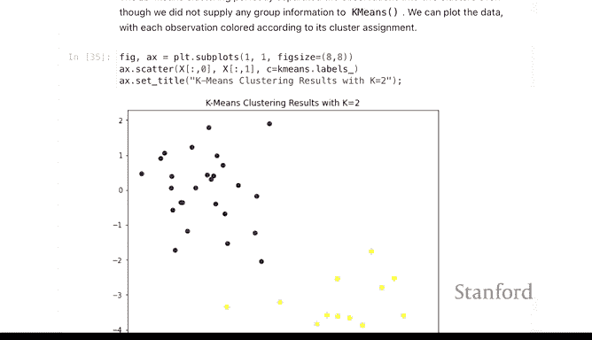

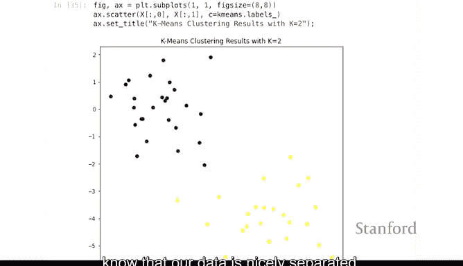

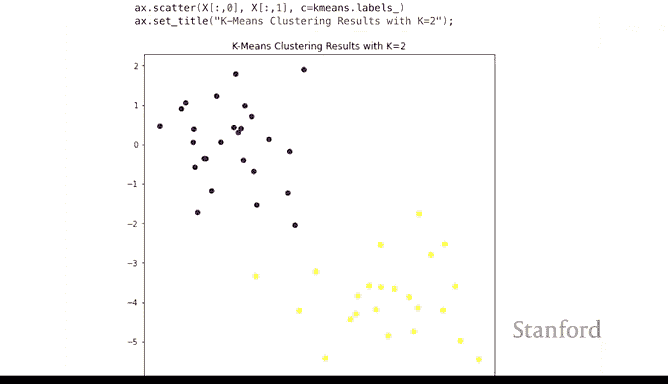

```python
# 获取每个点的簇标签
cluster_labels = kmeans.labels_
```

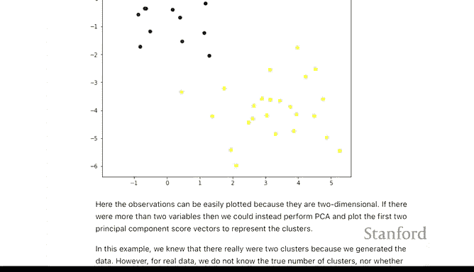

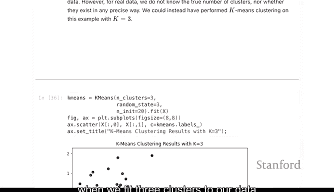

在我们的模拟数据中，前25个点属于一个类别，后25个点属于另一个类别。K均值模型完美地识别出了这个结构。

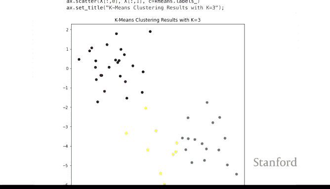

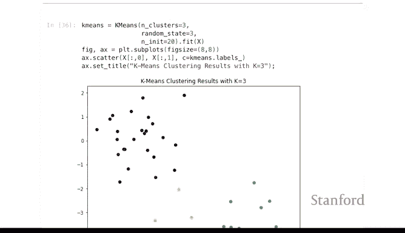

我们可以根据簇标签为数据点着色并绘制散点图，以直观地展示聚类结果。图中清晰地显示了两个分离的簇。

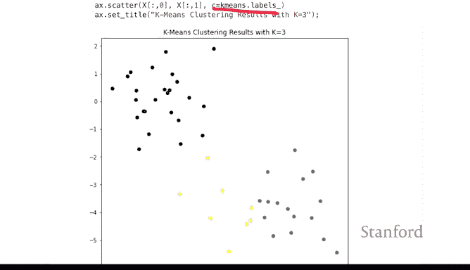

然而在实践中，我们通常不知道数据中确切的簇数量。因此，尝试不同的K值很重要。例如，我们可以尝试用K=3来拟合数据。

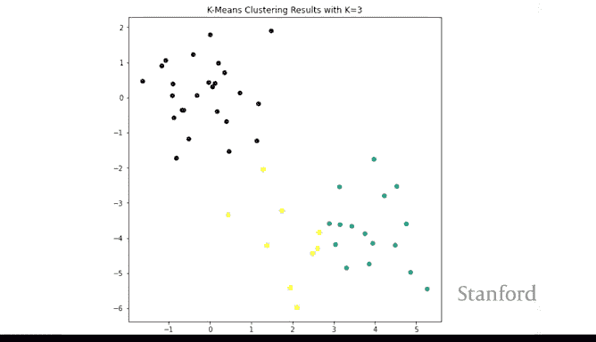

```python
# 尝试用3个簇进行拟合
kmeans_3 = KMeans(n_clusters=3, n_init=20, random_state=0)
kmeans_3.fit(X)
```

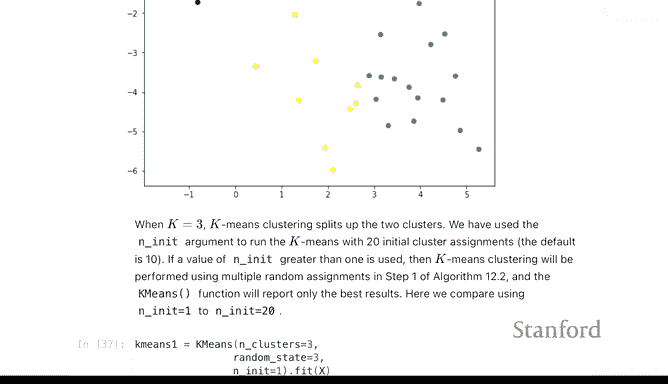

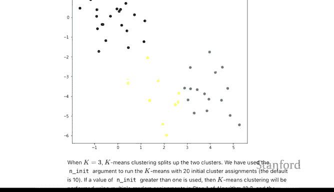

用3个簇拟合的结果看起来不如K=2时理想。模型似乎从每个原始簇的边缘分离出了一些点，而不是将一个大簇清晰地一分为二。这个简单的二维示例便于可视化，但在高维数据中，判断最佳簇数会更加困难。

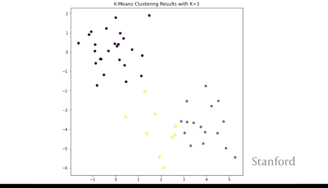

K均值算法从随机初始化簇中心开始，然后通过迭代交换数据点来最小化**簇内平方和**。不同的初始化可能导致不同的最终结果。`n_init`参数正是用来控制随机初始化的次数，算法最终会选择**簇内平方和**最小的那个结果。

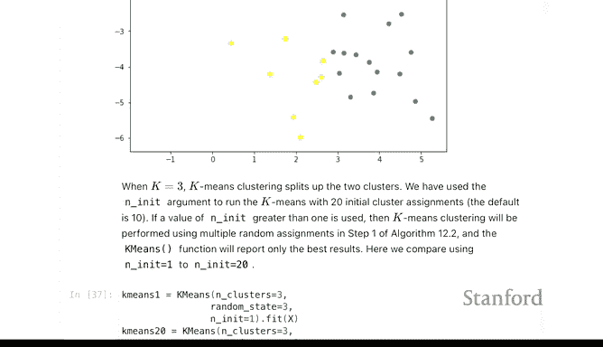

```python
# 比较使用1次初始化和20次初始化的结果
# 对于分离良好的数据，使用多次初始化通常能获得约5%的改进
```

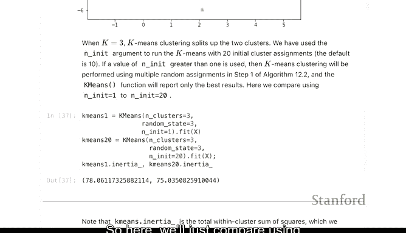

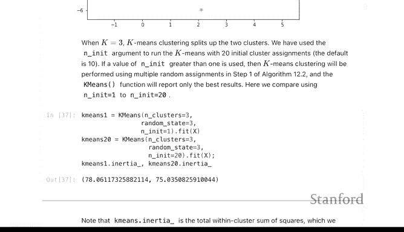

---

## 层次聚类 🌳

上一节我们介绍了需要预先指定簇数的K均值聚类，本节我们来看看另一种“自下而上”的聚合式方法：层次聚类。它从每个点作为一个独立的簇开始，逐步合并最相似的簇。

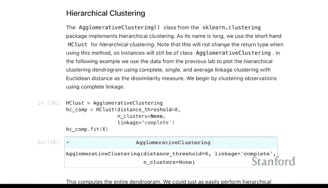

层次聚类中最重要的选择之一是**连接方式**，它决定了如何计算簇与簇之间的距离。三种主要的连接方式是：
*   **完全连接**：以两个簇中所有点间距离的最大值作为簇间距离。
*   **单连接**：以两个簇中所有点间距离的最小值作为簇间距离。
*   **平均连接**：以两个簇中所有点间距离的平均值作为簇间距离。

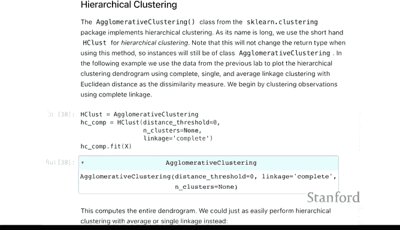

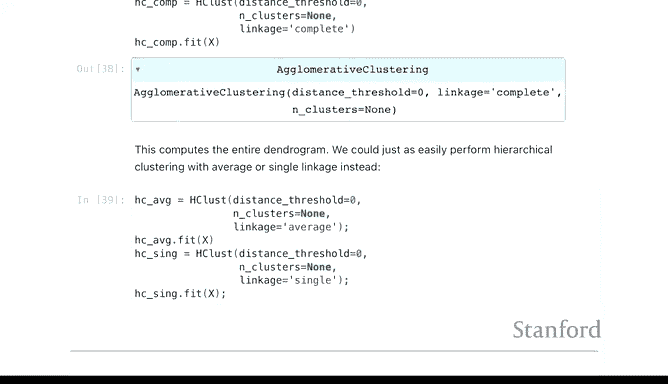

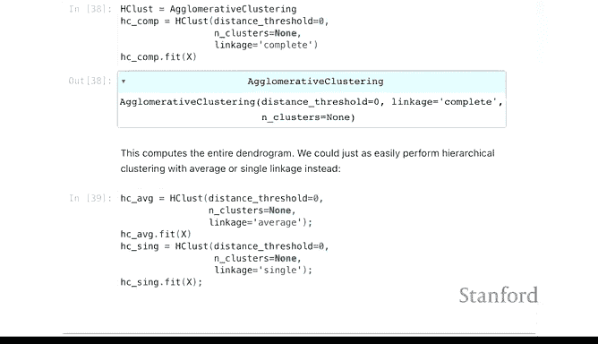

经验上，完全连接通常能产生更紧凑、更理想的簇。单连接有时会导致树状图在切割时没有明显的断点，而完全连接则能提供更清晰的切割位置。

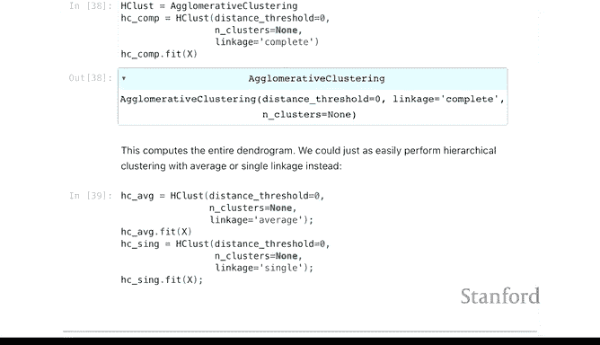

在代码实现上，层次聚类同样使用`scikit-learn`的估计器。拟合后，我们可以利用结果来绘制**树状图**。

```python
# 使用不同的连接方式拟合层次聚类模型
from sklearn.cluster import AgglomerativeClustering
hc_complete = AgglomerativeClustering(linkage='complete')
hc_complete.fit(X)
```

与K均值需要原始数据不同，层次聚类可以仅基于**距离矩阵**进行拟合。距离矩阵计算了数据集中所有观测对（行与行）之间的距离。

```python
# 计算距离矩阵并基于其拟合层次聚类
from scipy.spatial.distance import pdist, squareform
distance_matrix = squareform(pdist(X))
hc_complete.fit(distance_matrix)
```

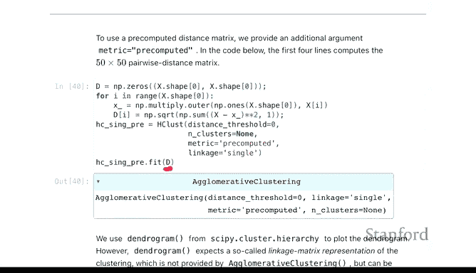

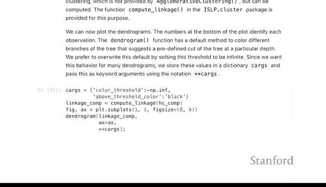

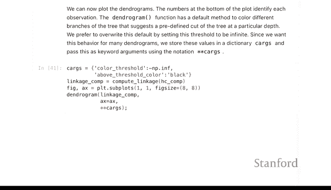

接下来，让我们绘制完全连接方式下的树状图。

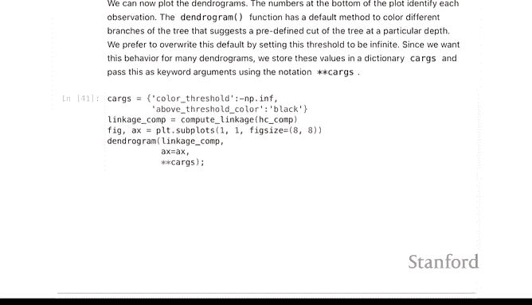

树状图中，底部的每个叶子节点代表一个原始数据点。垂直轴的高度代表了在该高度上两个簇被合并时的距离（对于完全和单连接，该值直接来自距离矩阵；对于平均连接，则是距离矩阵值的函数）。

我们知道模拟数据有两个自然类别。如果在树状图的适当高度（例如，在高度4处）进行水平切割，就会得到两个簇。树状图上的任何切割都对应着一组特定的聚类结果。

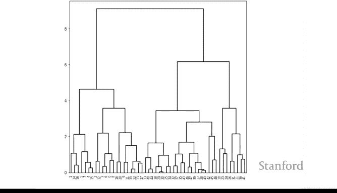

`cut_tree`函数可以用来在指定高度或指定簇数量处切割树状图，从而获得具体的簇分配。

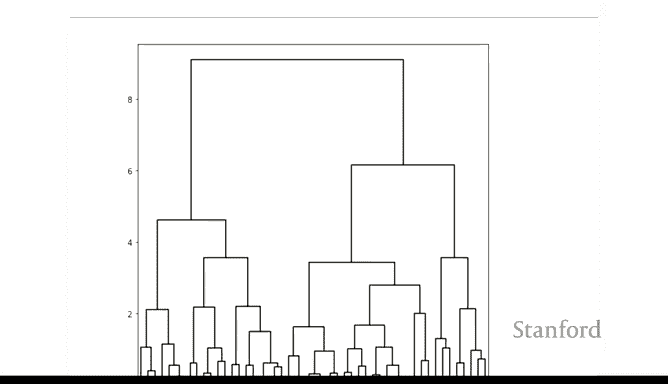

```python
# 在指定高度切割树状图以获得簇标签
# 也可以指定希望获得的簇数量
```

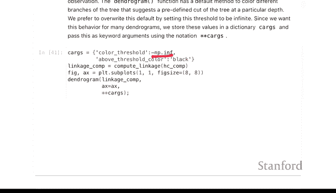

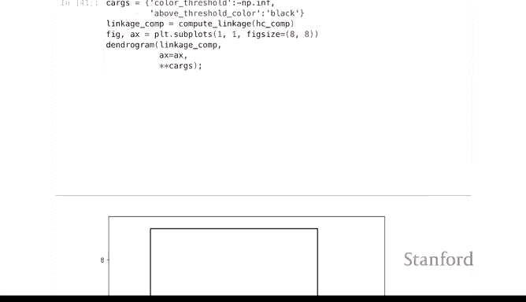

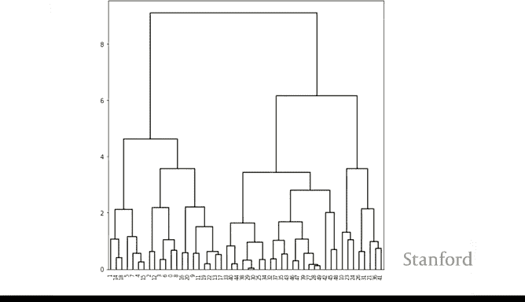

---

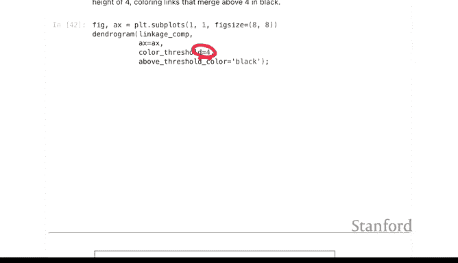

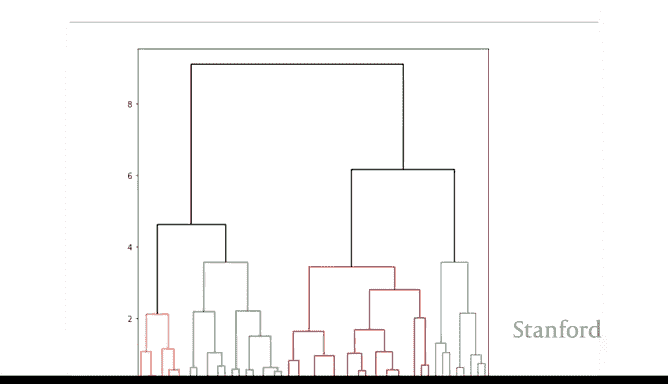

## 总结 📝

本节课中我们一起学习了两种核心的聚类技术。

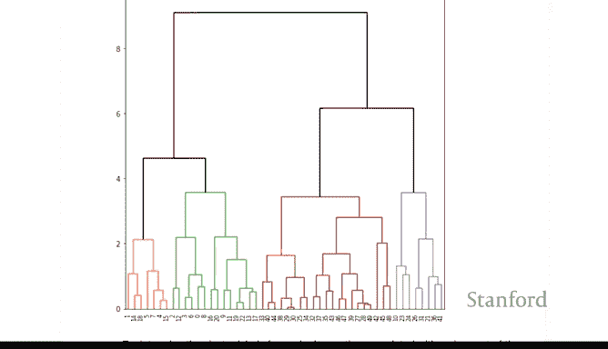

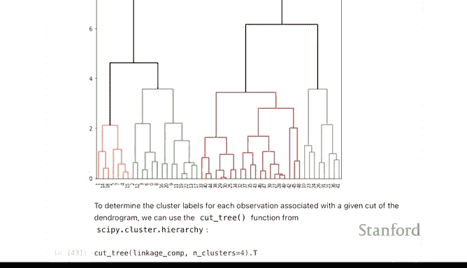

我们首先学习了**K均值聚类**，它是一种需要预先指定簇数（K）的划分方法。我们了解了如何使用`scikit-learn`实现它，如何通过`labels_`属性获取聚类结果，以及多次随机初始化（`n_init`）对优化**簇内平方和**的重要性。

接着，我们学习了**层次聚类**，这是一种从底部开始逐步合并簇的聚合方法。我们探讨了三种主要的连接方式（完全、单、平均）及其特点，并学习了如何基于距离矩阵进行拟合、如何绘制和解读**树状图**，以及如何通过切割树状图来获得不同数量的簇。

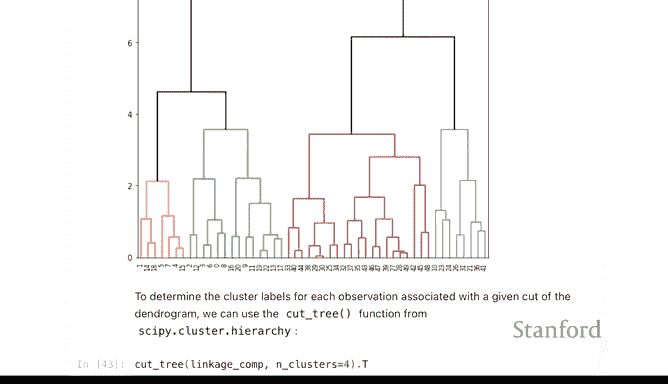

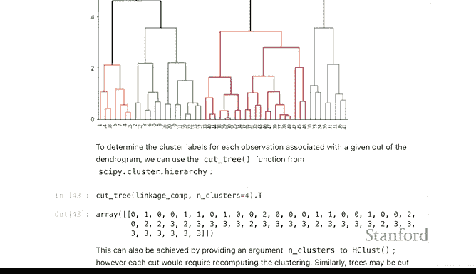

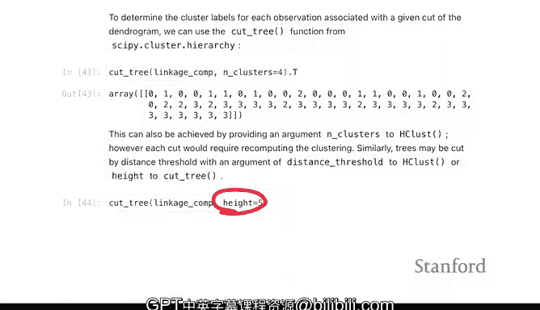


这两种方法各有优劣：K均值简单高效，但需指定K且对初始值敏感；层次聚类能提供完整的层次结构，但计算量较大且对连接方式选择敏感。在实际应用中，需要根据数据特点和分析目标来选择合适的方法。