# Python 版 97：NCI60基因表达数据应用 I 🧬

在本节课中，我们将学习如何将主成分分析（PCA）和聚类方法应用于一个真实的高维数据集——NCI60基因表达数据。我们将探索如何利用这些无监督学习方法，从数千个基因表达特征中发现癌症样本之间的潜在关系。

---

## 数据概述

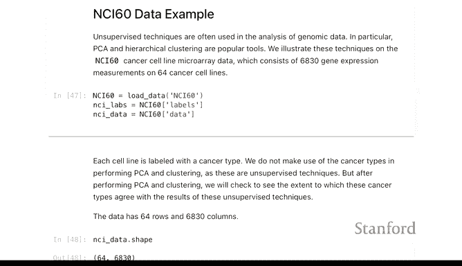

上一节我们介绍了聚类和PCA的基本概念。本节中，我们来看看如何将这些方法应用于一个更复杂、更真实的数据集。

NCI60数据集包含64个癌症样本（行），每个样本有大约7000个基因表达测量值（特征）。这些样本来自13种不同类型的癌症。我们的目标是，在不使用已知癌症类型标签的情况下，通过无监督学习方法（PCA和聚类）探索样本之间的相似性，并观察计算出的分组是否与真实的癌症类型相符。

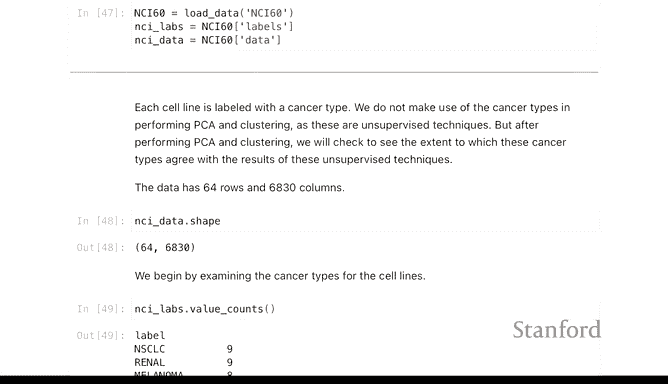

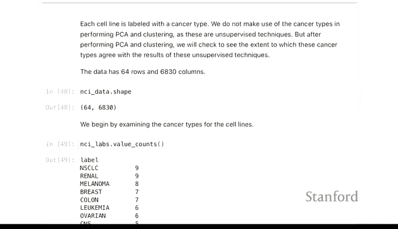

## 主成分分析（PCA）应用

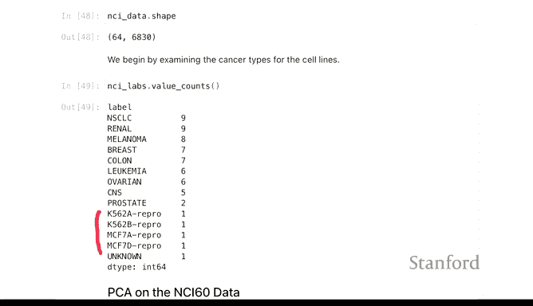

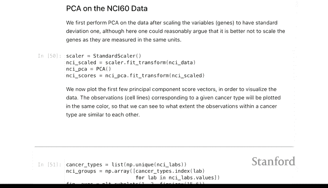

首先，我们对基因表达数据运行主成分分析。虽然所有测量值单位相同，但按照惯例，我们仍对数据进行标准化处理。

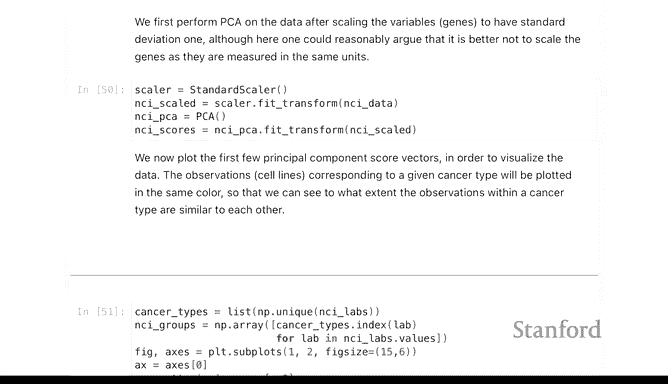

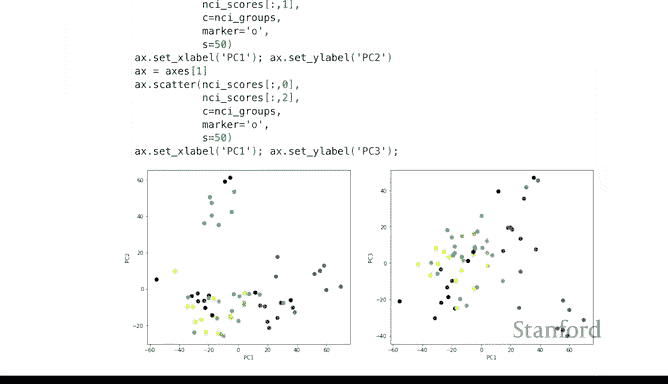

以下是执行PCA并获取主成分得分的代码：
```python
from sklearn.decomposition import PCA
# 假设 `data` 是标准化后的基因表达数据矩阵
pca = PCA()
pca_scores = pca.fit_transform(data)
```

我们得到了63个主成分（因为主成分数量最多为 `min(n_samples - 1, n_features)`）。通过绘制前几个主成分的散点图，我们可以直观地观察样本分布。

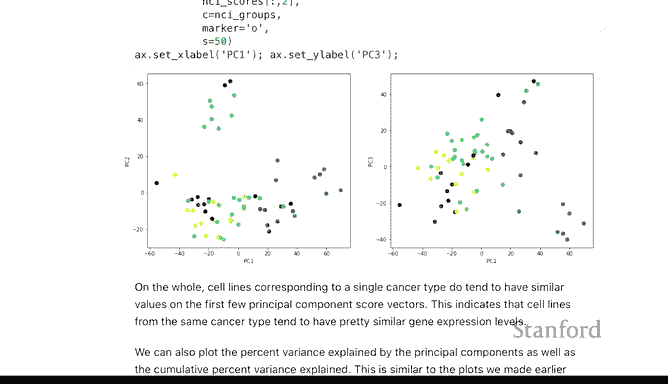

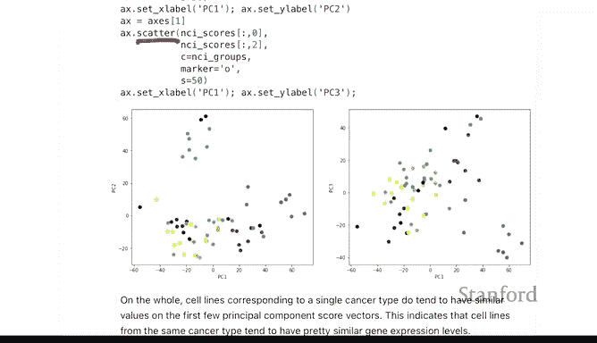

以下是绘制第一与第二、第一与第三主成分散点图的示例：
```python
import matplotlib.pyplot as plt
# 绘制PC1 vs PC2
plt.scatter(pca_scores[:, 0], pca_scores[:, 1], c=labels)
plt.xlabel('Principal Component 1')
plt.ylabel('Principal Component 2')
plt.show()
# 绘制PC1 vs PC3
plt.scatter(pca_scores[:, 0], pca_scores[:, 2], c=labels)
plt.xlabel('Principal Component 1')
plt.ylabel('Principal Component 3')
plt.show()
```

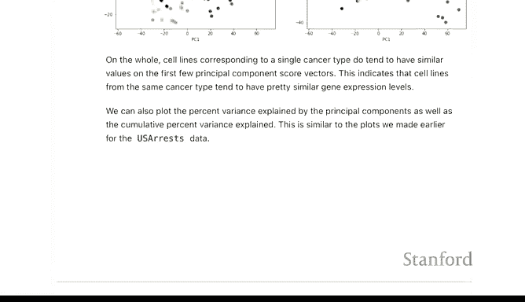

在图中，我们用不同颜色代表已知的癌症类型标签。可以观察到某些颜色的点（如代表白血病或结肠癌的点）在图中倾向于聚集在一起，这表明主成分在一定程度上捕捉到了与癌症类型相关的生物学差异。

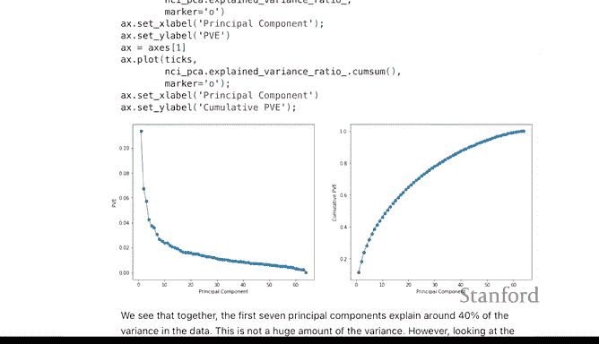

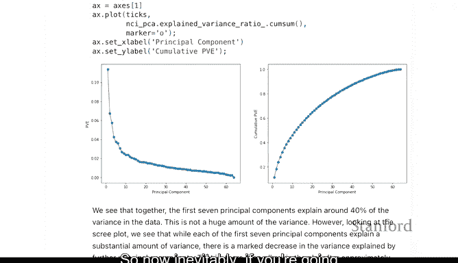

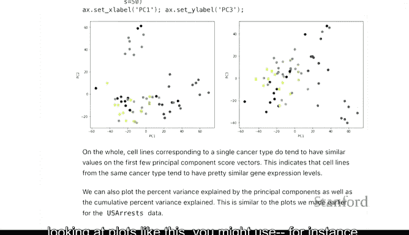

## 方差解释与碎石图

接下来，我们检查各主成分解释的方差比例，这有助于我们决定保留多少个主成分用于后续分析。

以下是绘制方差解释比例图和累积方差解释比例图的代码：
```python
import numpy as np
# 计算方差解释比例
explained_variance_ratio = pca.explained_variance_ratio_
# 计算累积比例
cumulative_variance = np.cumsum(explained_variance_ratio)
# 绘制碎石图
plt.figure(figsize=(10, 4))
plt.subplot(1, 2, 1)
plt.plot(range(1, len(explained_variance_ratio)+1), explained_variance_ratio, 'o-')
plt.xlabel('Principal Component')
plt.ylabel('Proportion of Variance Explained')
plt.title('Scree Plot')
plt.subplot(1, 2, 2)
plt.plot(range(1, len(cumulative_variance)+1), cumulative_variance, 'o-')
plt.xlabel('Principal Component')
plt.ylabel('Cumulative Proportion of Variance Explained')
plt.title('Cumulative Variance Explained')
plt.tight_layout()
plt.show()
```

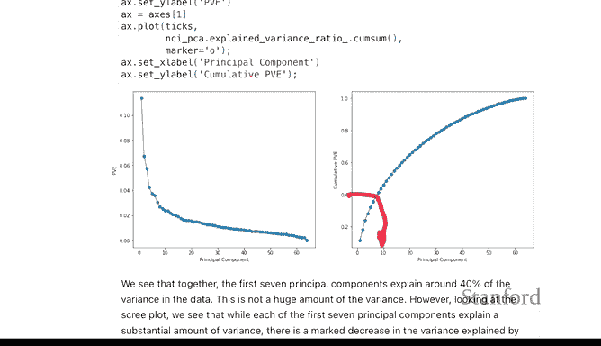

对于这个有7000个特征的数据集，第一个主成分解释了约15%的方差，这已经相当可观。前7个主成分共同解释了约40%的总方差。在实践中，人们常通过观察碎石图的“拐点”来主观选择主成分数量，例如本例中可能选择6到9个。

## 层次聚类分析

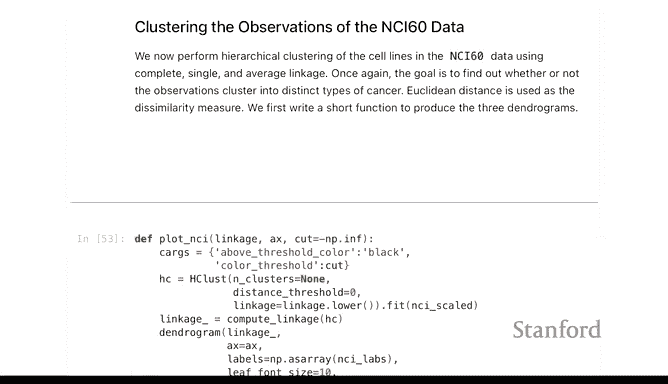

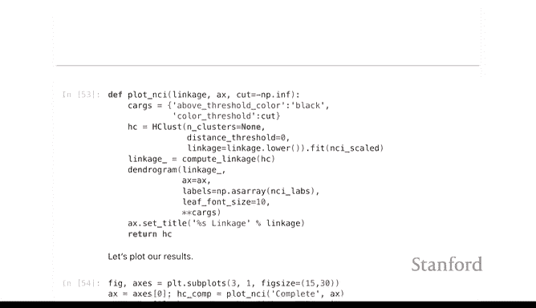

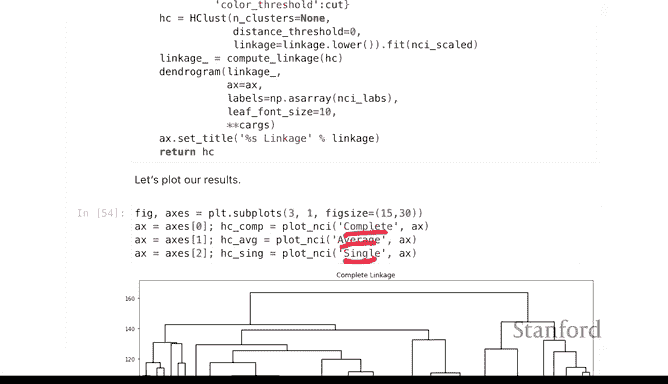

在完成PCA后，我们转向聚类分析。我们将使用层次聚类，并比较不同的连接方法。

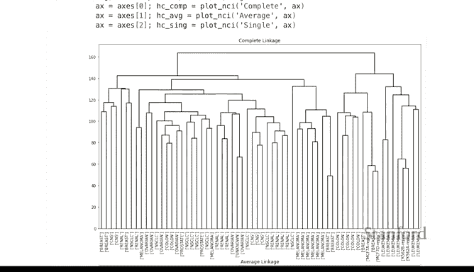

以下是使用不同连接方法进行层次聚类并绘制树状图的步骤：
1.  计算样本间的距离矩阵（通常使用欧氏距离）。
2.  应用层次聚类算法，指定连接方法（如完全连接、平均连接、单连接）。
3.  绘制树状图。

```python
from scipy.cluster.hierarchy import linkage, dendrogram
from scipy.spatial.distance import pdist
# 计算距离矩阵
distance_matrix = pdist(data_scaled) # data_scaled 是标准化后的数据
# 完全连接
Z_complete = linkage(distance_matrix, method='complete')
plt.figure(figsize=(10, 5))
dendrogram(Z_complete)
plt.title('Dendrogram (Complete Linkage)')
plt.show()
# 平均连接
Z_average = linkage(distance_matrix, method='average')
plt.figure(figsize=(10, 5))
dendrogram(Z_average)
plt.title('Dendrogram (Average Linkage)')
plt.show()
# 单连接
Z_single = linkage(distance_matrix, method='single')
plt.figure(figsize=(10, 5))
dendrogram(Z_single)
plt.title('Dendrogram (Single Linkage)')
plt.show()
```

比较三种树状图：
*   **完全连接**：树状图顶部显示出几个定义相对清晰的簇，合并高度差异明显，存在自然的切割点。
*   **单连接**：容易出现“链式效应”，许多合并只是将单个点逐步添加到大簇中，缺乏清晰的分离点，结果对切割高度敏感。
*   **平均连接**：效果介于完全连接和单连接之间。

基于完全连接的树状图，我们在合并高度约为140的位置进行切割，得到4个主要簇。

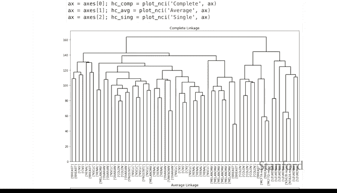

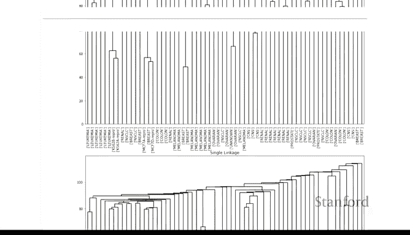

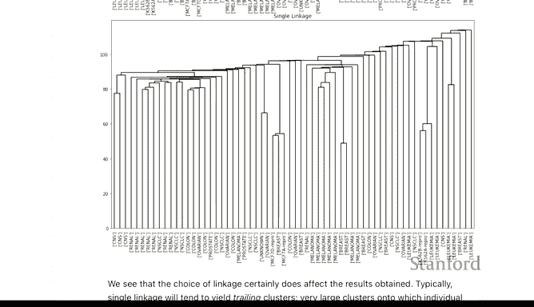

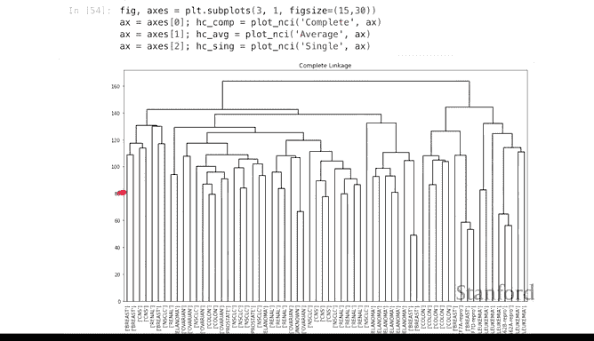

## 聚类结果与标签对比

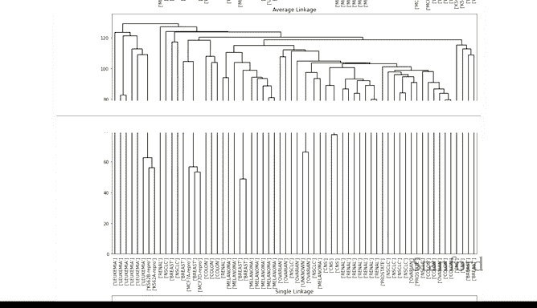

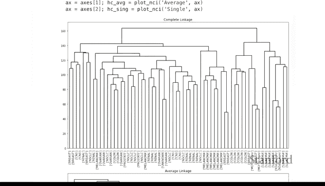

切割树状图后，我们检查得到的簇与真实癌症类型标签的对应关系。

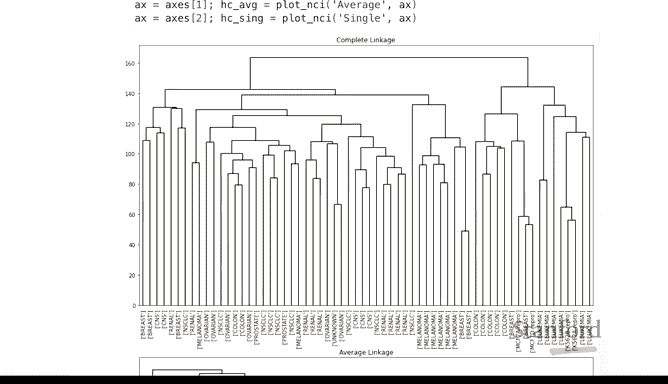

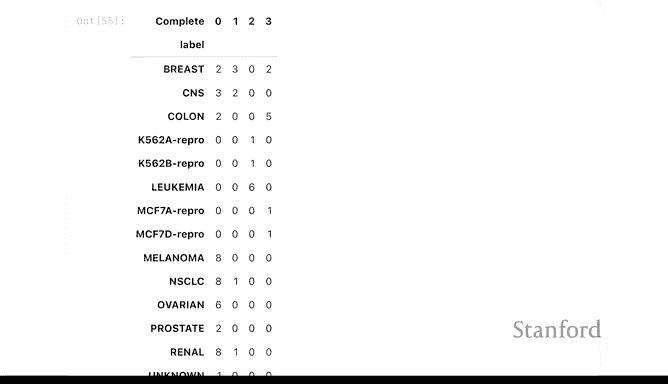

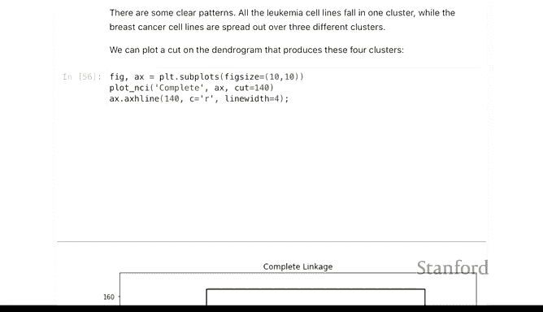

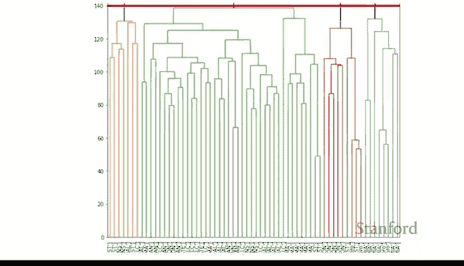

```python
from scipy.cluster.hierarchy import fcluster
# 在高度140处切割树状图，得到簇标签
cluster_labels = fcluster(Z_complete, t=140, criterion='distance')
# 此时可以统计每个簇中真实癌症类型的分布
# 例如，使用 pandas 的交叉表
import pandas as pd
cross_tab = pd.crosstab(index=cluster_labels, columns=true_cancer_labels)
print(cross_tab)
```

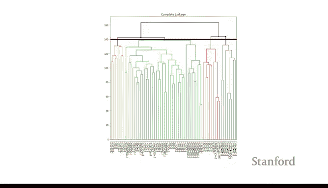

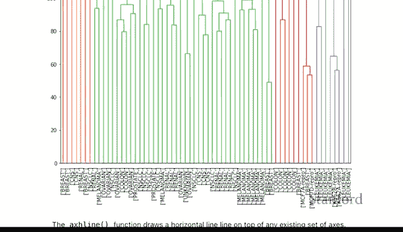

观察发现：
*   其中一个簇主要由白血病样本组成。
*   另一个簇主要由结肠癌样本组成，但也混入了一些乳腺癌样本。
*   由于我们只切割出4个簇，而真实有13种癌症类型，因此必然会将某些癌症类型合并。理想的情况是，属于同一真实类型的样本尽可能被分到同一个簇中，且不分散到其他簇。

## 总结

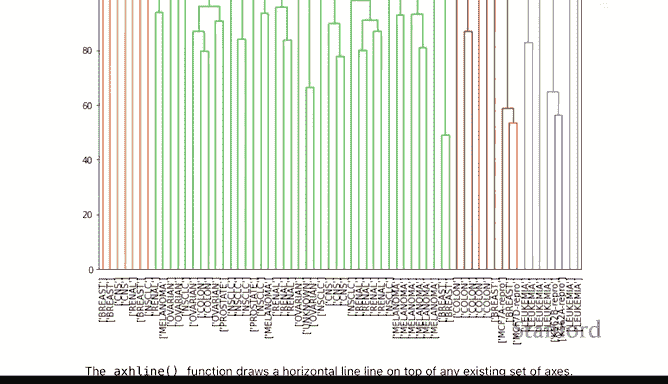

本节课中，我们一起学习了如何将PCA和层次聚类应用于NCI60基因表达数据集。

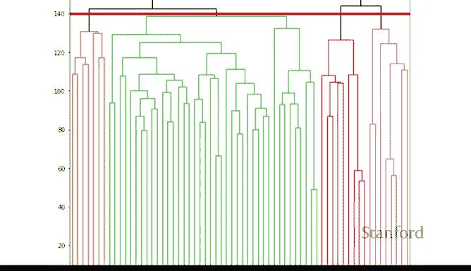

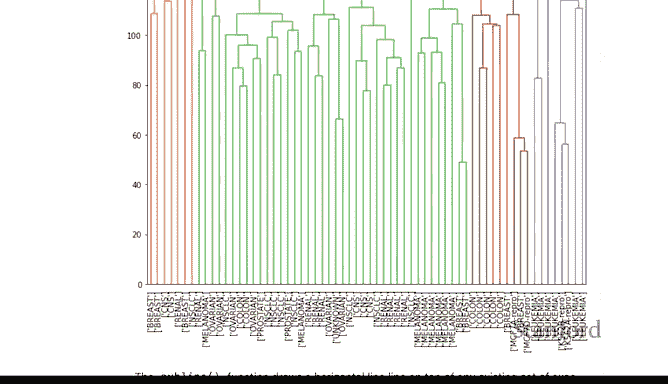

我们首先对高维基因数据进行了PCA，通过碎石图评估了主成分的重要性，并观察到前几个主成分能在一定程度上区分不同癌症类型。接着，我们应用了层次聚类，比较了不同连接方法的效果，发现完全连接方法在此数据上能产生更清晰的簇结构。最后，我们通过切割树状图得到了样本簇，并与真实癌症类型进行了对比分析。

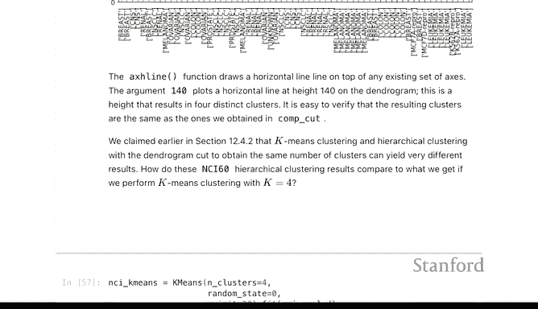

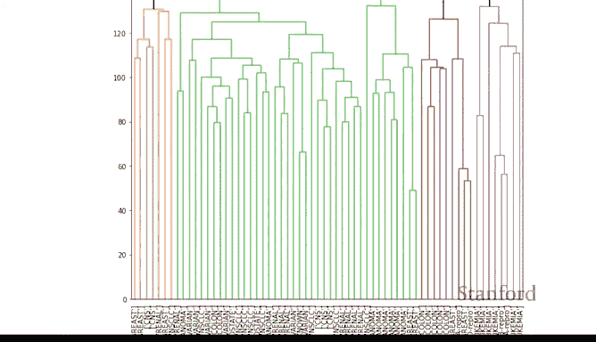

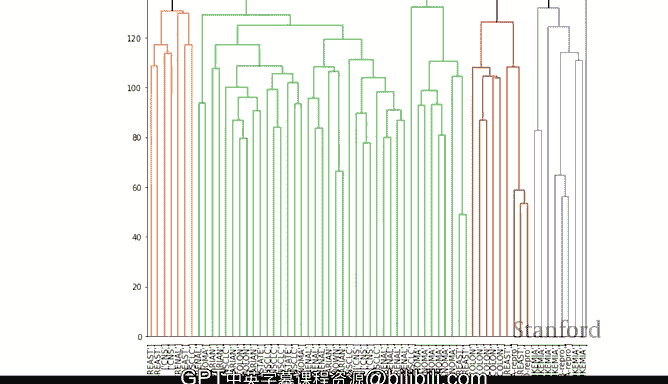


这个案例展示了无监督学习方法在探索性生物信息学分析中的实际应用，即在不依赖先验标签的情况下，发现数据中潜在的自然分组和结构。需要注意的是，由于样本量（64）远小于特征数（~7000），要完美区分所有13种癌症类型具有挑战性。在实际研究中，这通常需要更多的样本和更深入的分析。