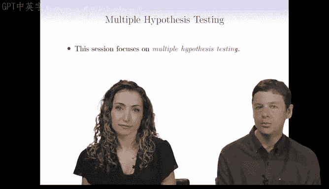
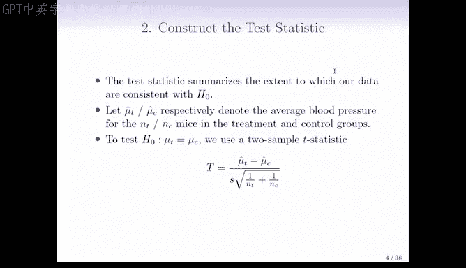
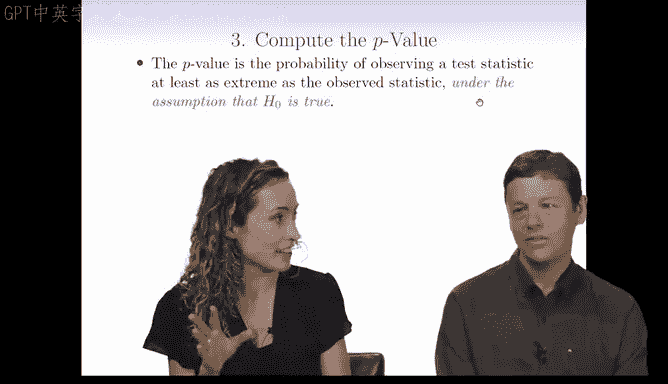
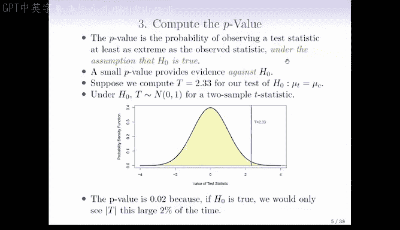

# Python 版 98：假设检验导论 🧪

在本节课中，我们将学习假设检验的基础知识，特别是当我们需要同时进行多个检验时的情况。理解这些概念对于避免数据分析中的虚假发现至关重要。

---

## 什么是多重假设检验？🔍

上一节我们介绍了假设检验的基本概念。本节中，我们来看看当检验数量从一个变为多个时会发生什么。

标准的单一假设检验，例如检验对照组和治疗组小鼠的预期血压是否相等，我们都很熟悉。其公式表示为：
*   **零假设 (H₀):** μ_control = μ_treatment
*   **备择假设 (Hₐ):** μ_control ≠ μ_treatment

然而，今天的主题是当我们有 **m** 个不同的假设检验需要同时进行时的情况。历史上，m 的值可能是 3 或 4。但在当今大数据时代，我们经常需要处理成千上万个检验。

例如，我们可能有成千上万个生物标志物，需要逐一检验它们在对照组和治疗组之间是否存在差异。公式可以表示为：
*   **零假设 (H₀ⱼ):** E[第 j 个生物标志物 | 对照组] = E[第 j 个生物标志物 | 治疗组]

一旦进行多重检验，情况就比处理单一零假设时复杂得多。最大的问题是，我们很容易得到大量的**假阳性**结果——即我们错误地拒绝了零假设，认为有有趣的事情发生，而这实际上只是由于我们进行了大量检验造成的。

---

## 假设检验基础回顾 📝

在深入多重检验之前，我们先快速回顾一下假设检验的基本步骤。假设检验为我们提供了一种回答“是或否”问题的方法。

以下是进行假设检验的四个主要步骤：

1.  **定义假设**：首先，我们将世界划分为零假设和备择假设。
2.  **构建检验统计量**：构造一个能量化数据与零假设一致程度的统计量。
3.  **计算 P 值**：计算在零假设成立的情况下，观察到当前或更极端检验统计量的概率。
4.  **做出决策**：根据 P 值决定是否拒绝零假设。

### 第一步：定义假设

*   **零假设 (H₀)**：这是关于世界的默认信念状态，表示“没有发生任何有趣的事”。例如，在线性回归中，H₀ 可能是真实系数 βⱼ = 0。
*   **备择假设 (Hₐ)**：这表示正在发生一些不同或意外的事情，是我们希望发现的东西。例如，Hₐ 可能是 βⱼ ≠ 0。

我们可以将其类比为刑事审判：零假设是被告无罪（默认假设），备择假设是被告有罪。我们相信零假设，除非有证据能“排除合理怀疑”地证明其不成立。

### 第二步：构建检验统计量

检验统计量总结了我们的数据与 H₀ 的一致程度。以检验两组小鼠血压均值是否相等为例：

*   令 μ̂_T 为治疗组小鼠血压的样本均值，n_T 为治疗组小鼠数量。
*   令 μ̂_C 为对照组小鼠血压的样本均值，n_C 为对照组小鼠数量。

为了检验零假设 H₀: μ_T = μ_C，我们构建一个**两样本 t 统计量**：

`T = (μ̂_T - μ̂_C) / SE(μ̂_T - μ̂_C)`

其中，分母 SE(μ̂_T - μ̂_C) 是分子差值的标准误。T 值基本上告诉我们，观测到的差值距离零有多少个标准误。如果 H₀ 成立，我们预计 T 的绝对值不会太大。

### 第三步：计算 P 值

P 值是统计学中最容易被误解的概念之一。**正确的定义是**：在零假设 H₀ 成立的条件下，观察到**至少与当前观测值一样极端**的检验统计量的概率。

**P 值 ≠ 零假设为真的概率。**

一个小的 P 值提供了反对 H₀ 的证据。因为如果 H₀ 成立，我们观察到如此极端统计量的概率很小，这让我们有理由怀疑 H₀ 可能不成立。

### 第四步：做出决策

在我们的例子中，如果计算出的 t 统计量 T = 2.33。在 H₀ 成立时，该统计量近似服从标准正态分布 N(0,1)。观测值 2.33 落在这个分布的很边缘的位置。

计算出的 P 值可能为 0.02。这意味着，如果 H₀ 成立，我们只有 2% 的概率（或每 50 次检验中约发生 1 次）会观察到如此极端的统计量。

这里有两种可能性：
1.  H₀ 成立，我们只是运气不好，碰上了这 50 次中的 1 次。
2.  H₀ 不成立。

P 值越小，我们越有把握认为 H₀ 不成立。但需要注意的是，即使 P=0.02，也并不能保证 H₀ 一定是假的。

---

## 总结 📚

本节课我们一起学习了假设检验的核心框架，并引出了**多重假设检验**的挑战。我们回顾了假设检验的四个步骤：定义假设、构建统计量、计算 P 值和做出决策。关键在于理解 P 值的准确定义——它是基于零假设成立这一前提的概率。

当我们将检验次数从一次增加到成百上千次时，即使每个单独的检验都控制得很好，整体上出现假阳性的风险也会急剧增加。在接下来的课程中，我们将探讨应对这一挑战的经典和现代方法。