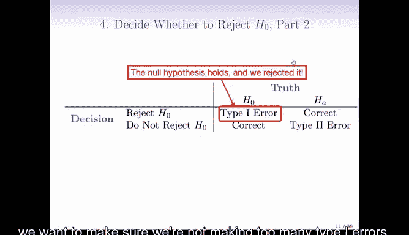
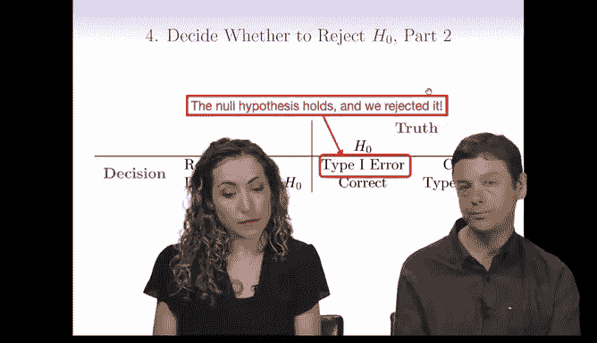
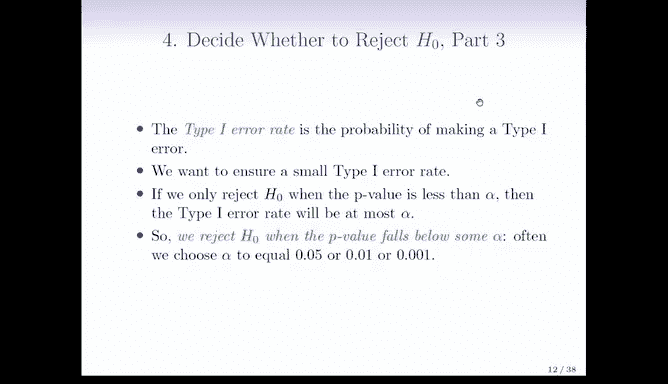

# Python 版 99：假设检验入门 II 🧪

在本节课中，我们将学习假设检验的核心决策过程。我们将探讨如何根据P值做出决策，并理解在此过程中可能犯的两种错误：第一类错误和第二类错误。掌握这些概念对于正确解读统计检验结果至关重要。

---

## 决策时刻

上一节我们介绍了P值的概念，本节中我们来看看如何基于P值做出决策。我们需要决定是否拒绝原假设。

一个小的P值表明，在原假设成立的情况下，出现如此大的检验统计量值是不太可能的。因此，小的P值为我们提供了反对原假设 **H₀** 的证据。

但这是否足够呢？通常，我们需要一个二元决策：要么拒绝原假设，要么不拒绝原假设。需要强调的是，我们从不“接受”原假设，正确的说法是“未能拒绝”原假设。

如果P值非常小，我们倾向于拒绝原假设，这通常意味着我们发现了一些新的、有趣的现象。那么，多小才算“足够小”呢？

---

## 显著性水平 α

在实践中，**5%** 或 **0.05** 常被用作拒绝原假设的临界值。然而，这个数字具有一定任意性，并且因领域而异。如何选择这个临界值，取决于犯错误的严重程度，特别是即将介绍的**第一类错误**。

以下是一些常见的显著性水平 α 及其含义：
*   **α = 0.05**： 有5%的风险错误地拒绝一个真实的原假设。
*   **α = 0.01**： 有1%的风险错误地拒绝一个真实的原假设。
*   **α = 0.001**： 有0.1%的风险错误地拒绝一个真实的原假设。

物理学家等领域有时会使用更小的α值，因为他们要求证据极度确凿。

---

## 假设检验的四种结果

当我们进行假设检验时，面临的情况可以用一个2x2的表格来概括。这个表格描述了我们的决策与现实情况之间的关系。

以下是所有可能的结果：

1.  **正确不拒绝**： 原假设 **H₀** 为真，我们决定不拒绝它。这是理想情况，意味着我们没有发现异常，决策正确。
2.  **正确拒绝**： 备择假设 **Hₐ** 为真，我们决定拒绝原假设。这也是正确决策，意味着我们成功探测到了真实存在的效应。
3.  **第二类错误**： 备择假设 **Hₐ** 为真，但我们决定不拒绝原假设。我们错过了发现真实效应的机会。其概率记为 **β**。
4.  **第一类错误**： 原假设 **H₀** 为真，但我们决定拒绝它。我们错误地宣称发现了不存在的效应。其概率记为 **α**。

---

## 错误类型的权衡与控制

为什么我们特别强调控制第一类错误？这源于原假设与备择假设之间的不对称性。原假设通常代表我们对世界的默认认知，需要有强有力的证据才能让我们改变这一认知。错误地拒绝原假设（第一类错误）就像发布“维生素C治愈癌症”这样的轰动性假新闻，可能造成严重后果。

虽然我们也希望第二类错误（**β**）尽可能小，但在实践中，**减小一种错误通常会增大另一种错误**。因此存在一个权衡。标准的做法是优先控制第一类错误率，因为我们认为错误地宣称一个发现（第一类错误）通常比错过一个发现（第二类错误）后果更严重。

**功效**是1减去第二类错误率，即 **功效 = 1 - β**，它代表正确拒绝一个错误原假设的能力。

---

## 如何控制第一类错误

有一个简单的方法可以控制第一类错误：**仅当P值小于预先设定的显著性水平 α 时，才拒绝原假设**。

这样，第一类错误率就会被控制在 **α** 以内。公式表示为：
`如果 拒绝规则为：当 P值 < α 时拒绝 H₀，那么 第一类错误率 ≤ α`

因此，如果你希望第一类错误率不超过5%，就应在P值小于0.05时拒绝原假设。

---

## 统计显著性与实际显著性

需要警惕的一个重要概念是：**统计显著性不等于实际重要性**。

当样本量非常大时，即使真实效应非常微小，也几乎总能得到一个极小的P值，从而获得“统计显著性”。但这可能仅仅意味着我们确信存在差异，而这个差异本身在科学或实践层面可能微不足道。

例如，如果我们对一百万只老鼠进行实验，即使处理组和对照组均值差异极小，我们也极有可能得到一个显著的P值。这凸显了在解读结果时，除了看P值，还必须关注**效应大小**。

---

## 总结

本节课中我们一起学习了假设检验的决策框架。我们了解到，通过比较P值与显著性水平α可以做出是否拒绝原假设的决策。我们深入探讨了可能发生的两种错误：第一类错误（错误拒绝真原假设）和第二类错误（未能拒绝假原假设），并理解了为何通常优先控制第一类错误。最后，我们强调了区分统计显著性与实际重要性的必要性，避免因大样本量而高估微小效应的实际价值。