# R 版 1：开场白 📊 

在本节课中，我们将要学习统计学习的基本概念，并通过一系列生动的例子来了解统计学习在现实世界中的应用。统计学习是统计学与计算机科学交叉的领域，它利用数据来构建模型，以进行预测或理解现象。

---

## 背景介绍

统计学习是什么？特雷弗·哈斯蒂和罗布·蒂布希拉尼都是统计学家，他们在20世纪80年代于斯坦福大学攻读研究生时相识。当时，计算机科学领域兴起了机器学习，特别是神经网络变得非常热门。与此同时，他们与同事杰里·弗里德曼、布拉德·埃夫龙等人开始研究机器学习，并发展出了被称为“统计学习”的独特视角。

## 统计学习的应用实例

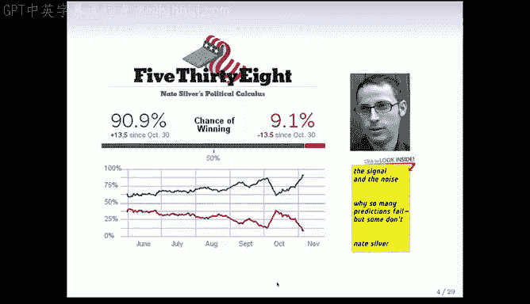

以下是统计学习在不同领域的一些应用实例，我们将逐一介绍。

### 1. IBM Watson 在《危险边缘》中的表现


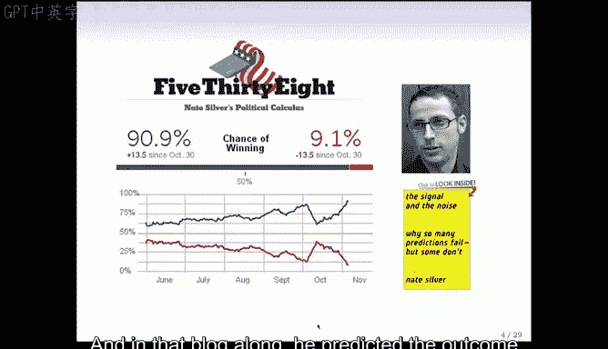

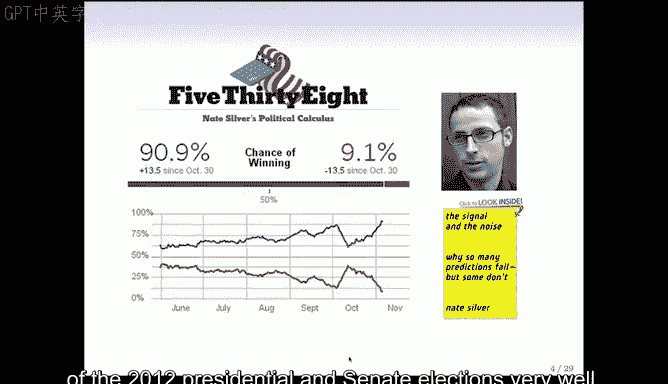


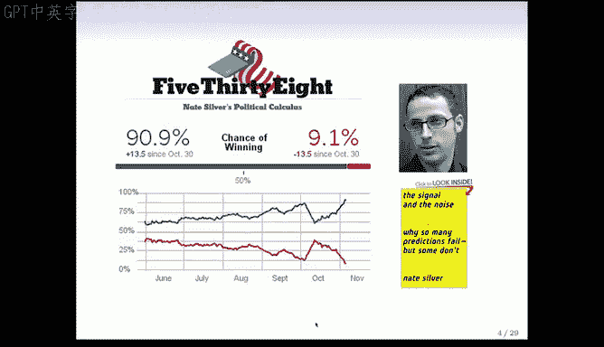

IBM开发的计算机程序Watson在《危险边缘》节目中击败了人类选手。这一成就被认为是机器学习的重大胜利，它结合了先进的硬件、软件和基于机器学习的算法。

### 2. 谷歌与数据科学

谷歌的首席经济学家哈尔·瓦里安在2009年《纽约时报》的采访中提到：“未来10年最性感的职业将是统计学家。”谷歌雇佣了许多统计学家，例如斯坦福大学统计学毕业生卡丽·格兰姆斯。

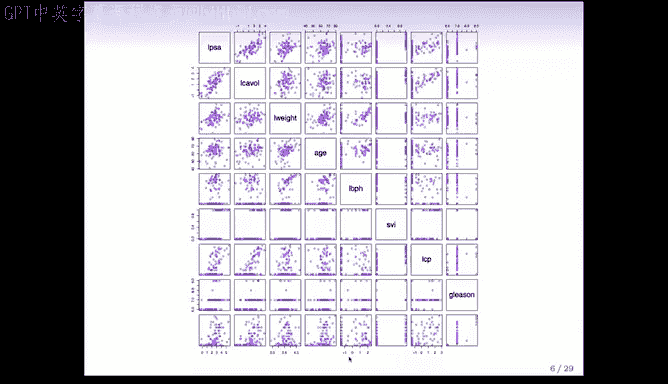

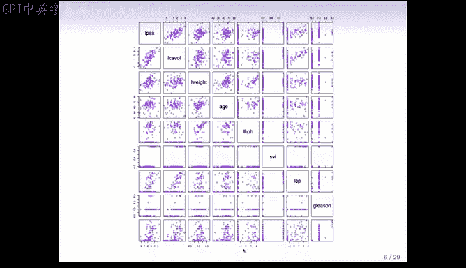

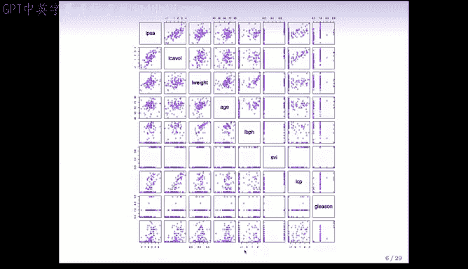

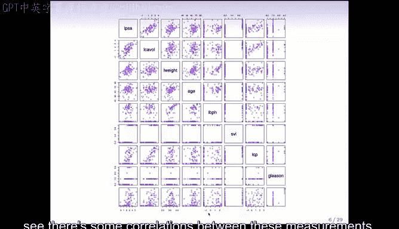

### 3. 内特·西尔弗的选举预测

内特·西尔弗拥有经济学硕士学位，但他自称统计学家。他通过博客“538”为《纽约时报》撰写文章，并利用统计方法和精心采样的数据，在2012年总统和参议院选举中做出了极为准确的预测。

### 4. 前列腺癌数据分析

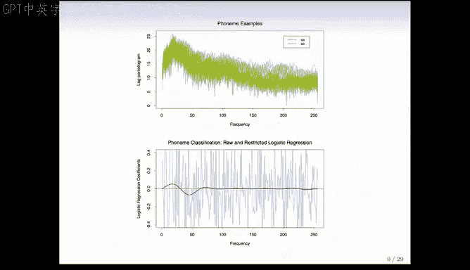

这是一个包含97名前列腺癌患者的小型数据集。数据包括每位患者的PSA测量值以及一系列临床和血液测量指标。目标是尝试根据其他测量值预测PSA水平。

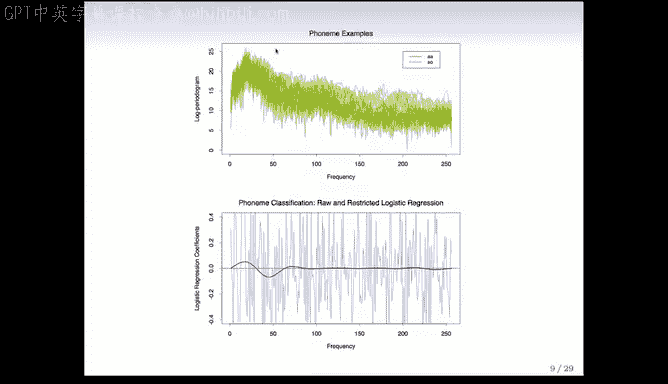

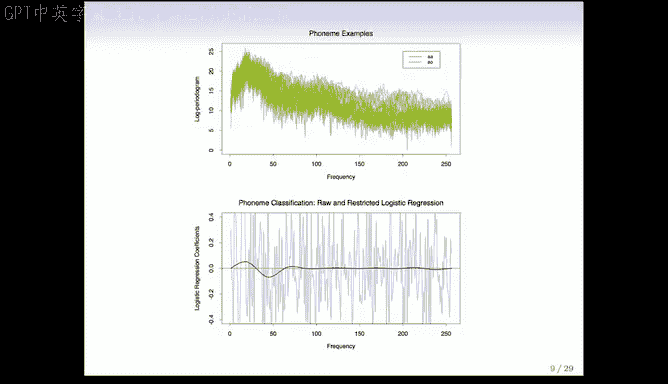

以下是数据的一个散点图矩阵，它展示了所有变量对之间的关系：

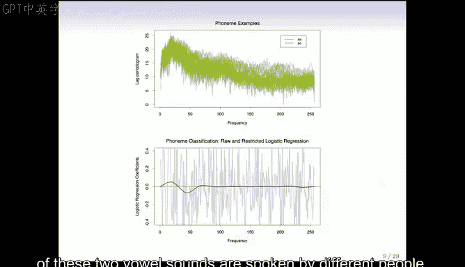

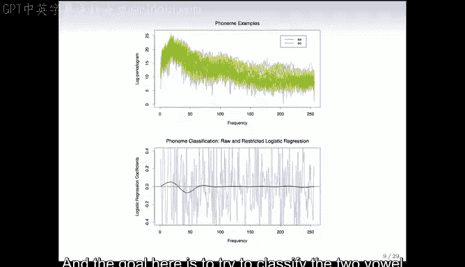

```r
# 示例：散点图矩阵
pairs(prostate_data)
```

在分析数据时，首先应该绘制图表来观察数据，而不是直接使用复杂的算法。例如，在这个数据集中，我们发现了一个异常值，它实际上是一个录入错误。

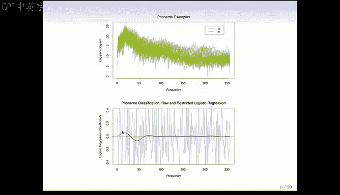

### 5. 语音识别：元音分类

这个例子涉及两个元音音素“AA”和“AO”的识别。数据是不同说话者发出的这两个元音的功率谱。目标是基于不同频率的功率来分类这两个元音。

我们使用了逻辑回归模型来分类，并通过平滑技术改进了系数估计，使其更能反映邻近频率的相似性。

### 6. 心脏病风险预测

这个数据集来自南非的男性，目标是基于人口统计、饮食和临床测量来预测心脏病发作的风险。数据点根据是否患有心脏病进行了颜色编码（红色表示患病，蓝色表示未患病）。

### 7. 电子邮件垃圾邮件检测

这个数据集包含4000多封发送给一位名叫乔治的个人的电子邮件，每封邮件都被手动标记为垃圾邮件或正常邮件。目标是基于邮件中词语的频率来分类垃圾邮件。

以下是一些重要特征的示例：

| 特征 | 说明 |
|------|------|
| `george` | 如果邮件中出现“george”，则更可能是正常邮件。 |
| `remove` | 如果邮件中出现“remove”，则更可能是垃圾邮件。 |

### 8. 手写邮政编码识别

这个任务是根据手写数字的图像将其分类为0-9中的一个数字。虽然对人类来说相对容易，但对计算机来说却非常具有挑战性。这是神经网络早期应用的一个经典问题。

### 9. 基因表达与癌症分类

这个例子涉及乳腺癌的基因表达数据。目标是基于基因表达谱将组织样本分类为几种癌症亚型之一。我们使用了热图和层次聚类来可视化和组织数据。

```r
# 示例：层次聚类
hclust_result <- hclust(dist(gene_expression_data))
plot(hclust_result)
```

### 10. 收入与人口统计变量关系

这个数据集调查了美国中大西洋地区2009年的收入情况。目标是建立收入与年龄、教育水平等人口统计变量之间的关系模型。

### 11. 卫星图像土地分类

这个例子使用澳大利亚农村地区的Landsat卫星图像。目标是基于四个光谱波段的特征来预测每个像素的土地利用类型。我们使用了最近邻分类器进行预测。

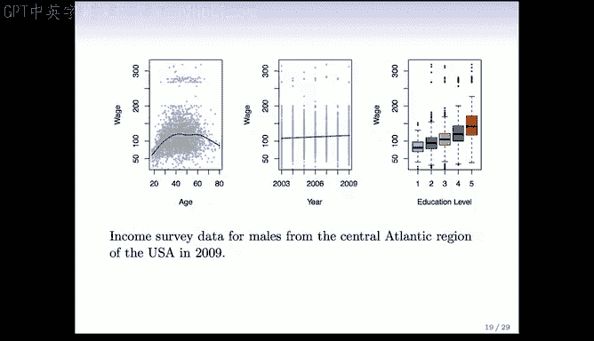

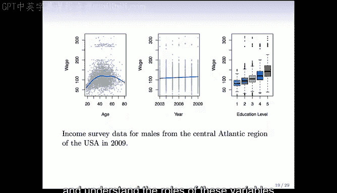

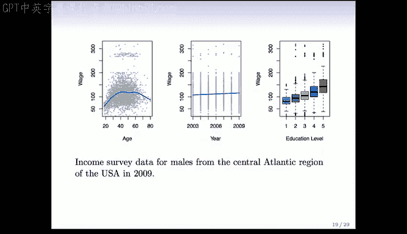

---

## 总结

本节课中我们一起学习了统计学习的基本概念，并通过一系列实例了解了它在不同领域的应用，从医疗诊断到图像识别，从选举预测到垃圾邮件过滤。这些例子展示了统计学习如何利用数据来构建模型，以解决复杂的现实问题。

在下一节中，我们将介绍监督学习的基本符号和问题设置，为后续课程打下基础。