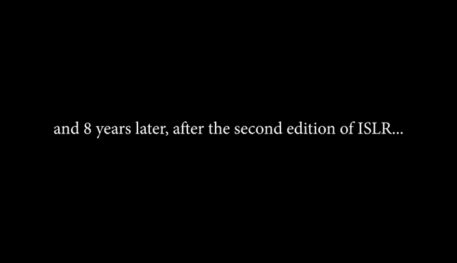
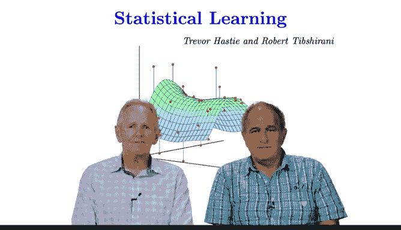

# R 版 2：介绍与更新概述 📘

在本节课中，我们将介绍《统计学习导论》课程第二版的主要更新内容。课程由Trevor Hastie和Robert Tibshirani主讲，旨在为学习者提供统计学习领域的最新知识。

## 背景与主讲人介绍

时隔八年，我们再次相聚。我是Trevor Hastie，这位是我的朋友Robert Tibshirani。

感谢我的老朋友Trevor。你看起来一点没变，状态很好。

我们正在录制《统计学习导论》课程第二版的MOOC讲座视频。你现在可以取下服装道具了。

欢迎来到《统计学习导论》讲座的第二版。新版课程包含一系列新讲座，以配合我们书籍的新版发布。

## 新增内容概述

新版讲座将涵盖深度学习、生存分析和多重检验等主题，以及其他几个专题。

如果你查看书籍（可通过我们的网站和书籍网站免费获取），你会注意到各章节增加了一些新内容。

以下是具体的新增章节内容：

*   在第四章中，新增了关于**广义线性模型**的章节。
*   在无监督学习章节中，新增了关于**矩阵补全**的章节。
*   在树模型章节中，新增了关于**贝叶斯加性回归树模型**的章节。

## 其他部分与新增资源

课程其余部分与之前版本保持一致，因此我们没有重新录制那些讲座，相关材料也相同。

当然，针对新增内容也配备了相应的实验练习。

此外，在第一版课程中，我们采访了该领域的一些知名人士。在新版中，我们增加了更多采访。

以下是新增的采访内容：

*   关于生存分析，我们采访了**David Cox**。
*   关于深度学习，我们采访了**Geoffrey Hinton**。
*   关于多重检验和错误发现率，我们采访了**Yoav Benjamini**。

我们希望你能享受课程的第二版。

---

## 总结

本节课中，我们一起学习了《统计学习导论》第二版课程的主要更新，包括新增的深度学习、生存分析和多重检验等核心章节，以及配套的新实验和专家访谈。这些内容旨在帮助学习者掌握统计学习领域的最新发展。