# R 版 3：统计学习示例与框架 📊

## 概述

在本节课中，我们将学习统计学习的基本框架，区分监督学习与无监督学习，并通过实际示例理解其核心概念与应用场景。

---

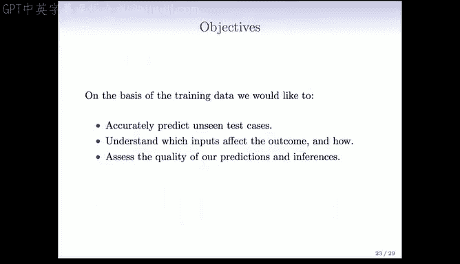

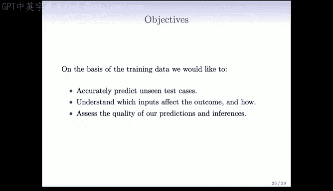

## 监督学习问题与符号表示

现在我们来讨论监督学习问题，并建立一些基本符号表示。

我们有一个结果测量值 **Y**，它有许多不同的名称：因变量、响应变量或目标变量。同时，我们有一个包含 **P** 个预测变量的测量向量，通常称为 **x**。这些预测变量也有许多名称：输入、回归量、协变量、特征或自变量。

我们区分两种情况：
1.  **回归问题**：**Y** 是定量变量，例如价格或血压。
2.  **分类问题**：**Y** 取值于一个有限的无序集合，例如“存活”或“死亡”、数字类别0到9、组织样本的癌症类别。

我们拥有训练数据对：**(x1, Y1), (x2, Y2), ..., (xN, YN)**。其中，**x1** 是一个包含 **P** 个测量值的向量，**Y1** 通常是一个单一的响应变量。这些数据对是这些测量的示例或实例。

监督学习的目标如下：
*   基于训练数据，我们希望准确预测未见过的测试案例。
*   理解哪些输入会影响结果以及如何影响。
*   评估我们预测和推断的质量。

---

## 学习理念与简单方法的重要性

在学习本课程时，我们不仅希望提供一系列方法清单，更希望您理解各种技术背后的思想。这样您才能知道在何时何地使用它们。因为在您自己的工作中，您会遇到前所未见的问题，您需要能够判断哪些方法可能有效，哪些可能无效。

预测准确性固然重要，但首先尝试简单方法以掌握更复杂的方法同样重要。我们将花相当多的时间在线性模型、线性回归和线性逻辑回归上。这些是简单的方法，但非常有效。

理解方法的表现如何也非常重要。如今，应用一个算法、运行软件很容易，但弄清楚方法实际表现如何却很难，也非常重要。这样您才能告诉您的老板或合作者，当您应用我们开发的这个方法时，它在某些情况下明天的表现可能如何。有时，您可能做得不够好，无法实际使用该方法，这时您就需要改进算法或收集更好的数据。

---

## 监督学习与无监督学习的比喻

您可能想知道“监督学习”和“无监督学习”这些术语从何而来。这实际上是一个非常巧妙的术语。

想象一个幼儿园，老师试图教一个孩子区分什么是房子，什么是自行车。老师可能会给孩子看一些例子，告诉他：“约翰尼，这些是房子的例子，这些是自行车的例子。”孩子通过观察这些带有标签的训练示例进行学习，这就是**监督学习**，因为他被给予了有标签的训练观察示例，受到了“监督”。正如上一节所概述的，**Y** 是给定的，孩子试图基于特征 **X** 学习对两种物体进行分类。

**无监督学习**则是本课程的另一个主题。在无监督学习的情景中，幼儿园里的孩子没有被给予房子和自行车的例子。他只是在地上看到很多东西，比如一些房子、一些自行车和其他物品。这些数据是**无标签**的，没有 **Y**。现在的问题是，孩子在没有监督的情况下，试图在他自己的脑海中组织他所看到的事物的共同模式。他可能会看着物体说，这三样东西可能是房子（虽然他并不知道它们叫房子），但它们彼此相似，因为有共同的特征。其他物体，也许是自行车或其他东西，它们彼此相似，因为他看到了一些共性。这就引出了根据特征的相似性对观察结果进行分组的想法，这将是本课程中无监督学习的一个主要主题。

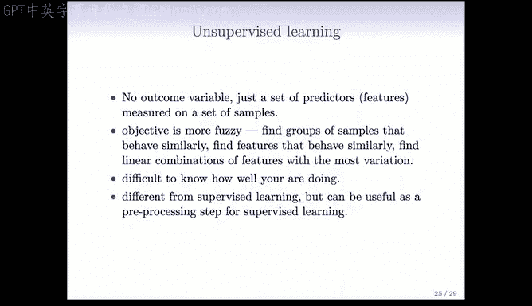

---

## 无监督学习的形式化定义与挑战

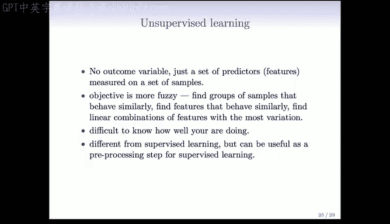

更正式地说，无监督学习中没有结果变量测量，只有一组预测变量。其目标更加模糊，不是预测 **Y**（因为没有 **Y**），而是了解数据是如何组织的，并找出哪些特征对数据的组织是重要的。

我们将讨论**聚类**和**主成分分析**，这些是无监督学习的重要技术。无监督学习的挑战之一是很难知道你做得好不好，因为没有黄金标准，没有 **Y**。当你完成聚类分析后，你并不真正知道你做得有多好。尽管如此，这是一个极其重要的领域。

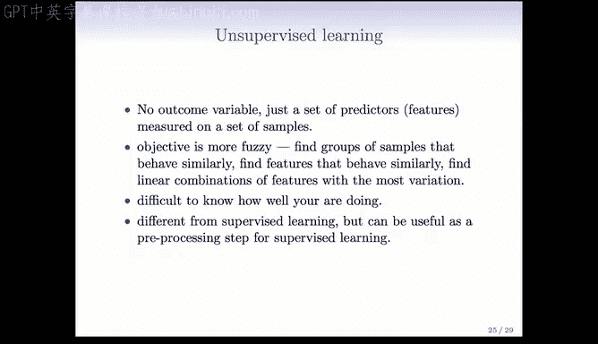

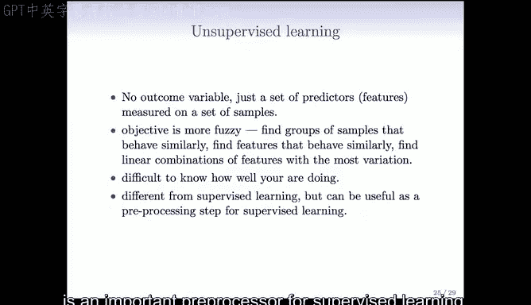

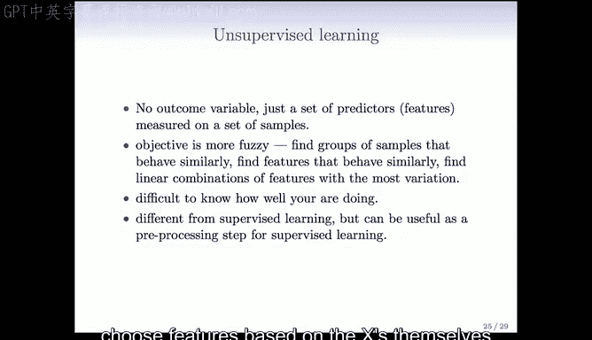

无监督学习之所以重要，一方面是因为它是监督学习的重要预处理步骤。通常，基于 **X** 本身来组织或选择特征，然后将这些处理过或选择过的特征作为监督学习的输入，是非常有用的。

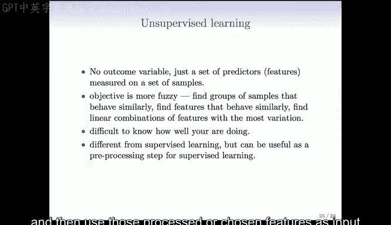

最后一点是，收集无标签数据要容易得多，也常见得多。例如，在网络上，计算机算法可以扫描网页并抓取电影评论，但要判断评论是正面还是负面，通常需要人工干预。因此，标记数据要困难得多，成本也高得多，而收集无监督、无标签的数据则容易得多。

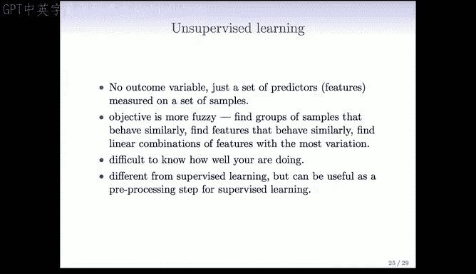

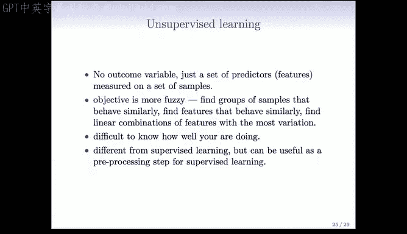

---

## 示例：Netflix 大奖赛

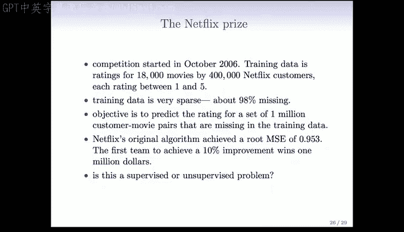

我们要展示的最后一个例子是一个精彩的示例：Netflix 大奖赛。Netflix 是美国的一家电影租赁公司。Netflix 设立了一项竞赛，试图改进其推荐系统。

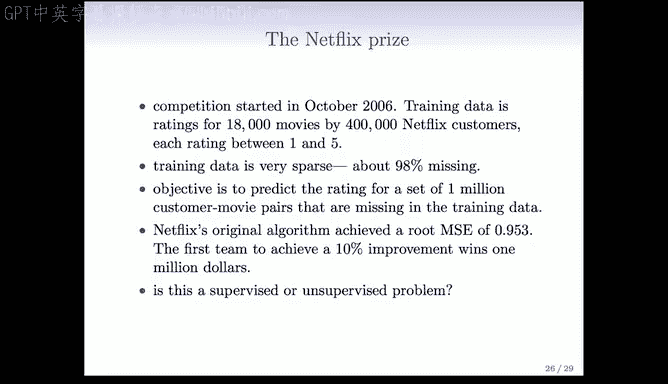

他们创建了一个数据集，包含 40 万 Netflix 用户和 1.8 万部电影。平均每个用户大约评价了 200 部电影。因此，每个用户只看过大约 1% 的电影。

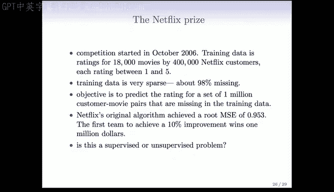

你可以将其想象成一个非常大的矩阵，其中稀疏地填充着 1 到 5 的评分。目标就像所有推荐系统一样，试图根据用户迄今为止的评分，预测他们对其他电影的看法。

Netflix 设立了一项竞赛，为第一个能够将其评分系统改进 10%（按某种衡量标准）的团队提供 100 万美元的奖金。竞赛设计非常巧妙。原始算法的均方根误差约为 0.953（评分范围为 1 到 5）。竞赛宣布并将数据放到网上后，社区大约花了一个月时间就获得了改进该算法的方案。但社区又花了大约三年时间才有人真正赢得比赛。

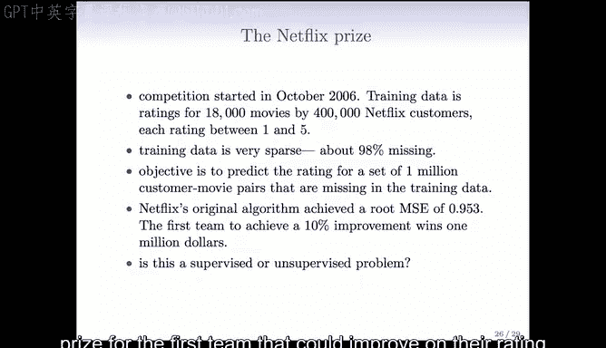

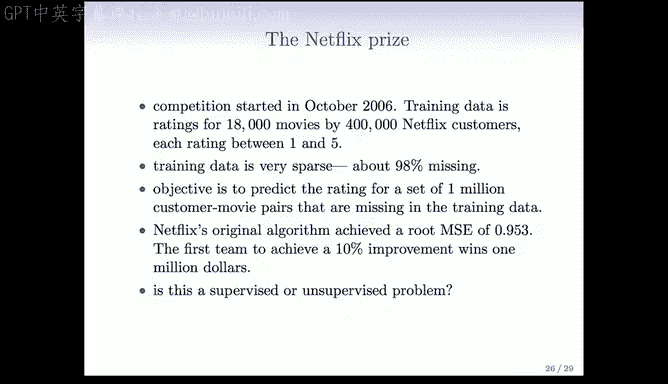

这是一个很好的例子。竞赛结束时的排行榜最终由一个名为“BellKor‘s Pragmatic Chaos”的团队赢得，但紧随其后的是“Ensemble”团队，事实上，他们的分数在小数点后四位都相同，最终的获胜者是由谁先提交最终预测决定的。

这是一场精彩的竞赛，但特别精彩的是它催生的大量研究。在三年时间里，全世界有成千上万的团队参加了这场竞赛，在这个过程中发明了许多新技术。许多获胜技术最终使用了存在缺失数据情况下的主成分分析的一种形式。

---

## 统计学习与机器学习的关系

在本课程开始时，我提到了机器学习领域的概念，它实际上催生了我们正在讨论的统计学习领域。机器学习本身是人工智能的一个子领域，特别是在 80 年代神经网络兴起之后。

因此，很自然地会想知道统计学习和机器学习之间的关系。首先，这个问题很难回答。我们经常问这个问题，两者有很多重叠之处。机器学习倾向于处理更大规模的问题，尽管随着计算机速度越来越快、价格越来越便宜，这种差距正在缩小。

机器学习更关注纯粹的预测以及预测效果如何。统计学习也关注预测，但也关注模型，试图提出科学家和其他人可以解释的模型和方法。此外，在评估方法表现时，我们更关注精确度和不确定性。但同样，这些区别越来越模糊，方法之间有很多交叉融合。

显然，机器学习在市场营销方面占优势。他们往往能获得更大的资助，他们的会议地点也更好。但我们正试图改变这一点，从这门课程开始。

---

## 教材与资源

这是我们的课程教材：《统计学习导论》。我们非常兴奋，这是由我们的两位研究生（过去的研究生）Gareth James 和 Daniela Witten 以及 Rob 和我共同撰写的新书，于 2013 年 8 月刚刚出版。本课程将涵盖这本书的全部内容。

这本书的每一章末尾都有使用 R 计算语言运行的示例，我们也会安排 R 语言的课程。因此，当您学习本课程时，您实际上也将学会使用 R。R 是一个很棒的环境，它是免费的，是进行数据分析的绝佳方式。

您还会看到那里有第二本书，那是我们更高级的教科书《统计学习基础》，这本书已经存在一段时间了，它将作为本课程的参考书，供那些希望更详细了解某些技术的人使用。

现在的好消息是，不仅这门课程是免费的，这些书也是免费的。《统计学习基础》一直是免费的，PDF 版本可以在我们的网站上找到。这本新书将在 1 月份课程开始时免费提供。这是与出版商达成的协议。当然，如果您想购买这本书也可以，拥有一本纸质书很不错。但如果您需要，PDF 版本是可用的。

---

## 总结

本节课中，我们一起学习了统计学习的基本框架，明确了监督学习与无监督学习的核心区别与目标。我们通过生动的比喻理解了“监督”与“无监督”的含义，并以 Netflix 大奖赛为例看到了统计学习在实际中的强大应用。最后，我们探讨了统计学习与机器学习的关系，并介绍了本课程的核心教材与学习资源。希望您能享受接下来的课程内容。